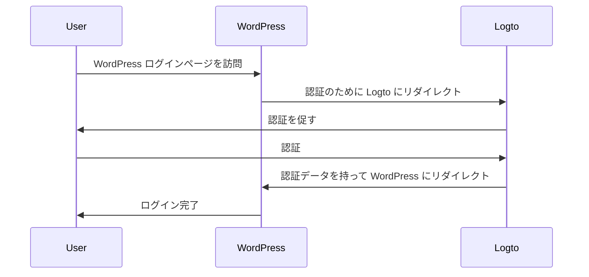
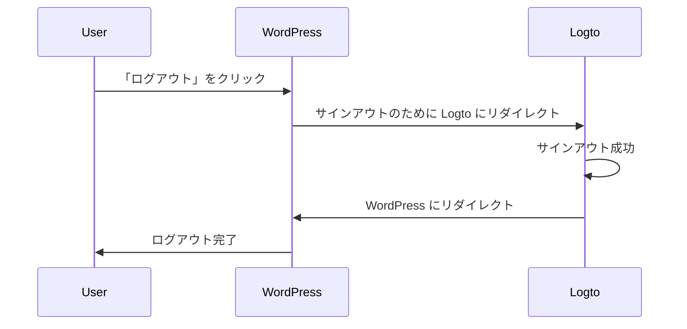

import TabItem from '@theme/TabItem';
import Tabs from '@theme/Tabs';

### プラグインのインストール \{#install-the-plugin}

<Tabs>

<TabItem value="admin-panel" label="WordPress 管理パネルから">

1. **プラグイン** > **新規追加** に移動します。
2. 「Logto」を検索するか、検索ボックスに https://wordpress.org/plugins/logto/ を入力します。
3. **今すぐインストール** をクリックします。
4. **有効化** をクリックします。

</TabItem>

<TabItem value="upload" label="アップロードから">

1. 次のリンクのいずれかから Logto WordPress プラグインをダウンロードします：
   - [最新リリース](https://github.com/logto-io/wordpress/releases)：`logto-plugin-<version>.zip` 形式のファイルをダウンロードします。
   - [WordPress プラグインディレクトリ](https://wordpress.org/plugins/logto/)：**ダウンロード** ボタンをクリックしてファイルをダウンロードします。
2. プラグインの ZIP ファイルをダウンロードします。
3. WordPress 管理パネルで **プラグイン** > **新規追加** に移動します。
4. **プラグインのアップロード** をクリックします。
5. ダウンロードした ZIP ファイルを選択し、**今すぐインストール** をクリックします。
6. **有効化** をクリックします。

</TabItem>

</Tabs>

### プラグインの設定 \{#configure-the-plugin}

これで、WordPress 管理パネルのサイドバーに Logto メニューが表示されるはずです。**Logto** > **設定** をクリックしてプラグインを設定します。

:::note
プラグインを設定する前に、Logto コンソールで **従来のウェブ** アプリケーションを作成しておく必要があります。まだ作成していない場合は、<MainSiteUrl href="/integrate-logto/integrate-logto-into-your-application">Logto をアプリケーションに統合する</MainSiteUrl> を参照してください。
:::

プラグインを開始するための最小限の設定は次のとおりです：

- Logto エンドポイント：Logto テナントのエンドポイント。
- アプリ ID：Logto アプリケーションのアプリ ID。
- アプリシークレット：Logto アプリケーションの有効なアプリシークレットのいずれか。

すべての値は Logto コンソールのアプリケーション詳細ページで見つけることができます。

値を入力したら、**変更を保存** をクリックします（ボタンが見つからない場合はページの下までスクロールしてください）。

### リダイレクト URI の設定 \{#configure-redirect-uri}

リダイレクト URI は、ユーザーが認証された後に Logto がリダイレクトする URL です。また、サインアウト後のリダイレクト URI は、ユーザーがログアウトした後に Logto がリダイレクトする URL です。

サインインフローを説明する非規範的なシーケンス図はこちらです：

サインアウトフローがどのように見えるかを示す非規範的なシーケンス図はこちらです：

リダイレクトが必要な理由について詳しくは、<MainSiteUrl href="/concepts/sign-in-experience">サインイン体験の説明</MainSiteUrl> を参照してください。

この場合、Logto コンソールで両方のリダイレクト URI を設定する必要があります。リダイレクト URI を見つけるには、WordPress 管理パネルの **Logto** > **設定** ページに移動します。**リダイレクト URI** と **サインアウト後のリダイレクト URI** フィールドが表示されます。

1. **リダイレクト URI** と **サインアウト後のリダイレクト URI** の値をコピーし、Logto コンソールの **リダイレクト URI** と **サインアウト後のリダイレクト URI** フィールドに貼り付けます。
2. Logto コンソールで **変更を保存** をクリックします。

### チェックポイント：WordPress ウェブサイトのテスト \{#checkpoint-test-your-website}

これで、WordPress ウェブサイトで Logto の統合をテストできます：

1. 必要に応じてシークレットブラウザウィンドウを開きます。
2. WordPress ウェブサイトを訪問し、該当する場合は **ログイン** リンクをクリックするか、直接ログインページ（例：`https://example.com/wp-login.php`）にアクセスします。
3. ページは Logto サインインページにリダイレクトされるはずです。
4. サインインまたはサインアッププロセスを完了します。
5. 認証が成功すると、WordPress ウェブサイトに戻り、自動的にログインされるはずです。
6. **ログアウト** リンクをクリックして WordPress ウェブサイトからログアウトします。
7. Logto サインアウトページにリダイレクトされ、その後 WordPress ウェブサイトに戻るはずです。
8. WordPress ウェブサイトからログアウトされているはずです。
