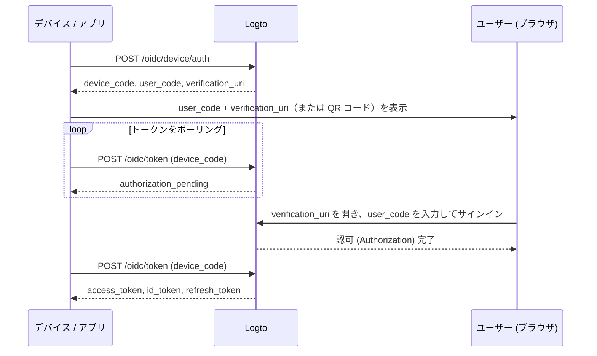

import ApiResourcesDescription from '../../fragments/_api-resources-description.md';
import FurtherReadings from '../../fragments/_further-readings.md';
import ScopeClaimList from '../../fragments/_scope-claim-list.md';
import ScopesAndClaimsIntroduction from '../../fragments/_scopes-claims-introduction.md';

# Device flow: Logto での認証 (Authentication)

:::note
このガイドは、Logto コンソールで「ネイティブ」タイプかつ device flow を認可フローとして作成したアプリケーションがあることを前提としています。
:::

## はじめに \{#introduction}

[OAuth 2.0 デバイス認可グラント](https://auth.wiki/device-flow)（device flow）は、スマート TV、ゲームコンソール、CLI ツール、IoT デバイスなど、入力機能が制限されたデバイス向けに設計されています。ユーザーはデバイス上でサインインプロセスを開始し、別のブラウザ搭載デバイス（スマートフォンやノート PC など）で認証 (Authentication) を完了できます。

デバイス自体がブラウザベースのサインインフローを処理できないため、デバイスは短いコードと URL を表示します。ユーザーは別のデバイスでその URL にアクセスし、コードを入力してサインインします。その間、元のデバイスは認可 (Authorization) 完了まで Logto にポーリングします。



## アプリケーションのクレデンシャルを取得 \{#get-application-credentials}

Logto コンソールでアプリケーション詳細ページに移動し、次のクレデンシャルを取得します：

- **App ID**：アプリケーションの一意の識別子（`client_id` とも呼ばれます）。
- **Logto エンドポイント**：Logto 認可サーバーのエンドポイント。Logto コンソールの「アプリケーション詳細」で確認できます。

Logto Cloud の場合、エンドポイントは `https://{your-tenant-id}.logto.app` です。

:::note
Device flow アプリはパブリッククライアントのため、App Secret は不要です。
:::

## デバイスコードのリクエスト \{#request-a-device-code}

device flow を開始するには、デバイス認可エンドポイントに `POST` リクエストを送信します：

```bash
curl --request POST 'https://your.logto.endpoint/oidc/device/auth' \
  --header 'Content-Type: application/x-www-form-urlencoded' \
  --data-urlencode 'client_id=your-application-id' \
  --data-urlencode 'scope=openid offline_access profile'
```

レスポンスには次が含まれます：

| フィールド                  | 説明                                                                                                                                                   |
| --------------------------- | ------------------------------------------------------------------------------------------------------------------------------------------------------ |
| `device_code`               | トークンエンドポイントをポーリングする際にアプリで使用する一意のコード。                                                                               |
| `user_code`                 | ユーザーがブラウザで入力するために表示する短いコード。                                                                                                 |
| `verification_uri`          | ユーザーが `user_code` を入力するための URL。                                                                                                          |
| `verification_uri_complete` | `user_code` があらかじめ入力された URL。ユーザーはこの URL に直接アクセスして手動入力を省略できます（QR コードやクリック可能なリンクなどで提示可能）。 |
| `expires_in`                | `device_code` および `user_code` の有効期間（秒）。この時間を過ぎたらポーリングを停止してください。                                                    |

## ユーザーに認証 (Authentication) URL を表示 \{#display-verification-url}

デバイス画面に `user_code` と `verification_uri` を表示します。

または、コードがあらかじめ入力された `verification_uri_complete` を利用することもできます。ユーザーは確認するだけで済みます。QR コードやクリック可能なリンクなど、表示方法は自由です。

## トークンのポーリング \{#poll-for-tokens}

ユーザーがブラウザで認証 (Authentication) を完了する間、デバイスはトークンエンドポイントをポーリングします。アプリはポーリングリクエストの間隔を **5 秒以上** 空けてください：

```bash
curl --request POST 'https://your.logto.endpoint/oidc/token' \
  --header 'Content-Type: application/x-www-form-urlencoded' \
  --data-urlencode 'client_id=your-application-id' \
  --data-urlencode 'grant_type=urn:ietf:params:oauth:grant-type:device_code' \
  --data-urlencode 'device_code=DEVICE_CODE'
```

`DEVICE_CODE` はデバイス認可レスポンスの `device_code` に置き換えてください。

**ポーリングを停止する条件**：

- 正常なトークンレスポンスを受信した場合
- device code レスポンスの `expires_in` 時間が経過した場合
- `expired_token` や `access_denied` など再試行不可のエラーを受信した場合

### トークンレスポンス \{#token-response}

ユーザーが承認すると、レスポンスには次が含まれます：

| フィールド      | 説明                                                                                                                                                 |
| --------------- | ---------------------------------------------------------------------------------------------------------------------------------------------------- |
| `access_token`  | アクセス トークン (Access token)。デフォルトでは不透明トークン (Opaque token) ですが、`resource` を指定した場合は `aud` がリソース URI の JWT です。 |
| `id_token`      | ユーザーのアイデンティティクレームを含む ID トークン (ID token)。`openid` スコープをリクエストした場合のみ含まれます。                               |
| `refresh_token` | 再認証なしで新しいトークンを取得するためのリフレッシュ トークン (Refresh token)。`offline_access` スコープをリクエストした場合のみ含まれます。       |
| `token_type`    | 常に `Bearer`。                                                                                                                                      |
| `expires_in`    | トークンの有効期間（秒）。                                                                                                                           |
| `scope`         | 認可サーバーによって付与されたスコープ。                                                                                                             |

## チェックポイント：デバイスフローのテスト \{#checkpoint}

デバイスフロー連携をテストしましょう：

1. アプリを実行し、device flow をトリガーして `device_code` と `user_code` を取得します。
2. ブラウザで `verification_uri` を開き、`user_code` を入力するか、`verification_uri_complete` を使って手動入力を省略します。
3. ブラウザでサインインプロセスを完了します。
4. アプリがポーリング後にトークンを受信できることを確認します。

## ユーザー情報の取得 \{#get-user-information}

### ID トークン (ID token) クレームのデコード \{#decode-id-token-claims}

トークンレスポンスで返される `id_token` は標準の [JSON Web Token (JWT)](https://auth.wiki/jwt) です。Base64URL エンコードされたペイロード（JWT の 2 番目の部分、`.` で区切られた部分）をデコードすることで、追加のネットワークリクエストなしで基本的なユーザークレームにアクセスできます。

デコードされたペイロードには、リクエストしたスコープに応じて `sub`（ユーザー ID）、`name`、`email` などのクレームが含まれます。

:::tip
本番環境では、JWT のクレームを信頼する前に署名検証を行ってください。Logto エンドポイント（`https://your.logto.endpoint/oidc/jwks`）の JWKS を使ってトークンを検証できます。
:::

### userinfo エンドポイントから取得 \{#fetch-from-userinfo-endpoint}

ID トークンにはリクエストしたスコープに基づく基本的なクレームが含まれます。一部の拡張クレーム（`custom_data` や `identities` など）は [OIDC UserInfo エンドポイント](https://openid.net/specs/openid-connect-core-1_0.html#UserInfo) からのみ取得できます：

```bash
curl --request GET 'https://your.logto.endpoint/oidc/me' \
  --header 'Authorization: Bearer ACCESS_TOKEN'
```

`ACCESS_TOKEN` には、トークンレスポンスで取得した不透明トークン (Opaque token)（JWT リソーストークンではありません）を指定してください。レスポンスは、付与されたスコープに基づくユーザークレームを含む JSON オブジェクトです。

### 追加クレームのリクエスト \{#request-additional-claims}

ID トークンに一部のユーザー情報が含まれていない場合があります。これは OAuth 2.0 および OpenID Connect (OIDC) が最小権限の原則（PoLP）に従って設計されており、Logto もこれらの標準に基づいているためです。

<ScopesAndClaimsIntroduction />

追加のスコープをリクエストするには、デバイス認可リクエストの `scope` パラメーターに含めてください。たとえば、ユーザーのメールアドレスや電話番号をリクエストする場合：

```bash
curl --request POST 'https://your.logto.endpoint/oidc/device/auth' \
  --header 'Content-Type: application/x-www-form-urlencoded' \
  --data-urlencode 'client_id=your-application-id' \
  --data-urlencode 'scope=openid offline_access profile email phone'
```

### スコープとクレーム \{#scopes-and-claims}

<ScopeClaimList />

## API リソースと組織 (Organizations) \{#api-resources-and-organizations}

<ApiResourcesDescription />

### API リソースへのアクセスリクエスト \{#request-access-for-api-resources}

特定の API リソースにアクセスするには、デバイス認可リクエストに `resource` パラメーターを含めます：

```bash
curl --request POST 'https://your.logto.endpoint/oidc/device/auth' \
  --header 'Content-Type: application/x-www-form-urlencoded' \
  --data-urlencode 'client_id=your-application-id' \
  --data-urlencode 'scope=openid offline_access' \
  --data-urlencode 'resource=https://your-api-resource-indicator'
```

ユーザーが認可 (Authorization) を完了し、リフレッシュ トークン (Refresh token) を受信したら、API リソース用の JWT アクセス トークン (Access token) を取得できます：

```bash
curl --request POST 'https://your.logto.endpoint/oidc/token' \
  --header 'Content-Type: application/x-www-form-urlencoded' \
  --data-urlencode 'client_id=your-application-id' \
  --data-urlencode 'grant_type=refresh_token' \
  --data-urlencode 'refresh_token=REFRESH_TOKEN' \
  --data-urlencode 'resource=https://your-api-resource-indicator'
```

レスポンスには、`aud` が API リソースインジケーターに設定された JWT の `access_token` が含まれます。

:::note
`refresh_token` は、初回のデバイス認可リクエストで `offline_access` スコープを含めた場合のみ利用可能です。Logto はトークンローテーションを行うため、常に最新の `refresh_token` を保存・利用してください。
:::

### 組織トークン (Organization tokens) の取得 \{#fetch-organization-tokens}

[組織 (Organizations)](/organizations) が初めての場合は、[🏢 組織 (マルチテナンシー)](/organizations) をご覧ください。

組織関連の情報をリクエストするには、デバイス認可リクエストに `urn:logto:scope:organizations` スコープを追加します：

```bash
curl --request POST 'https://your.logto.endpoint/oidc/device/auth' \
  --header 'Content-Type: application/x-www-form-urlencoded' \
  --data-urlencode 'client_id=your-application-id' \
  --data-urlencode 'scope=openid offline_access urn:logto:scope:organizations' \
  --data-urlencode 'resource=urn:logto:resource:organizations'
```

ユーザーがサインインしたら、リフレッシュ トークン (Refresh token) を使って組織トークン (Organization token) を取得できます：

```bash
curl --request POST 'https://your.logto.endpoint/oidc/token' \
  --header 'Content-Type: application/x-www-form-urlencoded' \
  --data-urlencode 'client_id=your-application-id' \
  --data-urlencode 'grant_type=refresh_token' \
  --data-urlencode 'refresh_token=REFRESH_TOKEN' \
  --data-urlencode 'organization_id=your-organization-id'
```

レスポンスには、指定した組織にスコープされたアクセス トークン (Access token) が含まれます。

#### 組織 API リソース \{#organization-api-resources}

組織内の API リソース用のアクセス トークン (Access token) を取得するには、`resource` と `organization_id` の両方のパラメーターを含めます：

```bash
curl --request POST 'https://your.logto.endpoint/oidc/token' \
  --header 'Content-Type: application/x-www-form-urlencoded' \
  --data-urlencode 'client_id=your-application-id' \
  --data-urlencode 'grant_type=refresh_token' \
  --data-urlencode 'refresh_token=REFRESH_TOKEN' \
  --data-urlencode 'organization_id=your-organization-id' \
  --data-urlencode 'resource=https://your-api-resource-indicator'
```

## さらに読む \{#further-readings}

<FurtherReadings />
