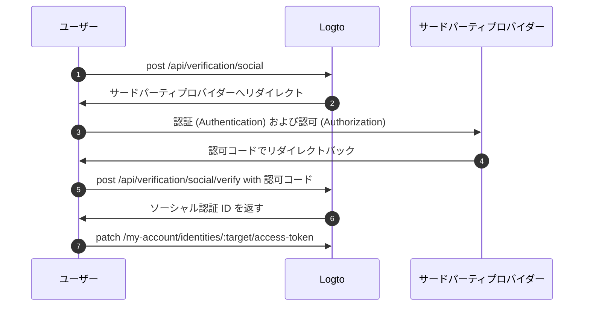

import Availability from '@components/Availability';

<Availability cloud oss={{ major: 1, minor: 31 }} />

サードパーティートークンセット（別名：フェデレーテッドトークンセット）は、Logto の [シークレットボールト](/secret-vault) に保存されるシークレットタイプであり、サードパーティのアイデンティティプロバイダーによって発行された アクセス トークン (Access token) および リフレッシュ トークン (Refresh token) を安全に管理するために使用されます。ユーザーがソーシャルまたはエンタープライズシングルサインオン (SSO) コネクター経由で認証 (Authentication) すると、Logto は発行されたトークンをボールトに保存します。これらのトークンは後で取得でき、ユーザーに再認証 (Authentication) を求めることなく、ユーザーの代理でサードパーティ API へアクセスできます。

## 主なユースケース \{#common-use-cases}

この機能は、AI エージェント、SaaS プラットフォーム、生産性ツール、顧客向けアプリケーションなど、ユーザーの代理でサードパーティサービスと連携する必要がある最新アプリケーションに不可欠です。実際の例をいくつか紹介します：

**📅 カレンダー管理アプリ**：ユーザーが Google でサインインした後、生産性アプリはカレンダーイベントを自動で同期し、新しい会議を作成し、招待を送信できます。再度認証 (Authentication) を求める必要はありません。

**🤖 AI アシスタント**：AI エージェントがユーザーの GitHub リポジトリへアクセスし、コード分析やプルリクエスト作成、課題管理などを行えます。すべてサインインやアカウント連携時の一度きりの同意で実現します。

**📊 分析ダッシュボード**：SaaS プラットフォームは、ユーザーが接続したソーシャルメディアアカウント（Facebook、LinkedIn など）からデータを取得し、ワークフローを中断することなくインサイトやレポートを生成できます。

## サードパーティートークンの保存を有効化する \{#enable-third-party-token-storage}

### ソーシャルコネクター \{#social-connectors}

この機能は、トークン保存をサポートする [ソーシャルコネクター](/connectors/social-connectors) で利用できます。サードパーティートークンは、[ソーシャルサインイン](/end-user-flows/sign-up-and-sign-in/social-sign-in)、[ソーシャルアカウント連携](/end-user-flows/account-settings/by-account-api#link-a-new-social-connection)、および [サードパーティ API アクセス用のトークン更新時](/secret-vault/federated-token-set#reauthentication-and-token-renewal) に保存できます。現在サポートされているコネクターは：[GitHub](/integrations/github)、[Google](/integrations/google)、[Facebook](/integrations/facebook)、[標準 OAuth 2.0](/integrations/oauth2)、[標準 OIDC](/integrations/oidc) です。今後さらに多くのコネクターが順次サポートされます。

1. <CloudLink to="/connectors/social">コンソール > コネクター > ソーシャルコネクター</CloudLink> に移動します。
2. サードパーティートークン保存を有効にしたいソーシャルコネクターを選択します。
3. コネクターのセットアップチュートリアルに従い、特定のサードパーティ API へアクセスするために必要なスコープを追加します。
4. 「設定」ページで **永続的な API アクセスのためにトークンを保存** オプションを有効にします。

### エンタープライズ SSO コネクター \{#enterprise-sso-connectors}

トークン保存は、すべての OIDC [エンタープライズコネクター](/connectors/enterprise-connectors) で利用できます。アクセス トークン (Access token) および リフレッシュ トークン (Refresh token) は、[エンタープライズシングルサインオン (SSO)](/end-user-flows/enterprise-sso) 時に保存できます。現在サポートされているコネクターは：[Google Workspace](/integrations/google-workspace)、[Microsoft Entra ID (OIDC)](/integrations/entra-id-oidc)、[Okta](/integrations/okta)、[OIDC (Enterprise)](/integrations/oidc-sso) です。

1. <CloudLink to="/enterprise-sso">コンソール > エンタープライズ SSO</CloudLink> に移動します。
2. サードパーティートークン保存を有効にしたいエンタープライズ SSO コネクターを選択します。
3. コネクターのセットアップチュートリアルに従い、特定のサードパーティ API へアクセスするために必要なスコープを追加します。
4. 「SSO 体験」タブで **永続的な API アクセスのためにトークンを保存** オプションを有効にします。

変更内容を必ず保存してください。

## トークンの保存 \{#token-storage}

サードパーティートークン保存を有効にすると、ユーザーがソーシャルまたはエンタープライズシングルサインオン (SSO) コネクター経由で認証 (Authentication) するたびに、Logto はフェデレーテッドアイデンティティプロバイダーから発行された アクセス トークン (Access token) および リフレッシュ トークン (Refresh token) を自動的に保存します。これには以下が含まれます：

- [ソーシャルサインイン・サインアップ](/end-user-flows/sign-up-and-sign-in/social-sign-in)
- [エンタープライズ SSO サインイン・サインアップ](/end-user-flows/enterprise-sso)
- [アカウント API 経由のソーシャルアカウント連携](/end-user-flows/account-settings/by-account-api#link-a-new-social-connection)

保存されたトークンは、ユーザーのソーシャルまたはエンタープライズ SSO アイデンティティに紐付けられ、再認証 (Authentication) を求めることなく後で API アクセス用に取得できます。

### トークン保存状況の確認 \{#checking-token-storage-status}

Logto コンソールでユーザーのサードパーティートークン保存状況を確認できます：

1. <CloudLink to="/users">コンソール > ユーザー</CloudLink> に移動します。
2. 確認したいユーザーをクリックします。ユーザー詳細ページに移動します。
3. **接続** セクションまでスクロールします。このエリアには、ユーザーに関連付けられたすべてのソーシャルおよびエンタープライズ SSO 接続が一覧表示されます。
4. 各接続エントリーには、その接続にトークンが保存されているかどうかを示すトークンステータスラベルが表示されます。
5. 接続エントリーをクリックすると、保存された アクセス トークン (Access token) のメタデータや リフレッシュ トークン (Refresh token) の有無（利用可能な場合）など、詳細を確認できます。

また、管理 API を通じてユーザーのサードパーティアイデンティティおよびトークン保存状況を確認できます：

- `GET /api/users/{userId}/identities/{target}?includeTokenSecret=true`：指定したコネクターターゲット（例：`github`、`google` など）でユーザーのソーシャルアイデンティティおよびトークン保存状況を取得します。
- `GET /api/users/{userId}/sso-identities/{ssoConnectorId}?includeTokenSecret=true`：指定した SSO コネクター ID でユーザーのエンタープライズ SSO アイデンティティおよびトークン保存状況を取得します。

### トークン保存ステータス \{#token-storage-status}

- **アクティブ**：アクセス トークン (Access token) が保存されており有効です。
- **期限切れ**：アクセス トークン (Access token) は保存されていますが、期限切れです。リフレッシュ トークン (Refresh token) が利用可能な場合、新しいアクセス トークン (Access token) を取得できます。
- **非アクティブ**：この接続にアクセス トークン (Access token) が保存されていません。ユーザーがこの接続で認証 (Authentication) していない場合や、トークン保存が削除された場合に発生します。
- **該当なし**：コネクターがトークン保存をサポートしていません。

### トークンメタデータ \{#token-metadata}

データの整合性とセキュリティのため、すべてのトークンはシークレットボールトに保存される前に暗号化されます。実際のトークン値は、適切な認可 (Authorization) を持つエンドユーザーのみがアクセスできます。一方、開発者はトークンセットのメタデータのみを取得でき、機密情報を露出せずに保存されたトークンの状態を把握できます。

- `createdAt`：接続が初めて確立され、トークンセットがシークレットボールトに最初に保存されたタイムスタンプ。
- `updatedAt`：トークンセットが最後に更新された時刻。
  - リフレッシュ トークン (Refresh token) がない場合、この値は **createdAt** と同じです。
  - リフレッシュ トークン (Refresh token) がある場合、この値はアクセス トークン (Access token) が最後にリフレッシュされた時刻を示します。
- `hasRefreshToken`：リフレッシュ トークン (Refresh token) が利用可能かどうかを示します。
  コネクターがオフラインアクセスをサポートし、認可 (Authorization) リクエストが正しく構成されていれば、Logto はアイデンティティプロバイダーから発行されたリフレッシュ トークン (Refresh token) をアクセス トークン (Access token) と一緒に保存します。
  アクセス トークン (Access token) が期限切れで有効なリフレッシュ トークン (Refresh token) が存在する場合、ユーザーが接続先プロバイダーへのアクセスを要求するたびに、Logto は保存されたリフレッシュ トークン (Refresh token) を使って新しいアクセス トークン (Access token) の取得を自動的に試みます。
- `expiresAt`：アクセス トークン (Access token) の推定有効期限（**秒単位**）。
  これは、アイデンティティプロバイダーのトークンエンドポイントから返される `expires_in` 値に基づいて計算されます。（このフィールドは、プロバイダーがトークンレスポンスに `expires_in` を含めている場合のみ利用可能です。）
- `scope`：アクセス トークン (Access token) のスコープであり、アイデンティティプロバイダーによって付与された 権限 (Permissions) を示します。
  保存されたアクセス トークン (Access token) でどのような操作が可能かを把握するのに役立ちます。（このフィールドは、プロバイダーがトークンレスポンスに `scope` を含めている場合のみ利用可能です。）
- `tokenType`：アクセス トークン (Access token) のタイプ。通常は "Bearer" です。
  （このフィールドは、プロバイダーがトークンレスポンスに `token_type` を含めている場合のみ利用可能です。）

## トークンの取得 \{#token-retrieval}

トークン保存が有効化され、トークンが Logto のシークレットボールトに安全に保存されると、エンドユーザーは Logto の [ユーザーアカウント API](/end-user-flows/account-settings/by-account-api) を組み込むことで、クライアントアプリケーションからサードパーティのアクセス トークン (Access token) を取得できます。

- `GET /my-account/identities/:target/access-token`：コネクターターゲット（例：github、google）を指定してソーシャルアイデンティティのアクセス トークン (Access token) を取得します。

- `GET /my-account/sso-identities/:connectorId/access-token`：コネクター ID を指定してエンタープライズ SSO アイデンティティのアクセス トークン (Access token) を取得します。

:::info
サードパーティのアクセス トークン (Access token) を取得するには、まずエンドユーザー向けにアカウント API を有効化する必要があります。<CloudLink to="/sign-in-experience/account-center">コンソール > サインイン & アカウント > アカウントセンター</CloudLink> で設定できます。[アカウント API の有効化方法](/end-user-flows/account-settings/by-account-api#how-to-enable-account-api) および [Logto 発行のアクセス トークン (Access token) でのアクセス方法](/end-user-flows/account-settings/by-account-api#access-account-api-using-access-token) もご覧ください。
:::

### トークンローテーション \{#token-rotation}

トークン取得エンドポイントは以下のレスポンスを返します：

- `200` OK：アクセス トークン (Access token) の取得に成功し、まだ有効な場合。
- `404` Not Found：指定したターゲットまたはコネクター ID に紐付くソーシャルまたはエンタープライズ SSO アイデンティティが存在しない場合、またはアクセス トークン (Access token) が保存されていない場合。
- `401` Unauthorized：アクセス トークン (Access token) が期限切れの場合。

アクセス トークン (Access token) が期限切れでリフレッシュ トークン (Refresh token) が利用可能な場合、Logto は自動的にアクセス トークン (Access token) のリフレッシュを試み、新しいアクセス トークン (Access token) をレスポンスで返します。シークレットボールト内のトークン保存も新しいアクセス トークン (Access token) とそのメタデータで更新されます。

## トークン保存の削除 \{#token-storage-deletion}

サードパーティートークン保存は、各ユーザーのソーシャルまたはエンタープライズ SSO 接続に直接紐付いています。つまり、以下の場合に保存されたトークンセットは自動的に削除されます：

- 関連付けられたソーシャルまたはエンタープライズ SSO アイデンティティがユーザーアカウントから削除された場合。
- ユーザーアカウントがテナントから削除された場合。
- ソーシャルまたはエンタープライズ SSO コネクターがテナントから削除された場合。

### トークンの失効 \{#revoking-tokens}

ユーザーのサードパーティートークンセットを手動で削除してアクセスを失効させることもできます：

- コンソールから：
  ユーザーのアイデンティティ詳細ページに移動します。**アクセス トークン (Access token)** セクション（トークン保存が利用可能な場合）までスクロールし、セクション末尾の **トークンを削除** ボタンをクリックします。
- 管理 API 経由：
  - `DELETE /api/secret/:id`：ユーザーアイデンティティ詳細から取得できる ID で特定のシークレットを削除します。

トークンセットを失効させると、ユーザーは再度サードパーティプロバイダーで認証 (Authentication) し、新しいアクセス トークン (Access token) ) を取得しない限り、サードパーティ API へアクセスできなくなります。

## 再認証とトークンの更新 \{#reauthentication-and-token-renewal}

保存されたアクセス トークン (Access token) の有効期限が切れた場合や、アプリケーションが追加の API スコープを要求する必要がある場合、エンドユーザーはサードパーティプロバイダーで再認証 (Authentication) し、新しいアクセス トークン (Access token) を取得できます—Logto への再サインインは不要です。
これは Logto の [ソーシャル認証 API](https://openapi.logto.io/operation/operation-createverificationbysocial) を通じて実現でき、ユーザーはフェデレーテッドソーシャル認可 (Authorization) フローを再開し、保存されたトークンセットを更新できます。

:::note
フェデレーテッド認可 (Authorization) の再開は現在ソーシャルコネクターに限定されています。
エンタープライズ SSO コネクターの場合、再認証 (Authentication) およびトークンの更新には、ユーザーが再度 Logto の認証 (Authentication) フローを開始する必要があります。サインイン後にエンタープライズ SSO プロバイダーと直接再認可 (Authorization) することは現在サポートされていません。
:::



1. ユーザーは `POST /api/verification/social` エンドポイントを呼び出してソーシャル認証リクエストを開始します。追加の 権限 (Permissions) を要求するためにカスタムスコープを指定することもできます。

   ```sh
   curl -X POST https://<your-logto-domain>/api/verification/social \
     -H "Authorization: Bearer <access_token>" \
     -H "Content-Type: application/json" \
     -d '{
       "state": "<state>",
       "connectorId": "<logto_connectorId>",
       "redirectUri": "<redirect_uri>",
       "scope": "<custom_scope>"
     }'
   ```

   - **authorization header**：Logto によって発行されたユーザーの アクセス トークン (Access token)。
   - **connectorId**：Logto 内のソーシャルコネクター ID。
   - **redirectUri**：認証 (Authentication) 後にユーザーをアプリケーションへリダイレクトする URI。この URI をプロバイダーのアプリケーション設定に登録する必要があります。
   - **scope**：（オプション）サードパーティプロバイダーから追加の 権限 (Permissions) を要求するためのカスタムスコープ。指定しない場合はコネクターで設定されたデフォルトスコープが使用されます。

2. Logto は新しいソーシャル認証レコードを作成し、ユーザーをサードパーティプロバイダーへリダイレクトするための認可 (Authorization) URL とともにソーシャル認証 ID を返します。

   レスポンス例：

   ```json
   {
     "verificationRecordId": "<social_verification_id>",
     "authorizationUri": "<authorization_url>",
     "expiresAt": "<expiration_time>"
   }
   ```

3. ユーザーを認可 (Authorization) URL へリダイレクトします。ユーザーはサードパーティプロバイダーで認証 (Authentication) し、 権限 (Permissions) を付与します。

4. サードパーティプロバイダーは認可コードを付与してユーザーをクライアントアプリケーションへリダイレクトします。

5. 認可 (Authorization) コールバックを処理し、認可コードを Logto の認証エンドポイントへ転送します：

   ```sh
   curl -X POST https://<your-logto-domain>/api/verification/social/verify \
     -H "Authorization: Bearer <access_token>" \
     -d '{
       "verificationRecordId": "<social_verification_id>",
       "connectorData": {
         "code": "<authorization_code>",
         "state": "<state>",
         "redirectUri": "<redirect_uri>"
       }
     }'
   ```

   - **authorization header**：Logto によって発行されたユーザーの アクセス トークン (Access token)。
   - **verificationRecordId**：前のステップで返されたソーシャル認証 ID。
   - **connectorData**：認可コードや、コールバック時にサードパーティプロバイダーから返されたその他のデータ。

   :::note
   CSRF 攻撃を防ぐため、`state` パラメーターの検証を忘れないでください。
   :::

6. Logto は認可コードを検証し、サードパーティプロバイダーから新しい アクセス トークン (Access token) および リフレッシュ トークン (Refresh token) を取得し、レスポンスでソーシャル認証 ID を返します。

7. 最後に、`PATCH /my-account/identities/:target/access-token` エンドポイントにソーシャル認証 ID を指定してユーザーのトークン保存を更新します：

   ```sh
   curl -X PATCH https://<your-logto-domain>/my-account/identities/<target>/access-token \
     -H "Authorization: Bearer <access_token>" \
     -H "Content-Type: application/json" \
     -d '{
       "socialVerificationId": "<social_verification_id>"
     }'
   ```

   - **authorization header**：Logto によって発行されたユーザーの アクセス トークン (Access token)。
   - **socialVerificationId**：前のステップで返された認証済みソーシャル認証レコード ID。

   これにより、Logto のシークレットボールト内のユーザーのトークンセット保存が新しい アクセス トークン (Access token) および リフレッシュ トークン (Refresh token) で更新され、ユーザーは再度 Logto にサインインすることなくサードパーティ API へアクセスできるようになります。

   更新されたアクセス トークン (Access token) が返されます。
