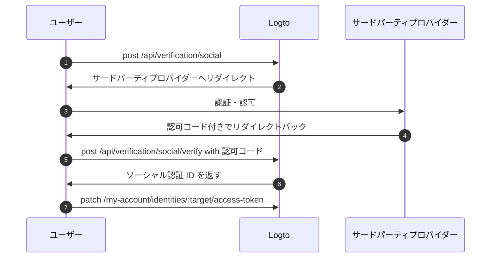

import Availability from '@components/Availability';

<Availability cloud oss={{ major: 1, minor: 31 }} />

サードパーティトークンセット（別名：フェデレーテッドトークンセット）は、Logto の [シークレットボールト](/secret-vault) に保存されるシークレットタイプであり、サードパーティのアイデンティティプロバイダーによって発行された アクセストークン (Access token) および リフレッシュトークン (Refresh token) を安全に管理するために使用されます。ユーザーがソーシャルまたはエンタープライズシングルサインオン (SSO) コネクター経由で認証 (Authentication) すると、Logto は発行されたトークンをボールトに保存します。これらのトークンは後で取得でき、ユーザーの再認証なしでサードパーティ API へ代理アクセスが可能となります。

## 主なユースケース \{#common-use-cases}

この機能は、AI エージェント、SaaS プラットフォーム、生産性ツール、顧客向けアプリケーションなど、ユーザーの代理でサードパーティサービスと連携する必要がある現代的なアプリケーションに不可欠です。実際の例をいくつか挙げます：

**📅 カレンダー管理アプリ**：ユーザーが Google でサインインした後、生産性アプリが自動的にカレンダーイベントを同期し、新しい会議を作成し、招待状を送信できます。再認証を求める必要はありません。

**🤖 AI アシスタント**：AI エージェントがユーザーの GitHub リポジトリへアクセスし、コード分析、プルリクエスト作成、課題管理などを行えます。すべてサインインやアカウント連携時の一度きりの同意で実現します。

**📊 分析ダッシュボード**：SaaS プラットフォームがユーザーの接続済みソーシャルメディアアカウント（Facebook、LinkedIn など）からデータを取得し、インサイトやレポートを生成できます。繰り返しログインを求めることなく、ワークフローを妨げません。

## サードパーティトークンの保存を有効化する \{#enable-third-party-token-storage}

### ソーシャルコネクター \{#social-connectors}

この機能は、トークン保存をサポートする [ソーシャルコネクター](/connectors/social-connectors) で利用できます。サードパーティトークンは、[ソーシャルサインイン](/end-user-flows/sign-up-and-sign-in/social-sign-in)、[ソーシャルアカウント連携](/end-user-flows/account-settings/by-account-api#link-a-new-social-connection)、および [サードパーティ API アクセス用トークンの更新時](/secret-vault/federated-token-set#reauthentication-and-token-renewal) に保存できます。現在サポートされているコネクターは：[GitHub](/integrations/github)、[Google](/integrations/google)、[Facebook](/integrations/facebook)、[標準 OAuth 2.0](/integrations/oauth2)、[標準 OIDC](/integrations/oidc) です。今後、他のコネクターも順次対応予定です。

1. <CloudLink to="/connectors/social">コンソール > コネクター > ソーシャルコネクター</CloudLink> に移動します。
2. サードパーティトークン保存を有効にしたいソーシャルコネクターを選択します。
3. コネクターのセットアップチュートリアルに従い、特定のサードパーティ API へアクセスするために必要なスコープを追加します。
4. 「設定」ページで **永続的な API アクセスのためにトークンを保存** オプションを有効にします。

### エンタープライズ SSO コネクター \{#enterprise-sso-connectors}

トークン保存は、すべての OIDC [エンタープライズコネクター](/connectors/enterprise-connectors) で利用できます。アクセストークン (Access token) およびリフレッシュトークン (Refresh token) は、[エンタープライズシングルサインオン (SSO)](/end-user-flows/enterprise-sso) 時に保存できます。現在サポートされているコネクターは：[Google Workspace](/integrations/google-workspace) です。

1. <CloudLink to="/enterprise-sso">コンソール > エンタープライズ SSO</CloudLink> に移動します。
2. サードパーティトークン保存を有効にしたいエンタープライズ SSO コネクターを選択します。
3. コネクターのセットアップチュートリアルに従い、特定のサードパーティ API へアクセスするために必要なスコープを追加します。
4. 「SSO 体験」タブで **永続的な API アクセスのためにトークンを保存** オプションを有効にします。

変更を保存することを忘れないでください。

## トークンの保存 \{#token-storage}

サードパーティトークン保存を有効にすると、ユーザーがソーシャルまたはエンタープライズ SSO コネクター経由で認証 (Authentication) するたびに、Logto はフェデレーテッドアイデンティティプロバイダーから発行された アクセストークン (Access token) および リフレッシュトークン (Refresh token) を自動的に保存します。これには以下が含まれます：

- [ソーシャルサインイン・サインアップ](/end-user-flows/sign-up-and-sign-in/social-sign-in)
- [エンタープライズ SSO サインイン・サインアップ](/end-user-flows/enterprise-sso)
- [アカウント API 経由のソーシャルアカウント連携](/end-user-flows/account-settings/by-account-api#link-a-new-social-connection)

保存されたトークンはユーザーのソーシャルまたはエンタープライズ SSO アイデンティティに紐付けられ、再認証なしで API アクセス用に後から取得できます。

### トークン保存状況の確認 \{#checking-token-storage-status}

Logto コンソールでユーザーのサードパーティトークン保存状況を確認できます：

1. <CloudLink to="/users">コンソール > ユーザー</CloudLink> に移動します。
2. 確認したいユーザーをクリックします。ユーザー詳細ページに移動します。
3. **接続** セクションまでスクロールします。このエリアには、ユーザーに紐付くすべてのソーシャルおよびエンタープライズ SSO 接続が一覧表示されます。
4. 各接続エントリーには、その接続でトークンが保存されているかどうかを示すトークンステータスラベルが表示されます。
5. 接続エントリーをクリックすると、保存されたアクセストークン (Access token) のメタデータやリフレッシュトークン (Refresh token) の有無（存在する場合）など、詳細を確認できます。

また、管理 API を通じてユーザーのサードパーティアイデンティティおよびトークン保存状況を確認できます：

- `GET /api/users/{userId}/identities/{target}?includeTokenSecret=true`：指定したコネクターターゲット（例：`github`、`google` など）でユーザーのソーシャルアイデンティティおよびトークン保存状況を取得します。
- `GET /api/users/{userId}/sso-identities/{ssoConnectorId}?includeTokenSecret=true`：指定した SSO コネクター ID でユーザーのエンタープライズ SSO アイデンティティおよびトークン保存状況を取得します。

### トークン保存ステータス \{#token-storage-status}

- **アクティブ**：アクセストークン (Access token) が保存されており有効です。
- **期限切れ**：アクセストークン (Access token) は保存されていますが、期限切れです。リフレッシュトークン (Refresh token) が利用可能な場合、新しいアクセストークン (Access token) を取得できます。
- **非アクティブ**：この接続にアクセストークン (Access token) は保存されていません。ユーザーがこの接続で認証 (Authentication) していない場合や、トークン保存が削除された場合に発生します。
- **該当なし**：コネクターがトークン保存をサポートしていません。

### トークンメタデータ \{#token-metadata}

データの整合性とセキュリティのため、すべてのトークンはシークレットボールトに保存される前に暗号化されます。実際のトークン値は、適切な認可 (Authorization) を持つエンドユーザーのみがアクセスできます。開発者は、機密情報を公開せずに保存されたトークンの状態を把握するため、トークンセットのメタデータのみ取得可能です。

- `createdAt`：接続が初めて確立され、トークンセットがシークレットボールトに初回保存されたタイムスタンプ。
- `updatedAt`：トークンセットが最後に更新された時刻。
  - リフレッシュトークン (Refresh token) がない場合、この値は **createdAt** と同じです。
  - リフレッシュトークン (Refresh token) がある場合、この値はアクセストークン (Access token) が最新でリフレッシュされた時刻を示します。
- `hasRefreshToken`：リフレッシュトークン (Refresh token) が利用可能かどうか。
  コネクターがオフラインアクセスをサポートし、認可リクエストが正しく構成されていれば、Logto はアイデンティティプロバイダーから発行されたリフレッシュトークン (Refresh token) をアクセストークン (Access token) とともに保存します。
  アクセストークン (Access token) の有効期限が切れ、かつ有効なリフレッシュトークン (Refresh token) が存在する場合、ユーザーが接続先プロバイダーへのアクセスを要求するたびに、Logto は保存されたリフレッシュトークン (Refresh token) を使って新しいアクセストークン (Access token) の取得を自動的に試みます。
- `expiresAt`：アクセストークン (Access token) の推定有効期限（**秒単位**）。
  これはアイデンティティプロバイダーのトークンエンドポイントから返される `expires_in` 値に基づいて計算されます。（このフィールドはプロバイダーがトークンレスポンスに `expires_in` を含む場合のみ利用可能です。）
- `scope`：アクセストークン (Access token) のスコープ。アイデンティティプロバイダーによって付与された権限を示します。
  保存されたアクセストークン (Access token) でどのような操作が可能かを把握するのに役立ちます。（このフィールドはプロバイダーがトークンレスポンスに `scope` を含む場合のみ利用可能です。）
- `tokenType`：アクセストークン (Access token) のタイプ。通常は "Bearer" です。
  （このフィールドはプロバイダーがトークンレスポンスに `token_type` を含む場合のみ利用可能です。）

## トークンの取得 \{#token-retrieval}

トークン保存が有効化され、トークンが Logto のシークレットボールトに安全に保存されると、エンドユーザーは Logto の [ユーザーアカウント API](/end-user-flows/account-settings/by-account-api) を組み込むことで、クライアントアプリケーションからサードパーティアクセストークン (Access token) を取得できます。

- `GET /my-account/identities/:target/access-token`：コネクターターゲット（例：github、google）を指定してソーシャルアイデンティティのアクセストークン (Access token) を取得します。

- `GET /my-account/sso-identities/:connectorId/access-token`：コネクター ID を指定してエンタープライズ SSO アイデンティティのアクセストークン (Access token) を取得します。

:::info
Logto 発行のアクセストークン (Access token) を使って [アカウント API を有効化](/end-user-flows/account-settings/by-account-api#how-to-enable-account-api) および [アクセス](/end-user-flows/account-settings/by-account-api#access-account-api-using-access-token) する方法を学べます。
:::

### トークンローテーション \{#token-rotation}

トークン取得エンドポイントは次のレスポンスを返します：

- `200` OK：アクセストークン (Access token) の取得に成功し、まだ有効な場合。
- `404` Not Found：指定したターゲットまたはコネクター ID に紐付くソーシャルまたはエンタープライズ SSO アイデンティティが存在しない場合、またはアクセストークン (Access token) が保存されていない場合。
- `401` Unauthorized：アクセストークン (Access token) の有効期限が切れている場合。

アクセストークン (Access token) の有効期限が切れており、リフレッシュトークン (Refresh token) が利用可能な場合、Logto は自動的にアクセストークン (Access token) のリフレッシュを試み、新しいアクセストークン (Access token) をレスポンスで返します。シークレットボールト内のトークン保存も新しいアクセストークン (Access token) とそのメタデータで更新されます。

## トークン保存の削除 \{#token-storage-deletion}

サードパーティトークン保存は、各ユーザーのソーシャルまたはエンタープライズ SSO 接続に直接紐付いています。つまり、以下の場合に保存されたトークンセットは自動的に削除されます：

- 関連するソーシャルまたはエンタープライズ SSO アイデンティティがユーザーアカウントから削除された場合。
- ユーザーアカウントがテナントから削除された場合。
- ソーシャルまたはエンタープライズ SSO コネクターがテナントから削除された場合。

### トークンの失効 \{#revoking-tokens}

ユーザーのサードパーティトークンセットを手動で削除し、アクセスを失効させることもできます：

- コンソールから：
  ユーザーのアイデンティティ詳細ページに移動します。**アクセストークン (Access token)** セクション（トークン保存が利用可能な場合）までスクロールし、セクション末尾の **トークンを削除** ボタンをクリックします。
- 管理 API 経由：
  - `DELETE /api/secret/:id`：ユーザーアイデンティティ詳細から取得した ID で特定のシークレットを削除します。

トークンセットを失効させると、ユーザーは再度サードパーティプロバイダーで認証 (Authentication) し、新しいアクセストークン (Access token) を取得しない限り、サードパーティ API へアクセスできなくなります。

## 再認証とトークンの更新 \{#reauthentication-and-token-renewal}

保存されたアクセストークン (Access token) の有効期限が切れた場合や、アプリケーションが追加の API スコープを要求する必要がある場合、エンドユーザーはサードパーティプロバイダーで再認証し、新しいアクセストークン (Access token) を取得できます—Logto への再サインインは不要です。
これは Logto の [ソーシャル認証 API](https://openapi.logto.io/operation/operation-createverificationbysocial) を通じて実現でき、ユーザーはフェデレーテッドソーシャル認可 (Authorization) フローを再開し、保存されたトークンセットを更新できます。

:::note
フェデレーテッド認可 (Authorization) の再開は現在ソーシャルコネクターに限定されています。
エンタープライズ SSO コネクターの場合、再認証とトークンの更新にはユーザーが再度 Logto の認証 (Authentication) フローを開始する必要があります。サインイン後にエンタープライズ SSO プロバイダーとの直接再認可 (Authorization) は現在サポートされていません。
:::



1. ユーザーは `POST /api/verification/social` エンドポイントを呼び出してソーシャル認証リクエストを開始します。追加の権限を要求するためにカスタムスコープを指定することもできます。

   ```sh
   curl -X POST https://<your-logto-domain>/api/verification/social \
     -H "Authorization: Bearer <access_token>" \
     -H "Content-Type: application/json" \
     -d '{
       "state": "<state>",
       "connectorId": "<logto_connectorId>",
       "redirectUri": "<redirect_uri>",
       "scope": "<custom_scope>"
     }'
   ```

   - **authorization header**：Logto が発行したユーザーのアクセストークン (Access token)。
   - **connectorId**：Logto 内のソーシャルコネクター ID。
   - **redirectUri**：認証 (Authentication) 後にユーザーをアプリケーションへリダイレクトする URI。この URI をプロバイダーのアプリケーション設定に登録する必要があります。
   - **scope**：（任意）サードパーティプロバイダーから追加の権限を要求するカスタムスコープ。指定しない場合はコネクターで設定されたデフォルトスコープが使用されます。

2. Logto は新しいソーシャル認証レコードを作成し、ユーザーをサードパーティプロバイダーへ認証 (Authentication) させるための認可 (Authorization) URL とともにソーシャル認証 ID を返します。

   レスポンス例：

   ```json
   {
     "verificationRecordId": "<social_verification_id>",
     "authorizationUri": "<authorization_url>",
     "expiresAt": "<expiration_time>"
   }
   ```

3. ユーザーを認可 (Authorization) URL へリダイレクトします。ユーザーはサードパーティプロバイダーで認証 (Authentication) し、権限を付与します。

4. サードパーティプロバイダーは認可コード付きでユーザーをクライアントアプリケーションへリダイレクトします。

5. 認可コールバックを処理し、認可コードを Logto の認証エンドポイントへ転送します：

   ```sh
   curl -X POST https://<your-logto-domain>/api/verification/social/verify \
     -H "Authorization: Bearer <access_token>" \
     -d '{
       "verificationRecordId": "<social_verification_id>",
       "connectorData": {
         "code": "<authorization_code>",
         "state": "<state>",
         "redirectUri": "<redirect_uri>"
       }
     }'
   ```

   - **authorization header**：Logto が発行したユーザーのアクセストークン (Access token)。
   - **verificationRecordId**：前のステップで返されたソーシャル認証 ID。
   - **connectorData**：認可コードやコールバック時にサードパーティプロバイダーから返されたその他のデータ。

   :::note
   CSRF 攻撃を防ぐため、`state` パラメーターの検証を忘れないでください。
   :::

6. Logto は認可コードを検証し、サードパーティプロバイダーから新しいアクセストークン (Access token) およびリフレッシュトークン (Refresh token) を取得し、レスポンスでソーシャル認証 ID を返します。

7. 最後に、`PATCH /my-account/identities/:target/access-token` エンドポイントにソーシャル認証 ID を指定してユーザーのトークン保存を更新します：

   ```sh
   curl -X PATCH https://<your-logto-domain>/my-account/identities/<target>/access-token \
     -H "Authorization: Bearer <access_token>" \
     -H "Content-Type: application/json" \
     -d '{
       "socialVerificationId": "<social_verification_id>"
     }'
   ```

   - **authorization header**：Logto が発行したユーザーのアクセストークン (Access token)。
   - **socialVerificationId**：前のステップで返された検証済みソーシャル認証レコード ID。

   これにより、Logto のシークレットボールト内のユーザーのトークンセット保存が新しいアクセストークン (Access token) およびリフレッシュトークン (Refresh token) で更新され、ユーザーは再度 Logto にサインインすることなくサードパーティ API へアクセスできるようになります。

   更新されたアクセストークン (Access token) が返されます。
