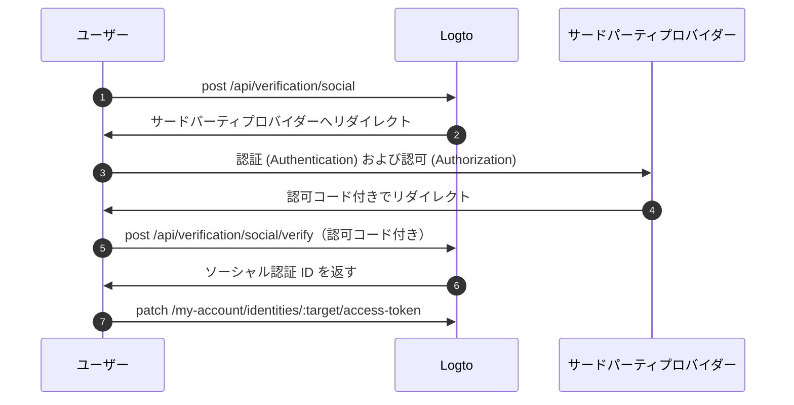

import Availability from '@components/Availability';

<Availability cloud oss={{ major: 1, minor: 31 }} />

フェデレーテッドトークンセットは、Logto の Secret Vault に保存されるシークレットタイプであり、フェデレーテッドなサードパーティアイデンティティプロバイダーによって発行されたアクセス トークン (Access token) およびリフレッシュ トークン (Refresh token) を安全に管理するために使用されます。ユーザーがソーシャルまたはエンタープライズシングルサインオン (SSO) コネクター経由で認証 (Authentication) すると、Logto は発行されたトークンを Vault に保存します。これらのトークンは後で取得でき、再認証なしでユーザーの代わりにサードパーティ API へアクセスできます。

## フェデレーテッドトークンストレージの有効化 \{#enable-federated-token-storage}

### ソーシャルコネクター \{#social-connectors}

:::Info
この機能はトークンストレージをサポートするコネクターのみで利用可能です。現在サポートされているコネクターは次の通りです：[GitHub](/integrations/github)、[Google](/integrations/google)、[Facebook](/integrations/facebook)、[Standard OAuth 2.0](/integrations/oauth2)、[Standard OIDC](/integrations/oidc)。今後、追加のコネクターにも順次対応予定です。
:::

1. <CloudLink to="/connectors/social">
     コンソール > コネクター > ソーシャルコネクター
   </CloudLink> に移動します。
2. フェデレーテッドトークンストレージを有効にしたいソーシャルコネクターを選択します。
3. 「設定」ページで、**永続的な API アクセスのためにトークンを保存** オプションを有効にします。

### エンタープライズ SSO コネクター \{#enterprise-sso-connectors}

:::Info
トークンストレージはすべての OIDC エンタープライズコネクターで利用可能です。
:::

1. <CloudLink to="/enterprise-sso">コンソール > エンタープライズ SSO</CloudLink> に移動します。
2. フェデレーテッドトークンストレージを有効にしたいエンタープライズ SSO コネクターを選択します。
3. 「SSO 体験」タブで、**永続的な API アクセスのためにトークンを保存** オプションを有効にします。

変更内容を必ず保存してください。

## トークンストレージ \{#token-storage}

フェデレーテッドトークンストレージを有効にすると、ユーザーがソーシャルまたはエンタープライズ SSO コネクター経由で認証 (Authentication) するたびに、Logto はフェデレーテッドアイデンティティプロバイダーによって発行されたアクセス トークン (Access token) およびリフレッシュ トークン (Refresh token) を自動的に保存します。これには次が含まれます：

- [ソーシャルサインイン・サインアップ](/end-user-flows/sign-up-and-sign-in/social-sign-in)
- [エンタープライズ SSO サインイン・サインアップ](/end-user-flows/enterprise-sso)
- [アカウント API 経由でのソーシャルアカウント連携](/end-user-flows/account-settings/by-account-api#link-a-new-social-connection)

保存されたトークンはユーザーのソーシャルまたはエンタープライズ SSO アイデンティティに紐づけられ、後で再認証なしで API アクセスのためにトークンを取得できます。

### トークンストレージの状態確認 \{#checking-token-storage-status}

Logto コンソールでユーザーのフェデレーテッドトークンストレージの状態を確認できます：

1. <CloudLink to="/users">コンソール > ユーザー</CloudLink> に移動します。
2. 確認したいユーザーをクリックします。ユーザー詳細ページに移動します。
3. **接続** セクションまでスクロールします。このエリアにはユーザーに紐づくすべてのソーシャルおよびエンタープライズ SSO 接続が一覧表示されます。
4. 各接続エントリーには、その接続にトークンが保存されているかどうかを示すトークンステータスラベルが表示されます。
5. 接続エントリーをクリックすると、保存されたアクセス トークン (Access token) のメタデータやリフレッシュ トークン (Refresh token) の有無（利用可能な場合）など、詳細を確認できます。

また、Management API を通じてユーザーのサードパーティアイデンティティやトークンストレージの状態を確認することも可能です：

- `GET /api/users/{userId}/identities/{target}?includeTokenSecret=true`：指定したコネクターターゲット（例：`github`、`google` など）に紐づくユーザーのソーシャルアイデンティティとトークンストレージの状態を取得します。
- `GET /api/users/{userId}/sso-identities/{ssoConnectorId}?includeTokenSecret=true`：指定した SSO コネクター ID に紐づくユーザーのエンタープライズ SSO アイデンティティとトークンストレージの状態を取得します。

### トークンストレージの状態 \{#token-storage-status}

- **アクティブ**：アクセス トークン (Access token) が保存されており有効です。
- **期限切れ**：アクセス トークン (Access token) は保存されていますが、期限切れです。リフレッシュ トークン (Refresh token) が利用可能な場合、新しいアクセス トークン (Access token) を取得できます。
- **非アクティブ**：この接続にアクセス トークン (Access token) が保存されていません。ユーザーがこの接続で認証 (Authentication) していない場合や、トークンストレージが削除された場合に発生します。
- **該当なし**：コネクターがトークンストレージをサポートしていません。

### トークンメタデータ \{#token-metadata}

データの整合性とセキュリティのため、すべてのトークンは Secret Vault に保存される前に暗号化されます。実際のトークン値は、適切な認可 (Authorization) を持つエンドユーザーのみがアクセスできます。一方、開発者はトークンセットのメタデータのみ取得でき、機密情報を露出せずに保存状態を把握できます。

- `createdAt`：接続が初めて確立され、トークンセットが Secret Vault に初回保存されたタイムスタンプ。
- `updatedAt`：トークンセットが最後に更新された時刻。
  - リフレッシュ トークン (Refresh token) がない場合、この値は **createdAt** と同じです。
  - リフレッシュ トークン (Refresh token) がある場合、この値はアクセス トークン (Access token) が最新でリフレッシュされた時刻を示します。
- `hasRefreshToken`：リフレッシュ トークン (Refresh token) が利用可能かどうかを示します。
  コネクターがオフラインアクセスをサポートし、認可 (Authorization) リクエストが適切に構成されている場合、Logto はアイデンティティプロバイダーから発行されたリフレッシュ トークン (Refresh token) をアクセス トークン (Access token) とともに保存します。
  アクセス トークン (Access token) が期限切れで有効なリフレッシュ トークン (Refresh token) が存在する場合、ユーザーが接続先プロバイダーへのアクセスを要求するたびに、Logto は保存されたリフレッシュ トークン (Refresh token) を使って新しいアクセス トークン (Access token) の取得を自動的に試みます。
- `expiresAt`：アクセス トークン (Access token) の推定有効期限（**秒単位**）。
  これはアイデンティティプロバイダーのトークンエンドポイントから返される `expires_in` 値に基づいて計算されます。（このフィールドはプロバイダーがトークンレスポンスに `expires_in` を含めている場合のみ利用可能です。）
- `scope`：アクセス トークン (Access token) のスコープ (Scope)。アイデンティティプロバイダーによって付与された権限 (Permissions) を示します。
  保存されたアクセス トークン (Access token) でどのような操作が可能かを把握するのに役立ちます。（このフィールドはプロバイダーがトークンレスポンスに `scope` を含めている場合のみ利用可能です。）
- `tokenType`：アクセス トークン (Access token) のタイプ。通常は "Bearer" です。
  （このフィールドはプロバイダーがトークンレスポンスに `token_type` を含めている場合のみ利用可能です。）

## トークン取得 \{#token-retrieval}

トークンストレージが有効化され、トークンが Logto の Secret Vault に安全に保存されると、エンドユーザーは Logto の [ユーザーアカウント API](/end-user-flows/account-settings/by-account-api) を統合することで、クライアントアプリケーションからサードパーティのアクセス トークン (Access token) を取得できます。

- `GET /my-account/identities/:target/access-token`：コネクターターゲット（例：github、google）を指定してソーシャルアイデンティティのアクセス トークン (Access token) を取得します。

- `GET /my-account/sso-identities/:connectorId/access-token`：コネクター ID を指定してエンタープライズ SSO アイデンティティのアクセス トークン (Access token) を取得します。

:::info
Logto 発行のアクセス トークン (Access token) を使って [Account API を有効化](/end-user-flows/account-settings/by-account-api#how-to-enable-account-api) および [アクセス](/end-user-flows/account-settings/by-account-api#access-account-api-using-access-token) する方法を学べます。
:::

### トークンローテーション \{#token-rotation}

トークン取得エンドポイントは次のレスポンスを返します：

- `200` OK：アクセス トークン (Access token) の取得に成功し、まだ有効な場合。
- `404` Not Found：指定したターゲットまたはコネクター ID に紐づくソーシャルまたはエンタープライズ SSO アイデンティティが存在しない場合、またはアクセス トークン (Access token) が保存されていない場合。
- `401` Unauthorized：アクセス トークン (Access token) が期限切れの場合。

アクセス トークン (Access token) が期限切れでリフレッシュ トークン (Refresh token) が利用可能な場合、Logto は自動的にアクセス トークン (Access token) のリフレッシュを試み、新しいアクセス トークン (Access token) をレスポンスで返します。Secret Vault のトークンストレージも新しいアクセス トークン (Access token) とそのメタデータで更新されます。

## トークンストレージの削除 \{#token-storage-deletion}

フェデレーテッドトークンストレージは各ユーザーのソーシャルまたはエンタープライズ SSO 接続に直接紐づいています。つまり、次の場合に保存されたトークンセットは自動的に削除されます：

- 関連するソーシャルまたはエンタープライズ SSO アイデンティティがユーザーアカウントから削除された場合
- ユーザーアカウントがテナントから削除された場合
- ソーシャルまたはエンタープライズ SSO コネクターがテナントから削除された場合

### トークンの失効 \{#revoking-tokens}

ユーザーのサードパーティトークンセットを手動で削除してアクセスを失効させることもできます：

- コンソールから：
  ユーザーのアイデンティティ詳細ページに移動します。**アクセス トークン (Access token)** セクション（トークンストレージが利用可能な場合）までスクロールし、セクション末尾の **トークンを削除** ボタンをクリックします。
- Management API 経由：
  - `DELETE /api/secret/:id`：ユーザーアイデンティティ詳細から取得できる ID で特定のシークレットを削除します。

トークンセットを失効させると、ユーザーは再度サードパーティプロバイダーで認証 (Authentication) し、新しいアクセス トークン (Access token) を取得しない限り、サードパーティ API へアクセスできなくなります。

## 再認証とトークン更新 \{#reauthentication-and-token-renewal}

保存されたアクセス トークン (Access token) が期限切れの場合や、アプリケーションが追加の API スコープ (Scope) を要求する必要がある場合、エンドユーザーはサードパーティプロバイダーで再認証し、新しいアクセス トークン (Access token) を取得できます—Logto への再サインインは不要です。
これは Logto の [ソーシャル認証 API](https://openapi.logto.io/operation/operation-createverificationbysocial) を通じて実現でき、ユーザーはフェデレーテッドなソーシャル認可 (Authorization) フローを再開し、保存されたトークンセットを更新できます。

:::note
フェデレーテッド認可 (Authorization) の再実行は現在ソーシャルコネクターに限定されています。
エンタープライズ SSO コネクターの場合、再認証とトークン更新にはユーザーが再度 Logto の認証 (Authentication) フローを開始する必要があります。サインイン後にエンタープライズ SSO プロバイダーと直接再認可 (Authorization) することは現在サポートされていません。
:::



1. ユーザーは `POST /api/verification/social` エンドポイントを呼び出してソーシャル認証リクエストを開始します。追加の権限 (Permissions) を要求するためにカスタムスコープ (Scope) を指定することもできます。

   ```sh
   curl -X POST https://<your-logto-domain>/api/verification/social \
     -H "Authorization: Bearer <access_token>" \
     -H "Content-Type: application/json" \
     -d '{
       "state": "<state>",
       "connectorId": "<logto_connectorId>",
       "redirectUri": "<redirect_uri>",
       "scope": "<custom_scope>"
     }'
   ```

   - **authorization header**：Logto によって発行されたユーザーのアクセス トークン (Access token)。
   - **connectorId**：Logto 内のソーシャルコネクター ID。
   - **redirectUri**：認証 (Authentication) 後にユーザーをアプリケーションへリダイレクトする URI。この URI はプロバイダーのアプリケーション設定に登録する必要があります。
   - **scope**：（オプション）サードパーティプロバイダーから追加の権限 (Permissions) を要求するためのカスタムスコープ (Scope)。指定しない場合、コネクターで設定されたデフォルトスコープが使用されます。

2. Logto は新しいソーシャル認証レコードを作成し、ユーザーをサードパーティプロバイダーへリダイレクトするための認可 (Authorization) URL とともにソーシャル認証 ID を返します。

   レスポンス例：

   ```json
   {
     "verificationRecordId": "<social_verification_id>",
     "authorizationUri": "<authorization_url>",
     "expiresAt": "<expiration_time>"
   }
   ```

3. ユーザーを認可 (Authorization) URL へリダイレクトします。ユーザーはサードパーティプロバイダーで認証 (Authentication) し、権限 (Permissions) を付与します。

4. サードパーティプロバイダーは認可コード付きでユーザーをクライアントアプリケーションへリダイレクトします。

5. 認可コールバックを処理し、認可コードを Logto の認証エンドポイントへ転送します：

   ```sh
   curl -X POST https://<your-logto-domain>/api/verification/social/verify \
     -H "Authorization: Bearer <access_token>" \
     -d '{
       "verificationRecordId": "<social_verification_id>",
       "connectorData": {
         "code": "<authorization_code>",
         "state": "<state>",
         "redirectUri": "<redirect_uri>"
       }
     }'
   ```

   - **authorization header**：Logto によって発行されたユーザーのアクセス トークン (Access token)。
   - **verificationRecordId**：前のステップで返されたソーシャル認証 ID。
   - **connectorData**：認可コードやコールバック時にサードパーティプロバイダーから返されたその他のデータ。

   :::note
   CSRF 攻撃を防ぐため、`state` パラメーターの検証を忘れないでください。
   :::

6. Logto は認可コードを検証し、サードパーティプロバイダーから新しいアクセス トークン (Access token) およびリフレッシュ トークン (Refresh token) を取得し、レスポンスでソーシャル認証 ID を返します。

7. 最後に、`PATCH /my-account/identities/:target/access-token` エンドポイントにソーシャル認証 ID を指定してユーザーのトークンストレージを更新します：

   ```sh
   curl -X PATCH https://<your-logto-domain>/my-account/identities/<target>/access-token \
     -H "Authorization: Bearer <access_token>" \
     -H "Content-Type: application/json" \
     -d '{
       "socialVerificationId": "<social_verification_id>"
     }'
   ```

   - **authorization header**：Logto によって発行されたユーザーのアクセス トークン (Access token)。
   - **socialVerificationId**：前のステップで返された検証済みソーシャル認証レコード ID。

   これにより、Logto の Secret Vault 内のユーザーのトークンセットストレージが新しいアクセス トークン (Access token) およびリフレッシュ トークン (Refresh token) で更新され、ユーザーは再度 Logto にサインインすることなくサードパーティ API へアクセスできるようになります。

   更新されたアクセス トークン (Access token) が返されます。
