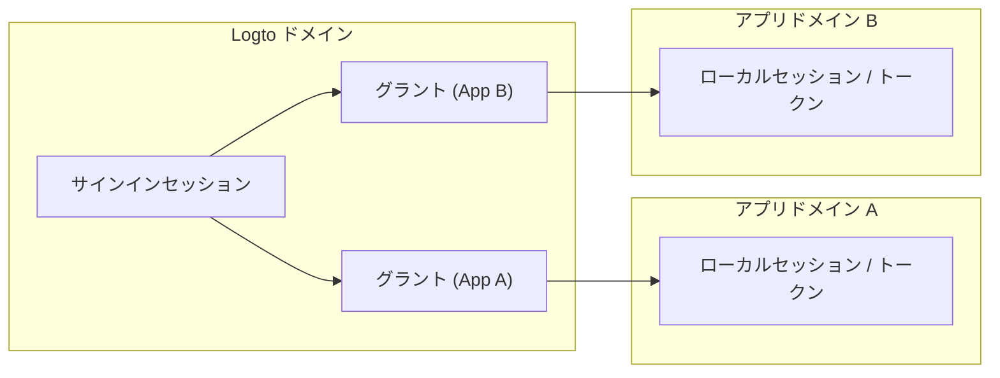
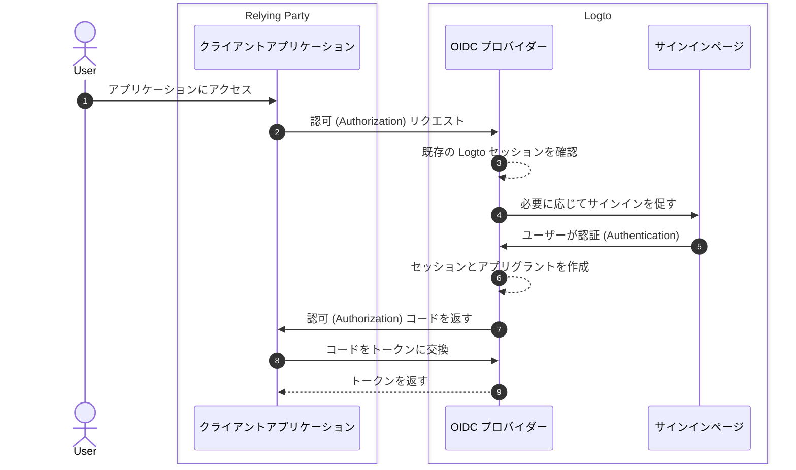
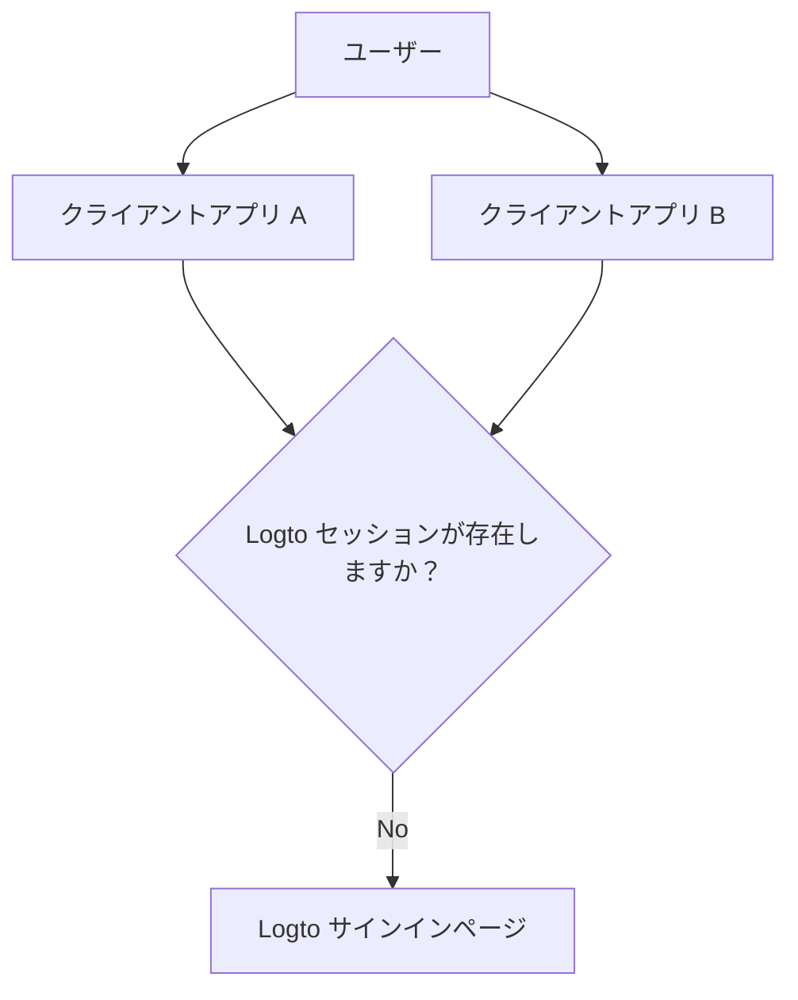

# セッション

Logto のセッションは、アプリ、ブラウザ、デバイス間で認証 (Authentication) 状態がどのように作成、共有、更新、取り消されるかを定義します。

実際には、ユーザーは「サインイン済み」という状態を体験しますが、システム状態は複数のレイヤーに分かれています。これらのレイヤーを理解することが、予測可能なシングルサインオン (SSO)、トークン更新、サインアウトの動作を設計する鍵です。

## Logto のセッションモデル \{#session-model-in-logto}

- **Logto サインインセッション**：Logto ドメインのクッキーとして保存される集中管理されたサインイン状態。現在のブラウザコンテキストでの SSO の可用性を制御します。
- **グラント**：`ユーザー + クライアントアプリ` のためのアプリ固有の認可 (Authorization) 状態。グラントは、集中管理されたサインインとアプリトークン発行の間の橋渡しです。
- **アプリローカルセッション / トークン**：各アプリ内のローカル認証 (Authentication) 状態（ID / アクセス / リフレッシュトークン、アプリセッションクッキーなど）。

## コアコンセプト \{#core-concepts}

### Logto セッションとは？ \{#what-is-a-logto-session}

Logto セッションは、サインインが成功した後に作成される集中管理された認証 (Authentication) 状態です。まだ有効であれば、Logto は同じテナント内の他のアプリに対してユーザーを静かに認証 (Authentication) できます。存在しない場合、ユーザーは再度サインインする必要があります。

### グラントとは？ \{#what-are-grants}

グラントは、特定のユーザーとクライアントアプリに結び付けられたアプリレベルの認可 (Authorization) 状態です。

- 1 つの Logto セッションには、複数のアプリのグラントが含まれることがあります。
- アプリのトークンは、そのアプリのグラントの下で発行されます。
- グラントを取り消すと、そのアプリのトークンベースのアクセスを継続する能力に影響を与えます。

### セッション、グラント、アプリ認証 (Authentication) 状態の関係 \{#how-session-grants-and-app-auth-state-relate}

- **セッション**は次の質問に答えます：「このブラウザは今 Logto で SSO を行うことができますか？」
- **グラント**は次の質問に答えます：「このユーザーはこのクライアントアプリに対して認可 (Authorization) されていますか？」
- **アプリローカルセッション**は次の質問に答えます：「このアプリは現在ユーザーをサインイン済みとして扱っていますか？」

## サインインとセッションの作成 \{#sign-in-and-session-creation}

## アプリとデバイス間のセッショントポロジー \{#session-topology-across-apps-and-devices}

### 同じブラウザ：共有された Logto セッション \{#same-browser-shared-logto-session}

同じブラウザ内のアプリは、集中管理された Logto セッション状態を共有できるため、繰り返しの資格情報入力なしで SSO が可能です。

### 異なるブラウザまたはデバイス：分離された Logto セッション \{#different-browsers-or-devices-isolated-logto-sessions}

各ブラウザ / デバイスには別々のクッキー保存があります。デバイス A で有効なセッションがあるからといって、デバイス B でも有効なセッションがあるとは限りません。

## セッションライフサイクル \{#session-lifecycle}

### 1. 作成 \{#1-create}

ユーザー認証 (Authentication) 後、Logto は集中管理されたセッションとアプリ固有のグラントを作成します。

### 2. 再利用 (SSO) \{#2-reuse-sso}

同じブラウザでセッションクッキーが有効である限り、新しい認可 (Authorization) リクエストはしばしば静かに完了できます。

### 3. トークンの更新 \{#3-renew-tokens}

アプリアクセスは通常、トークンリフレッシュフロー（有効な場合）を通じて継続します。これはアプリレベルの継続性であり、集中管理された Logto セッションがまだ存在するかどうかとは別です。

### 4. 取り消し / 期限切れ \{#4-revokeexpire}

取り消しは異なるレイヤーで発生することがあります：

- ローカルアプリのサインアウトは、アプリローカルトークン / セッションを削除します。
- セッションの終了は、集中管理された Logto セッションを削除します。
- グラントの取り消しは、アプリレベルの認可 (Authorization) 継続性を削除します。

## 設計の推奨事項 \{#design-recommendations}

- アプリコード内でアプリローカルセッションの処理を明示的に行う。
- Logto セッション、グラント、アプリローカルセッションを別々のレイヤーとして扱う。
- サインアウトをアプリローカルのみにするか、グローバルにするかを選択する。
- 複数のアプリの一貫性が必要な場合は、[バックチャネルログアウト](/end-user-flows/sign-out#federated-sign-out-back-channel-logout) を使用する。
- サインアウトの動作と実装の詳細については、[サインアウト](/end-user-flows/sign-out) を参照してください。

## アクセス取り消しのベストプラクティス \{#best-practices-for-revoking-access}

目標に基づいて異なる取り消し戦略を使用する：

- **ファーストパーティアプリからのアクセスを取り消す**：
  `revokeGrantsTarget=firstParty` を使用してターゲットセッションを取り消します。
  これにより、そのセッションに関連付けられたファーストパーティアプリ全体でユーザーがサインアウトされ、一貫したログアウト体験が作成されます。
  同時に、`offline_access` が付与されたサードパーティアプリのグラントは、継続的な統合のために利用可能なままです。
  セッション取り消しの詳細については、[ユーザーセッションの管理](/sessions/manage-user-sessions) を参照してください。

- **サードパーティアプリへのアクセスを取り消す**：
  次のいずれかを選択します：

  - `revokeGrantsTarget=all` を使用してセッションを取り消し、そのセッションに関連付けられたすべてのグラントを取り消します。
  - グラント管理 API を通じて特定のグラントを直接取り消し、完全なセッションサインアウトを強制せずにサードパーティアプリの認可 (Authorization) を削除します。
    グラント固有の取り消し戦略については、[ユーザー認可 (Authorization) アプリ (グラント) の管理](/sessions/grants-management) を参照してください。

- **Logto コンソールを使用する場合**：
  ユーザー詳細ページでは、Logto はセッション管理と認可 (Authorization) されたサードパーティアプリ管理の両方を提供します。
  - セッションを取り消すと、ファーストパーティアプリのグラントも取り消され、ファーストパーティのログアウト動作が一貫します。
  - サードパーティアプリの認可 (Authorization) を取り消すと、そのサードパーティアプリのグラントが取り消され、元のセッション状態は変更されません。

## 関連リソース \{#related-resources}

<Url href="/sessions/manage-user-sessions">ユーザーセッションの管理</Url>
<Url href="/sessions/grants-management">ユーザー認可 (Authorization) アプリ (グラント) の管理</Url>
<Url href="/sessions/session-configs">セッション設定</Url>
<Url href="/end-user-flows/sign-out">サインアウト</Url>
<Url href="/end-user-flows/sign-up-and-sign-in">サインアップとサインイン</Url>
<Url href="/integrate-logto/integrate-logto-into-your-application/understand-authentication-flow">
  認証 (Authentication) フローの理解
</Url>
