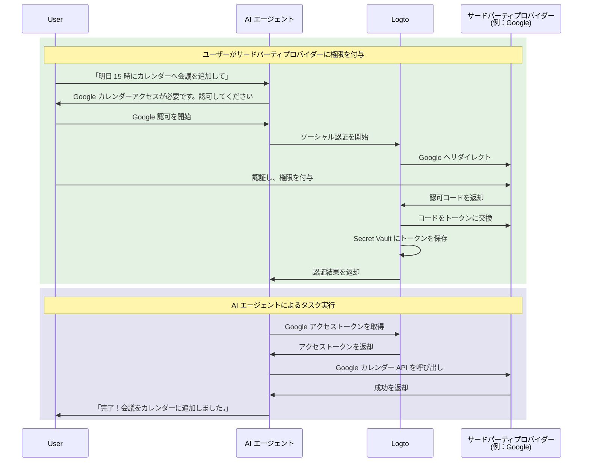

# AI エージェントをサードパーティ API に接続する

このガイドでは、AI エージェントがユーザーの代理としてサードパーティ API（例：Google カレンダー、GitHub など）へアクセスできるようにする方法を解説します。Logto のソーシャルコネクターと Secret Vault を活用することで、アクセストークンを安全に保存・管理し、ユーザーに再認証を繰り返し求めることなく、エージェントが自動タスクを実行できるようになります。

このガイドで学べること：

- サードパーティトークン保存付きソーシャルコネクターの設定方法
- 初回サインイン時に最小限の権限のみリクエストする方法
- 必要に応じて追加権限を段階的にリクエストする方法
- 保存されたトークンを取得し、サードパーティ API へアクセスする方法

## AI エージェントにサードパーティ API アクセスが必要な理由 \{#why-your-ai-agent-needs-third-party-api-access}

AI エージェントは、外部サービスとの連携が必要なタスクの自動化にますます利用されています。例えば：

- **📅 カレンダー管理**：AI エージェントが Google カレンダーで自動的に会議をスケジュールしたり、イベントを追加・調整したりできます。
- **📧 メール自動化**：Gmail API を使ってフォローアップメールの送信、受信トレイの整理、返信の下書きなどが可能です。
- **💻 コード管理**：GitHub の issue 作成、プルリクエストのレビュー、リポジトリ管理などができます。
- **📁 ファイル管理**：Google ドライブや Dropbox でファイルのアップロード、整理、共有が可能です。

これらのタスクを実行するには、AI エージェントがユーザー承認済みのサードパーティ API へ安全にアクセスする必要があり、OAuth トークンを正しく安全に扱うことが求められます。

## 仕組み \{#how-it-works}

全体の流れを簡単に説明します：



1. **ユーザーがタスクを依頼**：ユーザーが AI エージェントにサードパーティ API アクセスが必要なタスク（例：カレンダーイベント追加）を依頼します。
2. **認可プロンプト**：エージェントがサードパーティアクセスの必要性を検知し、ユーザーに認可を促します。
3. **トークン保存**：ユーザー認可後、Logto がアクセストークンとリフレッシュトークンを Secret Vault に安全に保存します。
4. **タスク実行**：エージェントが保存済みトークンを取得し、サードパーティ API を呼び出してタスクを完了します。

一度認可されれば、ユーザーは再認可なしで複数のタスクを実行できます。Logto はトークンを安全に保存し、必要に応じて自動的にリフレッシュするため、AI エージェントとのやり取りがシームレスになります。

## 前提条件 \{#prerequisites}

始める前に、以下を用意してください：

- [Logto Cloud](https://cloud.logto.io)（または自己ホスト型 Logto v1.31 以降）のテナント
- API アクセス権のあるサードパーティプロバイダーアカウント（例：[Google Cloud Console](https://console.cloud.google.com)）
- Logto SDK と連携済みの AI エージェントアプリケーション（ユーザーが AI エージェントにサインインできること）

## トークン保存付きソーシャルコネクターの設定 \{#set-up-social-connector-with-token-storage}

AI エージェントがサードパーティ API へアクセスできるようにするには、トークン保存を有効にしたソーシャルコネクターを設定する必要があります。これにより、ユーザーが AI エージェントとのやり取り中にサードパーティサービスを認可した際、Logto がアクセストークンを保存・管理できるようになります。

ここでは Google を例に説明します：

1. <CloudLink to="/connectors/social">コンソール > コネクター > ソーシャルコネクター</CloudLink> へ移動します。
2. **ソーシャルコネクターを追加** をクリックし、**Google** を選択します。
3. [Google コネクターセットアップガイド](/integrations/google) に従い、OAuth クライアント認証情報を設定します。
4. コネクター設定で：
   - **永続的な API アクセスのためにトークンを保存** を有効にし、Secret Vault にトークンを保存します。
   - **プロンプト** に `consent` を含め、ユーザーに権限リクエスト画面を表示させます。
   - **オフラインアクセス** を有効にし、長期間 API アクセス用のリフレッシュトークンを受け取ります。
5. 変更を保存します。

:::info
このコネクターをサインイン体験に追加する必要はありません。コネクターは、AI エージェントがサードパーティ API へアクセスする際のオンデマンド認可用に使用され、ユーザーのサインインには使われません。
:::

## 認可リクエストとサードパーティ API へのアクセス \{#request-authorization-and-access-third-party-apis}

AI エージェントがサードパーティ API（例：Google カレンダー）へアクセスする必要がある場合、まずユーザーが既に認可済みかどうかを確認します。未認可の場合は、ユーザーに認可を促します。

:::info アカウント API を有効化
進める前に、<CloudLink to="/sign-in-experience/account-center">コンソール > サインイン体験 > アカウントセンター</CloudLink> で Account API を有効にしてください。[Account API の有効化方法](/end-user-flows/account-settings/by-account-api#how-to-enable-account-api) も参照できます。
:::

### ステップ 1: 既存の認可を確認 \{#step-1-check-for-existing-authorization}

まず、保存済みアクセストークンを取得し、ユーザーが既に認可済みか確認します：

```tsx
async function getGoogleAccessToken(userAccessToken: string) {
  const response = await fetch(
    'https://[tenant-id].logto.app/my-account/identities/google/access-token',
    {
      headers: {
        Authorization: `Bearer ${userAccessToken}`,
      },
    }
  );

  return response.json();
}
```

### ステップ 2: 必要に応じて認可をリクエスト \{#step-2-request-authorization-if-needed}

トークンが存在しない場合や期限切れの場合、またはアクセストークンのスコープ拡張が必要な場合は、Logto の [Social Verification API](/secret-vault/federated-token-set#reauthentication-and-token-renewal) を使って認可フローを開始します：

```tsx
async function requestGoogleAuthorization(userAccessToken: string, scopes: string) {
  // CSRF 対策のためランダムな state を生成
  const state = crypto.randomUUID();
  sessionStorage.setItem('oauth_state', state);

  // ソーシャル認証を開始
  const response = await fetch('https://[tenant-id].logto.app/api/verification/social', {
    method: 'POST',
    headers: {
      Authorization: `Bearer ${userAccessToken}`,
      'Content-Type': 'application/json',
    },
    body: JSON.stringify({
      connectorId: '<google_connector_id>',
      state,
      redirectUri: 'https://your-ai-agent.com/callback',
      scope: scopes,
    }),
  });

  const { verificationRecordId, authorizationUri } = await response.json();

  // verificationRecordId を後で使うため保存
  sessionStorage.setItem('verificationRecordId', verificationRecordId);

  // ユーザーを Google 認可画面へリダイレクト
  window.location.href = authorizationUri;
}
```

### ステップ 3: 認可コールバックの処理 \{#step-3-handle-the-authorization-callback}

ユーザーが権限を付与した後、Google からアプリにリダイレクトされます。認証を完了し、トークンを保存します：

```tsx
async function handleAuthorizationCallback(
  userAccessToken: string,
  callbackParams: URLSearchParams
) {
  const verificationRecordId = sessionStorage.getItem('verificationRecordId');
  const storedState = sessionStorage.getItem('oauth_state');
  const code = callbackParams.get('code');
  const state = callbackParams.get('state');

  // CSRF 攻撃防止のため state を検証
  if (state !== storedState) {
    throw new Error('Invalid state parameter');
  }

  // 認可を検証
  await fetch('https://[tenant-id].logto.app/api/verification/social/verify', {
    method: 'POST',
    headers: {
      Authorization: `Bearer ${userAccessToken}`,
      'Content-Type': 'application/json',
    },
    body: JSON.stringify({
      verificationRecordId,
      connectorData: {
        code,
        state,
        redirectUri: 'https://your-ai-agent.com/callback',
      },
    }),
  });

  // Logto の Secret Vault にトークンを保存
  await fetch('https://[tenant-id].logto.app/my-account/identities/google/access-token', {
    method: 'PUT',
    headers: {
      Authorization: `Bearer ${userAccessToken}`,
      'Content-Type': 'application/json',
    },
    body: JSON.stringify({
      verificationRecordId,
    }),
  });

  // 後処理
  sessionStorage.removeItem('verificationRecordId');
  sessionStorage.removeItem('oauth_state');
}
```

### ステップ 4: サードパーティ API を呼び出す \{#step-4-call-the-third-party-api}

これで AI エージェントはトークンを取得し、API を呼び出せます：

```tsx
async function addCalendarEvent(userAccessToken: string, eventDetails: EventDetails) {
  // 保存済み Google アクセストークンを取得
  const tokenData = await getGoogleAccessToken(userAccessToken);

  if (!tokenData) {
    // ユーザーが未認可の場合、カレンダースコープで認可をリクエスト
    await requestGoogleAuthorization(
      userAccessToken,
      'https://www.googleapis.com/auth/calendar.events'
    );
    return; // リダイレクト後に続行
  }

  // Google カレンダー API を呼び出し
  const response = await fetch('https://www.googleapis.com/calendar/v3/calendars/primary/events', {
    method: 'POST',
    headers: {
      Authorization: `Bearer ${tokenData.accessToken}`,
      'Content-Type': 'application/json',
    },
    body: JSON.stringify(eventDetails),
  });

  return response.json();
}
```

Logto はトークンの自動リフレッシュに対応しています。アクセストークンが期限切れでもリフレッシュトークンが存在すれば、取得エンドポイント呼び出し時に新しいアクセストークンを自動で取得します。

## 追加権限のリクエスト \{#request-additional-permissions}

AI エージェントがより多くのタスクを担う場合、追加の権限が必要になることがあります。例えば、ユーザーが最初はカレンダーの読み取りのみを認可し、後からイベント作成も希望する場合、書き込み権限が必要です。

### なぜ段階的な認可が重要か \{#why-incremental-authorization}

- **より良いユーザー体験**：ユーザーは、必要な理由が明確な場合に権限を付与しやすくなります。
- **高いコンバージョン率**：最初に求める権限が少ないほど、離脱が減ります。
- **信頼構築**：必要な権限だけを求めるアプリは信頼されます。

### 例：読み取りから書き込み権限へのアップグレード \{#example-upgrading-from-read-to-write-access}

```tsx
async function createCalendarEvent(userAccessToken: string, eventDetails: EventDetails) {
  const tokenData = await getGoogleAccessToken(userAccessToken);

  if (!tokenData) {
    // まだ認可されていない場合、カレンダー書き込み権限を直接リクエスト
    await requestGoogleAuthorization(userAccessToken, 'https://www.googleapis.com/auth/calendar');
    return;
  }

  // イベント作成を試みる
  const response = await fetch('https://www.googleapis.com/calendar/v3/calendars/primary/events', {
    method: 'POST',
    headers: {
      Authorization: `Bearer ${tokenData.accessToken}`,
      'Content-Type': 'application/json',
    },
    body: JSON.stringify(eventDetails),
  });

  if (response.status === 403) {
    // 権限不足の場合、追加スコープをリクエスト
    await requestGoogleAuthorization(
      userAccessToken,
      'https://www.googleapis.com/auth/calendar' // カレンダー全体アクセス
    );
    return;
  }

  return response.json();
}
```

:::tip
追加スコープをリクエストする際、ユーザーには新たに必要な権限のみが同意画面で表示されます。既存の権限は維持されます。
:::

## トークンステータスの管理 \{#manage-token-status}

Logto コンソールでは、各ユーザーのトークンステータスを確認できます：

1. <CloudLink to="/users">コンソール > ユーザー管理</CloudLink> へ移動します。
2. ユーザーをクリックして詳細を表示します。
3. **接続** セクションまでスクロールし、すべての連携済みソーシャルアカウントを確認します。
4. 各接続のトークンステータスが表示されます：
   - **アクティブ**：アクセストークンが有効で利用可能
   - **期限切れ**：アクセストークンが期限切れ。リフレッシュトークンがあれば次回取得時に自動更新
   - **非アクティブ**：この接続に保存されたトークンなし

## セキュリティのベストプラクティス \{#security-best-practices}

AI エージェントがサードパーティ API へアクセスする際は、以下のセキュリティ対策を心がけてください：

- **最小限のスコープをリクエスト**：本当に必要な権限だけをリクエストしましょう。
- **段階的な認可を活用**：すべてまとめてではなく、必要なタイミングで追加権限をリクエストしましょう。
- **トークン期限切れを適切に処理**：トークンが期限切れや無効化されている場合にも対応しましょう。
- **ユーザーアクセストークンの安全管理**：ユーザーの Logto アクセストークンはサードパーティトークン取得の鍵です。厳重に保護しましょう。
- **API アクセスの監査**：AI エージェントがサードパーティ API へアクセスした際はログを残し、トラブルシューティングやコンプライアンスに備えましょう。

## 関連リソース \{#related-resources}

<Url href="/secret-vault/federated-token-set">サードパーティトークン保存</Url>
<Url href="/connectors/social-connectors">ソーシャルコネクター</Url>
<Url href="/end-user-flows/sign-up-and-sign-in/social-sign-in">ソーシャルサインイン</Url>
<Url href="/end-user-flows/account-settings/by-account-api">Account API</Url>
