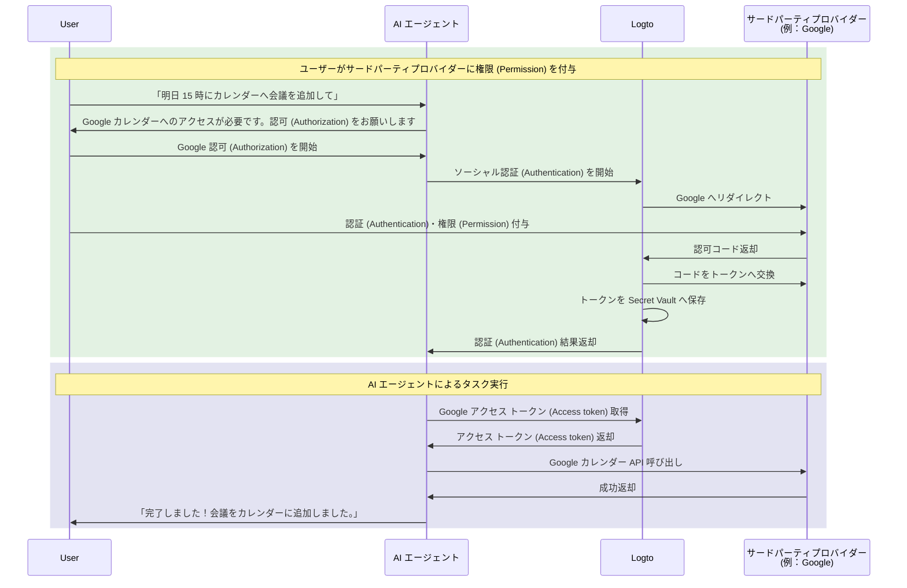

# AI エージェントをサードパーティ API に接続する

このガイドでは、AI エージェントがユーザーの代理としてサードパーティ API（例：Google カレンダー、GitHub など）へアクセスできるようにする手順を説明します。Logto のソーシャルコネクターと Secret Vault を活用することで、アクセス トークン (Access token) を安全に保存・管理でき、ユーザーに繰り返し再認証を求めることなくエージェントが自動タスクを実行できるようになります。

このガイドで学べること：

- サードパーティトークン保存機能付きソーシャルコネクターの設定方法
- 初回サインイン時に最小限の権限 (Permission) をリクエストする方法
- 必要に応じて追加の権限 (Permission) を段階的にリクエストする方法
- 保存されたトークンを取得し、サードパーティ API へアクセスする方法

## なぜ AI エージェントにサードパーティ API アクセスが必要なのか \{#why-your-ai-agent-needs-third-party-api-access}

AI エージェントは、外部サービスと連携するタスクの自動化にますます利用されています。例えば：

- **📅 カレンダー管理**：AI エージェントが Google カレンダーで自動的に会議をスケジューリングしたり、イベントを追加・調整したりできます。
- **📧 メール自動化**：Gmail API を使ってフォローアップメールの送信、受信トレイの整理、返信の下書き作成などが可能です。
- **💻 コード管理**：GitHub の issue 作成、プルリクエストのレビュー、リポジトリ管理など。
- **📁 ファイル管理**：Google ドライブや Dropbox でファイルのアップロード、整理、共有など。

これらのタスクを実行するには、AI エージェントがユーザーの許可を得たサードパーティ API へ安全にアクセスする必要があり、OAuth トークンを正しく安全に扱うことが求められます。

## 仕組み \{#how-it-works}

フローの概要は次の通りです：


```mermaid
sequenceDiagram
    participant User
    participant Agent as AI エージェント
    participant Logto
    participant Google as サードパーティプロバイダー<br/>(例：Google)

    rect rgba(200, 230, 200, 0.5)
        Note over User, Google: ユーザーがサードパーティプロバイダーに権限 (Permission) を付与
        User->>Agent: 「明日 15 時にカレンダーへ会議を追加して」
        Agent->>User: Google カレンダーへのアクセスが必要です。認可 (Authorization) をお願いします
        User->>Agent: Google 認可 (Authorization) を開始
        Agent->>Logto: ソーシャル認証 (Authentication) を開始
        Logto->>Google: Google へリダイレクト
        User->>Google: 認証 (Authentication)・権限 (Permission) 付与
        Google->>Logto: 認可コード返却
        Logto->>Google: コードをトークンへ交換
        Logto->>Logto: トークンを Secret Vault へ保存
        Logto->>Agent: 認証 (Authentication) 結果返却
    end

    rect rgba(200, 200, 230, 0.5)
        Note over User, Google: AI エージェントによるタスク実行
        Agent->>Logto: Google アクセス トークン (Access token) 取得
        Logto->>Agent: アクセス トークン (Access token) 返却
        Agent->>Google: Google カレンダー API 呼び出し
        Google->>Agent: 成功返却
        Agent->>User: 「完了しました！会議をカレンダーに追加しました。」
    end
```

1. **ユーザーがタスクを依頼**：ユーザーが AI エージェントにサードパーティ API アクセスが必要なタスク（例：カレンダーイベント追加）を依頼します。
2. **認可 (Authorization) プロンプト**：エージェントがサードパーティアクセスの必要性を検知し、ユーザーに認可 (Authorization) を促します。
3. **トークン保存**：ユーザーが認可 (Authorization) すると、Logto がアクセス トークン (Access token) とリフレッシュ トークン (Refresh token) を Secret Vault に安全に保存します。
4. **タスク実行**：エージェントが保存済みトークンを取得し、サードパーティ API を呼び出してタスクを完了します。

一度認可 (Authorization) されれば、ユーザーは再認可なしで複数のタスクを実行できます。Logto はトークンを安全に保存し、必要に応じて自動的にリフレッシュするため、AI エージェントとのやり取りがシームレスになります。

## 前提条件 \{#prerequisites}

始める前に、以下を用意してください：

- [Logto Cloud](https://cloud.logto.io) （または自己ホスト型 Logto v1.31 以上）のテナント
- API アクセス権を持つサードパーティプロバイダーアカウント（例：[Google Cloud Console](https://console.cloud.google.com)）
- Logto SDK と連携済みの AI エージェントアプリケーション（ユーザーが AI エージェントにサインイン可能）

## トークン保存機能付きソーシャルコネクターの設定 \{#set-up-social-connector-with-token-storage}

AI エージェントがサードパーティ API へアクセスできるようにするには、トークン保存機能を有効にしたソーシャルコネクターを設定する必要があります。これにより、ユーザーが AI エージェントとのやり取り中にサードパーティサービスを認可 (Authorization) した際、Logto がアクセス トークン (Access token) を保存・管理できるようになります。

ここでは Google を例に説明します：

1. <CloudLink to="/connectors/social">コンソール > コネクター > ソーシャルコネクター</CloudLink> へ移動します。
2. **ソーシャルコネクターを追加** をクリックし、**Google** を選択します。
3. [Google コネクター設定ガイド](/integrations/google) に従い、OAuth クライアント認証情報を設定します。
4. コネクター設定で：
   - **永続的な API アクセスのためにトークンを保存** を有効にし、Secret Vault へトークンを保存します。
   - **プロンプト** に `consent` を含め、ユーザーに権限 (Permission) リクエスト画面を必ず表示させます。
   - **オフラインアクセス** を有効にし、長期間 API アクセス用のリフレッシュ トークン (Refresh token) を受け取ります。
5. 変更を保存します。

:::info
このコネクターをサインイン体験に追加する必要はありません。コネクターは、AI エージェントがサードパーティ API へアクセスする際のオンデマンド認可 (Authorization) 用に使用され、ユーザーのサインインには使われません。
:::

## 認可 (Authorization) をリクエストしサードパーティ API へアクセスする \{#request-authorization-and-access-third-party-apis}

AI エージェントがサードパーティ API（例：Google カレンダー）へアクセスする必要がある場合、まずユーザーがすでに認可 (Authorization) しているか確認します。未認可の場合は、ユーザーに認可 (Authorization) を促してください。

:::info アカウント API を有効化
進める前に、<CloudLink to="/sign-in-experience/account-center">コンソール > サインイン & アカウント > アカウントセンター</CloudLink> で Account API を有効にしてください。詳しくは [Account API の有効化方法](/end-user-flows/account-settings/by-account-api#how-to-enable-account-api) をご覧ください。
:::

### ステップ 1: 既存の認可 (Authorization) を確認 \{#step-1-check-for-existing-authorization}

まず、保存済みアクセス トークン (Access token) を取得し、ユーザーがすでに認可 (Authorization) しているか確認します：

```tsx
async function getGoogleAccessToken(userAccessToken: string) {
  const response = await fetch(
    'https://[tenant-id].logto.app/my-account/identities/google/access-token',
    {
      headers: {
        Authorization: `Bearer ${userAccessToken}`,
      },
    }
  );

  return response.json();
}
```

### ステップ 2: 必要に応じて認可 (Authorization) をリクエスト \{#step-2-request-authorization-if-needed}

トークンが存在しない場合や期限切れ、またはアクセス トークン (Access token) のスコープ拡張が必要な場合は、Logto の [Social Verification API](/secret-vault/federated-token-set#reauthentication-and-token-renewal) を使って認可 (Authorization) フローを開始します：

```tsx
async function requestGoogleAuthorization(userAccessToken: string, scopes: string) {
  // CSRF 対策のためランダムな state を生成
  const state = crypto.randomUUID();
  sessionStorage.setItem('oauth_state', state);

  // ソーシャル認証 (Authentication) を開始
  const response = await fetch('https://[tenant-id].logto.app/api/verification/social', {
    method: 'POST',
    headers: {
      Authorization: `Bearer ${userAccessToken}`,
      'Content-Type': 'application/json',
    },
    body: JSON.stringify({
      connectorId: '<google_connector_id>',
      state,
      redirectUri: 'https://your-ai-agent.com/callback',
      scope: scopes,
    }),
  });

  const { verificationRecordId, authorizationUri } = await response.json();

  // verificationRecordId を後で使うため保存
  sessionStorage.setItem('verificationRecordId', verificationRecordId);

  // ユーザーを Google へリダイレクトし認可 (Authorization) を促す
  window.location.href = authorizationUri;
}
```

### ステップ 3: 認可 (Authorization) コールバックの処理 \{#step-3-handle-the-authorization-callback}

ユーザーが権限 (Permission) を付与した後、Google からアプリへリダイレクトされます。認証 (Authentication) を完了し、トークンを保存します：

```tsx
async function handleAuthorizationCallback(
  userAccessToken: string,
  callbackParams: URLSearchParams
) {
  const verificationRecordId = sessionStorage.getItem('verificationRecordId');
  const storedState = sessionStorage.getItem('oauth_state');
  const code = callbackParams.get('code');
  const state = callbackParams.get('state');

  // state を検証し CSRF 攻撃を防止
  if (state !== storedState) {
    throw new Error('Invalid state parameter');
  }

  // 認可 (Authorization) を検証
  await fetch('https://[tenant-id].logto.app/api/verification/social/verify', {
    method: 'POST',
    headers: {
      Authorization: `Bearer ${userAccessToken}`,
      'Content-Type': 'application/json',
    },
    body: JSON.stringify({
      verificationRecordId,
      connectorData: {
        code,
        state,
        redirectUri: 'https://your-ai-agent.com/callback',
      },
    }),
  });

  // トークンを Logto の Secret Vault に保存
  await fetch('https://[tenant-id].logto.app/my-account/identities/google/access-token', {
    method: 'PUT',
    headers: {
      Authorization: `Bearer ${userAccessToken}`,
      'Content-Type': 'application/json',
    },
    body: JSON.stringify({
      verificationRecordId,
    }),
  });

  // 後処理
  sessionStorage.removeItem('verificationRecordId');
  sessionStorage.removeItem('oauth_state');
}
```

### ステップ 4: サードパーティ API を呼び出す \{#step-4-call-the-third-party-api}

これで AI エージェントがトークンを取得し、API を呼び出せます：

```tsx
async function addCalendarEvent(userAccessToken: string, eventDetails: EventDetails) {
  // 保存済み Google アクセス トークン (Access token) を取得
  const tokenData = await getGoogleAccessToken(userAccessToken);

  if (!tokenData) {
    // ユーザーが認可 (Authorization) していない場合、カレンダースコープで認可 (Authorization) をリクエスト
    await requestGoogleAuthorization(
      userAccessToken,
      'https://www.googleapis.com/auth/calendar.events'
    );
    return; // リダイレクト後に続行
  }

  // Google カレンダー API を呼び出し
  const response = await fetch('https://www.googleapis.com/calendar/v3/calendars/primary/events', {
    method: 'POST',
    headers: {
      Authorization: `Bearer ${tokenData.accessToken}`,
      'Content-Type': 'application/json',
    },
    body: JSON.stringify(eventDetails),
  });

  return response.json();
}
```

Logto はトークンのリフレッシュを自動で処理します。アクセス トークン (Access token) が期限切れでもリフレッシュ トークン (Refresh token) があれば、取得エンドポイント呼び出し時に新しいアクセス トークン (Access token) を自動取得します。

## 追加の権限 (Permission) をリクエストする \{#request-additional-permissions}

AI エージェントがより多くのタスクを担う場合、追加の権限 (Permission) をリクエストする必要があります。例えば、ユーザーが最初はカレンダーの読み取り専用権限 (Permission) を認可 (Authorization) し、後からイベント作成も希望する場合、書き込み権限 (Permission) が必要です。

### なぜ段階的認可 (Authorization) が重要か \{#why-incremental-authorization}

- **より良いユーザー体験**：ユーザーは必要な理由が明確な場合、権限 (Permission) を承認しやすくなります。
- **高いコンバージョン率**：最初に求める権限 (Permission) を最小限にすることで摩擦が減ります。
- **信頼構築**：必要な権限 (Permission) だけを求めるアプリは信頼されます。

### 例：読み取りから書き込み権限 (Permission) へのアップグレード \{#example-upgrading-from-read-to-write-access}

```tsx
async function createCalendarEvent(userAccessToken: string, eventDetails: EventDetails) {
  const tokenData = await getGoogleAccessToken(userAccessToken);

  if (!tokenData) {
    // まだ認可 (Authorization) されていない場合、カレンダー書き込み権限 (Permission) を直接リクエスト
    await requestGoogleAuthorization(userAccessToken, 'https://www.googleapis.com/auth/calendar');
    return;
  }

  // イベント作成を試みる
  const response = await fetch('https://www.googleapis.com/calendar/v3/calendars/primary/events', {
    method: 'POST',
    headers: {
      Authorization: `Bearer ${tokenData.accessToken}`,
      'Content-Type': 'application/json',
    },
    body: JSON.stringify(eventDetails),
  });

  if (response.status === 403) {
    // 権限 (Permission) 不足の場合、追加スコープをリクエスト
    await requestGoogleAuthorization(
      userAccessToken,
      'https://www.googleapis.com/auth/calendar' // カレンダー全体アクセス
    );
    return;
  }

  return response.json();
}
```

:::tip
追加スコープをリクエストする際、ユーザーには新たに必要な権限 (Permission) のみが同意画面 (Consent screen) に表示されます。既存の権限 (Permission) は維持されます。
:::

## トークンステータスの管理 \{#manage-token-status}

Logto コンソールでは、各ユーザーのトークンステータスを確認できます：

1. <CloudLink to="/users">コンソール > ユーザー管理</CloudLink> へ移動します。
2. ユーザーをクリックして詳細を表示します。
3. **接続** セクションまでスクロールし、すべての連携済みソーシャルアカウントを確認します。
4. 各接続のトークンステータスは以下の通りです：
   - **アクティブ**：アクセス トークン (Access token) が有効で利用可能
   - **期限切れ**：アクセス トークン (Access token) が期限切れ。リフレッシュ トークン (Refresh token) があれば次回取得時に自動更新
   - **非アクティブ**：この接続に保存されたトークンはありません

## セキュリティのベストプラクティス \{#security-best-practices}

AI エージェントがサードパーティ API へアクセスする際は、以下のセキュリティ対策を心がけてください：

- **最小限のスコープをリクエスト**：本当に必要な権限 (Permission) のみをリクエストする
- **段階的認可 (Authorization) を活用**：一度にすべてではなく、必要なタイミングで追加権限 (Permission) をリクエスト
- **トークン期限切れを適切に処理**：トークンが期限切れや無効化された場合にも対応できるようにする
- **ユーザーのアクセス トークン (Access token) を安全に管理**：Logto のユーザーアクセス トークン (Access token) はサードパーティトークン取得の鍵です。厳重に保護してください
- **API アクセスの監査**：AI エージェントがサードパーティ API へアクセスした際はログを残し、トラブルシューティングやコンプライアンスに備える

## 関連リソース \{#related-resources}

<Url href="/secret-vault/federated-token-set">サードパーティトークン保存</Url>
<Url href="/connectors/social-connectors">ソーシャルコネクター</Url>
<Url href="/end-user-flows/sign-up-and-sign-in/social-sign-in">ソーシャルサインイン</Url>
<Url href="/end-user-flows/account-settings/by-account-api">Account API</Url>
