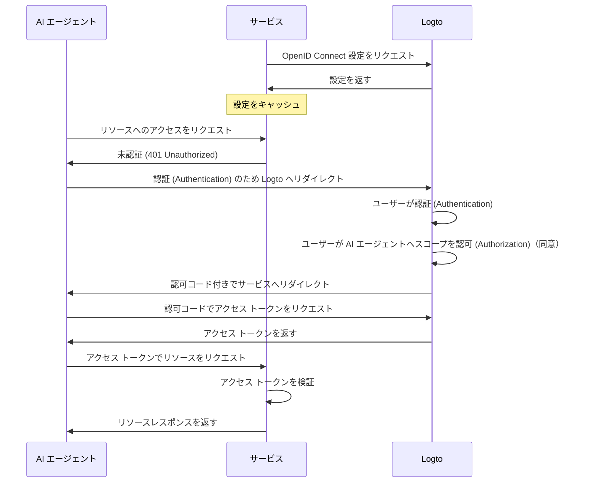

import ConfigureThirdPartyAiAgent from './fragments/_configure-third-party-ai-agent.mdx';

# サードパーティ AI エージェントによるアプリへのアクセスを有効化

このガイドでは、Logto をサービスと統合し、AI エージェントがサービスへアクセスできるようにする手順を説明します。

このガイドで学べること：

- サービスの認可 (Authorization) サーバーとして Logto を設定する方法
- AI エージェントがサービスへアクセスするためのアクセス トークンを取得する方法
- AI エージェントを使ってフローをテストする方法

## サードパーティ AI エージェントと自社 AI エージェント（またはアプリ）の違い \{#difference-between-third-party-ai-agent-and-your-own-ai-agent-or-app}

例を見てみましょう。あなたが天気データを提供するサービスを運営している開発者だとします。

**公式天気アプリ（自社 AI エージェント / アプリ）**

- ユーザーが天気を確認できる公式天気アプリを提供します。
- 仕組み：公式天気アプリは Logto を使ってユーザーを認証 (Authentication) し、サービスへ接続します。Alice がサインインすると、自動的に天気データへアクセスでき、追加の同意画面は不要です。これは信頼されたアプリだからです。

**サードパーティ AI エージェント**

- サービスのエコシステムを構築するため、他の開発者が「WeatherBot」（天気情報や予報を提供する AI アシスタント）をサードパーティ AI エージェントとして統合します。
- 仕組み：WeatherBot（サードパーティ AI エージェント）は、サービス経由でユーザーの天気データへアクセスしたいと考えています。Alice が自分のアカウントで WeatherBot にサインインすると：
  - WeatherBot が天気データへアクセスする許可を求める同意画面が表示されます。
  - Alice はこのアクセスを許可または拒否できます。
  - Alice が同意したデータのみが WeatherBot と共有され、明示的な再同意なしに追加データへアクセスすることはできません。

このアクセス（権限）コントロールにより、サービスがすべてのデータを管理していても、WeatherBot のようなサードパーティ AI エージェントはユーザーが明示的に許可したものだけにアクセスできます。このプロセスはサービス側のアクセス制御実装によって強制されるため、回避できません。

**まとめ**

| クライアント種別               | 例                      | 同意画面は必要？ | 誰がコントロール？ |
| ------------------------------ | ----------------------- | ---------------- | ------------------ |
| 公式天気アプリ                 | 自社天気アプリ          | いいえ           | 開発者（あなた）   |
| サードパーティ AI エージェント | WeatherBot アシスタント | はい             | 別の開発者         |

:::note
自社 AI エージェントやアプリとサービスを統合したい場合は、[クイックスタートガイド](/quick-starts) をご参照ください。
:::

## 前提条件 \{#prerequisites}

- [Logto Cloud](https://cloud.logto.io)（またはセルフホスト）テナント
- AI エージェントがアクセスする API エンドポイントを公開しているサービス

### フローの理解 \{#understanding-the-flow}

- **サービス**：AI エージェントに公開したいサービス
- **AI エージェント**：サービスへアクセスする AI エージェント
- **Logto**：OpenID Connect プロバイダー（認可 (Authorization) サーバー）として機能し、ユーザーアイデンティティを管理

全体の流れを示す非規範的なシーケンス図は以下の通りです：

## サードパーティ AI エージェントのセットアップ \{#set-up-third-party-ai-agent}

サードパーティ AI エージェントがサービスへアクセスできるようにするには、次の手順を実施します：

1. **Logto で AI エージェントを登録**：AI エージェントを表すアプリケーションを Logto で作成します。
2. **AI エージェントの設定**：AI エージェントがサービスへリクエストを送信し、401 Unauthorized レスポンスを処理できるようにします。
3. **認可 (Authorization) フローの実装**：AI エージェントが Logto からアクセス トークンを取得できるように OAuth 2.0 認可 (Authorization) フローを実装します。
4. **統合のテスト**：AI エージェントを使ってサービスへアクセスし、認証 (Authentication)・認可 (Authorization) リクエストが正しく処理されるか確認します。

<ConfigureThirdPartyAiAgent />

## サービス側で認可 (Authorization) を設定 \{#set-up-authorization-in-your-service}

サービスでアクセス制御を有効にするには、次の実装が必要です：

1. **Logto で API リソースを定義**：AI エージェントがアクセスするエンドポイントを表す API リソースを Logto で作成します。
2. **アクセス制御ロジックの実装**：サービス側で、AI エージェントから受け取ったアクセス トークンを検証し、ユーザーがリクエストされたリソースへアクセスする権限を持っているか確認するロジックを実装します。
3. **AI エージェントへのレスポンス**：アクセス トークンが有効でユーザーに権限があれば、リクエストされたリソースを返します。そうでなければ、401 Unauthorized レスポンスを返します。

サービスでアクセス制御を実装する方法については、[認可 (Authorization) ガイド](/authorization) をご参照ください。

## 統合のテスト \{#test-the-integration}

1. サービスを起動します。
2. AI エージェントを起動します。
3. AI エージェントで API エンドポイントを呼び出し、サービスへアクセスします。
4. AI エージェントは 401 Unauthorized レスポンスを処理し、ユーザーを Logto へ認証 (Authentication) のためリダイレクトします。
5. 認証 (Authentication) が成功すると、AI エージェントはアクセス トークンを受け取り、それを使ってサービスへリクエストを送信します。
6. AI エージェントはアクセス トークンを使ってサービスからリソースを取得できるはずです。
