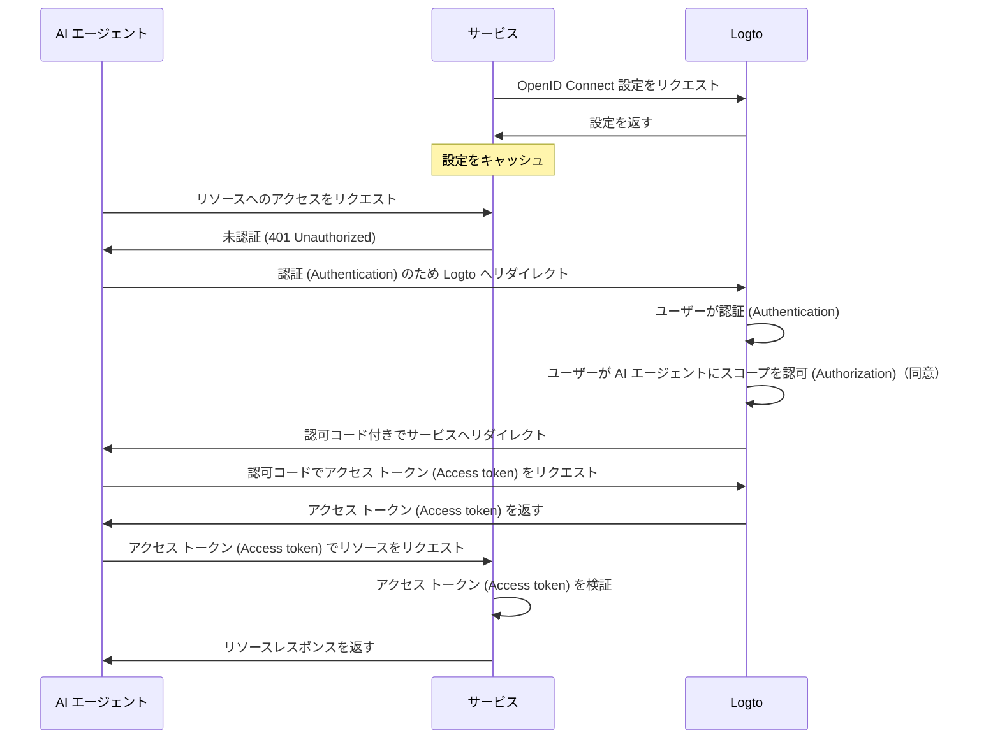

import ConfigureThirdPartyAiAgent from './fragments/_configure-third-party-ai-agent.mdx';
import ExploreAiSolutions from './fragments/_explore-ai-solutions.mdx';

# サードパーティ AI エージェントによるアプリへのアクセスを有効化

<ExploreAiSolutions />

このガイドでは、Logto をサービスと統合し、AI エージェントがサービスへアクセスできるようにする手順を説明します。

学べる内容：

- サービスの認可 (Authorization) サーバーとして Logto を設定する方法
- AI エージェントがサービスへアクセスするためのアクセス トークン (Access token) を取得する方法
- AI エージェントを使ってフローをテストする方法

## サードパーティ AI エージェントと自分の AI エージェント（またはアプリ）の違い \{#difference-between-third-party-ai-agent-and-your-own-ai-agent-or-app}

例を見てみましょう。あなたが天気データを提供するサービスの開発者だとします。

**公式天気アプリ（自分の AI エージェント / アプリ）**

- ユーザーが天気を確認できる公式天気アプリを提供します。
- 仕組み：公式天気アプリは Logto を使ってユーザーを認証 (Authentication) し、サービスに接続します。アリスがサインインすると、自動的に天気データへアクセスできます。信頼されたアプリなので追加の同意画面は不要です。

**サードパーティ AI エージェント**

- サービスのエコシステムを構築するため、他の開発者が「WeatherBot」（天気情報や予報を提供する AI アシスタント）を作成し、サードパーティ AI エージェントとして統合します。
- 仕組み：WeatherBot（サードパーティ AI エージェント）は、サービス経由でユーザーの天気データへアクセスしたいと考えています。アリスが自分のアカウントで WeatherBot にサインインすると：
  - WeatherBot が天気データへアクセスする許可を求める同意画面が表示されます。
  - アリスはこのアクセスを許可または拒否できます。
  - アリスが同意したデータのみが WeatherBot と共有され、明示的な再同意なしに追加データへアクセスすることはできません。

このアクセス（権限）コントロールにより、サービスがすべてのデータを管理していても、WeatherBot のようなサードパーティ AI エージェントはユーザーが明示的に許可した範囲のみアクセスできます。このプロセスはサービス側のアクセス制御実装によって強制されるため、回避できません。

**まとめ**

| クライアント種別               | 例                      | 同意が必要？ | 誰がコントロール？ |
| ------------------------------ | ----------------------- | ------------ | ------------------ |
| 公式天気アプリ                 | 自分の天気アプリ        | いいえ       | 開発者（あなた）   |
| サードパーティ AI エージェント | WeatherBot アシスタント | はい         | 他の開発者         |

:::note
自分の AI エージェントやアプリとサービスを統合したい場合は、[クイックスタートガイド](/quick-starts) を参照してください。
:::

## 前提条件 \{#prerequisites}

- [Logto Cloud](https://cloud.logto.io)（またはセルフホスト）テナント
- AI エージェントがアクセスする API エンドポイントを公開しているサービス

### フローの理解 \{#understanding-the-flow}

- **サービス**：AI エージェントに公開したいサービス
- **AI エージェント**：サービスへアクセスする AI エージェント
- **Logto**：OpenID Connect プロバイダー（認可 (Authorization) サーバー）として機能し、ユーザーアイデンティティを管理

全体の流れを示す非規範的なシーケンス図：

```mermaid
sequenceDiagram
    participant Agent as AI エージェント
    participant Service as サービス
    participant Logto

    Service->>Logto: OpenID Connect 設定をリクエスト
    Logto->>Service: 設定を返す
    Note over Service: 設定をキャッシュ
    Agent->>Service: リソースへのアクセスをリクエスト
    Service->>Agent: 未認証 (401 Unauthorized)
    Agent->>Logto: 認証 (Authentication) のため Logto へリダイレクト
    Logto->>Logto: ユーザーが認証 (Authentication)
    Logto->>Logto: ユーザーが AI エージェントにスコープを認可 (Authorization)（同意）
    Logto->>Agent: 認可コード付きでサービスへリダイレクト
    Agent->>Logto: 認可コードでアクセス トークン (Access token) をリクエスト
    Logto->>Agent: アクセス トークン (Access token) を返す
    Agent->>Service: アクセス トークン (Access token) でリソースをリクエスト
    Service->>Service: アクセス トークン (Access token) を検証
    Service->>Agent: リソースレスポンスを返す
```

## サードパーティ AI エージェントのセットアップ \{#set-up-third-party-ai-agent}

サードパーティ AI エージェントがサービスへアクセスできるようにするには、次の手順を実施します：

1. **Logto で AI エージェントを登録**：AI エージェントを表すアプリケーションを Logto で作成します。
2. **AI エージェントを設定**：AI エージェントがサービスへリクエストを送信し、401 Unauthorized レスポンスを処理できるようにします。
3. **認可 (Authorization) フローを実装**：AI エージェントが Logto からアクセス トークン (Access token) を取得できるよう、OAuth 2.0 認可フローを実装します。
4. **統合をテスト**：AI エージェントを使ってサービスへアクセスし、認証 (Authentication) と認可 (Authorization) リクエストが正常に行えるか検証します。

<ConfigureThirdPartyAiAgent />

## サービスで認可 (Authorization) を設定 \{#set-up-authorization-in-your-service}

サービスでアクセス制御を有効にするには、次の実装が必要です：

1. **Logto で API リソースを定義**：AI エージェントがアクセスするエンドポイントを表す API リソースを Logto で作成します。
2. **アクセス制御ロジックを実装**：サービス側で、AI エージェントから受け取ったアクセス トークン (Access token) を検証し、ユーザーがリクエストされたリソースへアクセスする権限を持っているか確認するロジックを実装します。
3. **AI エージェントへレスポンス**：アクセス トークン (Access token) が有効でユーザーに権限があれば、リクエストされたリソースを返します。そうでなければ 401 Unauthorized レスポンスを返します。

サービスでアクセス制御を実装する方法については、[認可 (Authorization) ガイド](/authorization) を参照してください。

## 統合のテスト \{#test-the-integration}

1. サービスを起動します。
2. AI エージェントを起動します。
3. AI エージェントで、サービスの API エンドポイントを呼び出します。
4. AI エージェントは 401 Unauthorized レスポンスを処理し、ユーザーを Logto へ認証 (Authentication) のためリダイレクトします。
5. 認証 (Authentication) が成功すると、AI エージェントはアクセス トークン (Access token) を受け取り、それを使ってサービスへリクエストを送信します。
6. AI エージェントはアクセス トークン (Access token) を使ってサービスからリソースを取得できるはずです。
