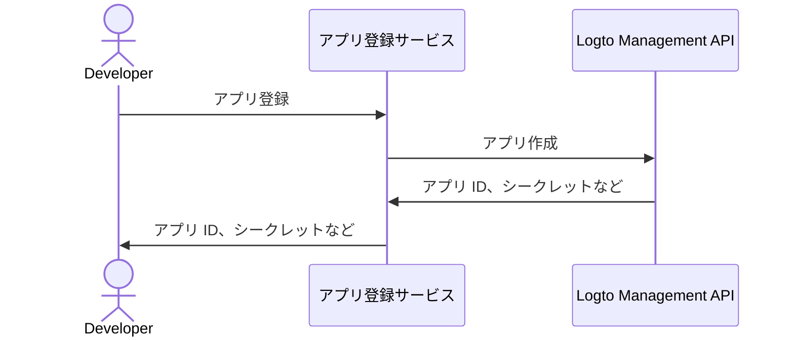

import QuickStartsReference from '../../../quick-starts/third-party/oidc/_quick-starts-reference.md';

## Logto でサードパーティ AI エージェントを設定する \{#configure-third-party-ai-agent-in-logto}

サードパーティ AI エージェントが {props.serviceName ?? 'サービス'} にアクセスできるようにするには、Logto で **サードパーティアプリ** を設定する必要があります。このアプリは AI エージェントを表し、認証 (Authentication) および認可 (Authorization) に必要な認証情報を取得するために使用されます。

### Logto で開発者がサードパーティアプリを作成できるようにする \{#allow-developers-to-create-third-party-apps-in-logto}

マーケットプレイスを構築する場合や、開発者が Logto でサードパーティアプリを作成できるようにしたい場合は、[Logto Management API](/integrate-logto/interact-with-management-api) を活用してプログラム的にサードパーティアプリを作成できます。これにより、開発者は自分のアプリケーションを登録し、認証 (Authentication) に必要な認証情報を取得できます。

クライアント登録プロセスを処理する独自のサービスをホストする必要があります。このサービスは Logto Management API と連携し、開発者に代わってサードパーティアプリを作成します。

または、Logto コンソールで手動でサードパーティアプリを作成し、プロセスに慣れることもできます。

### Logto でサードパーティアプリを手動で作成する \{#manually-create-a-third-party-app-in-logto}

テストやアドホックな統合のために、Logto コンソールでサードパーティアプリを手動で作成できます。これは、完全なクライアント登録フローを実装せずに統合をすばやくテストしたい場合に便利です。

1. Logto コンソールにサインインします。
2. <CloudLink to="/applications">**アプリケーション**</CloudLink> → **アプリケーションの作成** →
   **サードパーティアプリ** -> **OIDC** を選択します。
3. アプリ名やその他の必須項目を入力し、**アプリケーションの作成** をクリックします。
4. **権限** タブをクリックし、**ユーザー** セクションで「追加」をクリックします。
5. 開いたダイアログで -> **ユーザーデータ** -> **`profile`**、**`email`** 権限を選択し、**保存** をクリックします。
6. サードパーティアプリで、`openid profile email` 権限（スコープ）をリクエストするようにスコープを設定します。

   **注意**: OIDC には `openid` が必須であり、`profile` と `email` は前のステップで追加した権限です。

7. サードパーティアプリの **リダイレクト URI** を適切に設定します。Logto 側のリダイレクト URI も忘れずに更新してください。

---

<QuickStartsReference />
