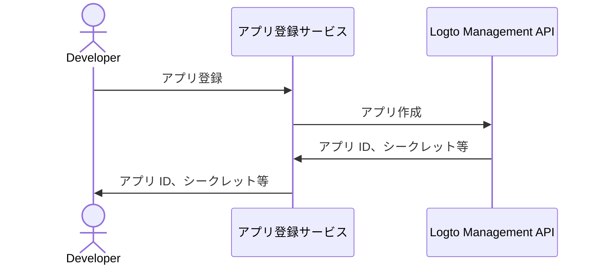

import QuickStartsReference from '../../../quick-starts/third-party/oidc/_quick-starts-reference.md';

## Logto でサードパーティ AI エージェントを設定する \{#configure-third-party-ai-agent-in-logto}

サードパーティ AI エージェントが {props.serviceName ?? 'サービス'} にアクセスできるようにするには、Logto で **サードパーティアプリ** を設定する必要があります。このアプリは AI エージェントを表し、認証 (Authentication) と認可 (Authorization) に必要な認証情報を取得するために使用されます。

:::info[サードパーティアプリとは？]
**サードパーティアプリ** とは、外部開発者（リソース所有者ではない）が作成したアプリケーションで、保護されたリソースにアクセスするためにユーザーの同意が必要です。ファーストパーティアプリ（自社アプリケーション）とは異なり、サードパーティアプリはユーザーのデータにアクセスする前に、特定の権限を承認する同意画面が表示されます。これにより、ユーザーは外部サービスと共有するデータをコントロールできます。

詳細は [サードパーティアプリケーション](/integrate-logto/third-party-applications) を参照してください。
:::

### 開発者が Logto でサードパーティアプリを作成できるようにする \{#allow-developers-to-create-third-party-apps-in-logto}

マーケットプレイスを構築したり、開発者が Logto でサードパーティアプリを作成できるようにしたい場合は、[Logto Management API](/integrate-logto/interact-with-management-api) を活用してプログラムでサードパーティアプリを作成できます。これにより、開発者は自分のアプリケーションを登録し、認証 (Authentication) に必要な認証情報を取得できます。

クライアント登録プロセスを処理する独自のサービスをホストする必要があります。このサービスは Logto Management API と連携し、開発者に代わってサードパーティアプリを作成します。

```mermaid
sequenceDiagram
  actor Developer
  participant Server as アプリ登録サービス
  participant Logto as Logto Management API
  Developer->>Server: アプリ登録
  Server->>Logto: アプリ作成
  Logto->>Server: アプリ ID、シークレット等
  Server->>Developer: アプリ ID、シークレット等
```

または、Logto コンソールで手動でサードパーティアプリを作成し、プロセスに慣れることもできます。

### Logto でサードパーティアプリを手動で作成する \{#manually-create-a-third-party-app-in-logto}

テストやアドホックな統合のために、Logto コンソールでサードパーティアプリを手動で作成できます。これは、クライアント登録フローを実装せずに統合をすぐにテストしたい場合に便利です。

1. Logto コンソールにサインインします。
2. <CloudLink to="/applications">**アプリケーション**</CloudLink>→ **アプリケーションの作成** →
   **サードパーティアプリ** -> **OIDC** を選択します。
3. アプリ名やその他の必須項目を入力し、**アプリケーションの作成** をクリックします。
4. **権限** タブをクリックし、**ユーザー** セクションで「追加」をクリックします。
5. 開いたダイアログで -> **ユーザーデータ** -> **`profile`**、**`email`** 権限を選択し、**保存** をクリックします。
6. サードパーティアプリで、`openid profile email` 権限（スコープ）をリクエストするようにスコープを設定します。

   **注意**：`openid` は OIDC で必須、`profile` と `email` は前のステップで追加した権限です。

7. サードパーティアプリの **リダイレクト URI** を適切に設定します。Logto 側のリダイレクト URI も忘れずに更新してください。

---

<QuickStartsReference />
