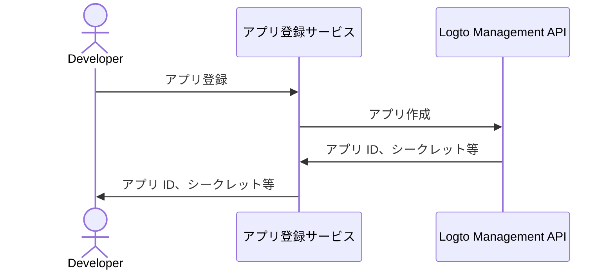
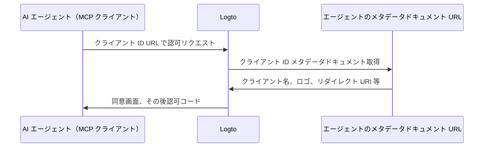

import QuickStartsReference from '../../../quick-starts/third-party/oidc/_quick-starts-reference.md';

## Logto でサードパーティ AI エージェントを設定する \{#configure-third-party-ai-agent-in-logto}

サードパーティ AI エージェントが {props.serviceName ?? 'サービス'} にアクセスできるようにするには、Logto で **サードパーティアプリ** をセットアップする必要があります。このアプリは AI エージェントを表し、認証 (Authentication) と認可 (Authorization) に必要なクレデンシャルを取得するために使用されます。

:::info[サードパーティアプリとは？]
**サードパーティアプリ** とは、外部開発者（リソース所有者ではない）が作成し、保護されたリソースへアクセスするためにユーザーの同意が必要なアプリケーションです。ファーストパーティアプリ（自社アプリ）とは異なり、サードパーティアプリはユーザーのデータへアクセスする前に、特定の権限を承認する同意画面を表示します。これにより、ユーザーは外部サービスと共有するデータをコントロールできます。

詳細は [サードパーティアプリケーション](/integrate-logto/third-party-applications) を参照してください。
:::

AI エージェントをオンボードする方法は 3 つあります：

- [コンソールで手動作成](#manually-create-a-third-party-app-in-logto)：テストや既知の少数エージェント向け。
- [Management API で登録サービスを構築](#allow-developers-to-create-third-party-apps-in-logto)：クレデンシャル発行をコントロールしたい場合。
- [ダイナミックアプリを有効化](#let-any-ai-agent-connect-without-pre-registration)：どのエージェントも事前登録なしで接続できるようにしたい場合。

### 開発者が Logto でサードパーティアプリを作成できるようにする \{#allow-developers-to-create-third-party-apps-in-logto}

マーケットプレイスを構築したり、開発者が Logto でサードパーティアプリを作成できるようにしたい場合は、[Logto Management API](/integrate-logto/interact-with-management-api) を活用してプログラム的にサードパーティアプリを作成できます。これにより、開発者は自分のアプリケーションを登録し、認証 (Authentication) に必要なクレデンシャルを取得できます。

クライアント登録プロセスを処理する独自サービスをホストする必要があります。このサービスは Logto Management API と連携し、開発者の代わりにサードパーティアプリを作成します。

```mermaid
sequenceDiagram
  actor Developer
  participant Server as アプリ登録サービス
  participant Logto as Logto Management API
  Developer->>Server: アプリ登録
  Server->>Logto: アプリ作成
  Logto->>Server: アプリ ID、シークレット等
  Server->>Developer: アプリ ID、シークレット等
```

または、Logto コンソールで手動でサードパーティアプリを作成し、プロセスに慣れることもできます。

### 事前登録なしで任意の AI エージェントを接続させる \{#let-any-ai-agent-connect-without-pre-registration}

オープンな MCP エコシステムでは、事前にエージェントを把握できないことが一般的です。[ダイナミックアプリ](/integrate-logto/third-party-applications/dynamic-apps) を利用すると、登録ステップが不要になります。エージェントは自身のクライアントメタデータドキュメントを公開する HTTPS URL を `client_id` として使用し、認可リクエストが届いた際に Logto がそれを解決します。

```mermaid
sequenceDiagram
  participant Agent as AI エージェント（MCP クライアント）
  participant Logto
  participant Metadata as エージェントのメタデータドキュメント URL
  Agent->>Logto: クライアント ID URL で認可リクエスト
  Logto->>Metadata: クライアント ID メタデータドキュメント取得
  Metadata->>Logto: クライアント名、ロゴ、リダイレクト URI 等
  Logto->>Agent: 同意画面、その後認可コード
```

ダイナミックアプリに付与した権限を通じて、エージェントがリクエストできる内容をコントロールできます。また、すべての認可はユーザーの同意画面を経由します。

### Logto でサードパーティアプリを手動作成する \{#manually-create-a-third-party-app-in-logto}

テストやアドホックな連携のために、Logto コンソールでサードパーティアプリを手動作成できます。これは、クライアント登録フローを実装せずに素早く連携を試したい場合に便利です。

1. Logto コンソールにサインインします。
2. <CloudLink to="/applications">**アプリケーション**</CloudLink>→ **アプリケーションを作成** →
   **サードパーティアプリ** → **OIDC** を選択します。
3. アプリ名やその他の必須項目を入力し、**アプリケーションを作成** をクリックします。
4. **権限** タブでアプリに [権限](/integrate-logto/third-party-applications/permission-management) を付与します：

   - **ユーザー** セクション：**`profile`** や **`email`** など、基本的なアイデンティティクレーム用のユーザーデータ権限。
   - **API リソース** セクション：Logto で定義した [API リソース](/authorization/global-api-resources) の権限（スコープ）。例：{props.serviceName ?? 'サービス'} を表す API リソース。
   - **組織** セクション：Logto 組織を利用している場合の組織権限。

5. サードパーティアプリ側で、付与した権限をリクエストするスコープを設定します。例：`openid profile email` に加え、API リソースのスコープ。

   **注意**：OIDC では `openid` が必須です。API リソースに紐づくアクセス トークン (Access token) を受け取るには、認可リクエストに `resource` パラメータも含める必要があります。最新の MCP 仕様に準拠した MCP クライアントは、保護リソースのメタデータに基づきこれを自動で行います。

6. サードパーティアプリの **リダイレクト URI** を適切に設定します。Logto 側のリダイレクト URI も忘れずに更新してください。

---

<QuickStartsReference />
