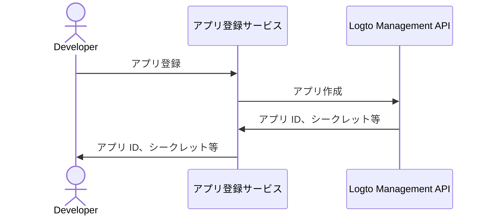

import QuickStartsReference from '../../quick-starts/third-party/oidc/_quick-starts-reference.md';

import thirdPartyAppPermissions from './assets/third-party-app-permissions.png';
import Prerequisites from './fragments/_mcp-prerequisites.mdx';
import SampleCode from './fragments/_mcp-sample-code.mdx';
import SetUpServer from './fragments/_mcp-set-up-server.mdx';

# サードパーティ AI エージェントによる MCP サーバーアクセスの有効化

このガイドでは、 [mcp-auth](https://mcp-auth.dev) を使用して Logto を MCP サーバーと統合し、標準の OpenID Connect フローを利用してユーザーを認証し、アイデンティティ情報を安全に取得する方法を説明します。

このガイドで学べること：

- MCP サーバーの認可 (Authorization) サーバーとして Logto を設定する方法
- MCP サーバーに「whoami」ツールをセットアップし、現在のユーザーのクレーム (Claims) を返す方法
- サードパーティ AI エージェント (MCP クライアント) でフローをテストする方法

このチュートリアルの完了後、MCP サーバーは以下のことが可能になります：

- Logto テナントでユーザーを認証 (Authentication) する
- 「whoami」ツールの呼び出し時に、`sub`、`username`、`name`、`email` などのクレーム (Claims) を返す

## サードパーティ AI エージェント (MCP クライアント) と自社 MCP クライアントの違い \{#difference-between-third-party-ai-agent-mcp-client-and-your-own-mcp-client}

例を見てみましょう。あなたが MCP サーバーを運用し、メールアクセスと自動化を管理している開発者だとします。

**公式メールアプリ（自社 MCP クライアント）**

- ユーザーがメールを閲覧・管理できる公式メールアプリを提供します。
- 動作：公式メールアプリは Logto を使って MCP サーバーに接続し、ユーザーを認証 (Authentication) します。Alice がサインインすると、自動的にメールへアクセスでき、追加の同意画面は不要です（信頼されたアプリのため）。

**サードパーティ AI エージェント（サードパーティ MCP クライアント）**

- MCP サーバーを中心にエコシステムを構築している場合、他の開発者が「SmartMail AI」（メールを要約し、会議を自動でスケジューリングする AI アシスタント）をサードパーティクライアントとして統合します。
- 動作：SmartMail AI（サードパーティ MCP クライアント）は、MCP サーバー経由でユーザーのメールにアクセスしたいと考えています。Alice が自分のアカウントで SmartMail AI にサインインすると：
  - SmartMail AI がメールやカレンダーの閲覧許可を求める同意画面が表示されます。
  - Alice はこのアクセスを許可または拒否できます。
  - Alice が同意したデータのみが SmartMail AI と共有され、明示的な再同意なしに追加データへアクセスすることはできません。

このアクセス（権限）コントロールにより、MCP サーバーがすべてのデータを管理していても、SmartMail AI のようなサードパーティアプリはユーザーが明示的に許可した範囲のみアクセスできます。このプロセスは MCP サーバーのアクセス制御実装によって強制され、回避できません。

**まとめ**

| クライアント種別               | 例                         | 同意画面が必要？ | 管理者           |
| ------------------------------ | -------------------------- | ---------------- | ---------------- |
| 公式メールアプリ               | 自社メールアプリケーション | いいえ           | 開発者（あなた） |
| サードパーティ AI エージェント | SmartMail AI アシスタント  | はい             | 他の開発者       |

:::note
自社の AI エージェントやアプリと MCP サーバーを統合したい場合は、 [Logto で MCP ベースのアプリに認証 (Authentication) を有効化する](./mcp-server-add-auth) ガイドを参照してください。
:::

<Prerequisites isThirdParty />

## サードパーティ AI エージェントのセットアップ \{#set-up-third-party-ai-agent}

サードパーティ AI エージェントが MCP サーバーへアクセスできるようにするには、以下の設定が必要です：

1. クライアントが MCP サーバーで公開されているツールを呼び出す MCP リクエストを送信できること。
2. クライアントが 401 Unauthorized レスポンスを処理できること。詳細は [認可 (Authorization) フローステップ](https://modelcontextprotocol.io/specification/2025-03-26/basic/authorization#2-5-authorization-flow-steps) を参照してください。
3. 認証 (Authentication) に成功した後、Logto から取得したアクセス トークン (Access token) で MCP サーバーにリクエストできること。

## Logto で AI エージェントをセットアップ \{#set-up-ai-agent-in-logto}

サードパーティ AI エージェントが MCP サーバーへアクセスできるようにするには、Logto で **サードパーティアプリ** をセットアップする必要があります。このアプリは AI エージェントを表し、認証 (Authentication) および認可 (Authorization) に必要なクレデンシャルを取得するために使用されます。

### Logto で開発者がサードパーティアプリを作成できるようにする \{#allow-developers-to-create-third-party-apps-in-logto}

マーケットプレイスを構築したり、開発者が Logto でサードパーティアプリを作成できるようにしたい場合は、 [Logto Management API](/integrate-logto/interact-with-management-api) を活用してプログラム的にサードパーティアプリを作成できます。これにより、開発者は自分のアプリケーションを登録し、認証 (Authentication) に必要なクレデンシャルを取得できます。

クライアント登録プロセスを処理する独自サービスをホストする必要があります。このサービスが Logto Management API と連携し、開発者の代わりにサードパーティアプリを作成します。

または、Logto コンソールで手動でサードパーティアプリを作成し、プロセスに慣れることもできます。

### Logto でサードパーティアプリを手動作成する \{#manually-create-a-third-party-app-in-logto}

テストやアドホックな統合の場合、Logto コンソールでサードパーティアプリを手動で作成できます。クライアント登録フローを実装せずに統合を素早くテストしたい場合に便利です。

1. Logto コンソールにサインインします。
2. <CloudLink to="/applications">**アプリケーション**</CloudLink> → **アプリケーション作成** →
   **サードパーティアプリ** -> **OIDC** を選択します。
3. アプリ名など必要事項を入力し、**アプリケーション作成** をクリックします。
4. **権限** タブをクリックし、**ユーザー** セクションで「追加」をクリックします。
5. 開いたダイアログで -> **ユーザーデータ** -> **`profile`**、**`email`** 権限を選択し、**保存** をクリックします。
6. サードパーティアプリで `openid profile email` 権限をリクエストするようスコープを設定します。
7. サードパーティアプリの **リダイレクト URI** を適切に設定します。Logto 側のリダイレクト URI も忘れずに更新してください。

---

<QuickStartsReference />

<SetUpServer />

## 統合のテスト \{#test-the-integration}

1. MCP サーバーを起動します。
2. AI エージェントを起動します。
3. クライアントで `whoami` ツールを呼び出し、現在のユーザーのクレーム (Claims) を取得します。
4. クライアントは 401 Unauthorized レスポンスを処理し、ユーザーを Logto へリダイレクトして認証 (Authentication) します。
5. 認証 (Authentication) に成功すると、クライアントはアクセス トークン (Access token) を受け取り、それを使って MCP サーバーにリクエストします。
6. クライアントはアクセス トークン (Access token) を使って MCP サーバーからクレーム (Claims) を取得できるようになります。

<SampleCode />
