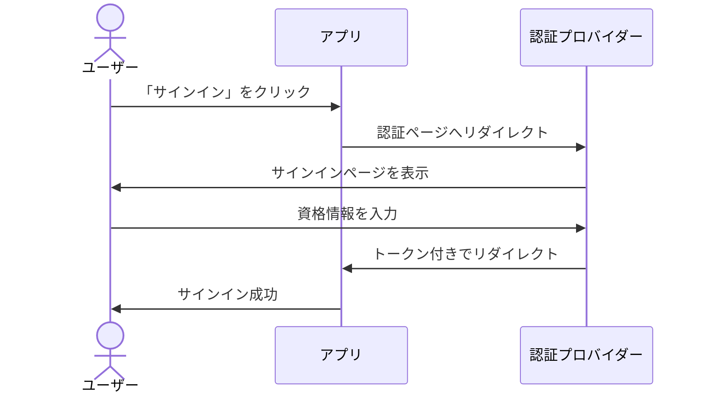
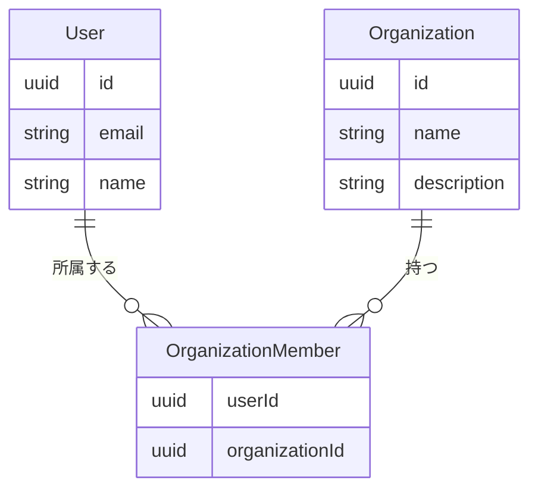
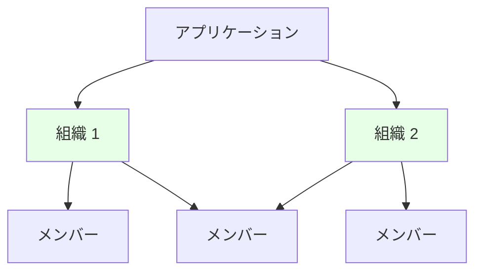
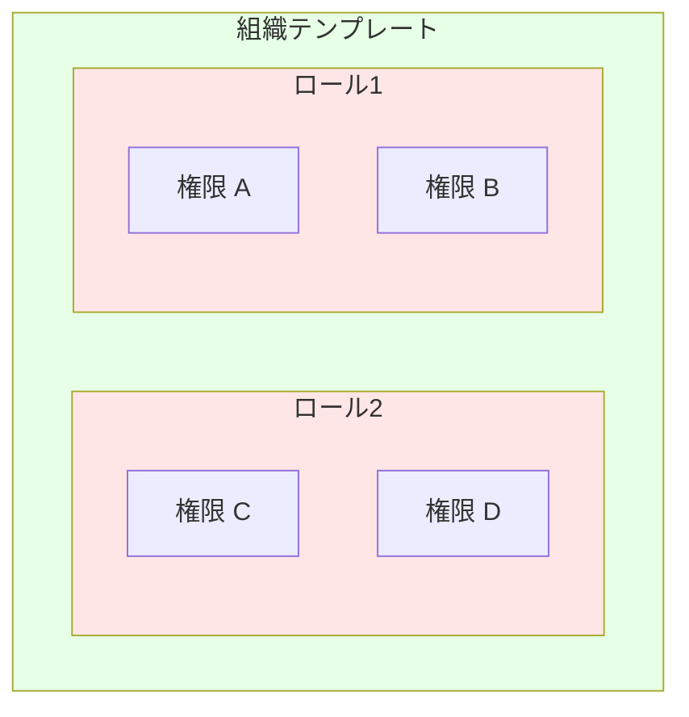
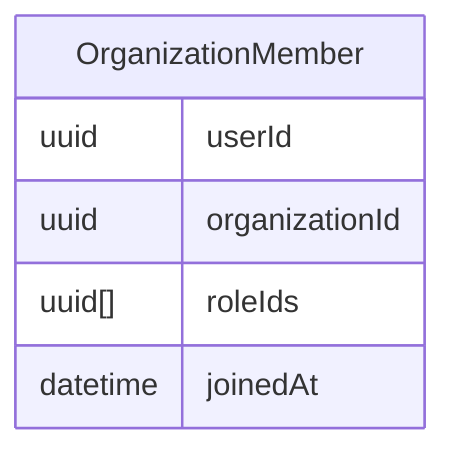
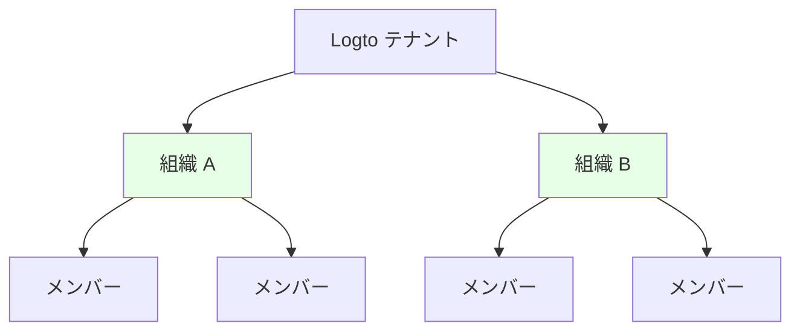
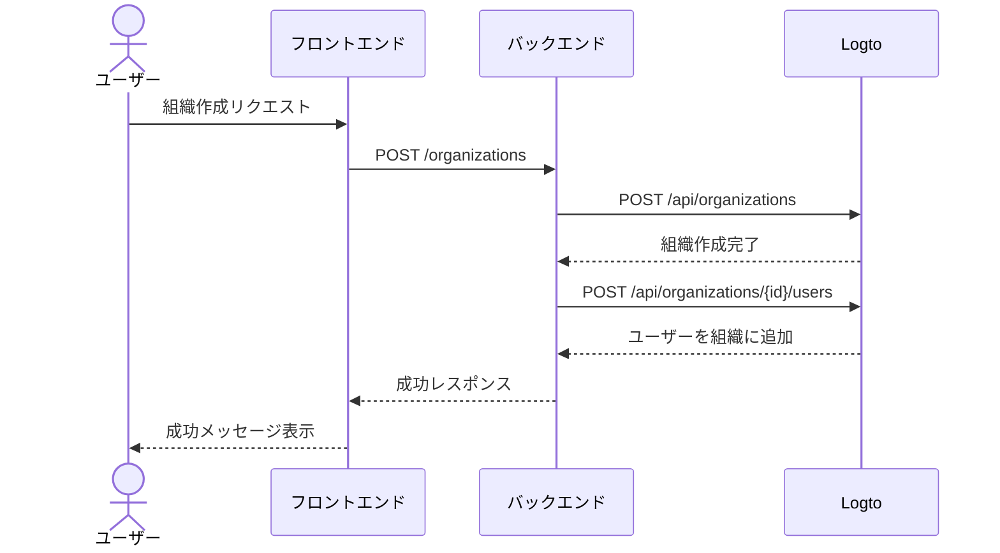

<head>
  <link rel="canonical" href="https://blog.logto.io/build-multi-tenant-saas-application" />
</head>

<style>
  {`
    .twoColumn {
      display: grid;
      grid-template-columns: 1fr 1fr;
      gap: 24px;
    }
    .twoColumn + .twoColumn {
      margin-top: 24px;
    }
  `}
</style>

# マルチテナント SaaS アプリケーションの構築：設計から実装までの完全ガイド

Notion や Slack、Figma のようなアプリはどのように作られているのでしょうか？これらのマルチテナント SaaS アプリケーションは使いやすく見えますが、自分で構築するとなると話は別です。

私が初めてこのような複雑なものを作ろうと考えたとき、頭が爆発しそうになりました：

- ユーザーには複数のサインインオプション（メール、Google、GitHub）が必要
- 各ユーザーは複数の組織に作成・所属できる
- 各組織内で異なる権限レベル
- 特定のメールドメインで自動参加が必要なエンタープライズ組織
- 機密操作のための多要素認証 (MFA)
- その他いろいろ...

「ボス、2週間後にプロダクト設計の話をしましょう。今は泥沼にはまっています。」

でも実際に取り組み始めてみると、**思ったほど大変ではないことに気づきました。**

**これらすべての機能を驚くほど少ない労力で備えたシステムを構築できました！**


<div className="twoColumn">
  
  
</div>

どのようにしてこのようなシステムをゼロから設計・実装するのか、具体的に紹介します。2025 年の現代ツールと正しいアーキテクチャアプローチがあれば、どれほどシンプルかきっと驚くはずです。

> **完全なソースコードは [Github リポジトリ](https://github.com/logto-io/multi-tenant-saas-sample) で公開しています。さっそく始めましょう！**

まずは AI ドキュメント SaaS プロダクト「DocuMind」から始めます。

DocuMind は、個人ユーザー、中小企業、エンタープライズをサポートするマルチテナントモデルで設計された AI ドキュメント SaaS プロダクトです。

このプラットフォームは、組織内での自動要約生成、重要ポイント抽出、インテリジェントなコンテンツ推薦など、強力な AI ドキュメント管理機能を提供します。

## SaaS の認証 (Authentication)・認可 (Authorization) に必要な機能とは？ \{#what-features-are-required-for-saas-authentication-and-authorization}

まずは必要な要件を整理しましょう。どんな機能が必要でしょうか？

### マルチテナントアーキテクチャ \{#multi-tenant-architecture}

マルチテナントアーキテクチャを実現するには、**組織 (Organization)** というエンティティレイヤーが必要です。1 つのユーザープールが複数のワークスペースにアクセスできるイメージです。各組織がワークスペースを表し、ユーザーは割り当てられたロールに応じて異なるワークスペース（組織）に単一のアイデンティティでアクセスできます。


これは認証 (Authentication) プロバイダーで広く使われている機能です。アイデンティティ管理システムにおける組織は、SaaS アプリのワークスペースやプロジェクト、テナントに相当します。


### メンバーシップ \{#membership}

メンバーとは、組織内でのアイデンティティの所属状態を示す一時的な概念です。

例えば、Sarah がメール **sarah@gmail.com** でアプリに登録したとします。Sarah は異なるワークスペースに所属できます。Sarah が **Workspace A** には所属しているが **Workspace B** には所属していない場合、Sarah は **Workspace A** のメンバーですが **Workspace B** のメンバーではありません。

### ロールと権限の設計 \{#role-and-permission-design}

マルチテナントアーキテクチャでは、ユーザーはテナントリソースにアクセスするための特定の **ロール (Role)** と **権限 (Permission)** が必要です。
権限 (Permission) とは、`read: order` や `write: order` のような特定の操作を定義する詳細なアクセス制御です。どのリソースに対してどんな操作ができるかを決定します。

ロール (Role) とは、マルチテナント環境でメンバーに割り当てられる権限 (Permission) のセットです。

これらのロールと権限 (Permission) を定義し、ユーザーにロールを割り当てる必要があります。場合によっては自動化も含まれます。例えば：

1. 組織に参加したユーザーは自動的に **member** ロールを取得
2. 最初にワークスペースを作成したユーザーは自動的に **admin** ロールを取得

### サインアップ・ログインフロー \{#sign-up-and-login-flow}

ユーザーフレンドリーかつ安全な登録・認証 (Authentication) プロセスを確保しましょう。基本的なサインイン・サインアップオプションを含みます：

1. **メールとパスワードによるサインイン**：従来のメール・パスワードによるログイン
2. **パスワードレスサインイン**：メール認証コードによる簡単かつ安全なアクセス
3. **アカウント管理**：メールやパスワードなどを更新できるアカウントセンター
4. **ソーシャルサインイン**：Google や GitHub などのクイックログイン
5. **多要素認証 (MFA)**：Duo などの認証アプリによるログインでセキュリティ強化

### テナント作成と招待 \{#tenant-creation-and-invitation}

マルチテナント SaaS アプリでは、ユーザーフローの大きな違いとしてテナント作成やメンバー招待のサポートが必要です。このプロセスはプロダクトのアクティベーションや成長に重要な役割を果たすため、慎重な設計と実装が求められます。

以下は考慮すべき典型的な利用フローです：

| ユーザータイプ                                   | エントリーポイント                                 |
| ------------------------------------------------ | -------------------------------------------------- |
| 新規アカウント                                   | サインイン・サインアップページから新規テナント作成 |
| 既存アカウント                                   | プロダクト内で別のテナントを作成                   |
| 既存アカウントが新規テナント招待を受け取った場合 | サインイン・サインアップページから参加             |
| 既存アカウントが新規テナント招待を受け取った場合 | 招待メールから参加                                 |
| 新規アカウントが新規テナント招待を受け取った場合 | サインイン・サインアップページから参加             |
| 新規アカウントが新規テナント招待を受け取った場合 | 招待メールから参加                                 |

ほぼすべての SaaS アプリで見られる一般的なシナリオです。プロダクトやデザインチームの参考にし、必要に応じて独自のフローを作成してください。

<div className="twoColumn">
  
  
</div>

<div className="twoColumn">
  
  
</div>

<div className="twoColumn">
  
  
</div>

## 技術アーキテクチャとシステム設計 \{#technical-architecture-and-system-design}

すべてのプロダクト要件が整理できたら、実装に進みましょう。

### 認証 (Authentication) 戦略の定義 \{#define-authentication-strategy}

認証 (Authentication) は難しそうに見えます。ユーザーは次のようなものを必要とします：

- メール & パスワードでのサインアップ / ログイン
- Google / Github でのワンクリックサインイン
- パスワードを忘れたときのリセット
- エンタープライズ顧客向けのチーム全体ログイン
- ...

これらの基本機能だけでも数週間の開発が必要になるかもしれません。

しかし今は、**これらを自分で一切作る必要はありません！**

現代の認証 (Authentication) プロバイダー（今回は [Logto](https://logto.io/) を選びます）が、これらすべての機能をパッケージ化してくれています。認証 (Authentication) フローはとてもシンプルです：



**数週間かかる開発が 15 分のセットアップに！** Logto が複雑なフローをすべて処理してくれます。統合手順は後ほど実装セクションで説明します。今は DocuMind のコア機能開発に集中できます！

### マルチテナントアーキテクチャの構築 \{#establish-multi-tenant-architecture}

組織システムにより、ユーザーは複数の組織を作成・参加できます。コアな関係性を理解しましょう：



このシステムでは、各ユーザーは複数の組織に所属でき、各組織は複数のメンバーを持つことができます。



### マルチテナントアプリでのアクセス制御の有効化 \{#enable-access-control-in-multi-tenant-app}

ロールベースのアクセス制御 (RBAC) は、マルチテナント SaaS アプリケーションのセキュリティとスケーラビリティを確保するために重要です。

マルチテナントアプリでは、権限 (Permission) とロール (Role) の設計は通常一貫しています。たとえば、複数のワークスペースには通常、管理者ロールとメンバーロールがあります。Logto の組織レベルのロールベースアクセス制御設計は次の通りです：

1. **統一された権限 (Permission) 定義**：権限 (Permission) はシステムレベルで定義され、すべての組織で一貫して適用されるため、保守性と一貫性のある権限管理が可能
2. **組織テンプレート**：あらかじめ定義されたロール (Role) と権限 (Permission) の組み合わせを組織テンプレートとして提供し、組織の初期化を簡素化

権限 (Permission) の関係性は次のようになります：



各ユーザーは各組織ごとに独自のロール (Role) が必要なため、ロール (Role) と組織の関係はユーザーごとに割り当てられたロール (Role) を反映する必要があります：



これで組織システムとアクセス制御システムの設計ができたので、いよいよプロダクト開発に取りかかれます！

## 技術スタック \{#tech-stack}

初心者にも優しく、移植性の高いスタックを選びました：

1. **フロントエンド**：React（Vue / Angular / Svelte への移行も簡単）
2. **バックエンド**：Express（シンプルで直感的な API）

なぜフロントエンドとバックエンドを分離するのか？それはアーキテクチャが明確で、学びやすく、スタックの切り替えも簡単だからです。認証 (Authentication) プロバイダーには Logto を例に使います。

このガイドのパターンは、**どんなフロントエンド・バックエンド・認証 (Authentication) システムにも適用できます。**

## アプリに基本的な認証 (Authentication) フローを追加 \{#add-basic-authentication-flow-to-your-app}

これは最も簡単なステップです。Logto をプロジェクトに統合するだけです。その後、Logto コンソールで必要に応じてユーザーのログイン / 登録方法を設定できます。

### アプリに Logto をインストール \{#install-logto-to-your-app}

まず [Logto Cloud](https://cloud.logto.io/) にログインします。アカウントがない場合は無料で登録できます。テスト用に Development Tenant を作成しましょう。

Tenant Console で左側の「アプリケーション」ボタンをクリックし、React を選択してアプリケーションの構築を開始します。

ページのガイドに従って進めば、Logto の統合は約 5 分で完了します！

私の統合コード例はこちらです：

```jsx
const config: LogtoConfig = {
  endpoint: "<YOUR_LOGTO_ENDPOINT>",
  appId: "<YOUR_LOGTO_APP_ID>",
};

function App() {
  return (
    <LogtoProvider config={config}>
      <div className="min-h-screen bg-gradient-to-b from-gray-50 to-gray-100">
        <Routes>
          {/* Logto からのユーザーログインリダイレクトを処理 */}
          <Route path="/callback" element={<Callback />} />
          <Route path="/*" element={<AppContent />} />
        </Routes>
      </div>
    </LogtoProvider>
  );
}

function AppContent() {
  const { isAuthenticated } = useLogto();

  if (!isAuthenticated) {
    // 未認証ユーザー向けランディングページを表示
    return <Landing />;
  }

  // 認証済みユーザー向けメインアプリを表示
  return (
    <Routes>
      {/* ダッシュボードで利用可能なすべての組織を表示 */}
      <Route path="/" element={<Dashboard />} />

      {/* ダッシュボードで組織をクリックした後の組織ページ */}
      <Route path="/:orgId" element={<Organization />} />
    </Routes>
  );
}
```


便利な小技：ログインページには「Sign in」と「Register」ボタンの両方があります。Register ボタンは Logto の登録ページに直接遷移します。これは Logto の [first screen](/end-user-flows/authentication-parameters/first-screen) 機能によるものです。ユーザーが最初にどの認証 (Authentication) ステップを見るかを決定できます。

新規ユーザーが多いプロダクトでは、デフォルトで登録ページを表示することもできます。

```jsx
function LandingPage() {
  const { signIn } = useLogto();

  return (
    <div className="landing-container">
      <div className="auth-buttons">
        <button
          className="sign-in-button"
          onClick={() => {
            signIn({
              redirectUri: '<YOUR_APP_CALLBACK_URL>',
            });
          }}
        >
          Sign In
        </button>

        <button
          className="register-button"
          onClick={() => {
            signIn({
              redirectUri: '<YOUR_APP_CALLBACK_URL>',
              firstScreen: 'register',
            });
          }}
        >
          Register
        </button>
      </div>
    </div>
  );
}
```

ログインをクリックすると Logto のログインページに遷移します。ログイン（または登録）が成功すると、おめでとうございます！アプリに最初のユーザー（あなた自身）ができました！

ユーザーをサインアウトしたい場合は、`useLogto` フックの `signOut` 関数を呼び出します。

```jsx
function SignOutButton() {
  const { signOut } = useLogto();

  return <button onClick={() => signOut('<YOUR_POST_LOGOUT_REDIRECT_URL>')}>Sign Out</button>;
}
```

### サインイン・サインアップ方法のカスタマイズ \{#customize-sign-in-and-sign-up-methods}

Logto コンソールで左メニューの「サインイン体験」をクリックし、「サインアップとサインイン」タブを選択します。
このページの指示に従って、Logto のログイン / 登録方法を設定してください。


サインインフローは次のようになります：


### 多要素認証 (MFA) の有効化 \{#enable-multi-factor-authentication}

Logto なら MFA の有効化も簡単です。Logto コンソールで「多要素認証」ボタンをクリックし、多要素認証ページで有効化してください。


MFA フローは次のようになります：

<div className="twoColumn">
  
  
</div>

すべてがとてもシンプルです！わずか数分で複雑なユーザー認証 (Authentication) システムを構築できました！

## マルチテナント組織体験の追加 \{#adding-multi-tenant-organization-experience}

これで最初のユーザーができました！しかし、このユーザーはまだどの組織にも所属しておらず、組織も作成されていません。

Logto はマルチテナンシーを標準でサポートしています。Logto で任意の数の組織を作成できます。各組織には複数のメンバーが所属できます。



各ユーザーは Logto から自身の組織情報を取得できます。これによりマルチテナンシーが実現できます。

### ユーザーの組織情報を取得 \{#get-a-user-s-organization-information}

Logto からユーザーの組織情報を取得するには、次の 2 ステップを実行します：

Logto Config で組織情報へのアクセスを宣言します。適切な `scopes` と `resources` を設定します。

```jsx
import { UserScope, ReservedResource } from "@logto/react";
const config: LogtoConfig = {
  endpoint: "<YOUR_LOGTO_ENDPOINT>",
  appId: "<YOUR_LOGTO_APP_ID>",
  scopes: [UserScope.Organizations], // 値: "urn:logto:scope:organizations"
  resources: [ReservedResource.Organization], // 値: "urn:logto:resource:organizations"
};

```

Logto の `fetchUserInfo` メソッドでユーザー情報（組織データを含む）を取得します。

```jsx
function Dashboard() {
  // ユーザー情報を取得
  const { fetchUserInfo } = useLogto();
  const [organizations, setOrganizations] = useState<OrganizationData[]>([]);
  const [loading, setLoading] = useState(false);

  useEffect(() => {
    const loadOrganizations = async () => {
      try {
        setLoading(true);
        // ユーザー情報を取得
        const userInfo = await fetchUserInfo();
        // ユーザーの組織情報を取得
        const organizationData = userInfo?.organization_data || [];
        setOrganizations(organizationData);
      } catch (error) {
        console.error('Failed to fetch organizations:', error);
      } finally {
        setLoading(false);
      }
    };

    loadOrganizations();
  }, [fetchUserInfo]);

  if (loading) {
    return <div>Loading...</div>;
  }

  if (organizations.length === 0) {
    return <div>まだどの組織にも所属していません</div>;
  }

  return <div>組織: {organizations.map(org => org.name).join(', ')}</div>;
}

```

これらの手順を完了したら、一度サインアウトして再度サインインしてください。リクエストするスコープとリソースを変更したため、必要な操作です。

現時点では、まだ組織を作成していませんし、ユーザーもどの組織にも参加していません。ダッシュボードには「まだ組織がありません」と表示されます。


次に、ユーザーのために組織を作成し、そこに追加します。

Logto のおかげで、複雑な組織関係を自分で構築する必要はありません。Logto で組織を作成し、ユーザーを追加するだけで OK です。複雑な処理は Logto がすべて担ってくれます。組織の作成方法は 2 つあります：

1. Logto コンソールで手動作成
2. Logto Management API を使って作成（ユーザー自身が組織（ワークスペース）を作成できる SaaS フロー設計時に特に有効）

### Logto コンソールで組織を作成 \{#create-organization-in-logto-console}

Logto コンソール左側の「組織」メニューボタンをクリックし、組織を作成します。

これで最初の組織ができました。


次に、この組織にユーザーを追加しましょう。

組織詳細ページに移動し、メンバータブに切り替えます。「+ メンバー追加」ボタンをクリックし、左側リストからログインユーザーを選択します。右下の「メンバー追加」ボタンをクリックすれば、ユーザーが組織に追加されます。


アプリページをリロードすると、ユーザーが組織に所属していることが確認できます！


## セルフサーブ組織作成体験の実装 \{#implement-self-serve-organization-creation-experience}

コンソールで組織を作成するだけでは不十分です。SaaS アプリには、エンドユーザーが自分でワークスペースを簡単に作成・管理できるフローが必要です。この機能を実装するには Logto Management API を使います。

API 通信のセットアップについては [Management API との連携](/integrate-logto/interact-with-management-api) ドキュメントを参照してください。

### 組織認証 (Authentication) インタラクションフローの理解 \{#understand-organization-auth-interaction-flow}

組織作成フローを例に、組織作成プロセスの流れを見てみましょう：



このフローには 2 つの重要な認証 (Authentication) 要件があります：

1. **バックエンドサービス API の保護**：
   - フロントエンドからバックエンドサービス API へのアクセスには認証 (Authentication) が必要
   - API エンドポイントはユーザーの Logto アクセストークン検証で保護
   - 認証済みユーザーのみサービスにアクセス可能
2. **Logto Management API へのアクセス**：
   - バックエンドサービスが Logto Management API を安全に呼び出す必要あり
   - [Management API との連携](/integrate-logto/interact-with-management-api) ガイドに従ってセットアップ
   - マシン間通信 (M2M) 認証 (Authentication) でアクセス認証情報を取得

### バックエンド API の保護 \{#protect-your-backend-api}

まず、バックエンドサービスに組織作成用 API エンドポイントを作成します。

```jsx
app.post('/organizations', async (req, res) => {
  // Logto Management API を使った実装
  // ...
});
```

バックエンドサービス API は認証済みユーザーのみ許可します。Logto で API を保護し、現在のユーザー情報（ユーザー ID など）も取得する必要があります。

Logto の概念（および OAuth 2.0）では、バックエンドサービスはリソースサーバーとして機能します。ユーザーはフロントエンドからアクセストークンを使って DocuMind リソースサーバーにアクセスします。リソースサーバーはこのトークンを検証し、有効ならリソースを返します。

バックエンドサービスを表す API リソースを作成しましょう。

Logto コンソールで：

1. 右側の「API リソース」ボタンをクリック
2. 「API リソース作成」をクリックし、ポップアップで Express を選択
3. API 名に「DocuMind API」、API 識別子に「[https://api.documind.com](https://api.documind.com/)」を入力
4. 作成をクリック

この API 識別子 URL は Logto 内で API を一意に識別するためのものです。実際のバックエンドサービス URL とは関係ありません。

API リソースの使い方チュートリアルが表示されます。そちらを参照しても、この後の手順に従っても OK です。

`requireAuth` ミドルウェアを作成し、POST /organizations エンドポイントを保護しましょう。

```jsx
const { createRemoteJWKSet, jwtVerify } = require('jose');

const getTokenFromHeader = (headers) => {
  const { authorization } = headers;
  const bearerTokenIdentifier = 'Bearer';

  if (!authorization) {
    throw new Error('Authorization header missing');
  }

  if (!authorization.startsWith(bearerTokenIdentifier)) {
    throw new Error('Authorization token type not supported');
  }

  return authorization.slice(bearerTokenIdentifier.length + 1);
};

const requireAuth = (resource) => {
  if (!resource) {
    throw new Error('Resource parameter is required for authentication');
  }

  return async (req, res, next) => {
    try {
      // トークンを抽出
      const token = getTokenFromHeader(req.headers);

      const { payload } = await jwtVerify(
        token,
        createRemoteJWKSet(new URL(process.env.LOGTO_JWKS_URL)),
        {
          issuer: process.env.LOGTO_ISSUER,
          audience: resource,
        }
      );

      // ユーザー情報をリクエストに追加
      req.user = {
        id: payload.sub,
      };

      next();
    } catch (error) {
      console.error('Auth error:', error);
      res.status(401).json({ error: 'Unauthorized' });
    }
  };
};

module.exports = {
  requireAuth,
};
```

このミドルウェアを使うには、次の環境変数が必要です：

- LOGTO_JWKS_URL
- LOGTO_ISSUER

これらは Logto テナントの OpenID Configuration エンドポイントから取得できます。`https://<your-tenant-id>.logto.app/oidc/.well-known/openid-configuration` にアクセスし、返却される JSON から情報を取得してください：

```json
{
  "jwks_uri": "<https://tenant-id.logto.app/oidc/jwks>",
  "issuer": "<https://tenant-id.logto.app/oidc>"
}
```

`requireAuth` ミドルウェアを POST /organizations エンドポイントで使用します。

```jsx
app.post('/organizations', requireAuth('<https://api.documind.com>'), async (req, res) => {
  // 組織作成ロジック
  // ...
});
```

これで POST /organizations エンドポイントが保護され、Logto の有効なアクセストークンを持つユーザーのみアクセスできます。

フロントエンドで Logto からトークンを取得し、このトークンでバックエンドサービス API を呼び出せます。ミドルウェアでユーザー ID も取得できるので、組織へのユーザー追加時にも便利です。

フロントエンドコードでは、この API リソースを Logto config の resources 配列に追加します。

```jsx
const config: LogtoConfig = {
  endpoint: "<YOUR_LOGTO_ENDPOINT>",
  appId: "<YOUR_LOGTO_APP_ID>",
  scopes: [UserScope.Organizations],
  resources: [ReservedResource.Organization, "<https://api.documind.com>"], // 新規作成した API リソース識別子
};

```

同様に、Logto config を更新したらユーザーは再度ログインが必要です。

ダッシュボードで組織作成時に Logto アクセストークンを取得し、このトークンでバックエンドサービス API を呼び出します。

```jsx
// "DocuMind API" 用アクセストークンを取得
const token = await getAccessToken('<https://api.documind.com>');

// トークン付きでバックエンドサービス API を呼び出し
const response = await fetch('<http://localhost:3000/organizations>', {
  method: 'POST',
  headers: {
    'Content-Type': 'application/json',
    Authorization: `Bearer ${token}`,
  },
  body: JSON.stringify({
    name: 'Organization A',
    description: 'Organization A description',
  }),
});
```

これで DocuMind バックエンドサービス API に正しくアクセスできます。

### Logto Management API の呼び出し \{#calling-logto-management-api}

Logto Management API を使って組織作成を実装しましょう。

フロントエンドからバックエンドサービスへのリクエストと同様に、バックエンドサービスから Logto へのリクエストにもアクセストークンが必要です。

Logto では、マシン間通信 (M2M) 認証 (Authentication) でアクセストークンを取得します。詳しくは [Management API との連携](/integrate-logto/interact-with-management-api) を参照してください。

Logto コンソールのアプリケーションページでマシン間通信 (M2M) アプリケーションを作成し、「Logto Management API アクセス」ロールを割り当てます。トークンエンドポイント、App ID、App Secret をコピーしておきます。


この M2M アプリケーションで Logto Management API のアクセストークンを取得できます。

```jsx
async function fetchLogtoManagementApiAccessToken() {
  const response = await fetch(process.env.LOGTO_MANAGEMENT_API_TOKEN_ENDPOINT, {
    method: 'POST',
    headers: {
      'Content-Type': 'application/x-www-form-urlencoded',
      Authorization: `Basic ${Buffer.from(
        `${process.env.LOGTO_MANAGEMENT_API_APPLICATION_ID}:${process.env.LOGTO_MANAGEMENT_API_APPLICATION_SECRET}`
      ).toString('base64')}`,
    },
    body: new URLSearchParams({
      grant_type: 'client_credentials',
      resource: process.env.LOGTO_MANAGEMENT_API_RESOURCE,
      scope: 'all',
    }).toString(),
  });
  const data = await response.json();
  return data.access_token;
}
```

このアクセストークンで Logto Management API を呼び出します。

利用する Management API は次の通りです：

- `POST /api/organizations`: 組織作成（[API リファレンス](https://openapi.logto.io/operation/operation-createorganization) 参照）
- `POST /api/organizations/{id}/users`: 組織にユーザー追加（[API リファレンス](https://openapi.logto.io/operation/operation-addusers) 参照）

```jsx
app.post('/organizations', requireAuth('<https://api.documind.com>'), async (req, res) => {
  const accessToken = await fetchLogtoManagementApiAccessToken();
  // Logto で組織を作成し、ユーザーを追加
  const response = await fetch(`${process.env.LOGTO_ENDPOINT}/api/organizations`, {
    method: 'POST',
    headers: {
      'Content-Type': 'application/json',
      Authorization: `Bearer ${accessToken}`,
    },
    body: JSON.stringify({
      name: req.body.name,
      description: req.body.description,
    }),
  });

  const createdOrganization = await response.json();

  await fetch(`${process.env.LOGTO_ENDPOINT}/api/organizations/${createdOrganization.id}/users`, {
    method: 'POST',
    headers: {
      'Content-Type': 'application/json',
      Authorization: `Bearer ${accessToken}`,
    },
    body: JSON.stringify({
      userIds: [req.user.id],
    }),
  });

  res.json({ data: createdOrganization });
});
```

これで Logto Management API を使った組織作成とユーザー追加が実装できました。

ダッシュボードでこの機能をテストしてみましょう。


「Create Organization」をクリック


作成成功！

次のステップは組織へのユーザー招待です。このチュートリアルでは実装しませんが、Management API の使い方はすでに説明しました。[**テナント作成と招待**](https://blog.logto.io/build-multi-tenant-saas-application#tenant-creation-and-invitation) をプロダクト設計の参考にし、[マルチテナントアプリでのユーザーコラボレーション実装方法](https://blog.logto.io/implement-user-collaboration-in-your-app) のブログ記事に従えば簡単に実装できます。

## マルチテナントアプリへのアクセス制御の実装 \{#implement-access-control-to-your-multi-tenant-app}

次は組織のアクセス制御に進みましょう。

実現したいこと：

- ユーザーは自分の組織に属するリソースのみアクセス可能：これは Logto の「組織トークン」で実現
- ユーザーは組織内で特定のロール（異なる権限を持つ）を持ち、認可された操作のみ実行可能：これは Logto の組織テンプレート機能で実現

これらの機能の実装方法を見ていきましょう。

### Logto 組織トークンの利用 \{#using-logto-organization-token}

先ほど説明した Logto アクセストークンと同様に、Logto は特定リソースに対応するアクセストークンを発行し、ユーザーはこのトークンでバックエンドサービスの保護リソースにアクセスします。同様に、Logto は特定組織に対応する組織トークンを発行し、ユーザーはこのトークンでバックエンドサービスの組織リソースにアクセスします。

フロントエンドアプリでは、Logto の `getOrganizationToken` メソッドで特定組織用のトークンを取得できます。

```jsx
const { getOrganizationToken } = useLogto();
const organizationToken = await getOrganizationToken(organizationId);
```

ここで `organizationId` はユーザーが所属する組織の id です。

`getOrganization` や組織機能を使う前に、Logto config に `urn:logto:scope:organizations` スコープと `urn:logto:resource:organization` リソースが含まれていることを確認してください。すでに宣言済みなのでここでは省略します。

組織ページでは、この組織トークンを使って組織内のドキュメントを取得します。

```jsx
function OrganizationPage() {
  const { organizationId } = useParams();
  const navigate = useNavigate();
  const { signOut, getOrganizationToken } = useLogto();
  const [error, setError] = useState<Error | null>(null);
  const [documents, setDocuments] = useState([]);

  const fetchDocuments = useCallback(async () => {
    if (!organizationId) return;

    try {
      const organizationToken = await getOrganizationToken(organizationId);
      const response = await fetch(`http://localhost:3000/documents`, {
          headers: {
          'Content-Type': 'application/json',
          Authorization: `Bearer ${organizationToken}`,
        },
      });
      const documents = await response.json();
      setDocuments(documents);
    } catch (error: unknown) {
      if (error instanceof Error) {
        setError(error);
      } else {
        setError(new Error(String(error)));
      }
    }
  },[getOrganizationToken, organizationId]);

  useEffect(() => {
    void fetchDocuments();
  }, [fetchDocuments]);

  if (error) {
    return <div>Error: {error.message}</div>;
  }

  return <div>
    <h1>組織ドキュメント</h1>
    <ul>
      {documents.map((document) => (
        <li key={document.id}>{document.name}</li>
      ))}
    </ul>
  </div>
}

```

この実装で重要なポイントは 2 つあります：

1. `getOrganizationToken` に渡す `organizationId` が現在のユーザーの所属組織 id でない場合、このメソッドはトークンを取得できません。これによりユーザーは自分の組織のみアクセス可能となります。
2. 組織リソースへのリクエスト時はアクセストークンではなく組織トークンを使います。なぜなら組織に属するリソースはユーザー権限ではなく組織権限で制御したいからです（この後 `GET /documents` API を実装するとより理解できます）。

次に、バックエンドサービスで `GET /documents` API を作成します。`POST /organizations` API を API リソースで保護したのと同様に、組織固有のリソースインジケーターで `GET /documents` API を保護します。

まず、組織リソースを保護する `requireOrganizationAccess` ミドルウェアを作成します。

```jsx
const getTokenFromHeader = (headers) => {
  const { authorization } = headers;
  const bearerTokenIdentifier = 'Bearer';

  if (!authorization) {
    throw new Error('Authorization header missing');
  }

  if (!authorization.startsWith(bearerTokenIdentifier)) {
    throw new Error('Authorization token type not supported');
  }

  return authorization.slice(bearerTokenIdentifier.length + 1);
};

const extractOrganizationId = (aud) => {
  if (!aud || typeof aud !== 'string' || !aud.startsWith('urn:logto:organization:')) {
    throw new Error('Invalid organization token');
  }
  return aud.replace('urn:logto:organization:', '');
};

const decodeJwtPayload = (token) => {
  try {
    const [, payloadBase64] = token.split('.');
    if (!payloadBase64) {
      throw new Error('Invalid token format');
    }
    const payloadJson = Buffer.from(payloadBase64, 'base64').toString('utf-8');
    return JSON.parse(payloadJson);
  } catch (error) {
    throw new Error('Failed to decode token payload');
  }
};

const requireOrganizationAccess = () => {
  return async (req, res, next) => {
    try {
      // トークンを抽出
      const token = getTokenFromHeader(req.headers);

      // トークンから audience を動的に取得
      const { aud } = decodeJwtPayload(token);
      if (!aud) {
        throw new Error('Missing audience in token');
      }

      // audience でトークンを検証
      const { payload } = await jwtVerify(
        token,
        createRemoteJWKSet(new URL(process.env.LOGTO_JWKS_URL)),
        {
          issuer: process.env.LOGTO_ISSUER,
          audience: aud,
        }
      );

      // audience claim から組織 ID を抽出
      const organizationId = extractOrganizationId(payload.aud);

      // 組織情報をリクエストに追加
      req.user = {
        id: payload.sub,
        organizationId,
      };

      next();
    } catch (error) {
      console.error('Organization auth error:', error);
      res.status(401).json({ error: 'Unauthorized - Invalid organization access' });
    }
  };
};
```

`requireOrganizationAccess` ミドルウェアで `GET /documents` API を保護します。

```jsx
app.get('/documents', requireOrganizationAccess(), async (req, res) => {
  // req.user から現在のユーザー id と organizationId を取得可能
  console.log('userId', req.user.id);
  console.log('organizationId', req.user.organizationId);

  // organizationId でデータベースからドキュメントを取得
  // ....
  const documents = await getDocumentsByOrganizationId(req.user.organizationId);

  res.json(documents);
});
```

このようにして、組織トークンで組織リソースにアクセスできるようになりました。バックエンドサービスでは組織 id でデータベースから該当リソースを取得できます。

組織間でデータ分離が必要なソフトウェアもあります。さらに詳しい議論や実装例は [PostgreSQL でのマルチテナンシー実装：シンプルな実例で学ぶ](https://blog.logto.io/implement-multi-tenancy) を参照してください。

### 組織レベルのロールベースアクセス制御設計の実装 \{#implement-organization-level-role-based-access-control-design}

組織トークンで組織リソースにアクセスできるようになりました。次は RBAC を使って組織内のユーザー権限制御を実装します。

DocuMind には「Admin」と「Collaborator」の 2 つのロールがあると仮定します。

Admin はドキュメントの作成とアクセスができ、Collaborator はアクセスのみ可能です。

したがって、組織にはこの 2 つのロールが必要です：

- Admin
  - `read:documents`
  - `create:documents`
- Collaborator
  - `read:documents`

ここで Logto の組織テンプレート機能が活躍します。

組織テンプレートとは、すべての組織に適用されるアクセス制御モデルの設計図です。どんなロール (Role)・権限 (Permission) を持つかを定義します。

> なぜ組織テンプレートなのか？
>
> SaaS プロダクトにとってスケーラビリティは最重要要件の一つです。つまり、1 クライアントで動くものはすべてのクライアントで動くべきです。

Logto コンソール > 組織テンプレート > 組織権限 で `read:documents` と `create:documents` の 2 つの権限 (Permission) を作成しましょう。


次に組織ロールタブで「Admin」と「Collaborator」の 2 つのユーザーロールを作成し、それぞれに対応する権限 (Permission) を割り当てます。


これで各組織ごとに RBAC 権限モデルが作成できました。

次に、組織詳細ページでメンバーに適切なロールを割り当てます。


これで組織ユーザーにロールが付きました！
これらの操作は Logto Management API でも実現できます：

```jsx
// 組織作成者に 'Admin' ロールを割り当て
app.post('/organizations', requireAuth('https://api.documind.com'), async (req, res) => {
  const accessToken = await fetchLogtoManagementApiAccessToken();
  // Logto で組織を作成
  // 既存コード...

  // Logto でユーザーを組織に追加
  await fetch(`${process.env.LOGTO_ENDPOINT}/api/organizations/${createdOrganization.id}/users`, {
    method: 'POST',
    headers: {
      'Content-Type': 'application/json',
      Authorization: `Bearer ${accessToken}`,
    },
    body: JSON.stringify({
      userIds: [req.user.id],
    }),
  });

  // 最初のユーザーに `Admin` ロールを割り当て
  const rolesResponse = await fetch(`${process.env.LOGTO_ENDPOINT}/api/organization-roles`, {
    method: 'GET',
    headers: {
      'Content-Type': 'application/json',
      Authorization: `Bearer ${accessToken}`,
    },
  });

  const roles = await rolesResponse.json();

  // `Admin` ロールを探す
  const adminRole = roles.find((role) => role.name === 'Admin');

  // 最初のユーザーに `Admin` ロールを割り当て
  await fetch(
    `${process.env.LOGTO_ENDPOINT}/api/organizations/${createdOrganization.id}/users/${req.user.id}/roles`,
    {
      method: 'POST',
      headers: {
        'Content-Type': 'application/json',
        Authorization: `Bearer ${accessToken}`,
      },
      body: JSON.stringify({
        organizationRoleIds: [adminRole.id],
      }),
    }
  );

  // 既存コード...
});
```

これでユーザー権限制御を権限チェックで実装できます。

コード上では、ユーザーの組織トークンに権限情報を持たせ、バックエンドでこれを検証します。

フロントエンドコードの Logto config で、組織内でユーザーがリクエストする必要のある権限 (Permission) を宣言します。`read:documents` と `create:documents` を `scopes` に追加しましょう。

```jsx
const config: LogtoConfig = {
  endpoint: "<YOUR_LOGTO_ENDPOINT>",
  appId: "<YOUR_LOGTO_APP_ID>",
  scopes: [UserScope.Organizations, "read:documents", "create:documents"],
  resources: [ReservedResource.Organization, "<https://api.documind.com>"], // 新規作成した API リソース識別子
};

```

いつものように、これらの設定を反映させるために再度ログインしてください。

次にバックエンドの `requireOrganizationAccess` ミドルウェアでユーザー権限 (Permission) の検証を追加します。

```jsx
const hasRequiredScopes = (tokenScopes, requiredScopes) => {
  if (!requiredScopes || requiredScopes.length === 0) {
    return true;
  }
  const scopeSet = new Set(tokenScopes);
  return requiredScopes.every((scope) => scopeSet.has(scope));
};

const requireOrganizationAccess = ({ requiredScopes = [] } = {}) => {
  return async (req, res, next) => {
    try {
      //...

      // audience でトークンを検証
      const { payload } = await jwtVerify(
        token,
        createRemoteJWKSet(new URL(process.env.LOGTO_JWKS_URL)),
        {
          issuer: process.env.LOGTO_ISSUER,
          audience: aud,
        }
      );

      //...

      // トークンからスコープを取得
      const scopes = payload.scope?.split(' ') || [];

      // 必要なスコープを検証
      if (!hasRequiredScopes(scopes, requiredScopes)) {
        throw new Error('Insufficient permissions');
      }

      //...

      next();
    } catch (error) {
      //...
    }
  };
};
```

次に POST /documents API を作成し、`requireOrganizationAccess` ミドルウェアの requiredScopes 設定でこの API と先ほどの `GET /documents` API を保護します。

```jsx
// ドキュメント作成 API
app.post(
  '/documents',
  requireOrganizationAccess({ requiredScopes: ['create:documents'] }),
  async (req, res) => {
    //...
  }
);

// ドキュメント取得 API
app.get(
  '/documents',
  requireOrganizationAccess({ requiredScopes: ['read:documents'] }),
  async (req, res) => {
    //...
  }
);
```

このようにして、ユーザー権限チェックによる権限制御が実現できます。

フロントエンドでは、組織トークンをデコードするか Logto の `getOrganizationTokenClaims` メソッドを呼び出すことでユーザー権限情報を取得できます。

```jsx
const [scopes, setScopes] = useState([]);
const { getOrganizationTokenClaims } = useLogto();

const loadScopes = async () => {
  const claims = await getOrganizationTokenClaims(organizationId);
  setScopes(claims.scope.split(' '));
};

// ...
```

claims 内のスコープをチェックして、ユーザー権限に応じてページ要素を制御できます。

## さらに多くのマルチテナントアプリ機能を追加 \{#add-more-multi-tenant-app-features}

ここまでで、マルチテナント SaaS システムの基本的なユーザー・組織機能を実装できました！しかし、組織ごとにログインページのブランディングをカスタマイズしたり、特定ドメインのメールユーザーを自動で組織に追加したり、エンタープライズレベルの SSO 機能を統合したりと、まだカバーしていない機能もあります。

これらはすべてすぐに使える機能であり、Logto ドキュメントで詳細を確認できます：

- [エンタープライズシングルサインオン (SSO) 統合](/end-user-flows/enterprise-sso)
- [ジャストインタイム (JIT) プロビジョニング](/organizations/just-in-time-provisioning)
- [組織レベルのブランディング](/customization/match-your-brand#organization-specific-branding)
- [組織レベルの多要素認証 (MFA)](/organizations/organization-management#require-mfa-for-organization-members)
- [組織レベルの管理](/end-user-flows/organization-experience/organization-management)

## まとめ \{#summary}

最初はどれほど圧倒されるように感じたか覚えていますか？ユーザー、組織、権限、エンタープライズ機能...果てしない山のように思えました。

でも、ここまでで実現できたことを見てください：

- 複数のサインインオプションと MFA 対応の完全な認証 (Authentication) システム
- 複数所属をサポートする柔軟な組織システム
- 組織内のロールベースアクセス制御 (RBAC)

そして何より素晴らしいのは、車輪の再発明をせずに済んだことです。Logto のような現代ツールを活用することで、数か月かかる開発が数分で完了しました。

このチュートリアルの完全なソースコードは [Multi-tenant SaaS Sample](https://github.com/logto-io/multi-tenant-saas-sample) で公開しています。

これが 2025 年の現代開発の力です ― インフラに悩まされることなく、独自のプロダクト機能開発に集中できます。さあ、今度はあなたが素晴らしいものを作る番です！

Logto Cloud から Logto OSS まで、Logto のすべての機能を [Logto ウェブサイト](https://logto.io/) でチェックするか、[Logto cloud](https://cloud.logto.io/?sign_up) に今すぐ登録しましょう。
