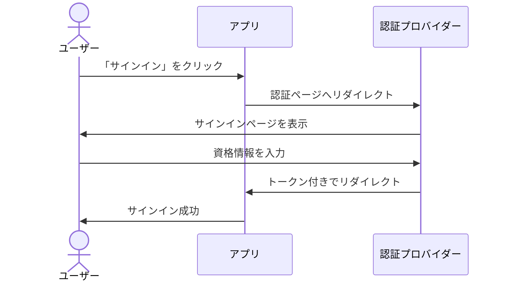
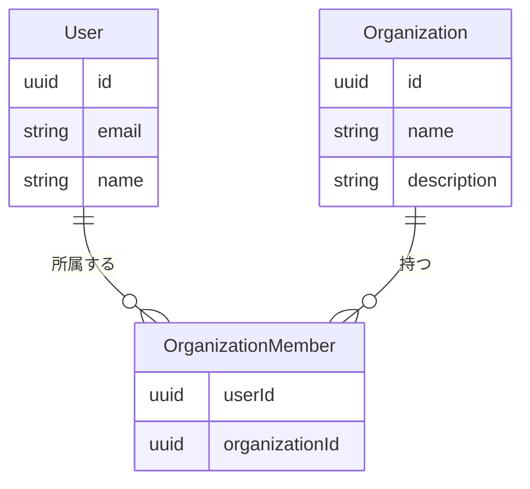
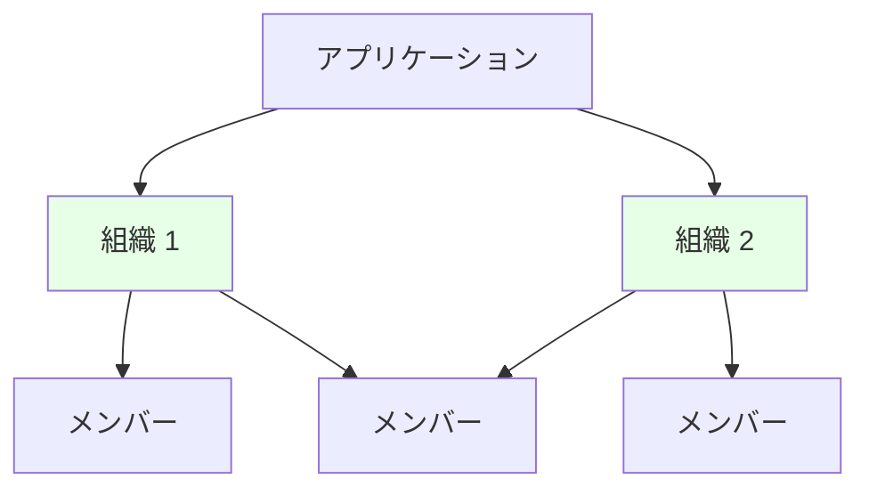
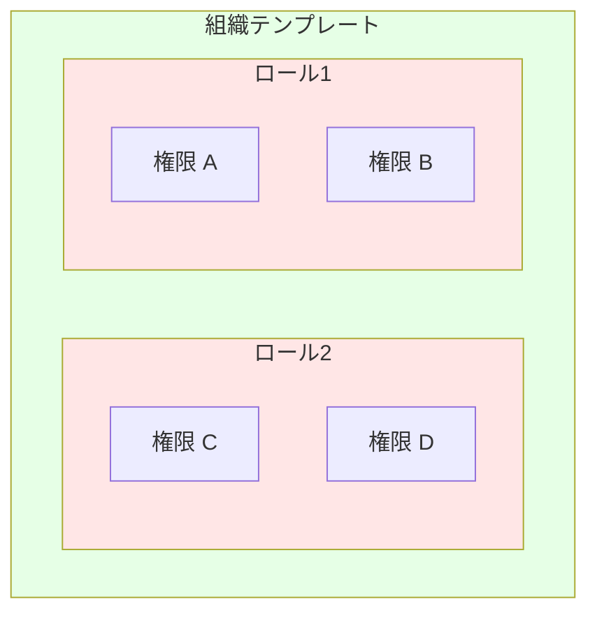
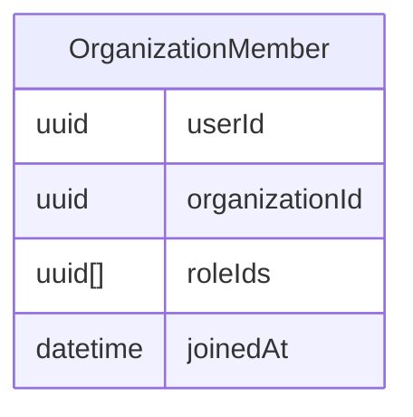
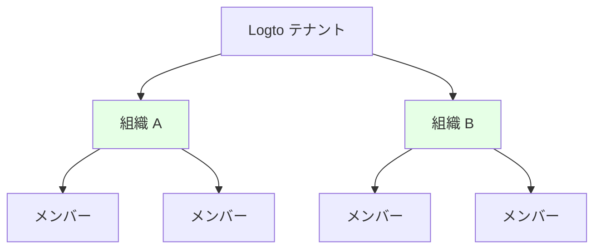
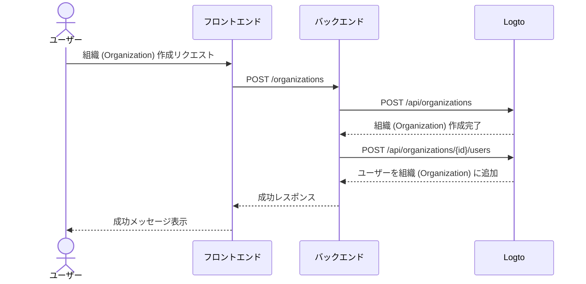

<head>
  <link rel="canonical" href="https://blog.logto.io/build-multi-tenant-saas-application" />
</head>

<style>
  {`
    .twoColumn {
      display: grid;
      grid-template-columns: 1fr 1fr;
      gap: 24px;
    }
    .twoColumn + .twoColumn {
      margin-top: 24px;
    }
  `}
</style>

# マルチテナント SaaS アプリケーションの構築：設計から実装までの完全ガイド

Notion や Slack、Figma のようなアプリはどのように作られているのでしょうか？これらのマルチテナント SaaS アプリケーションは使いやすそうに見えますが、自分で作るとなると話は別です。

私が最初にこのような複雑なものを作ろうと考えたとき、頭が爆発しそうになりました：

- ユーザーには複数のサインインオプション（メール、Google、GitHub）が必要
- 各ユーザーは複数の組織 (Organizations) を作成・所属できる
- 各組織 (Organizations) 内で異なる権限レベル
- 特定のメールドメインで自動参加が必要なエンタープライズ組織 (Organizations)
- 機密操作のための MFA 要件
- などなど...

「ボス、2 週間後にプロダクト設計の話をしましょう。今は泥沼にはまっています。」

でも実際に取り組み始めてみると、**思ったほど大変ではないことに気づきました。**

**これらすべての機能を備えたシステムを驚くほど少ない労力で構築できました！**


<div className="twoColumn">
  
  
</div>

どのようにしてこのようなシステムをゼロから設計・実装するのか、具体的に紹介します。2025 年の現代ツールと正しいアーキテクチャアプローチがあれば、どれほどシンプルかきっと驚くはずです。

> **完全なソースコードは [Github リポジトリ](https://github.com/logto-io/multi-tenant-saas-sample) で公開しています。さっそく始めましょう！**

まずは AI ドキュメント SaaS プロダクト「DocuMind」から始めます。

DocuMind は、個人ユーザー、中小企業、エンタープライズをサポートするマルチテナントモデルで設計された AI ドキュメント SaaS プロダクトです。

このプラットフォームは、組織 (Organizations) 内での自動要約生成、重要ポイント抽出、インテリジェントなコンテンツ推薦など、強力な AI ドキュメント管理機能を提供します。

## SaaS の認証 (Authentication)・認可 (Authorization) に必要な機能は？ \{#what-features-are-required-for-saas-authentication-and-authorization}

まずは必要な要件を整理しましょう。どんな機能が必要でしょうか？

### マルチテナントアーキテクチャ \{#multi-tenant-architecture}

マルチテナントアーキテクチャを実現するには、**組織 (Organization)** というエンティティレイヤーが必要です。1 つのユーザープールで複数のワークスペースにアクセスできるイメージです。各組織 (Organization) がワークスペースを表し、ユーザーは 1 つのアイデンティティで、割り当てられたロールに応じて異なるワークスペース（組織 (Organizations)）にアクセスします。


これは認証 (Authentication) プロバイダーで広く使われている機能です。アイデンティティ管理システムにおける組織 (Organization) は、SaaS アプリのワークスペースやプロジェクト、テナントに相当します。


### メンバーシップ \{#membership}

メンバーとは、組織 (Organization) 内でのアイデンティティの所属状態を示す一時的な概念です。

例えば、Sarah さんがメール **sarah@gmail.com** でアプリに登録したとします。彼女は異なるワークスペースに所属できます。Sarah さんが **Workspace A** には所属しているが **Workspace B** には所属していない場合、**Workspace A** のメンバーであり、**Workspace B** のメンバーではありません。

### ロールと権限の設計 \{#role-and-permission-design}

マルチテナントアーキテクチャでは、ユーザーはテナントリソースにアクセスするための特定の **ロール (Role)** と **権限 (Permission)** が必要です。
権限 (Permission) とは、`read: order` や `write: order` のような具体的な操作を定義する詳細なアクセス制御です。どのリソースに対してどの操作ができるかを決定します。

ロール (Role) とは、マルチテナント環境でメンバーに割り当てられる権限 (Permission) のセットです。

これらのロール (Role) と権限 (Permission) を定義し、ユーザーにロール (Role) を割り当てる必要があります。場合によっては自動化も必要です。例えば：

1. 組織 (Organization) に参加したユーザーは自動的に **member** ロール (Role) を取得
2. 最初にワークスペースを作成したユーザーは自動的に **admin** ロール (Role) を取得

### サインアップ・ログインフロー \{#sign-up-and-login-flow}

ユーザーフレンドリーかつ安全な登録・認証 (Authentication) プロセスを確保しましょう。基本的なサインイン・サインアップオプションを含みます：

1. **メール・パスワードサインイン**：従来のメール・パスワードによるログイン
2. **パスワードレスサインイン**：メール認証コードによる簡単かつ安全なアクセス
3. **アカウント管理**：メールやパスワードなどを更新できるアカウントセンター
4. **ソーシャルサインイン**：Google や GitHub などによるクイックログイン
5. **多要素認証 (MFA)**：Duo などの認証アプリによるログインでセキュリティ強化

### テナント作成・招待フロー \{#tenant-creation-and-invitation}

マルチテナント SaaS アプリでは、ユーザーフローの大きな違いとして、テナント作成やメンバー招待のサポートが必要です。このプロセスはプロダクトのアクティベーションや成長に重要な役割を果たすため、慎重な設計と実装が求められます。

よくあるユースフロー例をいくつか挙げます：

| ユーザータイプ                                   | エントリーポイント                                 |
| ------------------------------------------------ | -------------------------------------------------- |
| 新規アカウント                                   | サインイン・サインアップページから新規テナント作成 |
| 既存アカウント                                   | プロダクト内で別のテナントを作成                   |
| 既存アカウントが新規テナント招待を受け取った場合 | サインイン・サインアップページから参加             |
| 既存アカウントが新規テナント招待を受け取った場合 | 招待メールから参加                                 |
| 新規アカウントが新規テナント招待を受け取った場合 | サインイン・サインアップページから参加             |
| 新規アカウントが新規テナント招待を受け取った場合 | 招待メールから参加                                 |

ほぼすべての SaaS アプリで見られる一般的なシナリオです。プロダクトやデザインチームの参考にし、必要に応じて独自のフローを作成してください。

<div className="twoColumn">
  
  
</div>

<div className="twoColumn">
  
  
</div>

<div className="twoColumn">
  
  
</div>

## 技術アーキテクチャとシステム設計 \{#technical-architecture-and-system-design}

すべてのプロダクト要件が整理できたら、実装に進みましょう。

### 認証 (Authentication) 戦略の定義 \{#define-authentication-strategy}

認証 (Authentication) は難しそうに見えます。ユーザーには次のような要件があります：

- メール & パスワードでのサインアップ / ログイン
- Google / Github でワンクリックサインイン
- パスワードを忘れたときのリセット
- エンタープライズ顧客向けのチーム全体ログイン
- ...

これらの基本機能だけでも数週間の開発が必要になるかもしれません。

しかし今は、**これらを自分で作る必要はありません！**

現代の認証 (Authentication) プロバイダー（今回は [Logto](https://logto.io/) を選びます）が、これらすべての機能をパッケージ化してくれています。認証 (Authentication) フローはとてもシンプルです：


```mermaid
sequenceDiagram
  actor u as ユーザー
  participant a as アプリ
  participant auth as 認証プロバイダー

  u->>a: 「サインイン」をクリック
  a->>auth: 認証ページへリダイレクト
  auth->>u: サインインページを表示
  u->>auth: 資格情報を入力
  auth->>a: トークン付きでリダイレクト
  a->>u: サインイン成功
```

**数週間かかる開発が 15 分のセットアップに！** Logto が複雑なフローをすべて処理してくれます。統合手順は後ほど実装セクションで解説します。今は DocuMind のコア機能開発に集中できます！

### マルチテナントアーキテクチャの確立 \{#establish-multi-tenant-architecture}

組織 (Organization) システムにより、ユーザーは複数の組織 (Organizations) を作成・参加できます。コアな関係性を理解しましょう：


```mermaid
erDiagram
    User ||--o{ OrganizationMember : "所属する"
    Organization ||--o{ OrganizationMember : "持つ"

    User {
        uuid id
        string email
        string name
    }
    Organization {
        uuid id
        string name
        string description
    }
    OrganizationMember {
        uuid userId
        uuid organizationId
    }
```

このシステムでは、各ユーザーは複数の組織 (Organizations) に所属でき、各組織 (Organization) には複数のメンバーが所属できます。


```mermaid
graph TD
    App[アプリケーション]
    O1[組織 1]
    O2[組織 2]
    M1[メンバー]
    M2[メンバー]
    M3[メンバー]

    App --> O1
    App --> O2
    O1 --> M1
    O1 --> M2
    O2 --> M2
    O2 --> M3

    style O1 fill:#e6ffe6
    style O2 fill:#e6ffe6
```

### マルチテナントアプリでのアクセス制御の有効化 \{#enable-access-control-in-multi-tenant-app}

ロールベースのアクセス制御 (RBAC) は、マルチテナント SaaS アプリケーションのセキュリティとスケーラビリティを確保するために重要です。

マルチテナントアプリでは、権限 (Permission) とロール (Role) の設計は通常一貫しています。たとえば、複数のワークスペースには通常、管理者 (admin) ロール (Role) とメンバーロール (Role) があります。Logto の組織 (Organization) レベルのロールベースのアクセス制御 (RBAC) 設計は次の通りです：

1. **統一された権限 (Permission) 定義**：権限 (Permission) はシステムレベルで定義され、すべての組織 (Organizations) で一貫して適用されるため、保守性と一貫性のある権限 (Permission) 管理が可能
2. **組織テンプレート**：事前定義されたロール (Role) と権限 (Permission) の組み合わせを組織テンプレートとして提供し、組織 (Organization) 初期化を簡素化

権限 (Permission) の関係性は次のようになります：


```mermaid
graph TD
    subgraph organization_template[組織テンプレート]
        subgraph role_2[ロール2]
            permission_c[権限 C]
            permission_d[権限 D]
        end

        subgraph role_1[ロール1]
            permission_a[権限 A]
            permission_b[権限 B]
        end
    end

    style organization_template fill:#e6ffe6
    style role_1 fill:#ffe6e6
    style role_2 fill:#ffe6e6
```

各ユーザーは各組織 (Organization) ごとに独自のロール (Role) を持つ必要があるため、ロール (Role) と組織 (Organization) の関係はユーザーごとに割り当てられたロール (Role) を反映する必要があります：


```mermaid
erDiagram
    OrganizationMember {
        uuid userId
        uuid organizationId
        uuid[] roleIds
        datetime joinedAt
    }

```

これで組織 (Organization) システムとアクセス制御システムの設計ができたので、いよいよプロダクト開発に取りかかれます！

## 技術スタック \{#tech-stack}

初心者にも優しく、移植性の高いスタックを選びました：

1. **フロントエンド**：React（Vue / Angular / Svelte への移行も簡単）
2. **バックエンド**：Express（シンプルで直感的な API）

なぜフロントエンドとバックエンドを分離するのか？それはアーキテクチャが明確で、学びやすく、スタックの切り替えも簡単だからです。認証 (Authentication) プロバイダーには Logto を例に使います。

このガイドのパターンは、**どんなフロントエンド・バックエンド・認証 (Authentication) システムにも応用できます。**

## アプリに基本的な認証 (Authentication) フローを追加 \{#add-basic-authentication-flow-to-your-app}

これは最も簡単なステップです。Logto をプロジェクトに統合するだけです。その後、Logto コンソールでユーザーのログイン / 登録方法をニーズに合わせて設定できます。

### アプリに Logto をインストール \{#install-logto-to-your-app}

まず [Logto Cloud](https://cloud.logto.io/) にログインします。アカウントがない場合は無料で登録できます。テスト用に Development Tenant を作成しましょう。

テナントコンソールで左側の「アプリケーション」ボタンをクリックし、React を選択してアプリケーションの構築を開始します。

ページのガイドに従って進めば、Logto の統合は約 5 分で完了します！

私の統合コード例はこちらです：

```jsx
const config: LogtoConfig = {
  endpoint: "<YOUR_LOGTO_ENDPOINT>",
  appId: "<YOUR_LOGTO_APP_ID>",
};

function App() {
  return (
    <LogtoProvider config={config}>
      <div className="min-h-screen bg-gradient-to-b from-gray-50 to-gray-100">
        <Routes>
          {/* Logto からのユーザーログインリダイレクトを処理するコールバック */}
          <Route path="/callback" element={<Callback />} />
          <Route path="/*" element={<AppContent />} />
        </Routes>
      </div>
    </LogtoProvider>
  );
}

function AppContent() {
  const { isAuthenticated } = useLogto();

  if (!isAuthenticated) {
    // 未認証ユーザー向けランディングページを表示
    return <Landing />;
  }

  // 認証済みユーザー向けメインアプリを表示
  return (
    <Routes>
      {/* ダッシュボードで利用可能なすべての組織 (Organizations) を表示 */}
      <Route path="/" element={<Dashboard />} />

      {/* ダッシュボードで組織 (Organization) をクリックした後のページ */}
      <Route path="/:orgId" element={<Organization />} />
    </Routes>
  );
}
```


便利な小技：ログインページには「Sign in」と「Register」ボタンがあります。Register ボタンは Logto の登録ページに直接遷移します。これは Logto の [first screen](/end-user-flows/authentication-parameters/first-screen) 機能で実現しています。どの認証 (Authentication) フローのステップを最初に表示するかを決定できます。

新規ユーザーが多いプロダクトの場合、デフォルトで登録ページを表示することもできます。

```jsx
function LandingPage() {
  const { signIn } = useLogto();

  return (
    <div className="landing-container">
      <div className="auth-buttons">
        <button
          className="sign-in-button"
          onClick={() => {
            signIn({
              redirectUri: '<YOUR_APP_CALLBACK_URL>',
            });
          }}
        >
          Sign In
        </button>

        <button
          className="register-button"
          onClick={() => {
            signIn({
              redirectUri: '<YOUR_APP_CALLBACK_URL>',
              firstScreen: 'register',
            });
          }}
        >
          Register
        </button>
      </div>
    </div>
  );
}
```

ログインをクリックすると Logto のログインページに遷移します。ログイン（または登録）が成功すると、おめでとうございます！アプリに最初のユーザー（あなた）が誕生しました！

ユーザーをサインアウトしたい場合は、`useLogto` フックの `signOut` 関数を呼び出します。

```jsx
function SignOutButton() {
  const { signOut } = useLogto();

  return <button onClick={() => signOut('<YOUR_POST_LOGOUT_REDIRECT_URL>')}>Sign Out</button>;
}
```

### サインイン・サインアップ方法のカスタマイズ \{#customize-sign-in-and-sign-up-methods}

Logto コンソールの左メニューで「Sign-in & account」をクリックし、「Sign-up and sign-in」タブを選択します。
このページで Logto のログイン / 登録方法を設定できます。


サインインフローは次のようになります：


### 多要素認証 (MFA) の有効化 \{#enable-multi-factor-authentication}

Logto なら MFA の有効化も簡単です。Logto コンソールで「Multi-factor auth」ボタンをクリックし、Multi-factor authentication ページで有効化しましょう。


MFA フローは次のようになります：

<div className="twoColumn">
  
  
</div>

とてもシンプルですね！わずか数分で複雑なユーザー認証 (Authentication) システムを構築できました！

## マルチテナント組織 (Organization) 体験の追加 \{#adding-multi-tenant-organization-experience}

これで最初のユーザーができました！しかし、このユーザーはまだどの組織 (Organization) にも所属しておらず、組織 (Organization) も作成されていません。

Logto はマルチテナンシーを標準でサポートしています。Logto で任意の数の組織 (Organizations) を作成できます。各組織 (Organization) には複数のメンバーが所属できます。


```mermaid
graph TD
    T[Logto テナント] --> OrgA[組織 A]
    T --> OrgB[組織 B]
    OrgA --> MA1[メンバー]
    OrgA --> MA2[メンバー]
    OrgB --> MB1[メンバー]
    OrgB --> MB2[メンバー]

    style OrgA fill:#e6ffe6
    style OrgB fill:#e6ffe6

```

各ユーザーは Logto から自身の組織 (Organization) 情報を取得できます。これによりマルチテナンシーが実現できます。

### ユーザーの組織 (Organization) 情報を取得 \{#get-a-user-s-organization-information}

Logto からユーザーの組織 (Organization) 情報を取得するには、次の 2 ステップを実施します：

Logto Config で組織 (Organization) 情報へのアクセスを宣言します。適切な `scopes` と `resources` を設定します。

```jsx
import { UserScope, ReservedResource } from "@logto/react";
const config: LogtoConfig = {
  endpoint: "<YOUR_LOGTO_ENDPOINT>",
  appId: "<YOUR_LOGTO_APP_ID>",
  scopes: [UserScope.Organizations], // 値: "urn:logto:scope:organizations"
  resources: [ReservedResource.Organization], // 値: "urn:logto:resource:organizations"
};

```

Logto の `fetchUserInfo` メソッドでユーザー情報（組織 (Organization) データ含む）を取得します。

```jsx
function Dashboard() {
  // ユーザー情報を取得
  const { fetchUserInfo } = useLogto();
  const [organizations, setOrganizations] = useState<OrganizationData[]>([]);
  const [loading, setLoading] = useState(false);

  useEffect(() => {
    const loadOrganizations = async () => {
      try {
        setLoading(true);
        // ユーザー情報を取得
        const userInfo = await fetchUserInfo();
        // ユーザーの組織 (Organization) 情報を取得
        const organizationData = userInfo?.organization_data || [];
        setOrganizations(organizationData);
      } catch (error) {
        console.error('Failed to fetch organizations:', error);
      } finally {
        setLoading(false);
      }
    };

    loadOrganizations();
  }, [fetchUserInfo]);

  if (loading) {
    return <div>Loading...</div>;
  }

  if (organizations.length === 0) {
    return <div>まだどの組織 (Organization) のメンバーにもなっていません</div>;
  }

  return <div>Organizations: {organizations.map(org => org.name).join(', ')}</div>;
}

```

これらの手順を終えたら、一度サインアウトして再度サインインしてください。リクエストするスコープやリソースを変更したため、必要な操作です。

現時点では、まだ組織 (Organization) を作成していませんし、ユーザーもどの組織 (Organization) にも参加していません。ダッシュボードには「まだ組織 (Organization) がありません」と表示されます。


次に、ユーザーのために組織 (Organization) を作成し、そこに追加しましょう。

Logto のおかげで、複雑な組織 (Organization) 関係を自作する必要はありません。Logto で組織 (Organization) を作成し、ユーザーを追加するだけで OK です。Logto が複雑な部分をすべて処理してくれます。組織 (Organization) の作成方法は 2 つあります：

1. Logto コンソールで手動作成
2. Logto Management API を使って作成（ユーザー自身が組織 (Organization) を作成できる SaaS フロー設計時に特に有効）

### Logto コンソールで組織 (Organization) を作成 \{#create-organization-in-logto-console}

Logto コンソール左側の「Organizations」メニューボタンをクリックし、組織 (Organization) を作成します。

これで最初の組織 (Organization) ができました。


次に、この組織 (Organization) にユーザーを追加しましょう。

組織 (Organization) 詳細ページに移動し、Members タブに切り替えます。「+ Add member」ボタンをクリックし、左側リストからログインユーザーを選択します。右下の「Add members」ボタンをクリックすれば、ユーザーが組織 (Organization) に追加されます。


アプリページをリロードすると、ユーザーが組織 (Organization) に所属していることが確認できます！


## セルフサービスでの組織 (Organization) 作成体験の実装 \{#implement-self-serve-organization-creation-experience}

コンソールで組織 (Organization) を作成するだけでは不十分です。SaaS アプリには、エンドユーザーが自分でワークスペースを簡単に作成・管理できるフローが必要です。この機能を実装するには Logto Management API を使います。

ガイドについては [Management API との連携](/integrate-logto/interact-with-management-api) ドキュメントを参照し、Logto との API 通信をセットアップしてください。

### 組織 (Organization) 認証 (Authentication) インタラクションフローの理解 \{#understand-organization-auth-interaction-flow}

組織 (Organization) 作成フローを例に、プロセスを見てみましょう：


```mermaid
sequenceDiagram
  actor A as ユーザー
  participant B as フロントエンド
  participant C as バックエンド
  participant D as Logto

  A->>B: 組織 (Organization) 作成リクエスト
  B->>C: POST /organizations
  C->>D: POST /api/organizations
  D-->>C: 組織 (Organization) 作成完了
  C->>D: POST /api/organizations/{id}/users
  D-->>C: ユーザーを組織 (Organization) に追加
  C-->>B: 成功レスポンス
  B-->>A: 成功メッセージ表示
```

このフローには 2 つの重要な認証 (Authentication) 要件があります：

1. **バックエンドサービス API の保護**：
   - フロントエンドからバックエンドサービス API へのアクセスには認証 (Authentication) が必要
   - API エンドポイントはユーザーの Logto アクセストークンで保護
   - 認証済みユーザーのみサービスにアクセス可能
2. **Logto Management API へのアクセス**：
   - バックエンドサービスが Logto Management API を安全に呼び出す必要あり
   - [Management API との連携](/integrate-logto/interact-with-management-api) ガイドに従ってセットアップ
   - マシン間通信 (M2M) 認証 (Authentication) でアクセス認証情報を取得

### バックエンド API の保護 \{#protect-your-backend-api}

まず、バックエンドサービスで組織 (Organization) 作成用の API エンドポイントを作成します。

```jsx
app.post('/organizations', async (req, res) => {
  // Logto Management API を使った実装
  // ...
});
```

バックエンドサービス API は認証済みユーザーのみ許可します。Logto で API を保護し、現在のユーザー情報（ユーザー ID など）も取得する必要があります。

Logto の概念（および OAuth 2.0）では、バックエンドサービスはリソースサーバーとして機能します。ユーザーはフロントエンドからアクセストークンを使って DocuMind リソースサーバーにアクセスし、リソースサーバーはこのトークンを検証します。有効ならリクエストされたリソースを返します。

API リソースを作成してバックエンドサービスを表現しましょう。

Logto コンソールで：

1. 右側の「API resources」ボタンをクリック
2. 「Create API resource」をクリックし、ポップアップで Express を選択
3. API 名に「DocuMind API」、API 識別子に「[https://api.documind.com](https://api.documind.com/)」を入力
4. 作成をクリック

この API 識別子 URL は Logto 内で API を一意に識別するためのもので、実際のバックエンドサービス URL とは関係ありません。

API リソースの使い方チュートリアルが表示されます。そちらを参照しても、この後の手順に従っても OK です。

`requireAuth` ミドルウェアを作成し、POST /organizations エンドポイントを保護しましょう。

```jsx
const { createRemoteJWKSet, jwtVerify } = require('jose');

const getTokenFromHeader = (headers) => {
  const { authorization } = headers;
  const bearerTokenIdentifier = 'Bearer';

  if (!authorization) {
    throw new Error('Authorization header missing');
  }

  if (!authorization.startsWith(bearerTokenIdentifier)) {
    throw new Error('Authorization token type not supported');
  }

  return authorization.slice(bearerTokenIdentifier.length + 1);
};

const requireAuth = (resource) => {
  if (!resource) {
    throw new Error('Resource parameter is required for authentication');
  }

  return async (req, res, next) => {
    try {
      // トークンを抽出
      const token = getTokenFromHeader(req.headers);

      const { payload } = await jwtVerify(
        token,
        createRemoteJWKSet(new URL(process.env.LOGTO_JWKS_URL)),
        {
          issuer: process.env.LOGTO_ISSUER,
          audience: resource,
        }
      );

      // ユーザー情報をリクエストに追加
      req.user = {
        id: payload.sub,
      };

      next();
    } catch (error) {
      console.error('Auth error:', error);
      res.status(401).json({ error: 'Unauthorized' });
    }
  };
};

module.exports = {
  requireAuth,
};
```

このミドルウェアを使うには、次の環境変数が必要です：

- LOGTO_JWKS_URL
- LOGTO_ISSUER

これらは Logto テナントの OpenID Configuration エンドポイントから取得できます。`https://<your-tenant-id>.logto.app/oidc/.well-known/openid-configuration` にアクセスし、返却された JSON から情報を確認してください：

```json
{
  "jwks_uri": "<https://tenant-id.logto.app/oidc/jwks>",
  "issuer": "<https://tenant-id.logto.app/oidc>"
}
```

`requireAuth` ミドルウェアを POST /organizations エンドポイントで使いましょう。

```jsx
app.post('/organizations', requireAuth('<https://api.documind.com>'), async (req, res) => {
  // 組織 (Organization) 作成ロジック
  // ...
});
```

これで POST /organizations エンドポイントが保護され、Logto の有効なアクセストークンを持つユーザーのみアクセスできます。

フロントエンドで Logto からトークンを取得し、このトークンでバックエンドサービス API を呼び出せます。ミドルウェアでユーザー ID も取得できるので、組織 (Organization) へのユーザー追加時にも便利です。

フロントエンドコードでは、Logto config の resources 配列にこの API リソース識別子を追加します。

```jsx
const config: LogtoConfig = {
  endpoint: "<YOUR_LOGTO_ENDPOINT>",
  appId: "<YOUR_LOGTO_APP_ID>",
  scopes: [UserScope.Organizations],
  resources: [ReservedResource.Organization, "<https://api.documind.com>"], // 新規作成した API リソース識別子
};

```

同様に、Logto config を更新した後は再度ログインが必要です。

ダッシュボードで組織 (Organization) 作成時に Logto アクセストークンを取得し、このトークンでバックエンドサービス API にアクセスします。

```jsx
// "DocuMind API" 用アクセストークンを取得
const token = await getAccessToken('<https://api.documind.com>');

// トークンでバックエンドサービス API にアクセス
const response = await fetch('<http://localhost:3000/organizations>', {
  method: 'POST',
  headers: {
    'Content-Type': 'application/json',
    Authorization: `Bearer ${token}`,
  },
  body: JSON.stringify({
    name: 'Organization A',
    description: 'Organization A description',
  }),
});
```

これで DocuMind バックエンドサービス API に正しくアクセスできるようになりました。

### Logto Management API の呼び出し \{#calling-logto-management-api}

Logto Management API を使って組織 (Organization) 作成を実装しましょう。

フロントエンドからバックエンドサービスへのリクエストと同様に、バックエンドサービスから Logto へのリクエストにもアクセストークンが必要です。

Logto では、マシン間通信 (M2M) 認証 (Authentication) でアクセストークンを取得します。詳細は [Management API との連携](/integrate-logto/interact-with-management-api) を参照してください。

Logto コンソールのアプリケーションページで Machine-to-Machine アプリケーションを作成し、「Logto Management API access」ロール (Role) を割り当てます。Token endpoint、App ID、App Secret をコピーしておきます。これらをアクセストークン取得に使います。


この M2M アプリケーションで Logto Management API のアクセストークンを取得できます。

```jsx
async function fetchLogtoManagementApiAccessToken() {
  const response = await fetch(process.env.LOGTO_MANAGEMENT_API_TOKEN_ENDPOINT, {
    method: 'POST',
    headers: {
      'Content-Type': 'application/x-www-form-urlencoded',
      Authorization: `Basic ${Buffer.from(
        `${process.env.LOGTO_MANAGEMENT_API_APPLICATION_ID}:${process.env.LOGTO_MANAGEMENT_API_APPLICATION_SECRET}`
      ).toString('base64')}`,
    },
    body: new URLSearchParams({
      grant_type: 'client_credentials',
      resource: process.env.LOGTO_MANAGEMENT_API_RESOURCE,
      scope: 'all',
    }).toString(),
  });
  const data = await response.json();
  return data.access_token;
}
```

このアクセストークンで Logto Management API を呼び出します。

利用する Management API は次の通りです：

- `POST /api/organizations`：組織 (Organization) 作成（[API リファレンス](https://openapi.logto.io/operation/operation-createorganization) 参照）
- `POST /api/organizations/{id}/users`：組織 (Organization) へのユーザー追加（[API リファレンス](https://openapi.logto.io/operation/operation-addusers) 参照）

```jsx
app.post('/organizations', requireAuth('<https://api.documind.com>'), async (req, res) => {
  const accessToken = await fetchLogtoManagementApiAccessToken();
  // Logto で組織 (Organization) を作成し、ユーザーを追加
  const response = await fetch(`${process.env.LOGTO_ENDPOINT}/api/organizations`, {
    method: 'POST',
    headers: {
      'Content-Type': 'application/json',
      Authorization: `Bearer ${accessToken}`,
    },
    body: JSON.stringify({
      name: req.body.name,
      description: req.body.description,
    }),
  });

  const createdOrganization = await response.json();

  await fetch(`${process.env.LOGTO_ENDPOINT}/api/organizations/${createdOrganization.id}/users`, {
    method: 'POST',
    headers: {
      'Content-Type': 'application/json',
      Authorization: `Bearer ${accessToken}`,
    },
    body: JSON.stringify({
      userIds: [req.user.id],
    }),
  });

  res.json({ data: createdOrganization });
});
```

これで Logto Management API を使った組織 (Organization) 作成とユーザー追加が実装できました。

ダッシュボードでこの機能をテストしてみましょう。


「Create Organization」をクリック


作成成功！

次のステップはユーザーの組織 (Organization) への招待です。本チュートリアルではこの機能は実装しませんが、Management API の使い方はすでに説明済みです。[**テナント作成・招待**](#tenant-creation-and-invitation) をプロダクト設計の参考にし、[How we implement user collaboration within a multi-tenant app](https://blog.logto.io/implement-user-collaboration-in-your-app) のブログ記事を参考に簡単に実装できます。

## マルチテナントアプリへのアクセス制御実装 \{#implement-access-control-to-your-multi-tenant-app}

次は組織 (Organization) のアクセス制御に進みましょう。

実現したいこと：

- ユーザーは自分の組織 (Organization) のリソースのみアクセス可能：Logto の `組織トークン (Organization token)` で実現
- ユーザーは組織 (Organization) 内で特定のロール (Role)（異なる権限 (Permission) を含む）を持ち、許可された操作のみ実行可能：Logto の組織テンプレート機能で実現

これらの機能の実装方法を見ていきましょう。

### Logto 組織トークン (Organization token) の利用 \{#using-logto-organization-token}

先ほどの Logto アクセストークンと同様に、Logto は特定リソースに対応するアクセストークンを発行し、ユーザーはこのトークンでバックエンドサービスの保護リソースにアクセスします。同様に、Logto は特定の組織 (Organization) に対応する組織トークン (Organization token) を発行し、ユーザーはこのトークンで組織 (Organization) の保護リソースにアクセスします。

フロントエンドアプリケーションでは、Logto の `getOrganizationToken` メソッドで特定組織 (Organization) 用のトークンを取得できます。

```jsx
const { getOrganizationToken } = useLogto();
const organizationToken = await getOrganizationToken(organizationId);
```

ここで `organizationId` はユーザーが所属する組織 (Organization) の id です。

`getOrganization` や組織 (Organization) 関連機能を使う前に、Logto config に `urn:logto:scope:organizations` スコープと `urn:logto:resource:organization` リソースが含まれていることを確認してください。すでに宣言済みなのでここでは省略します。

組織 (Organization) ページでは、この組織トークン (Organization token) で組織 (Organization) 内のドキュメントを取得します。

```jsx
function OrganizationPage() {
  const { organizationId } = useParams();
  const navigate = useNavigate();
  const { signOut, getOrganizationToken } = useLogto();
  const [error, setError] = useState<Error | null>(null);
  const [documents, setDocuments] = useState([]);

  const fetchDocuments = useCallback(async () => {
    if (!organizationId) return;

    try {
      const organizationToken = await getOrganizationToken(organizationId);
      const response = await fetch(`http://localhost:3000/documents`, {
          headers: {
          'Content-Type': 'application/json',
          Authorization: `Bearer ${organizationToken}`,
        },
      });
      const documents = await response.json();
      setDocuments(documents);
    } catch (error: unknown) {
      if (error instanceof Error) {
        setError(error);
      } else {
        setError(new Error(String(error)));
      }
    }
  },[getOrganizationToken, organizationId]);

  useEffect(() => {
    void fetchDocuments();
  }, [fetchDocuments]);

  if (error) {
    return <div>Error: {error.message}</div>;
  }

  return <div>
    <h1>Organization Documents</h1>
    <ul>
      {documents.map((document) => (
        <li key={document.id}>{document.name}</li>
      ))}
    </ul>
  </div>
}

```

この実装で重要なポイントは 2 つあります：

1. `getOrganizationToken` に渡す `organizationId` が現在のユーザーの所属組織 (Organization) でない場合、このメソッドはトークンを取得できません。これによりユーザーは自分の組織 (Organization) のみアクセス可能となります。
2. 組織 (Organization) リソースへのリクエスト時はアクセストークンではなく組織トークン (Organization token) を使います。組織 (Organization) に属するリソースにはユーザー権限 (Permission) ではなく組織 (Organization) 権限 (Permission) 制御を適用したいためです（この後 `GET /documents` API を実装するとより理解できます）。

次に、バックエンドサービスで `GET /documents` API を作成します。`POST /organizations` API を API リソースで保護したのと同様に、組織 (Organization) 固有のリソースインジケーターで `GET /documents` API を保護します。

まず、`requireOrganizationAccess` ミドルウェアを作成し、組織 (Organization) リソースを保護します。

```jsx
const getTokenFromHeader = (headers) => {
  const { authorization } = headers;
  const bearerTokenIdentifier = 'Bearer';

  if (!authorization) {
    throw new Error('Authorization header missing');
  }

  if (!authorization.startsWith(bearerTokenIdentifier)) {
    throw new Error('Authorization token type not supported');
  }

  return authorization.slice(bearerTokenIdentifier.length + 1);
};

const extractOrganizationId = (aud) => {
  if (!aud || typeof aud !== 'string' || !aud.startsWith('urn:logto:organization:')) {
    throw new Error('Invalid organization token');
  }
  return aud.replace('urn:logto:organization:', '');
};

const decodeJwtPayload = (token) => {
  try {
    const [, payloadBase64] = token.split('.');
    if (!payloadBase64) {
      throw new Error('Invalid token format');
    }
    const payloadJson = Buffer.from(payloadBase64, 'base64').toString('utf-8');
    return JSON.parse(payloadJson);
  } catch (error) {
    throw new Error('Failed to decode token payload');
  }
};

const requireOrganizationAccess = () => {
  return async (req, res, next) => {
    try {
      // トークンを抽出
      const token = getTokenFromHeader(req.headers);

      // トークンから audience を動的に取得
      const { aud } = decodeJwtPayload(token);
      if (!aud) {
        throw new Error('Missing audience in token');
      }

      // audience でトークンを検証
      const { payload } = await jwtVerify(
        token,
        createRemoteJWKSet(new URL(process.env.LOGTO_JWKS_URL)),
        {
          issuer: process.env.LOGTO_ISSUER,
          audience: aud,
        }
      );

      // audience クレームから組織 (Organization) ID を抽出
      const organizationId = extractOrganizationId(payload.aud);

      // 組織 (Organization) 情報をリクエストに追加
      req.user = {
        id: payload.sub,
        organizationId,
      };

      next();
    } catch (error) {
      console.error('Organization auth error:', error);
      res.status(401).json({ error: 'Unauthorized - Invalid organization access' });
    }
  };
};
```

`requireOrganizationAccess` ミドルウェアで `GET /documents` API を保護します。

```jsx
app.get('/documents', requireOrganizationAccess(), async (req, res) => {
  // req.user から現在のユーザー ID と組織 (Organization) ID を取得可能
  console.log('userId', req.user.id);
  console.log('organizationId', req.user.organizationId);

  // organizationId でデータベースからドキュメントを取得
  // ....
  const documents = await getDocumentsByOrganizationId(req.user.organizationId);

  res.json(documents);
});
```

このようにして、組織トークン (Organization token) で組織 (Organization) リソースにアクセスできるようになりました。バックエンドサービスでは組織 (Organization) ID でデータベースから該当リソースを取得できます。

組織 (Organization) 間でデータ分離が必要なソフトウェアもあります。さらに詳しい議論や実装については、[Multi-tenancy implementation with PostgreSQL: Learn through a simple real-world example](https://blog.logto.io/implement-multi-tenancy) のブログ記事を参照してください。

### 組織 (Organization) レベルのロールベースのアクセス制御 (RBAC) 設計の実装 \{#implement-organization-level-role-based-access-control-design}

組織トークン (Organization token) で組織 (Organization) リソースへのアクセスは実装できました。次は RBAC を使って組織 (Organization) 内でのユーザー権限 (Permission) 制御を実装します。

DocuMind には Admin と Collaborator の 2 つのロール (Role) があると仮定します。

Admin はドキュメントの作成・閲覧ができ、Collaborator は閲覧のみ可能です。

したがって、組織 (Organization) には Admin と Collaborator の 2 つのロール (Role) が必要です。

Admin には `read:documents` と `create:documents` の両方の権限 (Permission) があり、Collaborator には `read:documents` のみがあります。

- Admin
  - `read:documents`
  - `create:documents`
- Collaborator
  - `read:documents`

ここで Logto の組織テンプレート機能が活躍します。

組織テンプレートとは、すべての組織 (Organizations) に適用されるアクセス制御モデルの設計図です。どのロール (Role)・権限 (Permission) を持つかを定義します。

> なぜ組織テンプレートなのか？
>
> SaaS プロダクトにとってスケーラビリティは最重要要件の 1 つだからです。つまり、1 つのクライアントで動くものはすべてのクライアントでも動く必要があります。

Logto コンソール > Organization Templates > Organization permissions で `read:documents` と `create:documents` の 2 つの権限 (Permission) を作成しましょう。


次に、organization roles タブで Admin と Collaborator の 2 つのユーザーロール (Role) を作成し、それぞれに対応する権限 (Permission) を割り当てます。


これで各組織 (Organization) の RBAC 権限 (Permission) モデルが作成できました。

次に、Organization 詳細ページでメンバーに適切なロール (Role) を割り当てます。


これで組織 (Organization) ユーザーにロール (Role) が割り当てられました！
これらの操作は Logto Management API でも実現できます：

```jsx
// 組織 (Organization) 作成者に 'Admin' ロール (Role) を割り当て
app.post('/organizations', requireAuth('https://api.documind.com'), async (req, res) => {
  const accessToken = await fetchLogtoManagementApiAccessToken();
  // Logto で組織 (Organization) を作成
  // 既存コード...

  // Logto でユーザーを組織 (Organization) に追加
  await fetch(`${process.env.LOGTO_ENDPOINT}/api/organizations/${createdOrganization.id}/users`, {
    method: 'POST',
    headers: {
      'Content-Type': 'application/json',
      Authorization: `Bearer ${accessToken}`,
    },
    body: JSON.stringify({
      userIds: [req.user.id],
    }),
  });

  // 最初のユーザーに `Admin` ロール (Role) を割り当て
  const rolesResponse = await fetch(`${process.env.LOGTO_ENDPOINT}/api/organization-roles`, {
    method: 'GET',
    headers: {
      'Content-Type': 'application/json',
      Authorization: `Bearer ${accessToken}`,
    },
  });

  const roles = await rolesResponse.json();

  // `Admin` ロール (Role) を探す
  const adminRole = roles.find((role) => role.name === 'Admin');

  // 最初のユーザーに `Admin` ロール (Role) を割り当て
  await fetch(
    `${process.env.LOGTO_ENDPOINT}/api/organizations/${createdOrganization.id}/users/${req.user.id}/roles`,
    {
      method: 'POST',
      headers: {
        'Content-Type': 'application/json',
        Authorization: `Bearer ${accessToken}`,
      },
      body: JSON.stringify({
        organizationRoleIds: [adminRole.id],
      }),
    }
  );

  // 既存コード...
});
```

これでユーザー権限 (Permission) 制御を権限 (Permission) チェックで実装できるようになりました。

コード上では、ユーザーの組織トークン (Organization token) に権限 (Permission) 情報を持たせ、バックエンドでこれを検証します。

フロントエンドコードの Logto config で、組織 (Organization) 内でユーザーがリクエストする必要のある権限 (Permission) を宣言します。`read:documents` と `create:documents` を `scopes` に追加しましょう。

```jsx
const config: LogtoConfig = {
  endpoint: "<YOUR_LOGTO_ENDPOINT>",
  appId: "<YOUR_LOGTO_APP_ID>",
  scopes: [UserScope.Organizations, "read:documents", "create:documents"],
  resources: [ReservedResource.Organization, "<https://api.documind.com>"], // 新規作成した API リソース識別子
};

```

いつものように、これらの設定を反映させるには再度ログインしてください。

次に、バックエンドの `requireOrganizationAccess` ミドルウェアでユーザー権限 (Permission) の検証を追加します。

```jsx
const hasRequiredScopes = (tokenScopes, requiredScopes) => {
  if (!requiredScopes || requiredScopes.length === 0) {
    return true;
  }
  const scopeSet = new Set(tokenScopes);
  return requiredScopes.every((scope) => scopeSet.has(scope));
};

const requireOrganizationAccess = ({ requiredScopes = [] } = {}) => {
  return async (req, res, next) => {
    try {
      //...

      // audience でトークンを検証
      const { payload } = await jwtVerify(
        token,
        createRemoteJWKSet(new URL(process.env.LOGTO_JWKS_URL)),
        {
          issuer: process.env.LOGTO_ISSUER,
          audience: aud,
        }
      );

      //...

      // トークンからスコープを取得
      const scopes = payload.scope?.split(' ') || [];

      // 必要なスコープを検証
      if (!hasRequiredScopes(scopes, requiredScopes)) {
        throw new Error('Insufficient permissions');
      }

      //...

      next();
    } catch (error) {
      //...
    }
  };
};
```

次に POST /documents API を作成し、`requireOrganizationAccess` ミドルウェアの requiredScopes 設定でこの API と先ほどの `GET /documents` API を保護します。

```jsx
// ドキュメント作成 API
app.post(
  '/documents',
  requireOrganizationAccess({ requiredScopes: ['create:documents'] }),
  async (req, res) => {
    //...
  }
);

// ドキュメント取得 API
app.get(
  '/documents',
  requireOrganizationAccess({ requiredScopes: ['read:documents'] }),
  async (req, res) => {
    //...
  }
);
```

これでユーザー権限 (Permission) チェックによる権限 (Permission) 制御が実装できました。

フロントエンドでは、組織トークン (Organization token) をデコードするか、Logto の `getOrganizationTokenClaims` メソッドでユーザー権限 (Permission) 情報を取得できます。

```jsx
const [scopes, setScopes] = useState([]);
const { getOrganizationTokenClaims } = useLogto();

const loadScopes = async () => {
  const claims = await getOrganizationTokenClaims(organizationId);
  setScopes(claims.scope.split(' '));
};

// ...
```

claims 内のスコープをチェックして、ユーザー権限 (Permission) に応じてページ要素を制御できます。

## さらに多くのマルチテナントアプリ機能を追加 \{#add-more-multi-tenant-app-features}

ここまでで、マルチテナント SaaS システムの基本的なユーザー・組織 (Organization) 機能を実装できました！ただし、組織 (Organization) ごとにログインページのブランディングをカスタマイズしたり、特定ドメインのメールユーザーを自動的に組織 (Organization) に追加したり、エンタープライズレベルの SSO 機能を統合したりと、まだ触れていない機能もあります。

これらはすべてすぐに使える機能であり、Logto ドキュメントで詳細を確認できます：

- [エンタープライズシングルサインオン (SSO) 統合](/end-user-flows/enterprise-sso)
- [ジャストインタイム (JIT) プロビジョニング](/organizations/just-in-time-provisioning)
- [組織 (Organization) レベルのブランディング](/customization/match-your-brand#organization-specific-branding)
- [組織 (Organization) レベルの多要素認証 (MFA)](/organizations/organization-management#require-mfa-for-organization-members)
- [組織 (Organization) レベルの管理](/end-user-flows/organization-experience/organization-management)

## まとめ \{#summary}

最初は圧倒されそうでしたよね？ユーザー、組織 (Organizations)、権限 (Permissions)、エンタープライズ機能...まるで果てしない山のように思えました。

でも、ここまでで実現できたことを振り返ってみましょう：

- 複数のサインインオプションと MFA 対応の完全な認証 (Authentication) システム
- 複数のメンバーシップをサポートする柔軟な組織 (Organization) システム
- 組織 (Organization) 内でのロールベースのアクセス制御 (RBAC)

そして何より素晴らしいのは、車輪の再発明をせずに済んだことです。Logto のような現代ツールを活用することで、数か月かかる開発を数分で実現できました。

本チュートリアルの完全なソースコードは [Multi-tenant SaaS Sample](https://github.com/logto-io/multi-tenant-saas-sample) で公開しています。

これが 2025 年の現代開発の力です。インフラに悩むことなく、独自のプロダクト機能開発に集中できます。さあ、今度はあなたが素晴らしいものを作る番です！

Logto Cloud から Logto OSS まで、Logto のすべての機能を [Logto ウェブサイト](https://logto.io/) でチェックするか、[Logto cloud](https://cloud.logto.io/?sign_up) に今すぐ登録しましょう。
