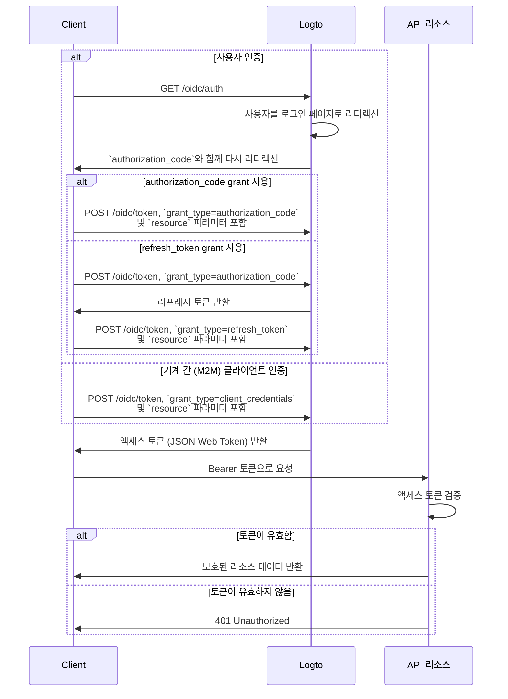

import TabItem from '@theme/TabItem';
import Tabs from '@theme/Tabs';

import illustration from '@site/docs/authorization/assets/rbac-global-api-resources.png';
import AuthorizationRequestExample from '@site/docs/authorization/fragments/AuthorizationRequestExample';
import ClientCredentialsRequestExample from '@site/docs/authorization/fragments/ClientCredentialsRequestExample';
import TokenRequestExample from '@site/docs/authorization/fragments/TokenRequestExample';

글로벌 API 리소스 보호하기

export const resource = 'https://api.your-app.com';

Logto에서 역할 기반 접근 제어 (RBAC)를 사용하여 제품 전체 API를 보호하세요. 모든 사용자와 클라이언트에 대해 글로벌 역할과 권한을 할당하여 애플리케이션 전반의 접근을 제어할 수 있습니다.

## 글로벌 API 리소스란? \{#what-are-global-api-resources}

글로벌 API 리소스는 조직이나 테넌트와 상관없이 모든 사용자가 접근할 수 있는 애플리케이션 내 엔드포인트 또는 서비스입니다. 일반적으로 공개 API, 핵심 제품 서비스, 또는 특정 조직에 한정되지 않은 엔드포인트가 이에 해당합니다.

**사용 사례 예시**

- 사용자 전체에 공유되는 공개 API 또는 엔드포인트
- 다중 테넌시에 묶이지 않은 마이크로서비스
- 모든 고객이 사용하는 핵심 애플리케이션 API (예: `/api/users`, `/api/products`)

Logto는 OAuth 2.1과 유연한 역할 기반 접근 제어를 결합하여 이러한 API를 안전하게 보호할 수 있도록 합니다.

## Logto에서의 동작 방식 \{#how-it-works-in-logto}

- **API 리소스와 권한은 전역적으로 등록됩니다:** 보호하려는 각 API는 고유한 리소스 지표 (URI)와 접근을 제어하는 권한(스코프) 집합으로 정의됩니다.
- **접근은 글로벌 역할로 제어됩니다:** 권한을 역할에 할당하고, 이 역할을 사용자 또는 클라이언트에 할당할 수 있습니다.
- **조직 수준 권한과는 별개입니다:** 글로벌 API 리소스는 조직 컨텍스트가 없습니다. 필요하다면 조직 역할과 함께 사용하여 추가적인 컨텍스트를 제공할 수 있습니다. 조직 수준 API 보호는 [조직 수준 API 리소스 보호하기](/authorization/organization-level-api-resources)를 참고하세요.

### 구현 개요 \{#implementation-overview}

1. **API 리소스를 등록**하고 Logto에서 해당 권한을 정의하세요.
2. **API 접근에 필요한 권한을 가진 역할을 정의**하세요.
3. **역할을 사용자 또는 클라이언트에 할당**하세요.
4. **OAuth 2.0 인가 플로우**를 사용하여 API에 대한 액세스 토큰을 획득하세요 (resource 파라미터는 등록한 API 식별자와 일치해야 합니다).
5. **API에서 액세스 토큰을 검증**하여 권한을 적용하세요.

### 리소스 지표 이해하기 \{#understanding-resource-indicators}

Logto는 [RFC 8707: OAuth 2.0을 위한 리소스 지표](https://www.rfc-editor.org/rfc/rfc8707.html)에 따라 API 리소스를 모델링합니다. **리소스 지표**는 요청 대상 API 또는 서비스를 고유하게 식별하는 URI입니다.

**주요 포인트**

- 리소스 지표는 반드시 절대 URI여야 합니다 (예: `https://api.example.com`)
- 프래그먼트 컴포넌트는 없어야 하며, 가능하면 쿼리 스트링 사용을 피하세요.
- 리소스 지표는 대상 제한 토큰 및 다중 API 아키텍처 지원을 가능하게 합니다.

**예시**

- Management API: `https://my-tenant.logto.app/api`
- 커스텀 글로벌 API: `https://api.yourapp.com`

### 인가 플로우: API 인증 및 보호하기 \{#authorization-flow-authenticating-and-securing-your-api}

아래 플로우는 상호작용 사용자 인증 (브라우저/앱)과 백엔드 기계 간 (M2M) 시나리오 모두에 적용됩니다.

이 플로우는 필수 파라미터나 헤더에 대한 모든 세부 정보를 포함하지 않으며, 주요 단계에 초점을 맞추고 있습니다. 실제 플로우가 어떻게 동작하는지 계속 읽어보세요.

_사용자 인증 = 브라우저/앱. M2M = 클라이언트 자격 증명을 사용하는 백엔드 서비스 또는 스크립트._

:::note
`resource` 파라미터는 Logto에 등록한 API 식별자 (리소스 지표)와 정확히 일치해야 합니다.
:::

## 구현 단계 \{#implementation-steps}

### API 리소스 등록하기 \{#register-your-api-resources}

1. <CloudLink to="/api-resources">콘솔 → API 리소스</CloudLink>로 이동하세요.
2. 새 API 리소스 (예: `https://api.yourapp.com/org`)를 생성하고 권한(스코프)을 정의하세요.

전체 설정 단계는 [권한과 함께 API 리소스 정의하기](/authorization/role-based-access-control#define-api-resources-with-permissions)를 참고하세요.

### 글로벌 역할 설정하기 \{#set-up-global-roles}

1. <CloudLink to="/roles">콘솔 → 역할</CloudLink>로 이동하세요.
2. API 권한에 매핑되는 역할을 생성하세요 (예: `read:products`, `write:products`).
3. 해당 역할을 API 접근이 필요한 사용자 또는 클라이언트에 할당하세요.

전체 설정 단계는 [글로벌 역할 사용하기](/authorization/role-based-access-control#configure-global-roles)를 참고하세요.

### 글로벌 API 리소스용 액세스 토큰 획득하기 \{#obtain-access-tokens-for-global-api-resources}

글로벌 API 리소스에 접근하기 전에, 클라이언트는 액세스 토큰을 획득해야 합니다. Logto는 글로벌 API 리소스용 액세스 토큰으로 [JSON Web Token (JWT)](https://auth.wiki/jwt)을 발급합니다. 일반적으로 [OAuth 2.0 인가 코드 플로우](https://auth.wiki/authorization-code-flow), [리프레시 토큰 플로우](https://auth.wiki/refresh-token), 또는 [클라이언트 자격 증명 플로우](https://auth.wiki/client-credentials-flow)를 사용합니다.

#### 인가 코드 또는 리프레시 토큰 플로우 \{#authorization-code-or-refresh-token-flow}

모든 Logto 공식 SDK는 리프레시 토큰 플로우를 통한 글로벌 API 리소스용 액세스 토큰 획득을 기본 지원합니다. 표준 OAuth 2.0 / OIDC 클라이언트 라이브러리도 이 플로우 구현에 사용할 수 있습니다.

<Tabs groupId="user-client">
<TabItem value="logto-sdk" label="Logto SDK">

Logto 클라이언트 초기화 시, `resources` 파라미터(배열)에 리소스 지표를 추가하고, `scopes` 파라미터에 원하는 권한(스코프)을 추가하세요.

사용자가 인증되면, 액세스 토큰을 요청할 때 `resource` 파라미터 또는 유사한 파라미터에 리소스 지표를 전달하세요 (예: `getAccessToken()` 호출).

각 SDK별 자세한 내용은 [빠른 시작](/quick-starts)을 참고하세요.

</TabItem>
<TabItem value="oauth-client" label="OAuth 2.0 / OIDC client library">

OAuth 2.0 클라이언트 설정 또는 인가 코드 플로우 초기화 시, 인가 요청에 `resource` 파라미터와 원하는 스코프를 반드시 포함하세요.

일부 라이브러리는 `resource` 파라미터를 기본 지원하지 않을 수 있지만, 일반적으로 인가 요청에 추가 파라미터를 전달할 수 있습니다. 자세한 내용은 라이브러리 문서를 참고하세요.

다음은 `resource` 및 `scope` 파라미터가 포함된 인가 요청의 비공식 예시입니다:

<AuthorizationRequestExample resource={resource} scope="read:products write:products" />

사용자가 인증되면 인가 코드를 받게 됩니다. 이 코드를 Logto의 `/oidc/token` 엔드포인트에 POST 요청하여 액세스 토큰으로 교환하세요. 이때 요청 본문에 `resource` 파라미터를 포함해야 합니다.

다음은 authorization code grant 타입을 사용하는 토큰 요청의 비공식 예시입니다:

<TokenRequestExample grantType="authorization_code" resource={resource} />

사용자 상호작용 없이 새로운 액세스 토큰을 획득하려면, `refresh_token` grant 타입을 사용할 수 있습니다. 이때도 `resource` 파라미터를 요청에 포함해야 합니다.

다음은 refresh token grant 타입을 사용하는 토큰 요청의 비공식 예시입니다:

<TokenRequestExample grantType="refresh_token" resource={resource} />

</TabItem>
</Tabs>

#### 클라이언트 자격 증명 플로우 \{#client-credentials-flow}

기계 간 (M2M) 시나리오에서는 클라이언트 자격 증명 플로우를 사용하여 글로벌 API 리소스용 액세스 토큰을 획득할 수 있습니다. Logto의 `/oidc/token` 엔드포인트에 POST 요청을 보내면, 클라이언트 ID와 시크릿을 사용하여 액세스 토큰을 요청할 수 있습니다.

요청에 반드시 포함해야 할 주요 파라미터는 다음과 같습니다:

- `resource`: 접근하려는 API의 리소스 지표 URI (예: `https://api.yourapp.com`)
- `scope`: API에 요청할 권한 (예: `read:products write:products`)

다음은 클라이언트 자격 증명 grant 타입을 사용하는 토큰 요청의 비공식 예시입니다:

<ClientCredentialsRequestExample
  resource="https://api.yourapp.com"
  scope="read:products write:products"
/>

### API에서 JWT 액세스 토큰 검증하기 \{#validating-jwt-access-tokens-in-your-api}

Logto가 발급한 JWT에는 API가 인가를 적용하는 데 사용할 수 있는 클레임이 포함되어 있습니다.

API가 Logto에서 발급한 액세스 토큰이 포함된 요청을 받으면 다음을 수행해야 합니다:

- 토큰 서명 검증 (Logto의 JWKs 사용)
- 토큰 만료 여부 확인 (`exp` 클레임)
- `iss` (발급자)가 Logto 엔드포인트와 일치하는지 확인
- `aud` (대상)이 등록한 API 리소스 식별자와 일치하는지 확인 (예: `https://api.yourapp.com`)
- `scope` 클레임(공백 구분)을 분리하여 필요한 권한이 포함되어 있는지 확인

단계별 및 언어별 가이드는 [액세스 토큰 검증 방법](/authorization/validate-access-tokens)을 참고하세요.

### 선택 사항: 사용자 권한 변경 처리하기 \{#optional-handle-user-permission-change}

:::info
👷 작업 진행 중입니다. 🚧
:::

## 모범 사례 및 보안 팁 \{#best-practices-and-security-tips}

- **권한은 비즈니스 중심으로 유지하세요:** 실제 동작에 매핑되는 명확한 이름을 사용하세요.
- **토큰 만료 시간을 짧게 유지하세요:** 토큰이 유출될 경우 위험을 줄일 수 있습니다.
- **부여하는 스코프를 제한하세요:** 토큰에 실제로 필요한 권한만 부여하세요.
- **대상 제한 사용:** 오용 방지를 위해 항상 `aud` 클레임을 검증하세요.

## 자주 묻는 질문 \{#faqs}

### 클라이언트가 resource 파라미터를 지원하지 않으면 어떻게 하나요? \{#what-if-my-client-doesn-t-support-the-resource-parameter}

Logto 콘솔에서 기본 API 리소스를 설정하세요. 토큰 요청에 resource 파라미터가 지정되지 않으면 이 audience가 기본값으로 사용됩니다.

### API에서 401 Unauthorized가 발생하는 이유는 무엇인가요? \{#why-do-i-get-401-unauthorized-from-my-api}

다음과 같은 일반적인 문제를 확인하세요:

- **토큰 서명**: 백엔드가 Logto에서 올바른 JWKs를 가져오는지 확인
- **토큰 만료**: 토큰이 만료되지 않았는지 확인 (`exp` 클레임)
- **대상**: `aud` 클레임이 등록한 API 리소스 지표와 일치하는지 확인
- **필수 스코프**: 토큰에 필요한 권한이 `scope` 클레임에 포함되어 있는지 확인

### 전체 클라이언트 없이 테스트하려면 어떻게 하나요? \{#how-do-i-test-without-a-full-client}

[개인 액세스 토큰](/user-management/personal-access-token)을 사용하여 인증된 호출을 시뮬레이션할 수 있습니다. 이를 통해 클라이언트 애플리케이션에서 전체 OAuth 플로우를 구현하지 않고도 API 엔드포인트를 테스트할 수 있습니다.

## 추가 자료 \{#further-reading}

<Url href="/authorization/validate-access-tokens">액세스 토큰 검증 방법</Url>
<Url href="/use-cases/authorization/rbac-in-practice">
  실전 RBAC: 애플리케이션을 위한 안전한 인가 구현
</Url>
<Url href="/developers/custom-token-claims">토큰 클레임 커스터마이징</Url>
<Url href="https://www.rfc-editor.org/rfc/rfc8707.html">RFC 8707: 리소스 지표</Url>
