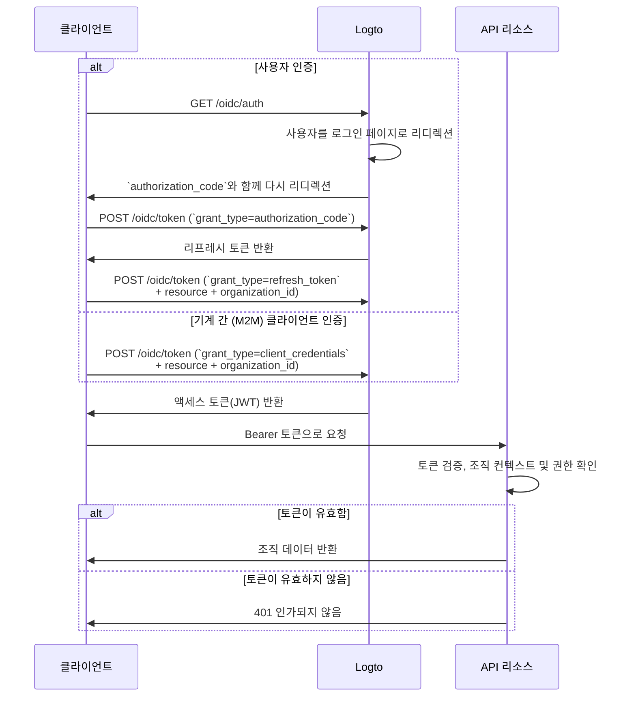

import illustration from '@site/docs/authorization/assets/rbac-organization-level-api-resources.png';
import AuthorizationRequestExample from '@site/docs/authorization/fragments/AuthorizationRequestExample';
import ClientCredentialsRequestExample from '@site/docs/authorization/fragments/ClientCredentialsRequestExample';
import TokenRequestExample from '@site/docs/authorization/fragments/TokenRequestExample';
import HandleUserPermissionChange from '@site/docs/authorization/fragments/_handle-user-permission-change.mdx';
import TabItem from '@theme/TabItem';
import Tabs from '@theme/Tabs';

import InspectOrganizationClaim from './fragments/_inspect-organization-claim.md';
import OrganizationTokenWarning from './fragments/_organization-token-warning.md';

# 조직 수준 API 리소스 보호하기

export const resource = 'https://api.your-app.com/organizations';

API 리소스와 조직 템플릿을 결합하여 각 조직 내에서 API 및 데이터 접근을 제한함으로써, SaaS에서 테넌트 수준의 격리를 보장하세요.

## 조직 수준 API 리소스란? \{#what-are-organization-level-api-resources}

조직 수준 API 리소스는 **특정 조직에 범위가 지정된** 애플리케이션의 엔드포인트 또는 서비스입니다. 이러한 API는 조직 컨텍스트에 따라 인가 (Authorization)와 접근을 강제하여, 사용자 또는 클라이언트가 자신의 조직과 관련된 데이터 및 작업만 접근할 수 있도록 보장합니다.

**사용 사례 예시**

- 조직 구성원, 역할 또는 설정을 관리하는 API (예: `/organizations/{organizationId}/members`)
- 조직 범위의 대시보드, 분석, 리포트
- 조직에 연결된 결제, 구독, 감사 엔드포인트
- 테넌트별로 작업과 데이터가 분리되어야 하는 모든 API

Logto는 OAuth 2.1 및 역할 기반 접근 제어 (RBAC)를 활용하여 이러한 조직 API를 안전하게 보호하며, 멀티 테넌트 SaaS 아키텍처를 지원합니다.

이러한 권한은 [조직 템플릿](/authorization/organization-template)에 정의된 **조직 역할**을 통해 관리됩니다. 모든 조직은 동일한 템플릿을 사용하므로, 모든 조직에 일관된 권한 모델이 적용됩니다.

## Logto에서의 동작 방식 \{#how-it-works-in-logto}

- **API 리소스와 권한은 전역적으로 등록됨:** 각 API 리소스는 Logto에서 고유한 리소스 지표 (URI)와 권한(스코프) 집합으로 정의됩니다.
- **조직 수준의 역할:** 조직 역할은 조직 템플릿에서 정의됩니다. API 리소스 권한(스코프)은 조직 역할에 할당되고, 각 조직 내의 사용자 또는 클라이언트에 할당됩니다.
- **컨텍스트 인식 인가:** 클라이언트가 API 리소스와 `organization_id`를 함께 포함하여 액세스 토큰을 요청하면, Logto는 조직 컨텍스트와 API 대상이 모두 포함된 토큰을 발급합니다. 토큰의 권한(스코프)은 지정된 조직에 대한 사용자의 조직 역할에 따라 결정됩니다.
- **전역 리소스와의 분리:** API 리소스는 조직 컨텍스트와 함께 또는 없이 접근할 수 있습니다. 조직 RBAC는 요청에 `organization_id`가 포함된 경우에만 적용됩니다. 모든 사용자에게 공유되는 API의 경우 [전역 API 리소스 보호하기](/authorization/global-api-resources)를 참고하세요.

### 구현 개요 \{#implementation-overview}

1. **API 리소스를 등록**하고, Logto에서 해당 권한(스코프)을 정의하세요.
2. **조직 역할을 정의**하고, 관련 API 권한을 할당하세요.
3. **각 조직 내에서 사용자 또는 클라이언트에 역할을 할당**하세요.
4. **API에 대한 액세스 토큰을 요청**할 때 `organization_id`를 포함하여 조직 컨텍스트를 추가하세요.
5. **API에서 액세스 토큰을 검증**하여 조직 컨텍스트와 권한을 모두 강제하세요.

### Logto의 조직 RBAC 적용 방식 \{#how-logto-applies-organization-rbac}

- `organization_id` 없이 액세스 토큰을 요청하면, 전역 역할/권한만 고려됩니다.
- `organization_id`와 함께 액세스 토큰을 요청하면, Logto는 해당 조직에 대한 사용자의 조직 역할과 연결된 권한을 평가합니다.
- 결과 JWT에는 API 대상(`aud` 클레임)과 조직 컨텍스트(`organization_id` 클레임)가 모두 포함되며, 스코프는 사용자의 조직 역할에 의해 부여된 권한으로 필터링됩니다.

### 인가 플로우: 조직 컨텍스트로 API 인증 및 보호하기 \{#authorization-flow-authenticating-and-securing-apis-with-organization-context}

다음 플로우는 클라이언트(웹, 모바일, 백엔드)가 조직 토큰을 획득하고, 조직 수준 API 리소스에 접근하는 과정을 보여줍니다.

이 플로우는 필수 파라미터나 헤더에 대한 모든 세부 정보를 포함하지 않으며, 핵심 단계에 초점을 맞추고 있습니다. 실제 동작 방식을 계속 읽어보세요.

_사용자 인증 = 브라우저/앱. M2M = 클라이언트 자격증명 + 조직 컨텍스트를 사용하는 백엔드 서비스 또는 스크립트._

## 구현 단계 \{#implementation-steps}

### API 리소스 등록하기 \{#register-your-api-resource}

1. <CloudLink to="/api-resources">콘솔 → API 리소스</CloudLink>로 이동하세요.
2. 새 API 리소스(예: `https://api.yourapp.com/org`)를 생성하고, 해당 권한(스코프)을 정의하세요.

전체 설정 방법은 [권한과 함께 API 리소스 정의하기](/authorization/role-based-access-control#define-api-resources-with-permissions)를 참고하세요.

### 조직 역할 설정하기 \{#set-up-organization-roles}

1. <CloudLink to="/organization-template/organization-roles">
     콘솔 → 조직 템플릿 → 조직 역할
   </CloudLink>
   로 이동하세요.
2. 조직 역할(예: `admin`, `member`)을 생성하고, 각 역할에 API 권한을 할당하세요.
3. 각 조직 내에서 사용자 또는 클라이언트에 역할을 할당하세요. 아직 멤버가 아니라면 초대하거나 먼저 추가하세요.

전체 설정 방법은 [조직 역할 사용하기](/authorization/role-based-access-control#configure-organization-roles)를 참고하세요.

### API 리소스를 위한 조직 토큰 획득하기 \{#obtain-organization-tokens-for-api-resources}

클라이언트/앱은 조직 수준 API에 접근하기 위해 `resource`와 `organization_id`를 모두 포함하여 토큰을 요청해야 합니다. Logto는 조직 토큰을 [JSON Web Token (JWT)](https://auth.wiki/jwt) 형태로 발급합니다. [리프레시 토큰 플로우](https://auth.wiki/refresh-token) 또는 [클라이언트 자격증명 플로우](https://auth.wiki/client-credentials-flow)를 사용할 수 있습니다.

#### 리프레시 토큰 플로우 \{#refresh-token-flow}

거의 모든 Logto 공식 SDK는 리프레시 토큰 플로우를 통해 조직 토큰 획득을 기본적으로 지원합니다. 표준 OAuth 2.0 / OIDC 클라이언트 라이브러리로도 이 플로우를 구현할 수 있습니다.

<Tabs groupId="user-client">
<TabItem value="logto-sdk" label="Logto SDK">

Logto SDK를 초기화할 때, `scopes` 파라미터에 `urn:logto:scope:organizations`와 원하는 조직 권한(스코프)을 추가하세요.

일부 Logto SDK에는 조직용 미리 정의된 스코프가 있습니다. 예를 들어 JavaScript SDK에서는 `UserScope.Organizations`가 있습니다.

<InspectOrganizationClaim />

`getAccessToken()`을 호출할 때, API 리소스(`resource`)와 조직 ID(`organizationId`)를 모두 지정하여 조직 토큰을 획득하세요.

각 SDK별 자세한 내용은 [빠른 시작](/quick-starts)을 참고하세요.

</TabItem>
<TabItem value="oauth-client" label="OAuth 2.0 / OIDC 클라이언트 라이브러리">

OAuth 2.0 클라이언트를 구성하거나 인가 코드 플로우를 초기화할 때, 다음 파라미터를 포함해야 합니다:

- `resource`: Logto에 등록된 API 리소스 식별자(예: `https://api.your-app.com/organizations`).
- `scope`: 미리 정의된 조직 스코프(`urn:logto:scope:organizations`), `offline_access`(리프레시 토큰 획득용), 그리고 필요한 API 권한(예: `manage:members view:analytics`)을 포함하세요.

일부 라이브러리는 `resource` 파라미터를 기본적으로 지원하지 않을 수 있지만, 일반적으로 인가 요청에 추가 파라미터를 전달할 수 있습니다. 자세한 내용은 라이브러리 문서를 참고하세요.

다음은 인가 요청 예시입니다:

<AuthorizationRequestExample
  resource={resource}
  scope="urn:logto:scope:organizations invite:member manage:billing"
/>

사용자가 인증되면 인가 코드를 받게 됩니다. 이 코드를 사용하여 Logto의 `/oidc/token` 엔드포인트에 POST 요청을 하세요.

다음은 토큰 요청 예시입니다:

<TokenRequestExample grantType="authorization_code" />

<OrganizationTokenWarning />

리프레시 토큰을 받게 되며, 이를 사용해 조직 토큰을 획득할 수 있습니다.

<InspectOrganizationClaim />

마지막으로, 리프레시 토큰을 사용하여 Logto의 `/oidc/token` 엔드포인트에 POST 요청을 통해 조직 토큰을 획득하세요. 다음을 반드시 포함하세요:

- `resource` 파라미터: API 리소스 식별자(예: `https://api.yourapp.com/org`)
- `organization_id` 파라미터: 원하는 조직 ID
- (선택) `scope` 파라미터: 필요한 권한만 추가로 지정(예: `manage:members view:reports`)

다음은 토큰 요청 예시입니다:

<TokenRequestExample
  grantType="refresh_token"
  resource={resource}
  organizationId="your-organization-id"
/>

</TabItem>
</Tabs>

#### 클라이언트 자격증명 플로우 \{#client-credentials-flow}

기계 간 (M2M) 시나리오에서는 클라이언트 자격증명 플로우를 사용하여 조직 수준 API 리소스 권한에 대한 액세스 토큰을 획득할 수 있습니다. Logto의 `/oidc/token` 엔드포인트에 조직 파라미터와 함께 POST 요청을 보내면, 클라이언트 ID와 시크릿으로 조직 토큰을 요청할 수 있습니다.

요청에 포함해야 할 주요 파라미터는 다음과 같습니다:

- `resource`: API 리소스 식별자(예: `https://api.yourapp.com/org`)
- `organization_id`: 토큰을 받고자 하는 조직의 ID
- `scope`: 요청할 조직 수준 API 리소스 권한(예: `invite:member`, `manage:billing`)

다음은 클라이언트 자격증명 grant 타입을 사용하는 토큰 요청 예시입니다:

<ClientCredentialsRequestExample
  resource="https://api.yourapp.com/org"
  organizationId="your-organization-id"
  scope="invite:member manage:billing"
/>

### 조직 토큰 검증하기 \{#validate-organization-tokens}

Logto가 발급한 조직 토큰(JWT)에는 API가 조직 수준 접근 제어를 강제할 수 있는 클레임이 포함되어 있습니다.

앱이 조직 토큰을 받으면 다음을 수행해야 합니다:

- 토큰 서명 검증(Logto의 JWKs 사용)
- 토큰 만료 여부 확인(`exp` 클레임)
- `iss`(발급자)가 Logto 엔드포인트와 일치하는지 확인
- `aud`(대상)이 등록한 API 리소스 식별자(예: `https://api.yourapp.com/org`)와 일치하는지 확인
- `organization_id` 클레임이 올바른 조직에 범위가 지정되어 있는지 확인
- `scope` 클레임(공백 구분)을 분리하여 필요한 권한이 포함되어 있는지 확인
- API 경로에 조직 ID가 포함되어 있다면(예: `/organizations/{organizationId}/members`), `organization_id` 클레임이 경로 파라미터와 일치하는지 확인

단계별 및 언어별 가이드는 [액세스 토큰 검증 방법](/authorization/validate-access-tokens)을 참고하세요.

<HandleUserPermissionChange type="organization" />

## 모범 사례 및 보안 팁 \{#best-practices-and-security-tips}

- **항상 조직 컨텍스트를 검증하세요:** 토큰만 신뢰하지 말고, 조직 범위 API 호출마다 `organization_id` 클레임을 확인하세요.
- **대상 제한 사용:** 항상 `aud` 클레임을 확인하여 토큰이 의도한 조직용인지 확인하세요.
- **비즈니스 중심의 권한 유지:** 실제 동작에 매핑되는 명확한 이름을 사용하고, 각 조직 역할에 필요한 권한만 부여하세요.
- **API와 비 API 권한을 분리**하세요(가능하다면, 단일 역할에 모두 포함할 수도 있습니다).
- **토큰 수명은 짧게 유지:** 토큰이 유출될 경우 위험을 줄입니다.
- **조직 템플릿을 정기적으로 검토:** 제품이 발전함에 따라 역할과 권한을 업데이트하세요.

## 자주 묻는 질문 \{#faqs}

### 토큰 요청에 `organization_id`를 포함하지 않으면 어떻게 되나요? \{#what-if-i-don-t-include-organization-id-in-my-token-request}

전역 역할/권한만 평가됩니다. 조직 RBAC는 적용되지 않습니다.

### 하나의 역할에 조직 및 비조직 권한을 혼합할 수 있나요? \{#can-i-mix-organization-and-non-organization-permissions-in-a-single-role}

아니요, 조직 권한(조직 수준 API 권한 포함)은 조직 템플릿에 의해 정의되며, 전역 API 권한과 혼합할 수 없습니다. 하지만, 조직 권한과 조직 수준 API 권한을 모두 포함하는 역할을 생성할 수는 있습니다.

## 추가 자료 \{#further-reading}

<Url href="/authorization/validate-access-tokens">액세스 토큰 검증 방법</Url>
<Url href="/developers/custom-token-claims">토큰 클레임 커스터마이징</Url>
<Url href="/use-cases/multi-tenancy/build-multi-tenant-saas-application">
  사용 사례: 멀티 테넌트 SaaS 애플리케이션 구축
</Url>
<Url href="https://www.rfc-editor.org/rfc/rfc8707.html">RFC 8707: 리소스 지표</Url>
