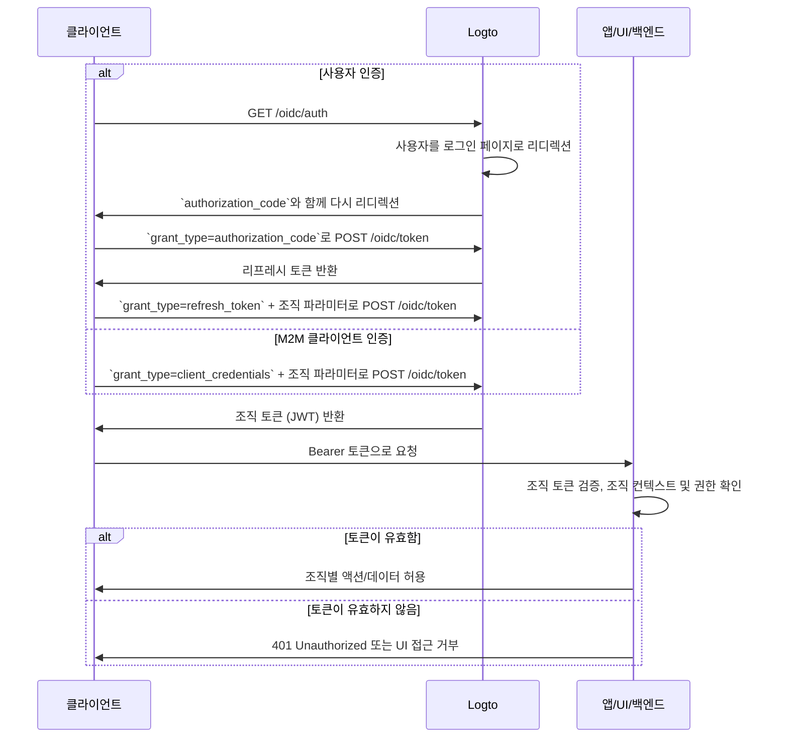

import illustration from '@site/docs/authorization/assets/rbac-organization-permissions.png';
import AuthorizationRequestExample from '@site/docs/authorization/fragments/AuthorizationRequestExample';
import ClientCredentialsRequestExample from '@site/docs/authorization/fragments/ClientCredentialsRequestExample';
import TokenRequestExample from '@site/docs/authorization/fragments/TokenRequestExample';
import TabItem from '@theme/TabItem';
import Tabs from '@theme/Tabs';

import InspectOrganizationClaim from './fragments/_inspect-organization-claim.md';
import OrganizationTokenWarning from './fragments/_organization-token-warning.md';

# 조직 (비 API) 권한 보호

조직 템플릿을 사용하여 Logto에서 조직 수준의 역할과 권한을 관리하고 적용하세요. 이를 통해 조직 컨텍스트 내에서 인앱 기능 및 워크플로우에 대한 접근을 제어할 수 있습니다.

## 조직 (비 API) 권한이란? \{#what-are-organization-non-api-permissions}

조직 권한(비 API)은 **조직 컨텍스트 내**에서 사용자가 무엇을 할 수 있는지 제어하지만, **API 수준에서 강제 적용되지는 않습니다**. 대신, 백엔드 API가 아닌 앱 기능, UI 요소, 워크플로우 또는 비즈니스 액션에 대한 접근을 관리합니다.

**사용 예시**

- 조직 내에서 멤버 초대 또는 관리
- 조직 역할 할당 또는 변경
- 조직의 결제, 설정, 관리 기능 관리
- API 엔드포인트가 없는 대시보드, 분석, 내부 도구 접근

Logto는 OAuth 2.1 및 역할 기반 접근 제어 (RBAC)를 사용하여 이러한 조직 권한을 안전하게 보호할 수 있으며, 다중 테넌트 SaaS 아키텍처도 지원합니다.

이러한 권한은 [조직 템플릿](/authorization/organization-template)에 정의된 **조직 역할**을 통해 관리됩니다. 모든 조직은 동일한 템플릿을 사용하므로, 모든 조직에서 일관된 권한 모델을 보장합니다.

## Logto에서의 동작 방식 \{#how-it-works-in-logto}

- **조직 수준 RBAC:** 역할과 권한은 조직 템플릿에서 정의됩니다. 사용자가 조직에 가입하면 하나 이상의 역할이 할당되어 특정 권한을 부여받습니다.
- **비 API 강제 적용:** 권한은 앱의 UI, 워크플로우 또는 백엔드 로직에서 확인 및 적용되며, 반드시 API 게이트웨이에서만 적용되는 것은 아닙니다.
- **API 보호와의 분리:** 조직(비 API) 권한은 API 리소스 권한과 구분됩니다. 두 가지를 조합하여 고급 시나리오를 구현할 수 있습니다.

  

### 구현 개요 \{#implementation-overview}

1. Logto의 조직 템플릿에서 **조직 권한을 정의**합니다.
2. 조직별 액션에 필요한 권한을 묶은 **조직 역할을 생성**합니다.
3. 각 조직 내 사용자 또는 클라이언트에 **역할을 할당**합니다.
4. **리프레시 토큰 또는 클라이언트 자격 증명 플로우**를 사용하여 현재 조직에 대한 **조직 토큰 (JWT)**을 획득합니다.
5. 앱의 UI 또는 백엔드에서 **액세스 토큰을 검증**하여 조직 권한을 적용합니다.

### 인가 플로우: 조직 권한 인증 및 보호 \{#authorization-flow-authenticating-and-securing-organization-permissions}

다음 플로우는 클라이언트(웹, 모바일, 백엔드)가 비 API 권한 적용을 위해 조직 토큰을 획득하고 사용하는 과정을 보여줍니다.

이 플로우는 필수 파라미터나 헤더에 대한 모든 세부 정보를 포함하지 않으며, 주요 단계에 초점을 맞추고 있습니다. 실제 동작 방식은 아래 내용을 계속 읽어보세요.

_사용자 인증 = 브라우저/앱. M2M = 클라이언트 자격 증명 + 조직 컨텍스트를 사용하는 백엔드 서비스 또는 스크립트._

## 구현 단계 \{#implementation-steps}

### 조직 권한 등록 \{#register-organization-permissions}

1. <CloudLink to="/organization-template/organization-permissions">
     콘솔 → 조직 템플릿 → 조직 권한
   </CloudLink>
   으로 이동하세요.
2. 필요한 조직 권한을 정의하세요 (예: `invite:member`, `manage:billing`, `view:analytics`).

전체 설정 단계는 [조직 권한 정의하기](/authorization/role-based-access-control#define-organization-permissions)를 참고하세요.

### 조직 역할 설정 \{#set-up-organization-roles}

1. <CloudLink to="/organization-template/organization-roles">
     콘솔 → 조직 템플릿 → 조직 역할
   </CloudLink>
   로 이동하세요.
2. 앞서 정의한 조직 권한을 묶은 역할을 생성하세요 (예: `admin`, `member`, `billing`).
3. 각 조직 내 사용자 또는 클라이언트에 이러한 역할을 할당하세요.

전체 설정 단계는 [조직 역할 사용하기](/authorization/role-based-access-control#configure-organization-roles)를 참고하세요.

### 조직 토큰(비 API) 획득 \{#obtain-organization-tokens-non-api}

클라이언트/앱은 조직 권한에 접근하기 위해 조직 토큰(비 API)을 획득해야 합니다. Logto는 조직 토큰을 [JSON Web Token (JWT)](https://auth.wiki/jwt) 형태로 발급합니다. [리프레시 토큰 플로우](https://auth.wiki/refresh-token) 또는 [클라이언트 자격 증명 플로우](https://auth.wiki/client-credentials-flow)를 통해 획득할 수 있습니다.

#### 리프레시 토큰 플로우 \{#refresh-token-flow}

거의 모든 Logto 공식 SDK는 리프레시 토큰 플로우를 통한 조직 토큰 획득을 기본 지원합니다. 표준 OAuth 2.0 / OIDC 클라이언트 라이브러리로도 구현할 수 있습니다.

<Tabs groupId="user-client">
<TabItem value="logto-sdk" label="Logto SDK">

Logto SDK를 초기화할 때, `scopes` 파라미터에 `urn:logto:scope:organizations`와 원하는 조직 권한(스코프)을 추가하세요.

일부 Logto SDK에는 조직용 미리 정의된 스코프가 있습니다. 예를 들어 JavaScript SDK의 `UserScope.Organizations` 등입니다.

<InspectOrganizationClaim />

특정 조직에 대한 조직 토큰을 요청하려면 `getOrganizationToken` 또는 유사한 메서드(예: 조직 ID와 함께 사용하는 `getAccessToken`)를 사용하세요.

각 SDK별 자세한 내용은 [빠른 시작](/quick-starts)을 참고하세요.

</TabItem>
<TabItem value="oauth-client" label="OAuth 2.0 / OIDC 클라이언트 라이브러리">

OAuth 2.0 클라이언트 설정 또는 인증 코드 플로우 초기화 시, 다음 파라미터를 반드시 포함하세요:

- `resource`: 조직 토큰을 요청하려면 `urn:logto:resource:organizations`로 설정
- `scope`: 미리 정의된 조직 스코프(`urn:logto:scope:organizations`), `offline_access`(리프레시 토큰 획득용), 그리고 필요한 조직 권한(예: `invite:member`, `manage:billing`) 포함

일부 라이브러리는 `resource` 파라미터를 기본 지원하지 않을 수 있지만, 보통 인증 요청에 추가 파라미터를 전달할 수 있습니다. 자세한 내용은 라이브러리 문서를 참고하세요.

다음은 인가 요청 예시입니다:

<AuthorizationRequestExample
  scope="urn:logto:scope:organizations invite:member manage:billing"
  resource="urn:logto:resource:organizations"
/>

사용자가 인증되면 인가 코드를 받게 됩니다. 이 코드를 사용하여 Logto의 `/oidc/token` 엔드포인트에 POST 요청을 하세요.

다음은 토큰 요청 예시입니다:

<TokenRequestExample grantType="authorization_code" />

<OrganizationTokenWarning />

리프레시 토큰을 받으면, 이를 사용해 조직 토큰을 획득할 수 있습니다.

<InspectOrganizationClaim />

마지막으로, 리프레시 토큰을 사용하여 Logto의 `/oidc/token` 엔드포인트에 POST 요청을 통해 조직 토큰을 획득하세요. 다음을 반드시 포함해야 합니다:

- 원하는 조직 ID로 설정된 `organization_id` 파라미터
- (선택) 필요한 권한만 요청하려면 `scope` 파라미터(예: `manage:members view:reports`)

다음은 토큰 요청 예시입니다:

<TokenRequestExample grantType="refresh_token" organizationId="your-organization-id" />

</TabItem>
</Tabs>

#### 클라이언트 자격 증명 플로우 \{#client-credentials-flow}

기계 간 (M2M) 시나리오에서는 클라이언트 자격 증명 플로우를 사용하여 조직 권한용 액세스 토큰을 획득할 수 있습니다. 조직 파라미터와 함께 Logto의 `/oidc/token` 엔드포인트에 POST 요청을 보내면, 클라이언트 ID와 시크릿으로 조직 토큰을 요청할 수 있습니다.

요청에 포함해야 할 주요 파라미터:

- `organization_id`: 토큰을 요청할 조직의 ID
- `scope`: 요청할 조직 권한(예: `invite:member`, `manage:billing`)

다음은 클라이언트 자격 증명 grant type을 사용하는 토큰 요청 예시입니다:

<ClientCredentialsRequestExample
  organizationId="your-organization-id"
  scope="invite:member manage:billing"
/>

### 조직 토큰 검증 \{#validate-organization-tokens}

Logto가 발급한 조직 토큰(JWT)에는 앱/UI/백엔드에서 조직 수준 접근 제어를 적용할 수 있는 클레임이 포함되어 있습니다.

앱이 조직 토큰을 받으면 다음을 수행해야 합니다:

- 토큰 서명 검증(Logto의 JWKs 사용)
- 토큰 만료 여부 확인(`exp` 클레임)
- `iss`(발급자)가 Logto 엔드포인트와 일치하는지 확인
- `aud`(대상)이 포맷된 조직 식별자(예: `urn:logto:organization:{organization_id}`)와 일치하는지 확인
- `scope` 클레임(공백 구분)을 분리하여 필요한 권한이 포함되어 있는지 확인

단계별 및 언어별 가이드는 [액세스 토큰 검증 방법](/authorization/validate-access-tokens)을 참고하세요.

## 모범 사례 및 보안 팁 \{#best-practices-and-security-tips}

- **UI 강제 적용만으로는 충분하지 않습니다:** 중요한 액션은 반드시 백엔드에서 권한을 검증하세요.
- **대상 제한 사용:** 항상 `aud` 클레임을 확인하여 토큰이 의도한 조직용인지 확인하세요.
- **비즈니스 중심 권한 사용:** 실제 액션에 매핑되는 명확한 이름을 사용하고, 각 조직 역할에 필요한 권한만 부여하세요.
- **API와 비 API 권한을 분리**하세요(단, 둘 다 하나의 역할에 포함될 수 있음).
- **제품이 발전함에 따라 조직 템플릿을 정기적으로 검토**하세요.

## 자주 묻는 질문 \{#faqs}

### 하나의 역할에 조직 및 비조직 권한을 혼합할 수 있나요? \{#can-i-mix-organization-and-non-organization-permissions-in-a-single-role}

아니요, 조직 권한(조직 수준 API 권한 포함)은 조직 템플릿에서 정의되며, 글로벌 API 권한과 혼합할 수 없습니다. 하지만 조직 권한과 조직 수준 API 권한을 모두 포함하는 역할은 생성할 수 있습니다.

### 비 API 권한은 어디에서 강제 적용해야 하나요? \{#where-should-i-enforce-non-api-permissions}

비 API 권한은 UI(기능 제한)와 서버 측 로직(민감한 액션)에 모두 확인하세요.

## 추가 자료 \{#further-reading}

<Url href="/authorization/validate-access-tokens">액세스 토큰 검증 방법</Url>
<Url href="/developers/custom-token-claims">토큰 클레임 커스터마이징</Url>
<Url href="/use-cases/multi-tenancy/build-multi-tenant-saas-application">
  사용 사례: 멀티 테넌트 SaaS 애플리케이션 구축
</Url>
