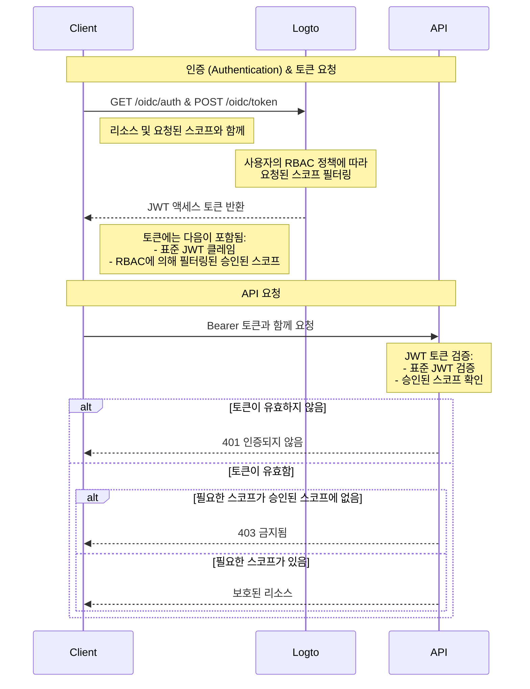

# RBAC로 API 리소스 보호하기

유효한 JWT가 존재하는지 확인하여 리소스를 보호하는 [API 보호](/authorization/api-resources/protect-your-api) 외에도, 역할 기반 접근 제어 (RBAC)를 적용할 수 있습니다.

이 글에서는 RBAC가 인증 흐름에서 스코프 위임 및 검증에 어떻게 영향을 미치는지에 중점을 둘 것입니다.

## 인가 흐름 다이어그램 \{#authorization-flow-diagram}



다이어그램에서 볼 수 있듯이, 기본 API 보호와의 주요 차이점은 스코프 처리입니다. 요청된 모든 스코프를 직접 승인하는 대신, Logto는 이제 사용자의 RBAC 정책에 따라 이를 필터링합니다. JWT 토큰에는 사용자가 역할을 통해 승인받은 스코프만 포함됩니다. API 측에서는 토큰의 진위 여부를 검증한 후, 요청된 리소스에 필요한 스코프가 토큰에 포함되어 있는지 추가로 확인합니다.

## 선택 사항: 사용자 권한 변경 처리 \{#optional-handle-user-permission-change}

사용자 권한은 세션 중에 변경될 수 있습니다. 예를 들어, 새로운 역할이 할당되거나 기존 역할 권한이 수정될 수 있습니다. 이러한 경우, 이러한 변경 사항을 감지하고 애플리케이션 UI를 업데이트해야 할 수 있습니다.

사용자의 권한이 변경되면 어떻게 될까요? 두 가지 경우가 있습니다.

### 시스템에 새로운 권한이 도입되지 않음 \{#no-new-permissions-introduced-into-the-system}

사용자의 권한이 변경된 후에도 현재 액세스 토큰은 만료될 때까지 유효합니다. 그러나 새로운 권한은 이후의 액세스 토큰에 반영되며, 취소된 권한은 생략됩니다.

다음은 **권장 조치**입니다:

**옵션 1: 짧은 액세스 토큰 만료 시간 사용**

단기 액세스 토큰은 사용자 권한을 더 자주 업데이트합니다. Console의 [API 리소스](/authorization/api-resources/#logto-api-resource-schema) 설정에서 토큰 만료 설정을 구성하세요. 단점은 토큰 사용량이 증가한다는 것입니다.

**옵션 2: 동적으로 권한 확인**

[Logto Management API](/integrate-logto/interact-with-management-api) 엔드포인트를 주기적으로 호출하거나 (예: SWR) WebSocket과 같은 기술을 사용하여 장기 연결을 구현하여 사용자 권한을 동적으로 가져옵니다. 변경 사항을 감지하면 기존 액세스 토큰을 지우고 새로 발급된 토큰에 자동으로 권한 스코프 변경 사항이 반영됩니다. - API: 사용자-역할 - API: 역할-권한

    권한 변경이 감지되면 먼저 저장소에서 액세스 토큰을 지우고, SDK 메서드 `getAccessToken()`을 호출하여 새 토큰을 획득합니다. 새로 발급된 액세스 토큰에는 권한 변경 사항이 반영되어야 합니다.

### 시스템에 새로운 권한이 도입되고 사용자에게 할당됨 \{#new-permission-is-introduced-into-the-system-and-assigned-to-a-user}

이 경우, 시스템에 새로운 권한이 도입됩니다. 이 경우, Logto 클라이언트를 초기화할 때 새로 도입된 권한 스코프를 포함해야 합니다. 예:

```tsx
new LogtoClient({
  appId: 'your-app-id',
  endpoint: 'your-logto-endpoint',
  resources: ['your-api-resource'],
  scopes: [
    // ... 기존 권한 스코프,
    'new-scope',
  ],
});
```

둘째로, 각 클라이언트 애플리케이션은 사용자에게 새로운 권한 변경 사항을 수신하기 위해 다시 동의하거나 다시 로그인해야 합니다. 그러면 새로운 권한 스코프가 새로운 액세스 토큰에 반영됩니다.

다시 동의에 대한 코드 예제:

```tsx
signIn({ redirectUri: 'your-redirect-url', prompt: 'consent' });
```

## 관련 리소스 \{#related-resources}

<Url href="https://blog.logto.io/logto-x-cloudflare-workers">
  Logto x Cloudflare Workers: 공개 액세스로부터 워커를 보호하는 방법?
</Url>

<Url href="https://blog.logto.io/secure-api-for-machine-to-machine">
  기계 간 통신을 위한 API 리소스를 보호하세요
</Url>
