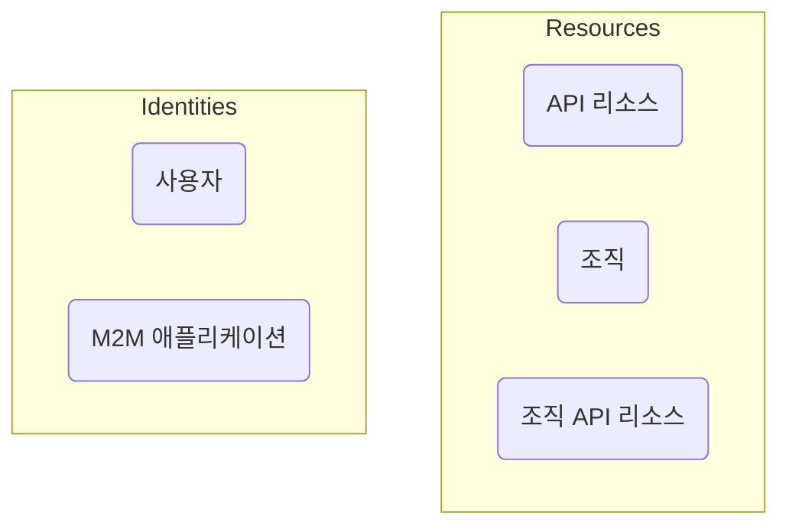

# 인증 (Authentication) vs. 인가 (Authorization)

**인증 (Authentication)**과 **인가 (Authorization)**의 차이는 다음과 같이 요약할 수 있습니다:

- **인증 (Authentication)**은 "어떤 아이덴티티를 소유하고 있습니까?"라는 질문에 답합니다.
- **인가 (Authorization)**는 "무엇을 할 수 있습니까?"라는 질문에 답합니다.

고객 아이덴티티 및 접근 관리 (CIAM)에 대한 완전한 소개는 우리의 CIAM 시리즈를 참조할 수 있습니다:

- [CIAM 101: 인증 (Authentication), 아이덴티티, SSO](https://blog.logto.io/ciam-101-intro-authn-sso/)
- [CIAM 102: 인가 (Authorization) & 역할 기반 접근 제어 (RBAC)](https://blog.logto.io/ciam-102-authz-and-rbac/)

## 인증 (Authentication) \{#authentication}

Logto는 다양한 상호작용 및 비상호작용 인증 방법을 지원합니다. 예를 들어:

- **로그인 경험**: 최종 사용자를 위한 인증 과정.
- **기계 간 (M2M) 인증**: 서비스 또는 애플리케이션을 위한 인증 과정.

인증의 궁극적인 목표는 매우 간단합니다: 엔티티 (Logto에서는 사용자 또는 애플리케이션)의 고유 식별자를 확인하고 얻는 것입니다.

## 인가 (Authorization) \{#authorization}

Logto에서 인가는 역할 기반 접근 제어 (RBAC)를 통해 이루어집니다. 이를 통해 사용자의 접근을 다음과 같이 완전히 관리할 수 있습니다:

- **API 리소스**: 절대 URI로 표현되는 글로벌 엔티티.
- **조직**: 사용자 또는 애플리케이션의 그룹.
- **조직 API 리소스**: 조직에 속한 API 리소스.

이 개념들에 대해 더 알고 싶다면 다음 리소스를 참조하세요:

- [역할 기반 접근 제어 (RBAC)](/authorization/role-based-access-control)
- [조직 (다중 테넌시)](/organizations)

다음은 이러한 개념들 간의 관계를 시각적으로 표현한 것입니다:

요약하자면, 인가는 "Identities" 그룹의 엔티티가 "Resources" 그룹의 엔티티에 접근할 수 있는지를 결정하는 규칙을 정의하는 것입니다.

## 자주 묻는 질문 \{#frequently-asked-questions}

### 애플리케이션에 로그인할 수 있는 사용자를 지정해야 합니다 \{#i-need-to-specify-which-users-can-sign-in-to-an-application}

싱글 사인온 (SSO)의 특성상, Logto는 현재 애플리케이션을 리소스로 사용하는 것을 지원하지 않습니다. 대신, API 리소스와 권한을 정의하여 리소스에 대한 접근을 제어할 수 있습니다.

### 사용자가 조직에 로그인해야 합니다 \{#i-need-my-users-to-sign-in-to-an-organization}

앞서 언급했듯이, 인증은 엔티티의 아이덴티티를 확인하는 것이며, 접근 제어는 인가를 통해 처리됩니다. 따라서:

- 사용자가 속한 조직을 결정하는 것은 인가 문제입니다.
- 로그인 과정은 인증 문제입니다.

이는 Logto에서 "조직에 로그인"하는 개념이 없음을 의미합니다. 사용자가 인증되면, 정의된 권한에 따라 모든 리소스 (조직 리소스를 포함)에 접근할 수 있도록 인가될 수 있습니다.

이 모델은 인증과 인가의 문제를 분리하여 효율적이고 명확합니다. GitHub 및 Notion과 같은 모든 현대 SaaS 애플리케이션은 이 모델을 따릅니다.

그러나 사용자 소스와 조직 간의 1-1 매핑을 설정해야 하는 경우가 있습니다. 이 경우, [엔터프라이즈 SSO](/end-user-flows/enterprise-sso) 및 [조직 Just-in-Time (JIT) 프로비저닝](/organizations/just-in-time-provisioning)이 도움이 될 수 있습니다.

### 고객이 로그인 페이지에 맞춤형 브랜딩이 필요합니다 \{#our-customers-need-custom-branding-for-their-sign-in-pages}

관련 설정에 대해서는 [앱별 브랜딩](/customization/match-your-brand/#app-specific-branding) 및 [조직별 브랜딩](/customization/match-your-brand/#organization-specific-branding)을 확인하세요.
