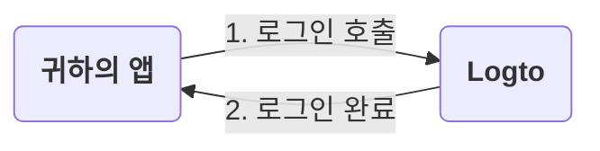
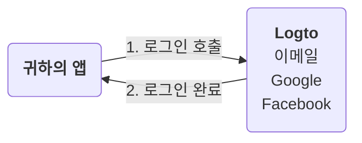
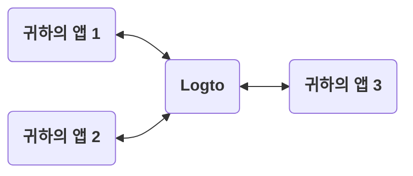
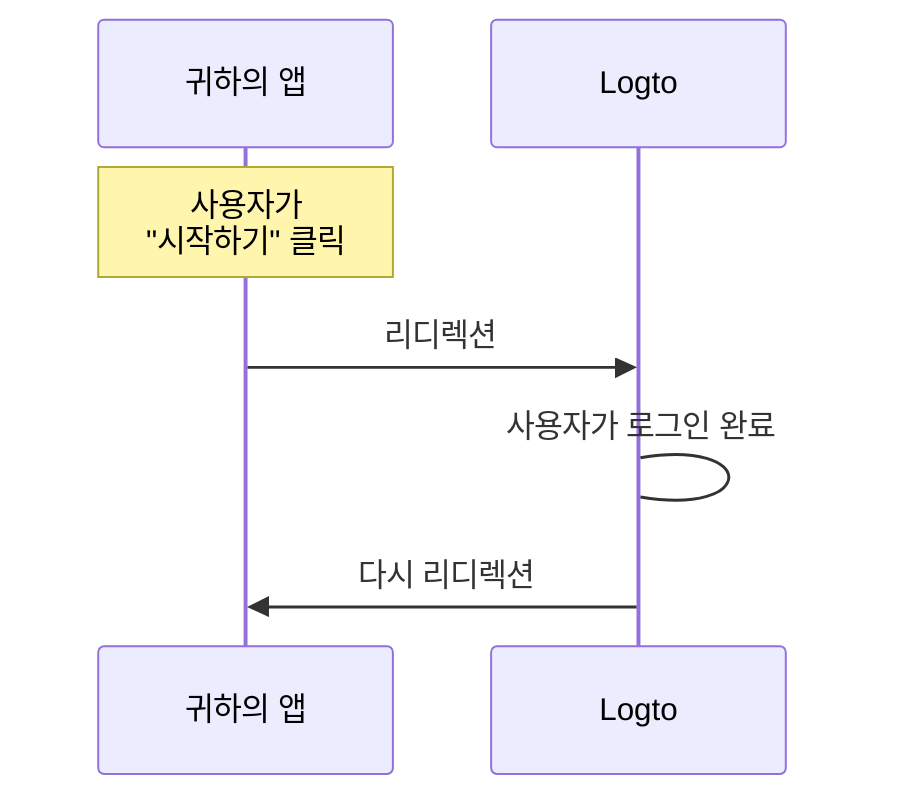
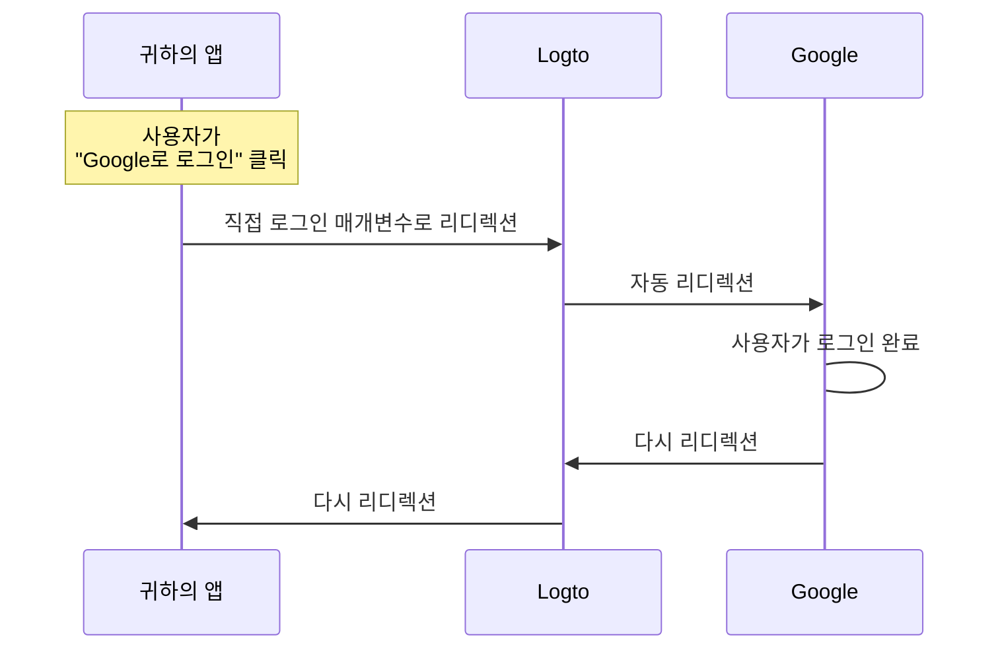

# 로그인 경험 설명

이 페이지에서는 Logto의 로그인 경험과 그 설계 이유를 설명합니다.

## 소개 \{#introduction}

로그인 경험은 Logto에서 사용자 인증 (Authentication) 과정입니다. 이 과정은 다음과 같이 간단히 설명할 수 있습니다:



1. 귀하의 앱이 로그인 메서드를 호출합니다.
2. 사용자는 Logto 로그인 페이지로 리디렉션됩니다. 네이티브 앱의 경우 시스템 브라우저가 열립니다.
3. 사용자가 로그인하고 귀하의 앱으로 다시 리디렉션됩니다 (Logto에서 "Redirect URI"로 구성됨).

과정은 간단하지만, 리디렉션 부분이 때때로 과도해 보일 수 있습니다. 그러나 이는 여러 가지 면에서 유익하고 안전할 수 있습니다. 다음 섹션에서 그 이유를 설명하겠습니다.

## 왜 리디렉션을 사용하는가? \{#why-redirect}

### 유연성 \{#flexibility}

리디렉션을 사용하면 인증 (Authentication) 과정을 앱과 분리할 수 있습니다. 비즈니스가 성장함에 따라 앱을 변경하지 않고도 동일한 인증 (Authentication) 과정을 유지할 수 있습니다. 예를 들어, 다단계 인증 (MFA)을 추가하거나 앱을 건드리지 않고 로그인 방법을 변경할 수 있습니다.



### 다중 앱 지원 \{#multi-app-support}

여러 앱이 있는 경우, 사용자는 한 번 로그인하면 다시 로그인하지 않고 모든 앱에 접근할 수 있습니다. 이는 SaaS 비즈니스나 여러 서비스를 제공하는 회사에 특히 유용합니다.



### 네이티브 앱 \{#native-apps}

네이티브 앱의 경우, 시스템 브라우저로 리디렉션하는 것은 사용자를 인증하는 안전한 방법이며 iOS와 Android 모두에 내장된 지원을 제공합니다.

- **iOS**: Apple은 안전한 인증을 위해 [ASWebAuthenticationSession](https://developer.apple.com/documentation/authenticationservices/aswebauthenticationsession)을 제공합니다.
- **Android**: Google은 원활한 경험을 위해 [Custom Tabs](https://developer.chrome.com/docs/android/custom-tabs)를 제공합니다.

### 보안 \{#security}

Logto는 [OpenID Connect (OIDC)](https://openid.net/specs/openid-connect-core-1_0.html) 제공자입니다. OIDC는 사용자 인증 (Authentication)을 위한 널리 채택된 표준입니다.

Logto는 [PKCE](https://tools.ietf.org/html/rfc7636)와 같은 엄격한 보안 조치를 시행하며, 암시적 흐름과 같은 안전하지 않은 흐름을 비활성화합니다. 리디렉션은 사용자를 안전하게 인증하는 방법이며 많은 일반적인 공격을 방지할 수 있습니다.

## 앱에서 일부 로그인 구성 요소를 표시해야 하는 경우 \{#what-if-i-need-to-show-some-sign-in-components-in-my-app}

때때로 팀에서 앱에 "Google로 로그인" 버튼과 같은 일부 로그인 구성 요소를 표시하고 싶을 수 있습니다. 이는 Logto의 "직접 로그인" 기능을 사용하여 달성할 수 있습니다.

### 어떻게 작동하나요? \{#how-does-it-work}

앱에 "시작하기"와 "Google로 로그인"이라는 두 개의 행동 유도 버튼이 있다고 가정해 봅시다. 이 버튼들은 다음과 같이 설계되었습니다:

- "시작하기": 일반 로그인 페이지로 리디렉션.
- "Google로 로그인": Google 로그인 페이지로 리디렉션.

두 작업 모두 로그인 과정을 완료하고 앱으로 다시 리디렉션해야 합니다.

---

#### "시작하기" 클릭 과정 \{#process-of-clicking-get-started}

이 경우, 로그인 경험은 기본 설정과 동일합니다. 사용자는 Logto 로그인 페이지로 리디렉션된 후 앱으로 다시 리디렉션됩니다.



:::note
Logto에서 소셜 로그인 방법 (예: Google, Facebook)을 구성한 경우, 사용자는 해당 로그인 페이지로 리디렉션될 수 있습니다. 그림에서는 간단함을 위해 일반적인 흐름만 보여줍니다.
:::

---

#### "Google로 로그인" 클릭 과정 \{#process-of-clicking-sign-in-with-google}

이 경우, 사용자는 Logto 로그인 페이지와 상호작용하지 않고 자동으로 Google 로그인 페이지로 리디렉션됩니다. 이 자동 리디렉션의 속도는 거의 즉각적이어서 사용자가 리디렉션을 인식하지 못할 수 있습니다.



---

요약하자면, 직접 로그인 기능은 보안 수준을 변경하지 않고 로그인 경험에서 일부 상호작용을 자동화하는 방법입니다.

### 앱에서 직접 로그인 사용 \{#use-direct-sign-in-in-your-app}

직접 로그인을 사용하려면 로그인 메서드를 호출할 때 `direct_sign_in` 매개변수를 전달해야 합니다. 값은 Logto가 인식하는 특정 형식으로 구성되어야 합니다. 예를 들어, Google로 로그인하려면 값이 `social:google`이어야 합니다.

일부 Logto 공식 SDK에서는 직접 로그인을 위한 전용 옵션이 있습니다. `@logto/client` JavaScript SDK에서 직접 로그인을 사용하는 예는 다음과 같습니다:

```ts
client.signIn({
  redirectUri: 'https://some-redirect-uri',
  directSignIn: { method: 'social', target: 'google' },
});
```

자세한 내용은 [직접 로그인](/end-user-flows/authentication-parameters/direct-sign-in)을 참조하세요.

:::info
이 기능은 모든 Logto 공식 SDK에 점진적으로 도입되고 있습니다. SDK에서 이 기능을 찾을 수 없는 경우, 언제든지 저희에게 문의해 주세요.
:::

## 사용자가 앱에서 자격 증명을 입력해야 하는 경우 \{#i-need-my-users-to-fill-in-their-credentials-in-my-app}

사용자가 Logto로 리디렉션되지 않고 앱에서 직접 자격 증명 (예: 이메일 및 비밀번호)을 입력해야 하는 경우, 현재로서는 도움을 드릴 수 없습니다. 과거에는 "리소스 소유자 비밀번호 자격 증명" 승인 방식이 있었지만, 이는 이제 안전하지 않은 것으로 간주되어 [OAuth 2.1에서 공식적으로 폐기되었습니다](https://datatracker.ietf.org/doc/html/draft-ietf-oauth-security-topics#name-resource-owner-password-cre).

ROPC 승인 유형의 보안 위험에 대해 더 알고 싶다면, 저희 블로그 게시물 [ROPC 승인 유형을 폐기해야 하는 이유](https://blog.logto.io/deprecated-ropc-grant-type/)를 확인하세요.

## 관련 리소스 \{#related-resources}

<Url href="https://blog.logto.io/oauth-2-1/">OAuth 2.1이 도착했습니다: 알아야 할 사항</Url>
<Url href="https://blog.logto.io/how-pkce-protects-the-authorization-code-flow-for-native-apps">
  PKCE란 무엇인가: 기본 개념부터 깊이 있는 이해까지
</Url>
