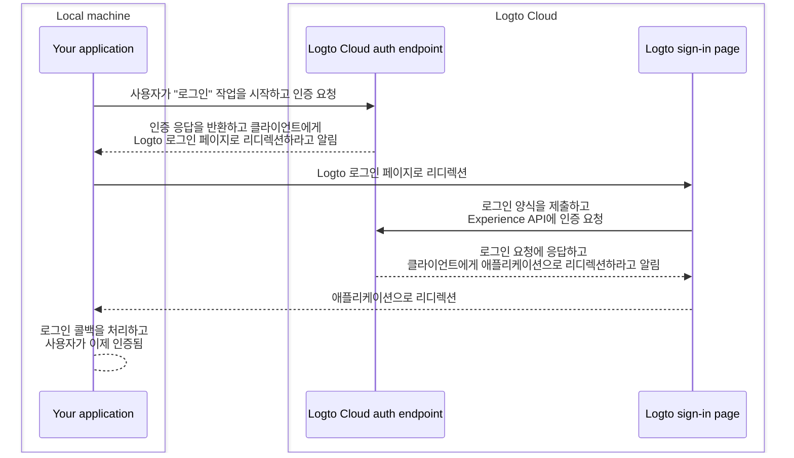
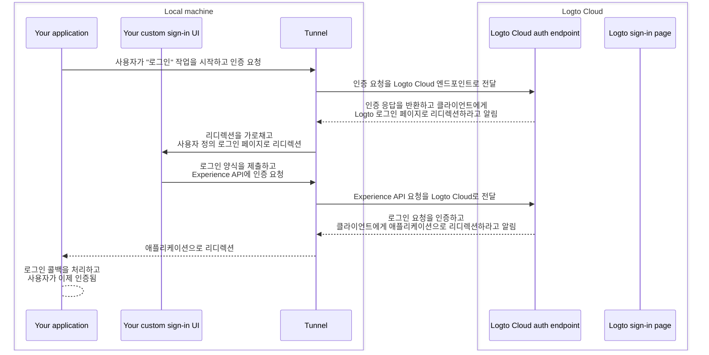

import TabItem from '@theme/TabItem';
import Tabs from '@theme/Tabs';

# 사용자 정의 UI를 로컬에서 디버그하고 테스트하세요

Logto Cloud 사용자에게는 "자신의 UI 가져오기"를 Logto에 쉽게 적용할 수 있도록 했습니다. Cloud 사용자는 이제 <CloudLink to="/sign-in-experience/branding">Console > Sign-in experience > Branding > Bring your UI</CloudLink>에서 사용자 정의 UI 자산을 포함한 zip 파일을 업로드할 수 있습니다 (자세한 내용은 [Bring your UI](/customization/bring-your-ui) 페이지를 참조하세요).

그러나 이러한 사용자 정의 UI 페이지를 개발할 때, 사용자는 Logto Cloud에 업로드하기 전에 코드를 로컬에서 테스트하고 디버그하고 싶어합니다. 이 CLI 명령은 로컬 터널을 설정하고 다음의 3가지 엔티티를 연결하는 데 도움을 줍니다: Logto Cloud 인증 엔드포인트, 애플리케이션, 사용자 정의 로그인 UI.

## 왜 이것이 필요한가요? \{#why-do-i-need-this}

기본적으로 애플리케이션에서 "로그인" 버튼을 클릭하면 Logto 엔드포인트에 구성된 로그인 페이지로 이동합니다. 성공적인 로그인 흐름은 다음과 같이 설명할 수 있습니다:



하지만 이제 사용자 정의 로그인 UI를 개발하고 있으므로, 로컬 머신에서 실행 중인 사용자 정의 로그인 UI 페이지로 이동할 방법이 필요합니다.
이를 위해서는 애플리케이션에서 나가는 요청을 가로채고 사용자 정의 로그인 UI 페이지로 리디렉션하는 로컬 터널 서비스가 필요합니다.

또한, [Logto의 Experience API](https://openapi.logto.io/group/endpoint-experience)와 상호작용하여 사용자를 인증하고 세션을 관리해야 합니다.
이 서비스는 또한 CORS 문제를 피하기 위해 이러한 Experience API 요청을 Logto Cloud로 전달하는 데 도움을 줄 것입니다.

아래의 시퀀스 다이어그램은 사용자 정의 UI와 터널 서비스가 있는 상태에서 성공적인 "로그인" 흐름이 어떻게 작동하는지를 보여줍니다:



터널 서비스가 있는 상태에서, 이제 사용자 정의 로그인 UI를 로컬에서 개발하고 테스트할 수 있으며, 변경할 때마다 Logto Cloud에 자산을 업로드할 필요가 없습니다.

## 지침 \{#instructions}

### 1단계: 명령 실행 \{#step-1-execute-the-command}

Cloud 테넌트 ID가 `foobar`이고, 로컬 개발 서버에서 `http://localhost:4000`에 사용자 정의 로그인 페이지가 실행 중이라고 가정하면, 다음과 같이 명령을 실행할 수 있습니다:

<Tabs groupId="cmd">

  <TabItem value="cli" label="CLI">

```bash
logto-tunnel -p 9000 --experience-uri http://localhost:4000/ --endpoint https://foobar.logto.app/
```

  </TabItem>
  <TabItem value="npx" label="npx">

```bash
npx @logto/tunnel -p 9000 --experience-uri http://localhost:4000/ --endpoint https://foobar.logto.app/
```

  </TabItem>

</Tabs>

Logto에서 사용자 정의 도메인을 구성한 경우에도 작동합니다:

<Tabs groupId="cmd">

  <TabItem value="cli" label="CLI">

```bash
logto-tunnel -p 9000 --experience-uri http://localhost:4000/ --endpoint https://your.custom.domain/
```

  </TabItem>
  <TabItem value="npx" label="npx">

```bash
npx @logto/tunnel -p 9000 --experience-uri http://localhost:4000/ --endpoint https://your.custom.domain/
```

  </TabItem>

</Tabs>

또한, 명령은 개발 서버에서 먼저 실행할 필요 없이 정적 html 자산도 지원합니다. 지정한 경로에 `index.html`이 있는지 확인하세요.

<Tabs groupId="cmd">

  <TabItem value="cli" label="CLI">

```bash
logto-tunnel -p 9000 --experience-path /path/to/your/static/files --endpoint https://foobar.logto.app/
```

  </TabItem>
  <TabItem value="npx" label="npx">

```bash
npx @logto/tunnel -p 9000 --experience-path /path/to/your/static/files --endpoint https://foobar.logto.app/
```

  </TabItem>

</Tabs>

### 2단계: 애플리케이션에서 엔드포인트 URI 업데이트 \{#step-2-update-endpoint-uri-in-your-application}

마지막으로, 애플리케이션을 실행하고 Logto 엔드포인트를 터널 서비스 주소 `http://localhost:9000/`로 설정하세요.

React 애플리케이션을 예로 들어보겠습니다:

```tsx title=App.tsx
import { LogtoProvider, LogtoConfig } from '@logto/react';

const config: LogtoConfig = {
  // endpoint: 'https://foobar.logto.app/', // 원래 Logto Cloud 엔드포인트
  endpoint: 'http://localhost:9000/', // 터널 서비스 주소
  appId: '<your-application-id>',
};

const App = () => (
  <LogtoProvider config={config}>
    <YourAppContent />
  </LogtoProvider>
);
```

소셜 로그인 기능을 사용하는 경우, 소셜 제공자 설정에서 리디렉션 URI도 터널 서비스 주소로 업데이트해야 합니다.

```
http://localhost:9000/callback/<connector-id>
```

모든 설정이 올바르게 완료되면, 애플리케이션에서 "로그인" 버튼을 클릭할 때 Logto의 기본 UI 대신 사용자 정의 로그인 페이지로 이동해야 하며, Logto Experience API와 추가로 상호작용할 수 있는 유효한 세션 (쿠키)도 함께 제공됩니다.

코딩을 즐기세요!

## 관련 리소스 \{#related-resources}

<Url href="https://blog.logto.io/automate-custom-sign-in-ui-deployment-with-github-actions">
  GitHub Actions 워크플로우로 사용자 정의 로그인 UI 배포 자동화
</Url>
