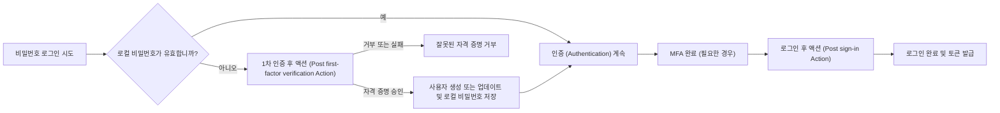

# 액션 (Actions)

Logto 액션 (Actions)을 사용하면 인증 (Authentication) 플로우의 특정 지점에서 신뢰할 수 있는 JavaScript를 실행할 수 있습니다. 액션은 동기적으로 실행됩니다: 인증 요청은 스크립트가 완료될 때까지 대기하며, 스크립트 결과로 사용자를 업데이트하거나 플로우의 계속 진행 여부를 결정할 수 있습니다.

액션은 인증 (Authentication) 플로우 내에서 반드시 결정을 내려야 할 때 유용합니다. 일반적인 사용 사례는 다음과 같습니다:

- 사용자가 처음 로그인할 때 레거시 아이덴티티 시스템에서 사용자 및 비밀번호를 마이그레이션합니다.
- Logto가 로그인을 완료하기 전에 사용자 프로필 또는 애플리케이션별 데이터를 새로 고칩니다.
- 외부 서비스를 호출하고 그 결과를 Logto 사용자에 적용합니다.

:::note
액션 (Actions)은 Logto Cloud 엔터프라이즈 플랜에서 제공됩니다.
:::

:::warning
액션 스크립트는 인증 (Authentication)에 영향을 주고 사용자 데이터를 수정할 수 있습니다. 신뢰할 수 있는 관리자만이 이를 조회, 생성, 편집, 테스트, 활성화 또는 삭제할 수 있어야 합니다.

셀프 호스팅 배포에서는 액션 스크립트가 Logto 서버 프로세스 내에서 해당 권한으로 실행됩니다. 스크립트 편집 또는 테스트 권한을 부여하는 것은 Logto 호스트에서 코드 실행 권한을 부여하는 것과 동일하므로, Admin Console은 신뢰할 수 없는 사용자와 공유해서는 안 됩니다. 스크립트는 신뢰할 수 있는 서버 측 코드로 취급해야 하며, 런타임은 스크립트의 시간과 메모리를 제한하지만, 신뢰할 수 없는 코드에 대한 보안 경계는 아닙니다.
:::

## 액션이 로그인에 어떻게 적용되는가 \{#how-actions-fit-into-sign-in}

Logto는 현재 두 가지 액션 타입을 제공합니다:



| 액션 타입                                                              | 실행 시점                                                                                                                   | 할 수 있는 일                                                                                                                                     |
| ---------------------------------------------------------------------- | --------------------------------------------------------------------------------------------------------------------------- | ------------------------------------------------------------------------------------------------------------------------------------------------- |
| [1차 인증 후 액션](/developers/actions/post-first-factor-verification) | 비밀번호 로그인 중, Logto의 로컬 비밀번호 검증이 실패한 경우에만 실행됩니다. 로컬 비밀번호가 유효할 때는 실행되지 않습니다. | 제출된 자격 증명을 레거시 시스템에서 검증한 후, 새로운 Logto 사용자를 생성하거나 기존 사용자를 업데이트하고 제출된 비밀번호를 마이그레이션합니다. |
| [로그인 후 액션](/developers/actions/post-sign-in)                     | 사용자가 모든 인증 요소(MFA 포함)를 완료한 후, Logto가 로그인을 완료하고 토큰을 발급하기 전에 실행됩니다.                   | 최종 로그인 컨텍스트를 사용하여 기존 Logto 사용자를 업데이트 및 확장합니다.                                                                       |

두 액션 타입 모두 Experience API의 `SignIn` 상호작용에만 적용됩니다. 1차 인증 후 액션은 비밀번호 로그인에만 적용되며, 로그인 후 액션은 인증 방식과 무관하게 동작합니다.

## 스크립트 모델 \{#script-model}

각 액션 타입은 하나의 설정과 `runAction`이라는 JavaScript 엔트리 함수를 가집니다:

```js
const runAction = async ({ event, environmentVariables = {} }) => {
  // 이벤트를 확인하고, 필요하다면 외부 데이터를 가져와서
  // 이 액션 타입이 지원하는 결과를 반환합니다.
};
```

페이로드에는 다음이 포함됩니다:

- `event`: 실제 인증 (Authentication) 이벤트. 형태는 액션 타입에 따라 다릅니다.
- `environmentVariables`: 이 액션에 대해 설정된 문자열 값들. 이 값들은 함수 페이로드를 통해 전달되며, `process.env`로는 접근할 수 없습니다.

에디터는 타입 정보를 제공하지만, 저장된 스크립트는 JavaScript로 실행됩니다. 스크립트는 비동기일 수 있으며, Logto Cloud와 셀프 호스팅 Logto 모두에서 다음 표준 Web API를 사용할 수 있습니다:

- `fetch`, `Request`, `Response`, `Headers`
- Web Crypto: `crypto`, `crypto.subtle`
- `TextEncoder`, `TextDecoder`
- `URL`, `URLSearchParams`

스크립트는 패키지를 import할 수 없습니다. Node.js 전용 글로벌 객체나 모듈은 셀프 호스팅 Logto와 Logto Cloud 간에 호환되지 않으며, 지원되는 스크립트 계약의 일부가 아니므로 사용을 피하세요.

지원되는 결과는 액션 타입마다 다르므로, 액션을 활성화하기 전에 해당 참조 페이지를 확인하세요.

## 액션과 Webhook \{#actions-and-webhooks}

액션과 [Webhook](/developers/webhooks)은 목적이 다릅니다:

|                              | 액션 (Actions)                                   | Webhook                                                     |
| ---------------------------- | ------------------------------------------------ | ----------------------------------------------------------- |
| 실행 방식                    | 인증 (Authentication)과 동기적, 인라인 실행      | 인증 요청 외부에서 비동기적으로 실행                        |
| 현재 인증 플로우에 영향 가능 | 예                                               | 아니오                                                      |
| 결과로 사용자 수정 가능      | 예, 지원되는 사용자 패치 사용                    | 직접적으로는 불가; 수신자가 별도로 Management API 호출 필요 |
| 이벤트 범위                  | 선택된 인증 (Authentication) 지점                | 다양한 상호작용 및 데이터 변경 이벤트                       |
| 일반적 사용                  | 자격 증명 마이그레이션, 토큰 발급 전 프로필 확장 | 알림, 하위 시스템 동기화, 분석                              |

비동기 작업은 Webhook에 맡기세요. 인증 (Authentication) 진행 전에 Logto가 결과를 필요로 할 때만 액션을 사용하세요.

## 다음 단계 \{#next-steps}

- [액션 구성 및 테스트](/developers/actions/configure-and-test-actions)
- [비밀번호 로그인 시 사용자 마이그레이션](/developers/actions/post-first-factor-verification)
- [로그인 후 사용자 확장](/developers/actions/post-sign-in)
