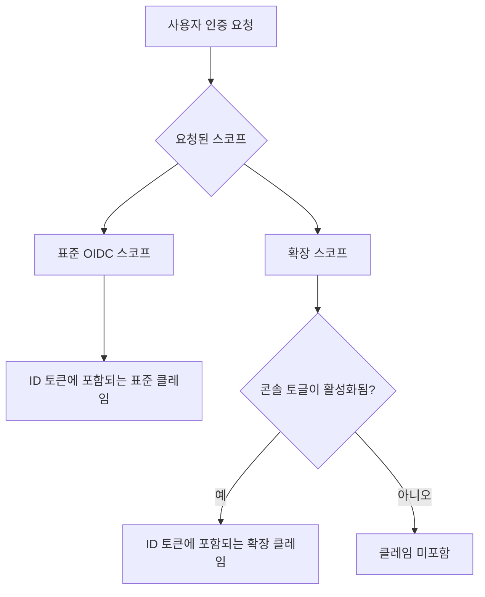

# 커스텀 ID 토큰

## 소개 \{#introduction}

[ID 토큰](https://auth.wiki/id-token)은 [OpenID Connect (OIDC)](https://auth.wiki/openid-connect) 프로토콜에 의해 정의된 특별한 유형의 토큰입니다. 이는 사용자가 성공적으로 인증된 후 인가 서버 (Logto)에서 발급하는 아이덴티티 주장으로, 인증된 사용자의 아이덴티티에 대한 클레임 (Claim)을 담고 있습니다.

[액세스 토큰](/developers/custom-token-claims)이 보호된 리소스에 접근하는 데 사용되는 것과 달리, ID 토큰은 인증된 사용자 아이덴티티를 클라이언트 애플리케이션에 전달하도록 특별히 설계되었습니다. 이들은 인증 이벤트와 인증된 사용자에 대한 클레임 (Claim)을 포함하는 [JSON Web Token (JWT)](https://auth.wiki/jwt)입니다.

## ID 토큰 클레임 (Claim)의 동작 방식 \{#how-id-token-claims-work}

Logto에서 ID 토큰의 클레임 (Claim)은 두 가지 범주로 나뉩니다:

1. **표준 OIDC 클레임 (Claim)**: OIDC 명세에 의해 정의되며, 인증 시 요청된 스코프 (Scope)에 의해 전적으로 결정됩니다.
2. **확장 클레임 (Claim)**: Logto가 추가 아이덴티티 정보를 전달하기 위해 확장한 클레임 (Claim)으로, **이중 조건 모델**(스코프 + 토글)에 의해 제어됩니다.

## 표준 OIDC 클레임 (Claim) \{#standard-oidc-claims}

표준 클레임 (Claim)은 OIDC 명세에 의해 완전히 관리됩니다. 이들이 ID 토큰에 포함되는지는 인증 시 애플리케이션이 요청하는 스코프 (Scope)에만 의존합니다. Logto는 개별 표준 클레임 (Claim)을 비활성화하거나 선택적으로 제외하는 옵션을 제공하지 않습니다.

다음 표는 표준 스코프와 해당 클레임 (Claim) 간의 매핑을 보여줍니다:

| Scope     | Claims (클레임)                                                                                                                                                                  |
| --------- | -------------------------------------------------------------------------------------------------------------------------------------------------------------------------------- |
| `openid`  | `sub`                                                                                                                                                                            |
| `profile` | `name`, `family_name`, `given_name`, `middle_name`, `nickname`, `preferred_username`, `profile`, `picture`, `website`, `gender`, `birthdate`, `zoneinfo`, `locale`, `updated_at` |
| `email`   | `email`, `email_verified`                                                                                                                                                        |
| `phone`   | `phone_number`, `phone_number_verified`                                                                                                                                          |
| `address` | `address`                                                                                                                                                                        |

예를 들어, 애플리케이션이 `openid profile email` 스코프를 요청하면, ID 토큰에는 `openid`, `profile`, `email` 스코프의 모든 클레임 (Claim)이 포함됩니다.

## 확장 클레임 (Claim) \{#extended-claims}

표준 OIDC 클레임 (Claim) 외에도, Logto는 Logto 생태계에 특화된 아이덴티티 정보를 담는 추가 클레임 (Claim)을 확장합니다. 이러한 확장 클레임 (Claim)은 **이중 조건 모델**을 따라 ID 토큰에 포함됩니다:

1. **스코프 조건**: 애플리케이션이 인증 시 해당 스코프를 요청해야 합니다.
2. **콘솔 토글**: 관리자가 Logto 콘솔에서 해당 클레임 (Claim)의 ID 토큰 포함을 활성화해야 합니다.

두 조건이 모두 동시에 충족되어야 합니다. 스코프는 프로토콜 계층의 접근 선언 역할을 하며, 토글은 제품 계층의 노출 제어 역할을 합니다 — 각자의 책임이 명확하고 대체 불가능합니다.

### 사용 가능한 확장 스코프 및 클레임 (Claim) \{#available-extended-scopes-and-claims}

| Scope                                | Claims (클레임)                | 설명                                   | 기본 포함 여부 |
| ------------------------------------ | ------------------------------ | -------------------------------------- | -------------- |
| `custom_data`                        | `custom_data`                  | 사용자 객체에 저장된 커스텀 데이터     |                |
| `identities`                         | `identities`, `sso_identities` | 사용자의 연결된 소셜 및 SSO 아이덴티티 |                |
| `roles`                              | `roles`                        | 사용자의 할당된 역할 (Role)            | ✅             |
| `urn:logto:scope:organizations`      | `organizations`                | 사용자의 조직 (Organization) ID        | ✅             |
| `urn:logto:scope:organizations`      | `organization_data`            | 사용자의 조직 (Organization) 데이터    |                |
| `urn:logto:scope:organization_roles` | `organization_roles`           | 사용자의 조직 역할 (Role) 할당         | ✅             |

### Logto 콘솔에서 설정하기 \{#configure-in-logto-console}

ID 토큰에 확장 클레임 (Claim)을 활성화하려면:

1. <CloudLink to="/customize-jwt">콘솔 > 커스텀 JWT</CloudLink>로 이동하세요.
2. ID 토큰에 포함하고자 하는 클레임 (Claim)을 토글로 켜세요.
3. 애플리케이션이 인증 시 해당 스코프를 요청하는지 확인하세요.

## 관련 리소스 \{#related-resources}

<Url href="/developers/custom-token-claims">커스텀 액세스 토큰</Url>

<Url href="https://openid.net/specs/openid-connect-core-1_0.html#IDToken">
  OpenID Connect Core - ID Token
</Url>
