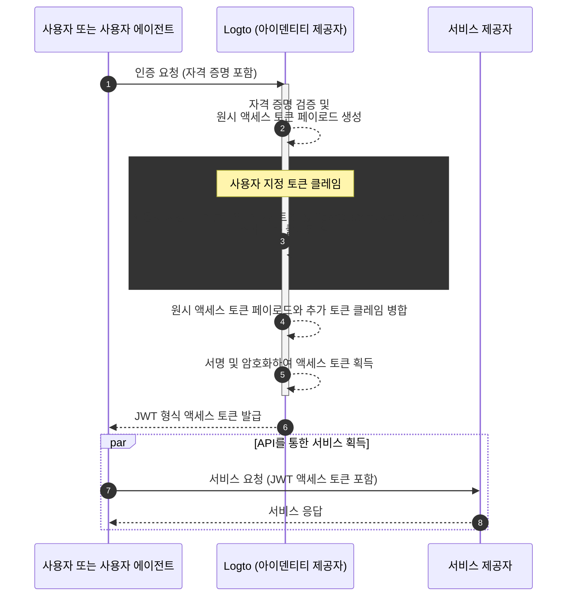

# 사용자 지정 토큰 클레임

## 소개 \{#introduction}

[액세스 토큰](https://auth.wiki/access-token)은 인증 (Authentication) 및 인가 (Authorization) 과정에서 중요한 역할을 하며, 주체의 아이덴티티 정보와 권한을 담고 [Logto 서버](/concepts/core-service) (인증 서버 또는 아이덴티티 제공자, IdP 역할), 웹 서비스 서버 (리소스 제공자), 클라이언트 애플리케이션 (클라이언트) 간에 전달됩니다.

[토큰 클레임](https://auth.wiki/claim)은 엔티티 또는 토큰 자체에 대한 정보를 제공하는 키-값 쌍입니다. 클레임에는 사용자 정보, 토큰 만료 시간, 권한 및 인증 (Authentication) 및 인가 (Authorization) 과정과 관련된 기타 메타데이터가 포함될 수 있습니다.

Logto에는 두 가지 유형의 액세스 토큰이 있습니다:

- **JSON Web Token:** [JSON Web Token (JWT)](https://auth.wiki/jwt)은 클레임을 안전하고 클라이언트가 읽을 수 있는 방식으로 인코딩하는 인기 있는 형식입니다. `sub`, `iss`, `aud` 등과 같은 일반적인 클레임은 OAuth 2.0 프로토콜에 따라 사용됩니다 (자세한 내용은 [이 링크](https://datatracker.ietf.org/doc/html/rfc7519#section-4)를 참조하세요). JWT 토큰은 소비자가 추가 검증 단계 없이 직접 클레임에 접근할 수 있도록 합니다. Logto에서는 특정 리소스 또는 조직의 인가 요청을 초기화할 때 기본적으로 JWT 형식으로 액세스 토큰이 발급됩니다.
- **불투명 토큰:** [불투명 토큰](http://localhost:3000/concepts/opaque-token)은 자체 포함되지 않으며 항상 [토큰 인트로스펙션](https://auth.wiki/token-introspection) 엔드포인트를 통한 추가 검증 단계가 필요합니다. 불투명한 형식에도 불구하고, 불투명 토큰은 클레임을 얻고 당사자 간에 안전하게 전송하는 데 도움이 될 수 있습니다. 토큰 클레임은 Logto 서버에 안전하게 저장되며, 클라이언트 애플리케이션은 토큰 인트로스펙션 엔드포인트를 통해 접근할 수 있습니다. 인가 요청에 특정 리소스나 조직이 포함되지 않은 경우 불투명 형식으로 액세스 토큰이 발급됩니다. 이러한 토큰은 주로 OIDC `userinfo` 엔드포인트 및 기타 일반적인 목적에 사용됩니다.

많은 경우, 표준 클레임은 JWT 또는 불투명 토큰을 사용하는 애플리케이션의 특정 요구를 충족하기에 충분하지 않습니다. 이를 해결하기 위해 Logto는 액세스 토큰 내에 사용자 지정 클레임을 추가할 수 있는 유연성을 제공합니다. 이 기능을 통해 비즈니스 로직에 필요한 추가 정보를 포함할 수 있으며, 불투명 토큰의 경우 인트로스펙션을 통해 안전하게 전송되고 검색할 수 있습니다.

## 사용자 지정 토큰 클레임은 어떻게 작동하나요? \{#how-do-custom-token-claims-work}

Logto는 `getCustomJwtClaims` 콜백 함수를 통해 `액세스 토큰`에 사용자 지정 클레임을 삽입할 수 있도록 합니다. `getCustomJwtClaims` 함수의 구현을 제공하여 사용자 지정 클레임 객체를 반환할 수 있습니다. 반환 값은 원래 토큰 페이로드와 병합되어 최종 액세스 토큰을 생성하기 위해 서명됩니다.

:::warning
Logto 내장 토큰 클레임은 덮어쓰거나 수정할 수 없습니다. 사용자 지정 클레임은 추가 클레임으로 토큰에 추가됩니다. 내장 클레임과 충돌하는 사용자 지정 클레임이 있는 경우, 해당 사용자 지정 클레임은 무시됩니다.
:::

## 관련 리소스 \{#related-resources}

<Url href="https://blog.logto.io/glance-on-custom-jwt-access-token-claims">
  Logto로 JWT 액세스 토큰에 사용자 지정 클레임을 추가하여 인가를 강화하세요
</Url>
