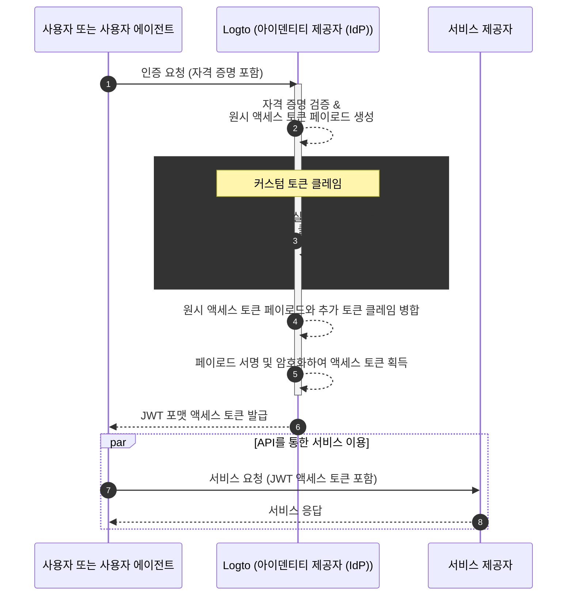

# 커스텀 토큰 클레임 (Custom token claims)

Logto는 액세스 토큰 (액세스 토큰 (Access token), JWT / 불투명 토큰 (Opaque token)) 내에 커스텀 클레임을 추가할 수 있는 유연성을 제공합니다. 이 기능을 통해 비즈니스 로직에 필요한 추가 정보를 토큰에 안전하게 포함시킬 수 있으며, 불투명 토큰의 경우 introspection을 통해 조회할 수 있습니다.

## 소개 \{#introduction}

[액세스 토큰 (Access tokens)](https://auth.wiki/access-token)은 인증 (Authentication) 및 인가 (Authorization) 과정에서 중요한 역할을 하며, 주체의 아이덴티티 정보와 권한을 담아 [Logto 서버](/concepts/core-service) (인증 서버 또는 아이덴티티 제공자 (IdP) 역할), 웹 서비스 서버 (리소스 제공자), 클라이언트 애플리케이션 (클라이언트) 간에 전달됩니다.

[토큰 클레임 (Token claims)](https://auth.wiki/claim)은 엔티티 또는 토큰 자체에 대한 정보를 제공하는 키-값 쌍입니다. 클레임에는 사용자 정보, 토큰 만료 시간, 권한, 그리고 인증 (Authentication) 및 인가 (Authorization) 과정과 관련된 기타 메타데이터가 포함될 수 있습니다.

Logto에는 두 가지 유형의 액세스 토큰이 있습니다:

- **JSON Web Token:** [JSON Web Token (JWT)](https://auth.wiki/jwt)은 클레임을 안전하면서도 클라이언트가 읽을 수 있는 방식으로 인코딩하는 인기 있는 포맷입니다. `sub`, `iss`, `aud` 등과 같은 일반적인 클레임은 OAuth 2.0 프로토콜에 따라 사용됩니다 ([자세한 내용은 이 링크](https://datatracker.ietf.org/doc/html/rfc7519#section-4) 참조). JWT는 소비자가 추가 검증 없이 클레임에 직접 접근할 수 있도록 합니다. Logto에서는 특정 리소스 또는 조직에 대한 인가 요청을 클라이언트가 시작할 때 기본적으로 JWT 포맷의 액세스 토큰이 발급됩니다.
- **불투명 토큰 (Opaque token):** [불투명 토큰 (Opaque token)](http://localhost:3000/concepts/opaque-token)은 자체적으로 정보를 담고 있지 않으며, 항상 [토큰 인트로스펙션 (token introspection)](https://auth.wiki/token-introspection) 엔드포인트를 통한 추가 검증이 필요합니다. 불투명한 포맷임에도 불구하고, 불투명 토큰은 클레임을 안전하게 전달하고, 당사자 간에 안전하게 전송될 수 있습니다. 토큰 클레임은 Logto 서버에 안전하게 저장되며, 클라이언트 애플리케이션은 토큰 인트로스펙션 엔드포인트를 통해 접근할 수 있습니다. 인가 요청에 특정 리소스나 조직이 포함되지 않은 경우, 액세스 토큰은 불투명 포맷으로 발급됩니다. 이 토큰들은 주로 OIDC `userinfo` 엔드포인트 접근 및 기타 일반적인 용도로 사용됩니다.

많은 경우, 표준 클레임만으로는 애플리케이션의 특정 요구를 충족할 수 없습니다. JWT 또는 불투명 토큰을 사용하든 관계없이 마찬가지입니다. 이를 해결하기 위해 Logto는 액세스 토큰 내에 커스텀 클레임을 추가할 수 있는 유연성을 제공합니다. 이 기능을 통해 비즈니스 로직에 필요한 추가 정보를 토큰에 안전하게 포함시킬 수 있으며, 불투명 토큰의 경우 introspection을 통해 조회할 수 있습니다.

## 커스텀 토큰 클레임은 어떻게 동작하나요? \{#how-do-custom-token-claims-work}

Logto는 콜백 함수 `getCustomJwtClaims`를 통해 `액세스 토큰 (Access token)`에 커스텀 클레임을 삽입할 수 있도록 지원합니다. `getCustomJwtClaims` 함수의 구현을 제공하여 커스텀 클레임 객체를 반환할 수 있습니다. 반환 값은 원래 토큰 페이로드와 병합되어 서명되어 최종 액세스 토큰이 생성됩니다.

:::warning
Logto 내장 토큰 클레임은 덮어쓰거나 수정할 수 없습니다. 커스텀 클레임은 추가 클레임으로 토큰에 포함됩니다. 만약 커스텀 클레임이 내장 클레임과 충돌할 경우, 해당 커스텀 클레임은 무시됩니다.
:::

## 관련 리소스 \{#related-resources}

<Url href="https://blog.logto.io/glance-on-custom-jwt-access-token-claims">
  Logto로 JWT 액세스 토큰에 커스텀 클레임을 추가하여 인가 (Authorization)를 강화하세요
</Url>
