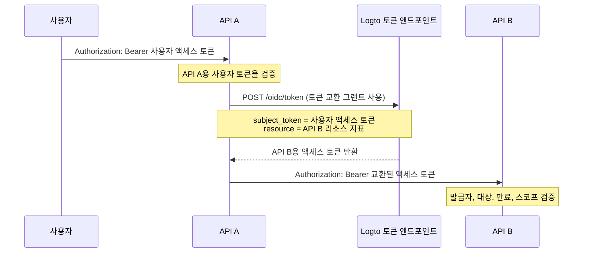

import TokenExchangePrerequisites from './fragments/_token-exchange-prerequisites.mdx';

# 서비스 간 위임

일부 API 아키텍처에서는 백엔드 서비스가 로그인한 사용자로부터 요청을 받고, 사용자의 아이덴티티를 유지한 채로 다른 백엔드 서비스를 호출해야 할 때가 있습니다.

예시:

```text
User -> API A -> API B
```

API B는 두 가지를 알아야 합니다:

1. 호출자가 신뢰할 수 있는 서비스(예: API A)임을 확인해야 합니다.
2. 해당 작업이 원래 사용자에 대해 수행되고 있음을 알아야 합니다.

Logto의 토큰 교환 그랜트(token exchange grant)를 사용하여 사용자의 액세스 토큰을 다운스트림 API 리소스를 대상으로 하는 새로운 액세스 토큰으로 교환하세요. 이는 OAuth 2.0 토큰 교환 패턴을 따르며, 원래 사용자 토큰을 다운스트림 서비스로 전달하는 것을 방지합니다.

## 이 플로우를 사용할 때 \{#when-to-use-this-flow}

서비스 간 위임은 다음과 같은 경우에 사용하세요:

- API A가 Logto의 토큰 엔드포인트에 안전하게 인증할 수 있는 백엔드 서비스일 때.
- API A가 Logto에서 발급한 사용자 액세스 토큰을 받을 때.
- API A가 동일한 사용자를 대신하여 API B를 호출해야 할 때.
- API B가 자신의 API 리소스를 대상으로 하는 하나의 액세스 토큰을 검증해야 할 때.

사용자가 없는 순수 기계 간(M2M) 접근에는 이 플로우를 사용하지 마세요. 이 경우 [클라이언트 크리덴셜 플로우](/quick-starts/m2m)를 사용하세요. 한 사용자가 일시적으로 다른 사용자를 대신하는 지원, 관리자, 에이전트 시나리오에는 [사용자 가장](/developers/user-impersonation)을 사용하세요.

## 작동 방식 \{#how-it-works}



교환된 액세스 토큰은 원래 사용자(`sub`)를 나타내며, 다운스트림 API 리소스(`aud`)에 바인딩됩니다. 다운스트림 API는 `client_id` 클레임을 확인하여 교환을 시작한 애플리케이션을 식별할 수도 있습니다.

## 사전 준비 사항 \{#prerequisites}

1. 관련 서비스에 대한 API 리소스를 생성하세요. [글로벌 API 리소스 보호하기](/authorization/global-api-resources) 참고.
2. API B의 권한을 구성하고, 역할 또는 조직 역할을 통해 사용자에게 할당하세요.
3. API A는 서버 측 애플리케이션(기계 간 앱 또는 전통적인 웹 앱 등)이어야 하며, 앱 시크릿으로 안전하게 인증할 수 있어야 합니다.
4. API A 애플리케이션에 토큰 교환을 활성화하세요.

<TokenExchangePrerequisites />

## 다운스트림 API용 액세스 토큰 요청하기 \{#request-an-access-token-for-the-downstream-api}

API A가 API B를 호출해야 할 때, Logto의 [토큰 엔드포인트](/integrate-logto/application-data-structure#token-endpoint)에 토큰 교환 요청을 하세요.

전통적인 웹 애플리케이션 또는 앱 시크릿이 있는 기계 간 애플리케이션의 경우, 크리덴셜을 `Authorization` 헤더에 포함하세요:

```bash
POST /oidc/token HTTP/1.1
Host: tenant.logto.app
Content-Type: application/x-www-form-urlencoded
# highlight-next-line
Authorization: Basic <base64(api-a-app-id:api-a-app-secret)>

grant_type=urn:ietf:params:oauth:grant-type:token-exchange
&subject_token=<user_access_token_received_by_api_a>
&subject_token_type=urn:ietf:params:oauth:token-type:access_token
&resource=https://api-b.example.com
&scope=read:orders
```

파라미터:

1. `grant_type`: `urn:ietf:params:oauth:grant-type:token-exchange` 사용.
2. `subject_token`: API A가 받은 Logto 발급 사용자 액세스 토큰.
3. `subject_token_type`: `urn:ietf:params:oauth:token-type:access_token` 사용.
4. `resource`: API B의 API 리소스 지표.
5. `scope`: 이 위임 호출에 대해 API A가 요청하는 다운스트림 권한. Logto는 RBAC 설정에 따라 원래 사용자가 이 리소스에 대해 가질 수 있는 요청된 스코프만 발급합니다.

Logto는 API B용 액세스 토큰을 반환합니다:

```json
{
  "access_token": "eyJhbGci...<truncated>",
  "token_type": "Bearer",
  "expires_in": 3600,
  "scope": "read:orders"
}
```

디코딩하면 액세스 토큰에는 다음과 유사한 클레임이 포함됩니다:

```json
{
  "sub": "user_id",
  "client_id": "api_a_app_id",
  "iss": "https://tenant.logto.app/oidc",
  "aud": "https://api-b.example.com",
  "scope": "read:orders",
  "exp": 1760000000
}
```

이후 API A는 교환된 토큰으로 API B를 호출합니다:

```bash
GET /orders HTTP/1.1
Host: api-b.example.com
Authorization: Bearer <exchanged_access_token>
```

## API B에서 토큰 검증하기 \{#validate-the-token-in-api-b}

API B는 교환된 토큰을 Logto에서 발급한 API 리소스 액세스 토큰과 동일하게 검증해야 합니다:

1. Logto의 JWKs를 사용하여 서명을 검증하세요.
2. 발급자(`iss`)를 확인하세요.
3. 대상(`aud`)이 API B의 리소스 지표와 일치하는지 확인하세요.
4. 만료(`exp`)를 확인하세요.
5. 필요한 스코프를 확인하세요.
6. `sub`를 원래 사용자 ID로 사용하세요.
7. 특정 업스트림 서비스만 위임 호출을 허용해야 하는 경우, 선택적으로 `client_id`를 확인하세요.

구현 가이드는 [API에서 액세스 토큰 검증하기](/authorization/validate-access-tokens)를 참고하세요.

## 관련 리소스 \{#related-resources}

<Url href="/authorization/global-api-resources">글로벌 API 리소스 보호하기</Url>

<Url href="/authorization/validate-access-tokens">API에서 액세스 토큰 검증하기</Url>

<Url href="/developers/user-impersonation">사용자 가장</Url>
