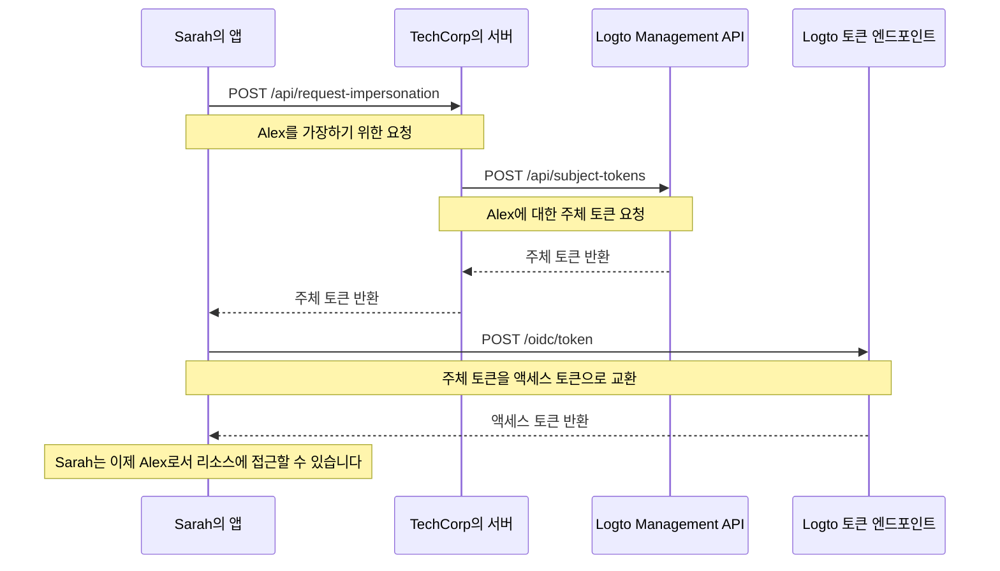

# 사용자 가장

TechCorp의 지원 엔지니어인 Sarah가 고객 Alex로부터 중요한 리소스에 접근할 수 없다는 긴급 티켓을 받았다고 상상해보세요. 문제를 효율적으로 진단하고 해결하기 위해 Sarah는 시스템에서 Alex가 보는 것을 정확히 볼 필요가 있습니다. 이때 Logto의 사용자 가장 기능이 유용합니다.

사용자 가장은 Sarah와 같은 인가된 사용자가 시스템 내에서 Alex와 같은 다른 사용자를 대신하여 일시적으로 행동할 수 있게 해줍니다. 이 강력한 기능은 문제 해결, 고객 지원 제공 및 관리 작업 수행에 매우 유용합니다.

## 작동 방식 \{#how-it-works}



가장 과정은 세 가지 주요 단계로 구성됩니다:

1. Sarah가 TechCorp의 백엔드 서버를 통해 가장을 요청합니다.
2. TechCorp의 서버가 Logto의 Management API에서 주체 토큰을 얻습니다.
3. Sarah의 애플리케이션이 이 주체 토큰을 액세스 토큰으로 교환합니다.

Sarah가 이 기능을 사용하여 Alex를 돕는 방법을 살펴보겠습니다.

### 1단계: 가장 요청하기 \{#step-1-requesting-impersonation}

먼저, Sarah의 지원 애플리케이션은 TechCorp의 백엔드 서버에 가장을 요청해야 합니다.

**요청 (Sarah의 애플리케이션에서 TechCorp의 서버로)**

```bash
POST /api/request-impersonation HTTP/1.1
Host: api.techcorp.com
Authorization: Bearer <Sarah의_액세스_토큰>
Content-Type: application/json

{
  "userId": "alex123",
  "reason": "리소스 접근 문제 조사",
  "ticketId": "TECH-1234"
}
```

이 API에서 백엔드는 Sarah가 Alex를 가장할 수 있는 필요한 권한을 가지고 있는지 확인하기 위해 적절한 인가 검사를 수행해야 합니다.

### 2단계: 주체 토큰 얻기 \{#step-2-obtaining-a-subject-token}

Sarah의 요청을 검증한 후, TechCorp의 서버는 Logto의 [Management API](/integrate-logto/interact-with-management-api)를 호출하여 주체 토큰을 얻습니다.

**요청 (TechCorp의 서버에서 Logto의 Management API로)**

```bash
POST /api/subject-tokens HTTP/1.1
Host: techcorp.logto.app
Authorization: Bearer <TechCorp_m2m_액세스_토큰>
Content-Type: application/json

{
  "userId": "alex123",
  "context": {
    "ticketId": "TECH-1234",
    "reason": "리소스 접근 문제",
    "supportEngineerId": "sarah789"
  }
}
```

**응답 (Logto에서 TechCorp의 서버로)**

```json
{
  "subjectToken": "sub_7h32jf8sK3j2",
  "expiresIn": 600
}
```

TechCorp의 서버는 이 주체 토큰을 Sarah의 애플리케이션에 반환해야 합니다.

**응답 (TechCorp의 서버에서 Sarah의 애플리케이션으로)**

```json
{
  "subjectToken": "sub_7h32jf8sK3j2",
  "expiresIn": 600
}
```

### 3단계: 주체 토큰을 액세스 토큰으로 교환하기 \{#step-3-exchanging-the-subject-token-for-an-access-token}

이제 Sarah의 애플리케이션은 이 주체 토큰을 Alex를 나타내는 액세스 토큰으로 교환하고, 토큰이 사용될 리소스를 지정합니다.

**요청 (Sarah의 애플리케이션에서 Logto의 토큰 엔드포인트로)**

```bash
POST /oidc/token HTTP/1.1
Host: techcorp.logto.app
Content-Type: application/x-www-form-urlencoded

grant_type=urn:ietf:params:oauth:grant-type:token-exchange
&client_id=techcorp_support_app
&scope=resource:read
&subject_token=alx_7h32jf8sK3j2
&subject_token_type=urn:ietf:params:oauth:token-type:access_token
&resource=https://api.techcorp.com/customer-data
```

**응답 (Logto에서 Sarah의 애플리케이션으로)**

```json
{
  "access_token": "eyJhbG...<truncated>",
  "issued_token_type": "urn:ietf:params:oauth:token-type:access_token",
  "token_type": "Bearer",
  "expires_in": 3600,
  "scope": "resource:read"
}
```

반환된 `access_token`은 지정된 리소스에 바인딩되어, TechCorp의 고객 데이터 API에서만 사용할 수 있도록 보장합니다.

**참고**: 전통적인 웹 애플리케이션의 경우, 토큰 요청의 헤더에 `client_id`와 `client_secret`을 포함하여 401 invalid_client 오류를 방지하세요.

다음은 Node.js 예제입니다:

```json
Authorization: `Basic ${Buffer.from(`${client_id}:${client_secret}`, 'utf8').toString('base64')}`
```

## 사용 예시 \{#example-usage}

Sarah가 Node.js 지원 애플리케이션에서 이를 사용하는 방법은 다음과 같습니다:

```jsx
interface ImpersonationResponse {
  subjectToken: string;
  expiresIn: number;
}

interface TokenExchangeResponse {
  access_token: string;
  issued_token_type: string;
  token_type: string;
  expires_in: number;
  scope: string;
}

async function impersonateUser(
  userId: string,
  clientId: string,
  ticketId: string,
  resource: string
): Promise<string> {
  try {
    // 1단계 & 2단계: 가장 요청 및 주체 토큰 얻기
    const impersonationResponse = await fetch(
      'https://api.techcorp.com/api/request-impersonation',
      {
        method: 'POST',
        headers: {
          Authorization: "Bearer <Sarah의_액세스_토큰>",
          'Content-Type': 'application/json',
        },
        body: JSON.stringify({
          userId,
          reason: '리소스 접근 문제 조사',
          ticketId,
        }),
      }
    );

    if (!impersonationResponse.ok) {
      throw new Error(`HTTP 오류 발생. 상태: ${impersonationResponse.status}`);
    }

    const { subjectToken } = (await impersonationResponse.json()) as ImpersonationResponse;

    // 3단계: 주체 토큰을 액세스 토큰으로 교환
    const tokenExchangeBody = new URLSearchParams({
      grant_type: 'urn:ietf:params:oauth:grant-type:token-exchange',
      client_id: clientId,
      scope: 'openid profile resource.read',
      subject_token: subjectToken,
      subject_token_type: 'urn:ietf:params:oauth:token-type:access_token',
      resource: resource,
    });

    const tokenExchangeResponse = await fetch('https://techcorp.logto.app/oidc/token', {
      method: 'POST',
      headers: { 'Content-Type': 'application/x-www-form-urlencoded' },
      body: tokenExchangeBody,
    });

    if (!tokenExchangeResponse.ok) {
      throw new Error(`HTTP 오류! 상태: ${tokenExchangeResponse.status}`);
    }

    const tokenData = (await tokenExchangeResponse.json()) as TokenExchangeResponse;
    return tokenData.access_token;
  } catch (error) {
    console.error('가장 실패:', error);
    throw error;
  }
}

// Sarah가 이 함수를 사용하여 Alex를 가장합니다
async function performImpersonation(): Promise<void> {
  try {
    const accessToken = await impersonateUser(
      'alex123',
      'techcorp_support_app',
      'TECH-1234',
      'https://api.techcorp.com/customer-data'
    );
    console.log('Alex를 위한 가장 액세스 토큰:', accessToken);
  } catch (error) {
    console.error('가장 수행 실패:', error);
  }
}

// 가장 실행
void performImpersonation()
```

:::note

1. 주체 토큰은 단기 사용 및 일회용입니다.
2. 가장 액세스 토큰에는 [리프레시 토큰](https://auth.wiki/refresh-token)이 포함되지 않습니다. Sarah는 Alex의 문제를 해결하기 전에 토큰이 만료되면 이 과정을 반복해야 합니다.
3. TechCorp의 백엔드 서버는 Sarah와 같은 인가된 지원 직원만 가장을 요청할 수 있도록 적절한 인가 검사를 구현해야 합니다.

:::

## `act` 클레임 \{#act-claim}

가장을 위한 토큰 교환 흐름을 사용할 때, 발급된 액세스 토큰에는 추가적인 `act` (actor) 클레임이 포함될 수 있습니다. 이 클레임은 "행동하는 당사자"의 아이덴티티를 나타냅니다 - 우리 예제에서는 Sarah가 Alex를 가장하고 있습니다.

`act` 클레임을 포함하려면, Sarah의 애플리케이션은 토큰 교환 요청에 `actor_token`을 제공해야 합니다. 이 토큰은 `openid` 스코프를 가진 Sarah의 유효한 액세스 토큰이어야 합니다. 토큰 교환 요청에 포함하는 방법은 다음과 같습니다:

```bash
POST /oidc/token HTTP/1.1
Host: techcorp.logto.app
Content-Type: application/x-www-form-urlencoded

grant_type=urn:ietf:params:oauth:grant-type:token-exchange
&client_id=techcorp_support_app
&scope=resource:read
&subject_token=alx_7h32jf8sK3j2
&subject_token_type=urn:ietf:params:oauth:token-type:access_token
&actor_token=sarah_access_token
&actor_token_type=urn:ietf:params:oauth:token-type:access_token
&resource=https://api.techcorp.com/customer-data
```

`actor_token`이 제공되면, 결과 액세스 토큰에는 다음과 같은 `act` 클레임이 포함됩니다:

```json
{
  "aud": "https://api.techcorp.com",
  "iss": "https://techcorp.logto.app",
  "exp": 1443904177,
  "sub": "alex123",
  "act": {
    "sub": "sarah789"
  }
}
```

이 `act` 클레임은 Sarah (sarah789)가 Alex (alex123)를 대신하여 행동하고 있음을 명확히 나타냅니다. `act` 클레임은 가장 행동을 감사하고 추적하는 데 유용할 수 있습니다.

## 토큰 클레임 사용자 정의 \{#customizing-token-claims}

Logto는 가장 토큰에 대한 [토큰 클레임을 사용자 정의](/developers/custom-token-claims)할 수 있도록 허용합니다. 이는 가장 과정에 대한 추가적인 컨텍스트나 메타데이터를 추가하는 데 유용할 수 있습니다. 예를 들어, 가장의 이유나 관련 지원 티켓을 추가할 수 있습니다.

TechCorp의 서버가 Logto의 Management API에서 주체 토큰을 요청할 때, `context` 객체를 포함할 수 있습니다:

```json
{
  "userId": "alex123",
  "context": {
    "ticketId": "TECH-1234",
    "reason": "리소스 접근 문제",
    "supportEngineerId": "sarah789"
  }
}
```

이 [컨텍스트](/developers/custom-token-claims/create-script#context-only-available-for-user-access-token)는 `getCustomJwtClaims()` 함수에서 최종 액세스 토큰에 특정 클레임을 추가하는 데 사용할 수 있습니다. 다음은 이를 구현하는 예입니다:

```tsx
const getCustomJwtClaims = async ({ token, context, environmentVariables }) => {
  if (context.grant?.type === 'urn:ietf:params:oauth:grant-type:token-exchange') {
    const { ticketId, reason, supportEngineerId } = context.grant.subjectTokenContext;
    return {
      impersonation_context: {
        ticket_id: ticketId,
        reason: reason,
        support_engineer: supportEngineerId,
      },
    };
  }
  return {};
};
```

Sarah가 받는 최종 액세스 토큰은 다음과 같이 보일 수 있습니다:

```json
{
  "sub": "alex123",
  "aud": "https://api.techcorp.com/customer-data",
  "impersonation_context": {
    "ticket_id": "TECH-1234",
    "reason": "리소스 접근 문제",
    "support_engineer": "sarah789"
  }
  // ... 다른 표준 클레임
}
```

이렇게 액세스 토큰 클레임을 사용자 정의함으로써, TechCorp는 가장 컨텍스트에 대한 유용한 정보를 포함할 수 있어, 시스템 내에서 가장 활동을 감사하고 이해하기 쉽게 만듭니다.

:::note
토큰에 사용자 정의 클레임을 추가할 때는 주의하세요. 토큰이 가로채거나 유출될 경우 보안 위험을 초래할 수 있는 민감한 정보를 포함하지 마세요. JWT는 서명되지만 암호화되지 않으므로, 클레임은 토큰에 접근할 수 있는 누구에게나 보입니다.
:::
