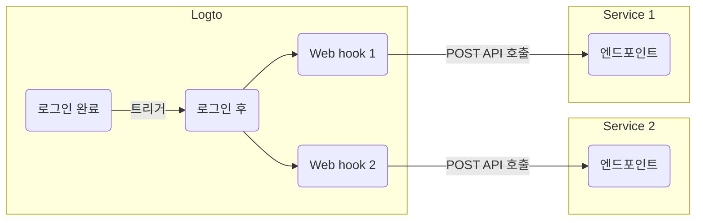

# Webhook

Logto [Webhook](https://auth.wiki/webhook)은 사용자 계정, 역할, 권한, 조직, 조직 역할, 조직 권한, 그리고 [사용자 상호작용](/end-user-flows) 등 다양한 이벤트에 대한 실시간 알림을 제공합니다.

이벤트가 발생하면, Logto는 여러분이 제공한 Endpoint URL로 HTTP 요청을 전송하며, 이 요청에는 사용자 ID, 사용자명, 이메일 등 이벤트에 대한 상세 정보가 포함되어 있습니다 (페이로드와 헤더에 포함된 데이터에 대한 자세한 내용은 [Webhook 요청](/developers/webhooks/webhooks-request)을 참조하세요). 여러분의 애플리케이션은 이 요청을 처리하여 이메일 발송이나 데이터베이스 내 데이터 업데이트 등 맞춤형 작업을 수행할 수 있습니다.

우리는 사용자 요구에 따라 더 많은 이벤트를 지속적으로 추가하고 있습니다. 비즈니스에 필요한 특정 요구 사항이 있다면 언제든 알려주세요.

## Webhook을 사용하는 이유는 무엇인가요? \{#why-use-webhook}

Webhook은 애플리케이션 간 실시간 통신을 제공하여 폴링이 필요 없고 즉각적인 데이터 업데이트가 가능합니다. 복잡한 코드나 독점 API 없이도 애플리케이션 통합 및 워크플로 자동화를 간소화합니다.

다음은 CIAM에서 일반적으로 사용되는 Webhook 활용 사례입니다:

- **이메일 발송:** Webhook을 구성하여 신규 사용자가 등록할 때 환영 이메일을 보내거나, 사용자가 새로운 기기나 위치에서 로그인할 때 관리자를 알릴 수 있습니다.
- **알림 전송:** Webhook을 구성하여 사용자가 가입할 때 CRM 시스템과 연동된 가상 비서를 트리거하여 실시간 고객 지원을 제공할 수 있습니다.
- **추가 API 호출 수행:** Webhook을 구성하여 사용자의 이메일 도메인이나 IP 주소를 확인한 뒤, Logto Management API를 사용해 적절한 역할과 리소스 권한을 할당할 수 있습니다.
- **데이터 동기화:** Webhook을 구성하여 사용자 계정 정지 또는 삭제와 같은 변경 사항을 애플리케이션에 실시간으로 반영할 수 있습니다.
- **리포트 생성:** Webhook을 설정하여 사용자 로그인 활동 데이터를 수신하고, 이를 활용해 사용자 참여도나 사용 패턴에 대한 리포트를 생성할 수 있습니다.

## 용어 \{#terms}

| Item                                                                                                                                                                           | Description                                                                                                                                                                                              |
| ------------------------------------------------------------------------------------------------------------------------------------------------------------------------------ | -------------------------------------------------------------------------------------------------------------------------------------------------------------------------------------------------------- |
| Event                                                                                                                                                                          | 특정 작업이 수행되면, 해당 작업에 맞는 타입의 hook 이벤트가 트리거됩니다. 예: 사용자가 회원가입을 완료하고 새 계정을 생성하면 Logto는 PostRegister hook 이벤트를 발생시킵니다. |
| Hook                                                                                                                                                                           | 특정 이벤트에 연결된 하나 또는 일련의 작업입니다. 작업에는 API 호출, 코드 스니펫 실행 등이 포함될 수 있습니다.                                                                                           |
| Webhook                                                                                                                                                                        | 이벤트 페이로드와 함께 API를 호출하는 hook의 하위 유형입니다.                                                                                                                                            |
| 예를 들어, 개발자가 사용자가 새로운 기기로 로그인할 때 알림을 보내고 싶다면, PostSignIn 이벤트에 자신의 보안 서비스 API를 호출하는 webhook을 추가할 수 있습니다.                |

다음은 Logto에서 `PostSignIn` 이벤트에 대해 두 개의 web hook을 활성화하는 예시입니다:

## 자주 묻는 질문 \{#faqs}

### Logto는 동기화된 webhook을 지원하나요? \{#does-logto-support-synced-webhooks}

동기화된 webhook은 사용자 로그인 흐름을 더 원활하게 만들 수 있지만, 아직 지원하지 않습니다 (향후 지원 예정입니다). 따라서 현재 동기화된 webhook에 의존하는 시나리오는 모두 별도의 우회 방법이 필요합니다. 궁금한 점이 있다면 언제든 문의해 주세요.

### 사용자 권한 변경은 어떻게 처리하나요? \{#how-to-deal-with-user-permission-change}

[사용자 권한 변경 관리](/authorization/global-api-resources/#optional-handle-user-permission-change) 가이드를 참고하세요.

### webhook 타임아웃은 어떻게 디버깅하나요? \{#how-to-debug-webhook-timeout}

Webhook을 수신하는 엔드포인트는 Logto에 Webhook이 성공적으로 수신되었음을 알리기 위해 가능한 한 빨리 2xx 응답을 반환해야 합니다. 사용자마다 Webhook 처리 로직이 매우 다르기 때문에, 지나치게 복잡한 작업은 몇 초가 걸릴 수 있어 Logto Webhook이 타임아웃될 수 있습니다. 최선의 방법은 자체 이벤트 큐를 유지하는 것입니다. Logto Webhook을 수신하면 이벤트를 큐에 삽입하고 Logto에 2xx 응답을 반환하세요. 이후 자체 워커가 큐의 작업을 단계별로 처리하도록 하세요. 워커에서 오류가 발생하면 자체 서버에서 처리하면 됩니다.

### `PostSignIn` webhook에서 클라이언트 IP 주소를 얻을 수 있나요? \{#can-i-get-the-client-ip-address-from-postsignin-webhooks}

네, Webhook 페이로드에서 IP 주소, 사용자 에이전트 등을 얻을 수 있습니다. 현재 지원되지 않는 정보가 필요하다면 GitHub 이슈에 기능 요청을 생성하거나, 저희에게 연락해 주세요.

## 관련 리소스 \{#related-resources}

<Url href="https://blog.logto.io/webhooks-vs-polling">Webhook vs. 폴링</Url>
