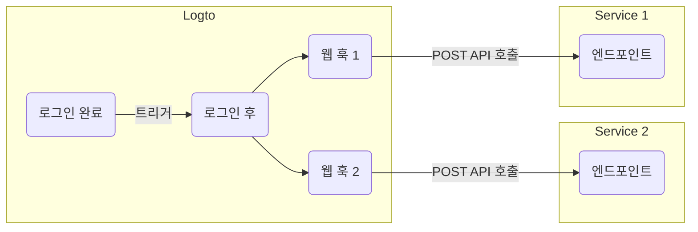

# Webhooks

Logto [Webhook](https://auth.wiki/webhook)은 [사용자 계정](/user-management/user-data), [역할](/authorization/role-based-access-control#roles), [권한](/authorization/role-based-access-control#permissionsscopes), [조직](/organizations/organization-data), [조직 역할](/authorization/organization-template#organization-role), [조직 권한](/authorization/organization-template#organization-permission), [사용자 상호작용](/end-user-flows) 등의 다양한 이벤트에 대한 실시간 알림을 제공합니다.

이벤트가 발생하면, Logto는 제공한 Endpoint URL로 HTTP 요청을 보내며, 사용자 ID, 사용자 이름, 이메일 및 기타 관련 세부 정보와 같은 이벤트에 대한 자세한 정보를 포함합니다 (페이로드 및 헤더에 포함된 데이터에 대한 자세한 내용은 [Webhook 요청](/developers/webhooks/webhooks-request)을 참조하세요). 귀하의 애플리케이션은 이 요청을 처리하고 이메일 전송이나 데이터베이스의 데이터 업데이트와 같은 맞춤형 작업을 수행할 수 있습니다.

우리는 사용자 요구에 따라 더 많은 이벤트를 지속적으로 추가하고 있습니다. 비즈니스에 대한 특정 요구 사항이 있는 경우, 저희에게 알려주세요.

## Webhook을 사용하는 이유 \{#why-use-webhook}

Webhooks는 애플리케이션 간의 실시간 통신을 제공하여 폴링의 필요성을 제거하고 즉각적인 데이터 업데이트를 가능하게 합니다. 복잡한 코드나 독점 API 없이 애플리케이션 통합 및 워크플로 자동화를 간소화합니다.

다음은 CIAM을 위한 일반적인 Webhook 사용 사례의 몇 가지 예입니다:

- **이메일 전송:** Webhook을 구성하여 신규 사용자가 등록할 때 환영 이메일을 보내거나 사용자가 새로운 장치나 위치에서 로그인할 때 관리자에게 알림을 보냅니다.
- **알림 전송:** Webhook을 구성하여 CRM 시스템과 함께 가상 비서를 트리거하여 사용자가 가입할 때 실시간 고객 지원을 제공합니다.
- **추가 API 호출 수행:** Webhook을 구성하여 사용자의 이메일 도메인이나 IP 주소를 확인하여 사용자 접근을 검증한 후 Logto Management API를 사용하여 적절한 역할과 리소스 권한을 할당합니다.
- **데이터 동기화:** Webhook을 구성하여 사용자 계정 정지 또는 삭제와 같은 변경 사항에 대해 애플리케이션을 최신 상태로 유지합니다.
- **보고서 생성:** Webhook을 설정하여 사용자 로그인 활동 데이터를 수신하고 이를 활용하여 사용자 참여 또는 사용 패턴에 대한 보고서를 생성합니다.

## 용어 \{#terms}

| 항목                                                                                                                                           | 설명                                                                                                                                                                  |
| ---------------------------------------------------------------------------------------------------------------------------------------------- | --------------------------------------------------------------------------------------------------------------------------------------------------------------------- |
| 이벤트                                                                                                                                         | 특정 작업이 수행되면 특정 유형의 훅 이벤트가 트리거됩니다. 예를 들어, 사용자가 가입 과정을 완료하고 새 계정을 생성하면 Logto는 PostRegister 훅 이벤트를 발생시킵니다. |
| 훅                                                                                                                                             | 특정 이벤트에 연결된 단일 또는 일련의 작업. 작업은 API 호출, 코드 스니펫 실행 등이 될 수 있습니다.                                                                    |
| Webhook                                                                                                                                        | 이벤트 페이로드와 함께 API를 호출하는 훅의 하위 유형.                                                                                                                 |
| 개발자가 사용자가 새로운 장치로 로그인할 때 알림을 보내고 싶다면, PostSignIn 이벤트에 보안 서비스 API를 호출하는 Webhook을 추가할 수 있습니다. |

다음은 Logto에서 `PostSignIn` 이벤트에 대해 두 개의 웹 훅을 활성화하는 예입니다:

## 자주 묻는 질문 \{#faqs}

### Logto는 동기화된 Webhook을 지원합니까? \{#does-logto-support-synced-webhooks}

동기화된 Webhook은 사용자 로그인 흐름을 더 원활하게 만들겠지만, 아직 지원하지 않습니다 (미래에는 지원할 예정입니다). 따라서 현재 동기화된 Webhook에 의존하는 시나리오는 모두 다른 해결책이 필요합니다. 질문이 있으면 주저하지 말고 저희에게 연락하세요.

### 사용자 권한 변경을 어떻게 처리합니까? \{#how-to-deal-with-user-permission-change}

[사용자 권한 변경 관리](/authorization/role-based-access-control/protect-api-resources-with-rbac/#optional-handle-user-permission-change) 가이드를 참조하세요.

### Webhook 타임아웃을 어떻게 디버그합니까? \{#how-to-debug-webhook-timeout}

Webhook을 수신하는 엔드포인트는 Webhook이 성공적으로 수신되었음을 Logto에 알리기 위해 가능한 한 빨리 2xx 응답을 반환해야 합니다. 사용자가 Webhook에 대해 매우 다양한 처리 로직을 가지고 있기 때문에, 지나치게 복잡한 작업은 몇 초가 걸릴 수 있으며, 이는 Logto Webhook이 타임아웃되는 원인이 될 수 있습니다. 최선의 방법은 자체 이벤트 큐를 유지하는 것입니다. Logto Webhook을 수신하면 이벤트를 큐에 삽입하고 Logto에 2xx 응답을 반환합니다. 그런 다음 자체 작업자가 큐의 작업을 단계별로 처리하도록 합니다. 작업자가 오류를 만나면 자체 서버에서 처리하세요.

### `PostSignIn` Webhook에서 클라이언트 IP 주소를 얻을 수 있습니까? \{#can-i-get-the-client-ip-address-from-postsignin-webhooks}

네, Webhook 페이로드에서 IP 주소, 사용자 에이전트 등을 얻을 수 있습니다. 현재 지원되지 않는 정보가 필요한 경우, GitHub 이슈에서 기능 요청을 생성하거나 저희에게 연락할 수 있습니다.

## 관련 리소스 \{#related-resources}

<Url href="https://blog.logto.io/webhooks-vs-polling">Webhooks vs. polling</Url>
