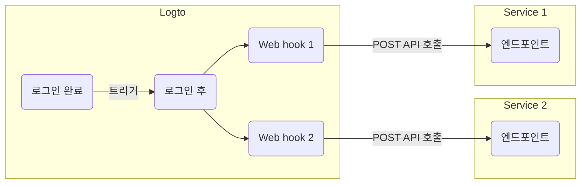

# Webhook

Logto [Webhook](https://auth.wiki/webhook)은 사용자 계정, 역할 (Role), 권한 (Permission), 조직 (Organization), 조직 역할, 조직 권한, 그리고 [사용자 상호작용](/end-user-flows) 등 다양한 이벤트에 대한 실시간 알림을 제공합니다.

이벤트가 발생하면, Logto는 비동기적으로 여러분이 제공한 엔드포인트 URL로 HTTP 요청을 보냅니다. 이 요청에는 사용자, 애플리케이션, 요청 컨텍스트 등 이벤트에 대한 세부 정보가 포함되어 있습니다. 페이로드와 헤더에 대한 참조는 [Webhook 요청](/developers/webhooks/webhooks-request)을 참고하세요.

Webhook 전송은 인증 요청 외부에서 발생하며, 현재 플로우의 결과를 변경할 수 없습니다. 로그인 진행 전에 반드시 완료되어야 하는 동기 코드가 필요하다면 [액션 (Actions)](/developers/actions)을 사용하세요.

우리는 사용자 요구에 따라 더 많은 이벤트를 지속적으로 추가하고 있습니다. 비즈니스에 필요한 특정 요구 사항이 있다면 언제든 알려주세요.

## 왜 Webhook을 사용해야 하나요? \{#why-use-webhook}

Webhook은 애플리케이션 간 실시간 통신을 제공하여 폴링이 필요 없고 즉각적인 데이터 업데이트가 가능합니다. 복잡한 코드나 독점 API 없이도 애플리케이션 통합 및 워크플로우 자동화를 간소화합니다.

다음은 CIAM에서 흔히 사용되는 Webhook 활용 사례입니다:

- **이메일 발송:** Webhook을 구성하여 신규 사용자 등록 시 환영 이메일을 보내거나, 사용자가 새로운 기기나 위치에서 로그인할 때 관리자를 알릴 수 있습니다.
- **알림 전송:** Webhook을 구성하여 사용자가 가입할 때 CRM 시스템과 연동된 가상 비서를 트리거하여 실시간 고객 지원을 제공할 수 있습니다.
- **추가 API 호출 수행:** Webhook을 구성하여 사용자의 이메일 도메인이나 IP 주소를 확인한 후, Logto Management API를 사용해 리소스 권한이 포함된 적절한 역할을 할당할 수 있습니다.
- **데이터 동기화:** Webhook을 구성하여 사용자 계정 정지 또는 삭제와 같은 변경 사항을 애플리케이션에 실시간으로 반영할 수 있습니다.
- **리포트 생성:** Webhook을 설정하여 사용자 로그인 활동 데이터를 수신하고, 이를 활용해 사용자 참여도나 사용 패턴에 대한 리포트를 생성할 수 있습니다.

## 용어 \{#terms}

| 항목           | 설명                                                                               |
| -------------- | ---------------------------------------------------------------------------------- |
| Webhook 이벤트 | Logto가 전달할 수 있는 지원되는 이벤트 유형. 예: `PostSignIn` 또는 `User.Created`. |
| Webhook        | 하나 이상의 이벤트를 구독하고, 해당 페이로드를 HTTP 엔드포인트로 전송하는 구성.    |

예를 들어, 사용자가 로그인한 후 보안 서비스에 알리려면 `PostSignIn`을 구독하는 Webhook을 생성하세요.

다음은 Logto에서 `PostSignIn` 이벤트에 대해 두 개의 Webhook을 활성화한 예시입니다:

```mermaid
graph LR
  subgraph Logto
    SF(로그인 완료)
    PS(로그인 후)
    WH2(Web hook 2)
    WH1(Web hook 1)
  end

  subgraph Service 2
    E2(엔드포인트)
  end

  subgraph Service 1
    E1(엔드포인트)
  end

  SF -->|트리거| PS
  PS --> WH1
  PS --> WH2
  WH1 --->|POST API 호출| E1
  WH2 --->|POST API 호출| E2

```

## 자주 묻는 질문 \{#faqs}

### Webhook이 동기식 인증 (Authentication) 결정을 내릴 수 있나요? \{#does-logto-support-synced-webhooks}

아니요. Webhook은 비동기 알림이므로, 응답이 현재 인증 (Authentication) 플로우를 허용, 차단 또는 수정할 수 없습니다.

Logto가 커스텀 코드를 실행하거나, 외부 API를 호출하거나, 로그인 진행 전에 사용자를 업데이트해야 할 때는 [액션 (Actions)](/developers/actions)을 사용하세요. 액션은 동기식이므로, 외부 의존성을 빠르고 신뢰성 있게 유지하세요.

### 사용자 권한 (Permission) 변경은 어떻게 처리하나요? \{#how-to-deal-with-user-permission-change}

[사용자 권한 (Permission) 변경 관리](/authorization/global-api-resources/#optional-handle-user-permission-change) 가이드를 참고하세요.

### Webhook 타임아웃을 어떻게 디버깅하나요? \{#how-to-debug-webhook-timeout}

Webhook을 수신하는 엔드포인트는 Webhook이 성공적으로 수신되었음을 Logto에 알리기 위해 가능한 한 빨리 2xx 응답을 반환해야 합니다. 사용자마다 Webhook 처리 로직이 매우 다르기 때문에, 지나치게 복잡한 작업은 몇 초가 걸릴 수 있어 Logto Webhook이 타임아웃될 수 있습니다. 최선의 방법은 자체 이벤트 큐를 유지하는 것입니다. Logto Webhook을 수신하면 이벤트를 큐에 삽입하고, Logto에 2xx 응답을 반환하세요. 그 후 자체 워커가 큐의 작업을 순차적으로 처리하도록 하세요. 워커에서 오류가 발생하면 자체 서버에서 처리하세요.

### `PostSignIn` Webhook에서 클라이언트 IP 주소를 받을 수 있나요? \{#can-i-get-the-client-ip-address-from-postsignin-webhooks}

네, Webhook 페이로드에서 IP 주소, 사용자 에이전트 등 정보를 받을 수 있습니다. 현재 지원되지 않는 정보가 필요하다면 GitHub 이슈에 기능 요청을 생성하거나, 저희에게 연락해 주세요.

## 관련 리소스 \{#related-resources}

<Url href="https://blog.logto.io/webhooks-vs-polling">Webhook vs. 폴링</Url>
