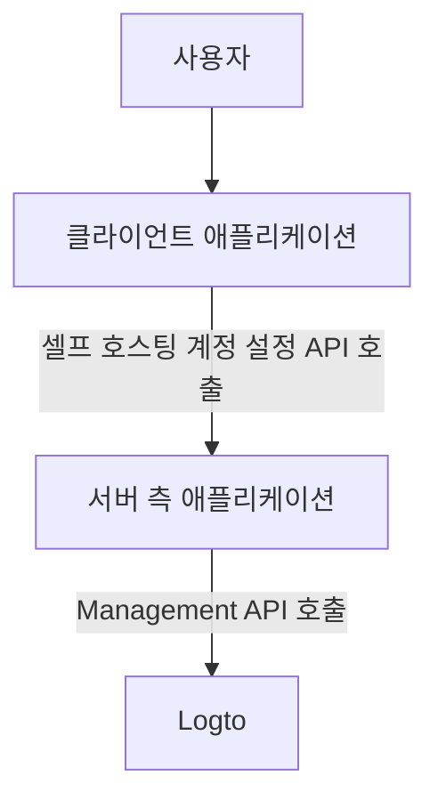
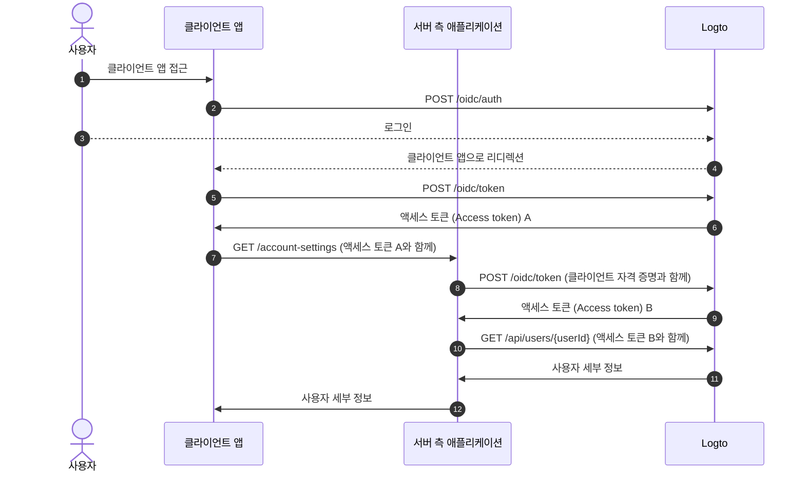
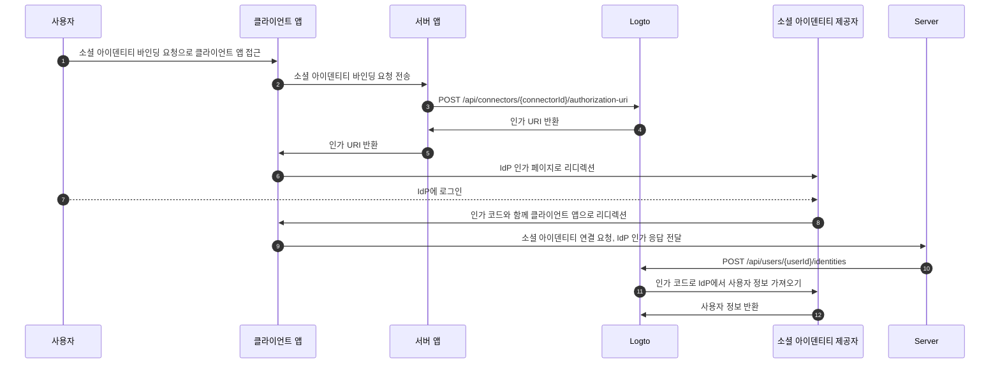

# Management API로 계정 설정하기

## 통합 (Integrations) \{#integrations}

Logto는 사용자 계정을 관리할 수 있는 다양한 Management API를 제공합니다. 이 API들을 사용하여 최종 사용자를 위한 셀프 서비스 계정 설정 페이지를 구축할 수 있습니다.

### 아키텍처 (Architecture) \{#architecture}

1. **사용자**: 계정 설정에 접근하고 관리해야 하는 인증된 최종 사용자.
2. **클라이언트 애플리케이션**: 사용자에게 계정 설정 페이지를 제공하는 클라이언트 애플리케이션.
3. **서버 측 애플리케이션**: 클라이언트에 계정 설정 API를 제공하는 서버 측 애플리케이션. Logto Management API와 상호작용합니다.
4. **Logto**: 인증 (Authentication) 및 인가 (Authorization) 서비스로서의 Logto. 사용자 계정 관리를 위한 Management API를 제공합니다.

### 시퀀스 다이어그램 (Sequence diagram) \{#sequence-diagram}

1. 사용자가 클라이언트 애플리케이션에 접근합니다.
2. 클라이언트 애플리케이션이 Logto에 인증 요청을 보내고 사용자를 Logto 로그인 페이지로 리디렉션합니다.
3. 사용자가 Logto에 로그인합니다.
4. 인증된 사용자가 인가 코드와 함께 클라이언트 애플리케이션으로 리디렉션됩니다.
5. 클라이언트 애플리케이션이 셀프 호스팅 계정 설정 API 접근을 위해 Logto에서 액세스 토큰 (Access token)을 요청합니다.
6. Logto가 클라이언트 애플리케이션에 액세스 토큰 (Access token)을 발급합니다.
7. 클라이언트 애플리케이션이 사용자 액세스 토큰과 함께 서버 측 애플리케이션에 계정 설정 요청을 보냅니다.
8. 서버 측 애플리케이션이 사용자 액세스 토큰에서 요청자의 신원과 권한을 검증한 후, Logto에서 Management API 액세스 토큰을 요청합니다.
9. Logto가 서버 측 애플리케이션에 Management API 액세스 토큰을 발급합니다.
10. 서버 측 애플리케이션이 Management API 액세스 토큰을 사용하여 Logto에서 사용자 데이터를 요청합니다.
11. Logto가 서버의 신원과 Management API 권한을 검증하고 사용자 데이터를 반환합니다.
12. 서버 측 애플리케이션이 요청자의 권한에 따라 사용자 데이터를 처리하고, 사용자 계정 세부 정보를 클라이언트 애플리케이션에 반환합니다.

### 서버 측 애플리케이션에 Management API 통합하기 \{#integrate-management-api-to-server-side-application}

서버 측 애플리케이션과 Management API를 통합하는 방법은 [Management API](/integrate-logto/interact-with-management-api/) 섹션을 참고하세요.

## 사용자 관리 API (User Management APIs) \{#user-management-apis}

### 사용자 데이터 스키마 (User data schema) \{#user-data-schema}

Logto의 사용자 스키마에 대해 더 알고 싶다면 [사용자 데이터 및 커스텀 데이터](/user-management/user-data/) 섹션을 참고하세요.

### 사용자 프로필 및 식별자 관리 API (User profile and identifiers Management APIs) \{#user-profile-and-identifiers-management-apis}

사용자 프로필과 식별자는 사용자 관리에 필수적입니다. 다음 API들을 사용하여 사용자 프로필과 식별자를 관리할 수 있습니다.

| method | path                                                                                                     | description                                |
| ------ | -------------------------------------------------------------------------------------------------------- | ------------------------------------------ |
| GET    | [/api/users/\{userId\}](https://openapi.logto.io/operation/operation-getuser)                            | 사용자 ID로 사용자 세부 정보 가져오기.     |
| PATCH  | [/api/users/\{userId\}](https://openapi.logto.io/operation/operation-updateuser)                         | 사용자 세부 정보 업데이트.                 |
| PATCH  | [/api/users/\{userId\}/profile](https://openapi.logto.io/operation/operation-updateuserprofile)          | 사용자 ID로 사용자 프로필 필드 업데이트.   |
| GET    | [/api/users/\{userId\}/custom-data](https://openapi.logto.io/operation/operation-listusercustomdata)     | 사용자 ID로 사용자 커스텀 데이터 가져오기. |
| PATCH  | [/api/users/\{userId\}/custom-data](https://openapi.logto.io/operation/operation-updateusercustomdata)   | 사용자 ID로 사용자 커스텀 데이터 업데이트. |
| PATCH  | [/api/users/\{userId\}/is-suspended](https://openapi.logto.io/operation/operation-updateuserissuspended) | 사용자 ID로 사용자 정지 상태 업데이트.     |

### 이메일 및 전화번호 인증 (Email and phone number verification) \{#email-and-phone-number-verification}

Logto 시스템에서는 이메일 주소와 전화번호 모두 사용자 식별자로 사용될 수 있으므로, 이들의 인증이 필수적입니다. 이를 지원하기 위해 제공된 이메일 또는 전화번호를 인증할 수 있는 일련의 인증 코드 API를 제공합니다.

:::note
새 이메일 또는 전화번호로 사용자 프로필을 업데이트하기 전에 반드시 이메일 또는 전화번호를 인증하세요.
:::

| method | path                                                                                                                             | description                            |
| ------ | -------------------------------------------------------------------------------------------------------------------------------- | -------------------------------------- |
| POST   | [/api/verifications/verification-code](https://openapi.logto.io/operation/operation-createverificationbyverificationcode)        | 이메일 또는 전화번호 인증 코드 전송.   |
| POST   | [/api/verifications/verification-code/verify](https://openapi.logto.io/operation/operation-verifyverificationbyverificationcode) | 인증 코드로 이메일 또는 전화번호 인증. |

### 사용자 비밀번호 관리 (User password management) \{#user-password-management}

| method | path                                                                                                     | description                          |
| ------ | -------------------------------------------------------------------------------------------------------- | ------------------------------------ |
| POST   | [/api/users/\{userId\}/password/verify](https://openapi.logto.io/operation/operation-verifyuserpassword) | 사용자 ID로 현재 비밀번호 인증.      |
| PATCH  | [/api/users/\{userId\}/password](https://openapi.logto.io/operation/operation-updateuserpassword)        | 사용자 ID로 비밀번호 업데이트.       |
| GET    | [/api/users/\{userId\}/has-password](https://openapi.logto.io/operation/operation-getuserhaspassword)    | 사용자 ID로 비밀번호 존재 여부 확인. |

:::note
사용자 비밀번호를 업데이트하기 전에 반드시 사용자의 현재 비밀번호를 인증하세요.
:::

### 사용자 소셜 아이덴티티 관리 (User social identities management) \{#user-social-identities-management}

| method | path                                                                                                                              | description                                                                                           |
| ------ | --------------------------------------------------------------------------------------------------------------------------------- | ----------------------------------------------------------------------------------------------------- |
| GET    | [/api/users/\{userId\}](https://openapi.logto.io/operation/operation-getuser)                                                     | 사용자 ID로 사용자 세부 정보 가져오기. 소셜 아이덴티티는 `identities` 필드에서 확인할 수 있습니다.    |
| POST   | [/api/users/\{userId\}/identities](https://openapi.logto.io/operation/operation-createuseridentity)                               | 인증된 소셜 아이덴티티를 사용자 ID로 연결.                                                            |
| DELETE | [/api/users/\{userId\}/identities](https://openapi.logto.io/operation/operation-deleteuseridentity)                               | 사용자 ID로 소셜 아이덴티티 연결 해제.                                                                |
| PUT    | [/api/users/\{userId\}/identities](https://openapi.logto.io/operation/operation-replaceuseridentity)                              | 사용자 ID로 연결된 소셜 아이덴티티 직접 업데이트.                                                     |
| POST   | [/api/connectors/\{connectorId\}/authorization-uri](https://openapi.logto.io/operation/operation-createconnectorauthorizationuri) | 소셜 아이덴티티 제공자의 인가 URI 가져오기. 이 URI를 사용해 새로운 소셜 아이덴티티 연결을 시작하세요. |

1. 사용자가 클라이언트 애플리케이션에 접근하여 소셜 아이덴티티 바인딩을 요청합니다.
2. 클라이언트 애플리케이션이 서버에 소셜 아이덴티티 바인딩 요청을 보냅니다.
3. 서버가 Logto에 소셜 아이덴티티 제공자의 인가 URI를 요청합니다. 이때 `state` 파라미터와 `redirect_uri`를 직접 제공해야 합니다. `redirect_uri`는 소셜 아이덴티티 제공자에 사전 등록되어 있어야 합니다.
4. Logto가 서버에 인가 URI를 반환합니다.
5. 서버가 인가 URI를 클라이언트 애플리케이션에 반환합니다.
6. 클라이언트 애플리케이션이 사용자를 IdP 인가 URI로 리디렉션합니다.
7. 사용자가 IdP에 로그인합니다.
8. IdP가 인가 코드와 함께 사용자를 `redirect_uri`로 클라이언트 애플리케이션에 리디렉션합니다.
9. 클라이언트 애플리케이션이 `state`를 검증하고 IdP 인가 응답을 서버로 전달합니다.
10. 서버가 Logto에 소셜 아이덴티티를 사용자에 연결하도록 요청합니다.
11. Logto가 인가 코드를 사용해 IdP에서 사용자 정보를 가져옵니다.
12. IdP가 사용자 정보를 Logto에 반환하고, Logto가 소셜 아이덴티티를 사용자에 연결합니다.

:::note
사용자에 새로운 소셜 아이덴티티를 연결할 때 고려해야 할 몇 가지 제한 사항이 있습니다:

- Management API에는 세션 컨텍스트가 없으므로, 소셜 인증 상태를 안전하게 유지하기 위해 활성 세션이 필요한 소셜 커넥터는 Management API를 통해 연결할 수 없습니다. 지원되지 않는 커넥터에는 apple, 표준 OIDC 및 표준 OAuth 2.0 커넥터가 포함됩니다.
- 같은 이유로, Logto는 인가 응답의 `state` 파라미터를 검증할 수 없습니다. 클라이언트 앱에서 `state` 파라미터를 저장하고 인가 응답을 받을 때 반드시 검증하세요.
- `redirect_uri`를 소셜 아이덴티티 제공자에 미리 등록해야 합니다. 그렇지 않으면 소셜 IdP가 사용자를 클라이언트 앱으로 리디렉션하지 않습니다. 소셜 IdP는 사용자 로그인용, 프로필 바인딩 페이지용 등 둘 이상의 콜백 `redirect_uri`를 허용해야 합니다.

:::

### 사용자 엔터프라이즈 아이덴티티 관리 (User enterprise identities management) \{#user-enterprise-identities-management}

| method | path                                                                                                    | description                                                                                                                                                                 |
| ------ | ------------------------------------------------------------------------------------------------------- | --------------------------------------------------------------------------------------------------------------------------------------------------------------------------- |
| GET    | [/api/users/\{userId\}?includeSsoIdentities=true](https://openapi.logto.io/operation/operation-getuser) | 사용자 ID로 사용자 세부 정보 가져오기. 엔터프라이즈 아이덴티티는 `ssoIdentities` 필드에서 확인할 수 있습니다. API에 `includeSsoIdentities=true` 쿼리 파라미터를 추가하세요. |

현재 Management API는 사용자에 엔터프라이즈 아이덴티티를 연결하거나 해제하는 기능을 지원하지 않습니다. 연결된 엔터프라이즈 아이덴티티만 표시할 수 있습니다.

### 개인 액세스 토큰 (Personal access token) \{#personal-access-token}

| method | path                                                                                                                                 | description                              |
| ------ | ------------------------------------------------------------------------------------------------------------------------------------ | ---------------------------------------- |
| GET    | [/api/users/\{userId\}/personal-access-tokens](https://openapi.logto.io/operation/operation-listuserpersonalaccesstokens)            | 사용자의 모든 개인 액세스 토큰 가져오기. |
| POST   | [/api/users/\{userId\}/personal-access-tokens](https://openapi.logto.io/operation/operation-createuserpersonalaccesstoken)           | 사용자에 새 개인 액세스 토큰 추가.       |
| DELETE | [/api/users/\{userId\}/personal-access-tokens/\{name\}](https://openapi.logto.io/operation/operation-deleteuserpersonalaccesstoken)  | 이름으로 사용자의 토큰 삭제.             |
| PATCH  | [/api/users/\{userId\s}/personal-access-tokens/\{name\}](https://openapi.logto.io/operation/operation-updateuserpersonalaccesstoken) | 이름으로 사용자의 토큰 업데이트.         |

개인 액세스 토큰은 사용자가 자격 증명 및 상호작용 로그인 없이 [액세스 토큰 (Access token)](https://auth.wiki/access-token)을 안전하게 부여할 수 있는 방법을 제공합니다. [개인 액세스 토큰 사용법](/user-management/personal-access-token)에 대해 더 알아보세요.

### 사용자 MFA 설정 관리 (User MFA settings management) \{#user-mfa-settings-management}

| method | path                                                                                                                                 | description                           |
| ------ | ------------------------------------------------------------------------------------------------------------------------------------ | ------------------------------------- |
| GET    | [/api/users/\{userId\}/mfa-verifications](https://openapi.logto.io/operation/operation-listusermfaverifications)                     | 사용자 ID로 사용자 MFA 설정 가져오기. |
| POST   | [/api/users/\{userId\}/mfa-verifications](https://openapi.logto.io/operation/operation-createusermfaverification)                    | 사용자 ID로 사용자 MFA 인증 설정.     |
| DELETE | [/api/users/\{userId\}/mfa-verifications/\{verificationId\}](https://openapi.logto.io/operation/operation-deleteusermfaverification) | ID로 사용자 MFA 인증 삭제.            |

### 사용자 계정 삭제 (User account deletion) \{#user-account-deletion}

| method | path                                                                             | description              |
| ------ | -------------------------------------------------------------------------------- | ------------------------ |
| DELETE | [/api/users/\{userId\}](https://openapi.logto.io/operation/operation-deleteuser) | 사용자 ID로 사용자 삭제. |
