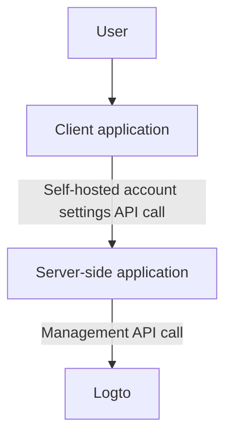
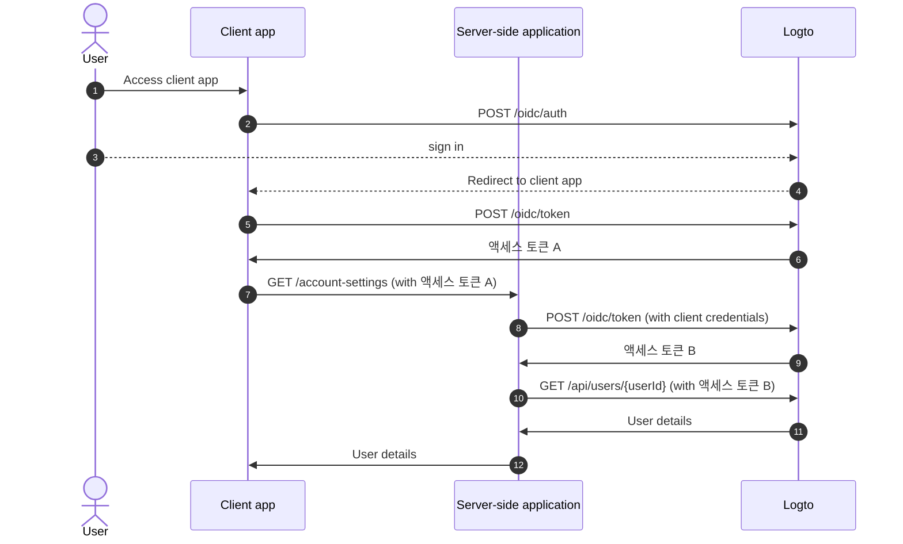
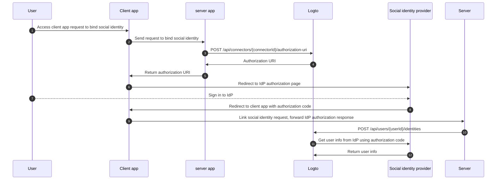

# Management API 를 통한 계정 설정

## 통합 \{#integrations}

Logto는 사용자 계정을 관리하기 위한 다양한 Management API 를 제공합니다. 이러한 API 를 사용하여 최종 사용자를 위한 셀프 서비스 계정 설정 페이지를 구축할 수 있습니다.

### 아키텍처 \{#architecture}

1. **User**: 계정 설정에 접근하고 관리해야 하는 인증된 최종 사용자.
2. **Client application**: 사용자에게 계정 설정 페이지를 제공하는 클라이언트 애플리케이션.
3. **Server-side application**: 클라이언트에 계정 설정 API 를 제공하는 서버 측 애플리케이션. Logto Management API 와 상호작용합니다.
4. **Logto**: 인증 및 인가 서비스로서의 Logto. 사용자 계정을 관리하기 위한 Management API 를 제공합니다.

### 시퀀스 다이어그램 \{#sequence-diagram}

1. 사용자가 클라이언트 애플리케이션에 접근합니다.
2. 클라이언트 애플리케이션은 Logto에 인증 요청을 보내고 사용자를 Logto 로그인 페이지로 리디렉션합니다.
3. 사용자가 Logto에 로그인합니다.
4. 인증된 사용자는 인가 코드와 함께 클라이언트 애플리케이션으로 리디렉션됩니다.
5. 클라이언트 애플리케이션은 셀프 호스팅 계정 설정 API 접근을 위해 Logto에 액세스 토큰을 요청합니다.
6. Logto는 클라이언트 애플리케이션에 액세스 토큰을 부여합니다.
7. 클라이언트 애플리케이션은 사용자 액세스 토큰과 함께 서버 측 애플리케이션에 계정 설정 요청을 보냅니다.
8. 서버 측 애플리케이션은 사용자 액세스 토큰에서 요청자의 아이덴티티와 권한을 확인합니다. 그런 다음 Logto에 Management API 액세스 토큰을 요청합니다.
9. Logto는 서버 측 애플리케이션에 Management API 액세스 토큰을 부여합니다.
10. 서버 측 애플리케이션은 Management API 액세스 토큰을 사용하여 Logto에서 사용자 데이터를 요청합니다.
11. Logto는 서버의 아이덴티티와 Management API 권한을 확인하고 사용자 데이터를 반환합니다.
12. 서버 측 애플리케이션은 요청자의 권한에 따라 사용자 데이터를 처리하고 사용자 계정 세부 정보를 클라이언트 애플리케이션에 반환합니다.

### 서버 측 애플리케이션에 Management API 통합 \{#integrate-management-api-to-server-side-application}

서버 측 애플리케이션과 Management API 를 통합하는 방법에 대해 알아보려면 [Management API](/integrate-logto/interact-with-management-api/) 섹션을 확인하세요.

## 사용자 관리 API \{#user-management-apis}

### 사용자 데이터 스키마 \{#user-data-schema}

Logto의 사용자 스키마에 대해 더 알고 싶다면 [사용자 데이터 및 사용자 정의 데이터](/user-management/user-data/) 섹션을 확인하세요.

### 사용자 프로필 및 식별자 관리 API \{#user-profile-and-identifiers-management-apis}

사용자의 프로필과 식별자는 사용자 관리에 필수적입니다. 다음 API 를 사용하여 사용자 프로필과 식별자를 관리할 수 있습니다.

| method | path                                                                                                     | description                                      |
| ------ | -------------------------------------------------------------------------------------------------------- | ------------------------------------------------ |
| GET    | [/api/users/\{userId\}](https://openapi.logto.io/operation/operation-getuser)                            | 사용자 ID로 사용자 세부 정보를 가져옵니다.       |
| PATCH  | [/api/users/\{userId\}](https://openapi.logto.io/operation/operation-updateuser)                         | 사용자 세부 정보를 업데이트합니다.               |
| PATCH  | [/api/users/\{userId\}/profile](https://openapi.logto.io/operation/operation-updateuserprofile)          | 사용자 ID로 사용자 프로필 필드를 업데이트합니다. |
| GET    | [/api/users/\{userId\}/custom-data](https://openapi.logto.io/operation/operation-listusercustomdata)     | 사용자 ID로 사용자 정의 데이터를 가져옵니다.     |
| PATCH  | [/api/users/\{userId\}/custom-data](https://openapi.logto.io/operation/operation-updateusercustomdata)   | 사용자 ID로 사용자 정의 데이터를 업데이트합니다. |
| PATCH  | [/api/users/\{userId\}/is-suspended](https://openapi.logto.io/operation/operation-updateuserissuspended) | 사용자 ID로 사용자 정지 상태를 업데이트합니다.   |

### 이메일 및 전화번호 인증 \{#email-and-phone-number-verification}

Logto 시스템에서는 이메일 주소와 전화번호 모두 사용자 식별자로 사용할 수 있으므로, 이들의 인증이 필수적입니다. 이를 지원하기 위해 제공된 이메일 또는 전화번호를 인증하는 데 도움이 되는 일련의 인증 코드 API 를 제공합니다.

:::note
사용자 프로필을 새 이메일 또는 전화번호로 업데이트하기 전에 이메일 또는 전화번호를 인증하세요.
:::

| method | path                                                                                                               | description                                    |
| ------ | ------------------------------------------------------------------------------------------------------------------ | ---------------------------------------------- |
| POST   | [/api/verification/verification-codes](https://openapi.logto.io/operation/operation-createverificationcode)        | 이메일 또는 전화번호 인증 코드를 보냅니다.     |
| POST   | [/api/verification/verification-codes/verify](https://openapi.logto.io/operation/operation-verifyverificationcode) | 인증 코드로 이메일 또는 전화번호를 인증합니다. |

### 사용자 비밀번호 관리 \{#user-password-management}

| method | path                                                                                                     | description                                               |
| ------ | -------------------------------------------------------------------------------------------------------- | --------------------------------------------------------- |
| POST   | [/api/users/\{userId\}/password/verify](https://openapi.logto.io/operation/operation-verifyuserpassword) | 사용자 ID로 현재 사용자 비밀번호를 인증합니다.            |
| PATCH  | [/api/users/\{userId\}/password](https://openapi.logto.io/operation/operation-updateuserpassword)        | 사용자 ID로 사용자 비밀번호를 업데이트합니다.             |
| GET    | [/api/users/\{userId\}/has-password](https://openapi.logto.io/operation/operation-getuserhaspassword)    | 사용자 ID로 사용자가 비밀번호를 가지고 있는지 확인합니다. |

:::note
사용자 비밀번호를 업데이트하기 전에 사용자의 현재 비밀번호를 인증하세요.
:::

### 사용자 소셜 아이덴티티 관리 \{#user-social-identities-management}

| method | path                                                                                                                              | description                                                                                                   |
| ------ | --------------------------------------------------------------------------------------------------------------------------------- | ------------------------------------------------------------------------------------------------------------- |
| GET    | [/api/users/\{userId\}](https://openapi.logto.io/operation/operation-getuser)                                                     | 사용자 ID로 사용자 세부 정보를 가져옵니다. 소셜 아이덴티티는 `identities` 필드에서 찾을 수 있습니다.          |
| POST   | [/api/users/\{userId\}/identities](https://openapi.logto.io/operation/operation-createuseridentity)                               | 사용자 ID로 인증된 소셜 아이덴티티를 사용자에게 연결합니다.                                                   |
| DELETE | [/api/users/\{userId\}/identities](https://openapi.logto.io/operation/operation-deleteuseridentity)                               | 사용자 ID로 사용자로부터 소셜 아이덴티티를 연결 해제합니다.                                                   |
| PUT    | [/api/users/\{userId\}/identities](https://openapi.logto.io/operation/operation-replaceuseridentity)                              | 사용자 ID로 사용자에게 연결된 소셜 아이덴티티를 직접 업데이트합니다.                                          |
| POST   | [/api/connectors/\{connectorId\}/authorization-uri](https://openapi.logto.io/operation/operation-createconnectorauthorizationuri) | 소셜 아이덴티티 제공자의 인가 URI 를 가져옵니다. 이 URI 를 사용하여 새로운 소셜 아이덴티티 연결을 시작하세요. |

1. 사용자가 클라이언트 애플리케이션에 접근하여 소셜 아이덴티티를 연결하도록 요청합니다.
2. 클라이언트 애플리케이션은 서버에 소셜 아이덴티티를 연결하도록 요청을 보냅니다.
3. 서버는 소셜 아이덴티티 제공자의 인가 URI 를 얻기 위해 Logto에 요청을 보냅니다. 요청에 자신의 `state` 매개변수와 `redirect_uri`를 제공해야 합니다. 소셜 아이덴티티 제공자에 `redirect_uri`를 등록해야 합니다.
4. Logto는 서버에 인가 URI 를 반환합니다.
5. 서버는 클라이언트 애플리케이션에 인가 URI 를 반환합니다.
6. 클라이언트 애플리케이션은 사용자를 IdP 인가 URI 로 리디렉션합니다.
7. 사용자가 IdP에 로그인합니다.
8. IdP는 인가 코드와 함께 사용자를 `redirect_uri`를 사용하여 클라이언트 애플리케이션으로 리디렉션합니다.
9. 클라이언트 애플리케이션은 `state`를 검증하고 IdP 인가 응답을 서버로 전달합니다.
10. 서버는 사용자의 소셜 아이덴티티를 연결하기 위해 Logto에 요청을 보냅니다.
11. Logto는 인가 코드를 사용하여 IdP에서 사용자 정보를 가져옵니다.
12. IdP는 사용자 정보를 Logto에 반환하고 Logto는 사용자의 소셜 아이덴티티를 연결합니다.

:::note
사용자에게 새로운 소셜 아이덴티티를 연결할 때 고려해야 할 몇 가지 제한 사항이 있습니다:

- Management API 는 세션 컨텍스트가 없으므로, 소셜 인증 상태를 안전하게 유지하기 위해 활성 세션이 필요한 소셜 커넥터는 Management API 를 통해 연결할 수 없습니다. 지원되지 않는 커넥터에는 apple, standard OIDC 및 standard OAuth 2.0 커넥터가 포함됩니다.
- 같은 이유로, Logto는 인가 응답에서 `state` 매개변수를 검증할 수 없습니다. 클라이언트 앱에 `state` 매개변수를 저장하고 인가 응답을 받을 때 이를 검증하세요.
- 소셜 아이덴티티 제공자에 `redirect_uri`를 미리 등록해야 합니다. 그렇지 않으면 소셜 IdP는 사용자를 클라이언트 앱으로 리디렉션하지 않습니다. 소셜 IdP는 사용자 로그인용과 프로필 바인딩 페이지용으로 두 개 이상의 콜백 `redirect_uri`를 허용해야 합니다.

:::

### 사용자 엔터프라이즈 아이덴티티 관리 \{#user-enterprise-identities-management}

| method | path                                                                                                    | description                                                                                                                                                                                                |
| ------ | ------------------------------------------------------------------------------------------------------- | ---------------------------------------------------------------------------------------------------------------------------------------------------------------------------------------------------------- |
| GET    | [/api/users/\{userId\}?includeSsoIdentities=true](https://openapi.logto.io/operation/operation-getuser) | 사용자 ID로 사용자 세부 정보를 가져옵니다. 엔터프라이즈 아이덴티티는 `ssoIdentities` 필드에서 찾을 수 있습니다. 사용자 세부 정보 API 에 `includeSsoIdentities=true` 쿼리 매개변수를 추가하여 포함시킵니다. |

현재, Management API 는 사용자에게 엔터프라이즈 아이덴티티를 연결하거나 연결 해제하는 것을 지원하지 않습니다. 사용자에게 연결된 엔터프라이즈 아이덴티티만 표시할 수 있습니다.

### 개인 액세스 토큰 \{#personal-access-token}

| method | path                                                                                                                                 | description                                      |
| ------ | ------------------------------------------------------------------------------------------------------------------------------------ | ------------------------------------------------ |
| GET    | [/api/users/\{userId\}/personal-access-tokens](https://openapi.logto.io/operation/operation-listuserpersonalaccesstokens)            | 사용자의 모든 개인 액세스 토큰을 가져옵니다.     |
| POST   | [/api/users/\{userId\}/personal-access-tokens](https://openapi.logto.io/operation/operation-createuserpersonalaccesstoken)           | 사용자에게 새로운 개인 액세스 토큰을 추가합니다. |
| DELETE | [/api/users/\{userId\}/personal-access-tokens/\{name\}](https://openapi.logto.io/operation/operation-deleteuserpersonalaccesstoken)  | 이름으로 사용자의 토큰을 삭제합니다.             |
| PATCH  | [/api/users/\{userId\s}/personal-access-tokens/\{name\}](https://openapi.logto.io/operation/operation-updateuserpersonalaccesstoken) | 이름으로 사용자의 토큰을 업데이트합니다.         |

개인 액세스 토큰은 사용자가 자격 증명과 상호작용 로그인 없이 [액세스 토큰](https://auth.wiki/access-token)을 안전하게 부여할 수 있는 방법을 제공합니다. [개인 액세스 토큰 사용](/user-management/personal-access-token)에 대해 더 알아보세요.

### 사용자 MFA 설정 관리 \{#user-mfa-settings-management}

| method | path                                                                                                                                 | description                               |
| ------ | ------------------------------------------------------------------------------------------------------------------------------------ | ----------------------------------------- |
| GET    | [/api/users/\{userId\}/mfa-verifications](https://openapi.logto.io/operation/operation-listusermfaverifications)                     | 사용자 ID로 사용자 MFA 설정을 가져옵니다. |
| POST   | [/api/users/\{userId\}/mfa-verifications](https://openapi.logto.io/operation/operation-createusermfaverification)                    | 사용자 ID로 사용자 MFA 인증을 설정합니다. |
| DELETE | [/api/users/\{userId\}/mfa-verifications/\{verificationId\}](https://openapi.logto.io/operation/operation-deleteusermfaverification) | ID로 사용자 MFA 인증을 삭제합니다.        |

### 사용자 계정 삭제 \{#user-account-deletion}

| method | path                                                                             | description                      |
| ------ | -------------------------------------------------------------------------------- | -------------------------------- |
| DELETE | [/api/users/\{userId\}](https://openapi.logto.io/operation/operation-deleteuser) | 사용자 ID로 사용자를 삭제합니다. |
