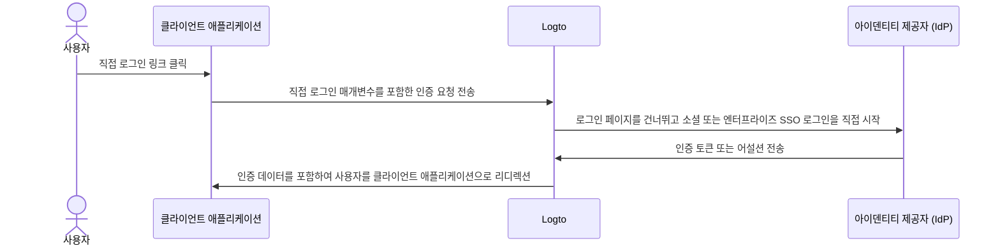

# 직접 로그인

직접 로그인은 기본적인 Logto 로그인 페이지를 우회하여 소셜 로그인 또는 엔터프라이즈 SSO를 직접 시작할 수 있게 해주는 Logto 전용 [인증 (Authentication) 매개변수](/end-user-flows/authentication-parameters)입니다.

이 기능은 웹사이트에 맞춤형 로그인 페이지나 IdP 로그인 진입점을 포함하고 있는 경우 특히 유용합니다 (사용 사례 보기). 직접 로그인을 사용하면 사용자를 IdP의 로그인 페이지로 직접 리디렉션할 수 있습니다.



## 소셜 로그인 \{#social-sign-in}

`direct_sign_in` 매개변수를 `social:<idp-name>` 값과 함께 전달하여 소셜 로그인 프로세스를 직접 시작하세요.

### 커넥터 IdP 이름을 찾는 방법 \{#where-to-find-the-connector-idp-name}

1. <CloudLink to="/connectors/social">콘솔 > 커넥터 > 소셜 커넥터</CloudLink>로 이동합니다.
2. 사용하려는 [소셜 커넥터](/connectors/social-connectors)를 클릭합니다.
3. 커넥터 설정 페이지 상단에서 아이덴티티 제공자 이름을 찾습니다.


### 예시 \{#example}

`direct_sign_in` 매개변수를 사용하여 자신의 인증 요청 URL을 만드세요:

```sh
curl --location \
  --request GET 'https://[tenant-id].logto.app/oidc/auth?client_id=1234567890&...&direct_sign_in=social:google'
```

지원되는 Logto SDK에서는 `signIn` 메서드를 호출할 때 `directSignIn` 매개변수를 설정할 수 있습니다:

```javascript
const authResult = await logto.signIn({
  redirectUri: 'https://your-app.com/callback',
  directSignIn: 'social:google',
});
```

## 엔터프라이즈 SSO \{#enterprise-sso}

`direct_sign_in` 매개변수를 `sso:<connector-id>` 값과 함께 전달하여 엔터프라이즈 SSO 로그인 프로세스를 직접 시작하세요.

### 엔터프라이즈 SSO 커넥터 ID를 찾는 방법 \{#where-to-find-the-enterprise-sso-connector-id}

1. <CloudLink to="/enterprise-sso">콘솔 > 엔터프라이즈 SSO</CloudLink>로 이동합니다.
2. 사용하려는 [엔터프라이즈 커넥터](/connectors/enterprise-connectors)를 클릭합니다.
3. 커넥터 설정 페이지 상단에서 커넥터 ID를 찾습니다.


### 예시 \{#example-1}

`direct_sign_in` 매개변수를 사용하여 자신의 인증 요청 URL을 만드세요:

```sh
curl --location \
  --request GET 'https://[tenant-id].logto.app/oidc/auth?client_id=1234567890&...&direct_sign_in=sso:1234567890'
```

지원되는 Logto SDK에서는 `signIn` 메서드를 호출할 때 `directSignIn` 매개변수를 설정할 수 있습니다:

```javascript
logtoClient.signIn({
  redirectUri: 'https://your-app.com/callback',
  directSignIn: 'sso:1234567890',
});
```

## 로그인 페이지로의 폴백 \{#fallback-to-the-sign-in-page}

직접 로그인 프로세스가 실패할 경우, 예를 들어 커넥터가 발견되지 않거나 활성화되지 않은 경우, 사용자는 표준 로그인 페이지로 리디렉션됩니다.

:::note
우리는 모든 Logto SDK에 `direct_sign_in` 매개변수에 대한 지원을 점진적으로 추가하고 있습니다. SDK에서 이를 찾을 수 없는 경우, 이슈를 열거나 저희에게 연락해 주세요.
:::

## 자주 묻는 질문 \{#faqs}

<details>
  <summary>

### 직접 로그인이 API 인증 (Authentication)과 동일한가요? \{#is-direct-sign-in-the-same-as-api-authentication}

</summary>

아니요, 직접 로그인은 기본 Logto 로그인 페이지를 건너뛰고 사용자를 소셜 또는 엔터프라이즈 SSO 제공자의 로그인 페이지로 직접 리디렉션할 수 있는 사용자 흐름 매개변수입니다. API 기반 인증과 달리, 사용자는 로그인 프로세스를 시작하기 위해 먼저 Logto 인증 엔드포인트로 리디렉션되어야 합니다.

</details>
