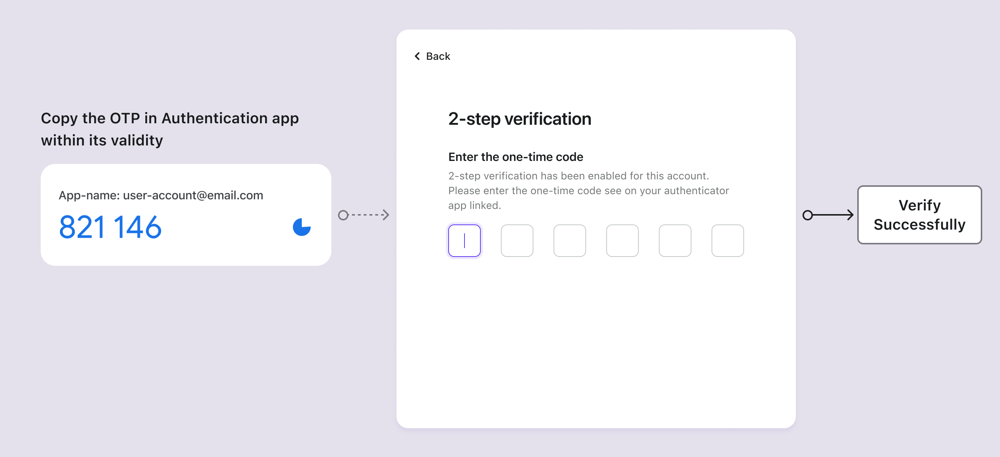

# 인증자 앱 OTP

## 개념 {#concepts}

인증자 앱, 소프트웨어 토큰이라고도 불리는 것은 가장 널리 채택된 [MFA](https://auth.wiki/mfa) 방법 중 하나입니다. 이는 온라인 서비스 인증의 보안을 강화하기 위해 일시적인 [일회용 비밀번호 (OTP)](https://auth.wiki/otp)를 생성합니다. 물리적 하드웨어 토큰과 달리, 소프트웨어 토큰은 일반적으로 사용자가 스마트폰이나 컴퓨터 브라우저에 설치하는 애플리케이션이나 플러그인입니다. 소프트웨어 토큰은 인증자의 기능과 개별 사용자 설정에 따라 단일 장치에서 로컬로 작동하거나 다양한 장치 간에 동기화할 수 있습니다.

소프트웨어 토큰의 인기 있는 예로는 Google Authenticator, Microsoft Authenticator, Duo, 1Password, Authy 등이 있습니다.

## 인증 흐름 {#authentication-flows}

### 인증 앱 OTP 설정 흐름 {#authentication-app-otp-setup-flows}

1. **QR 코드 또는 비밀 키**: 사용자는 서비스로부터 QR 코드 또는 비밀 키를 받습니다.
2. **계정 추가**: 인증자 앱을 사용하여 사용자는 QR 코드를 스캔하거나 비밀 키를 수동으로 입력하여 계정을 추가합니다.
3. **동적 일회용 비밀번호**: 인증자 앱은 추가된 계정에 대해 1-2분마다 갱신되는 6자리 코드를 표시합니다.
4. **MFA 설정 완료**: 사용자는 이 코드를 유효성 내에서 MFA 설정 페이지에 입력하여 인증자 앱 OTP의 MFA 설정을 완료합니다.

### 인증 앱 OTP 검증 흐름 {#authentication-app-otp-verification-flows}

1. **로그인 시도**: 로그인 중에 사용자는 MFA를 요청받습니다.
2. **OTP 가져오기**: 인증자 앱을 열어 해당 계정의 OTP를 가져옵니다.
3. **OTP 입력**: 사용자는 앱에 표시된 OTP를 유효성 내에서 2단계 인증 페이지에 입력합니다.
4. **인증**: 시스템은 OTP를 검증하여 성공적으로 확인되면 접근을 허용합니다.

