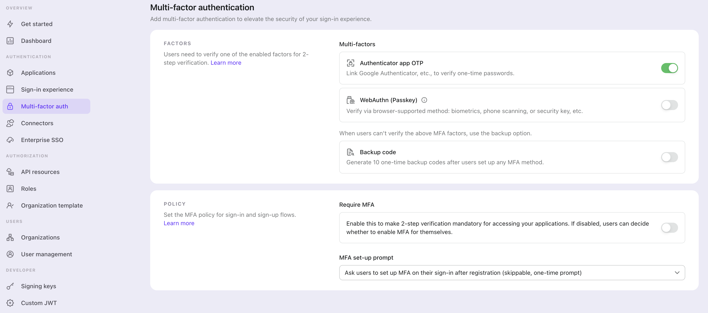

# MFA 구성

## Logto 에서 MFA 설정 구성하기 \{#configure-mfa-settings-in-logto}

사용자의 Logto 로그인 흐름에서 MFA를 활성화하려면 다음 단계를 따르세요:

1. 이동 경로: <CloudLink to="/mfa">Console > Multi-factor auth</CloudLink>.
2. 사용자에게 지원되는 인증 요소를 활성화하세요.
   1. 기본 요소:
      - [Authenticator App OTP](/end-user-flows/mfa/authenticator-app-otp): 가장 일반적이고 널리 인정받는 방법입니다. Google Authenticator 또는 Authy와 같은 인증 앱에서 생성된 시간 기반 일회용 비밀번호 (TOTP)를 사용합니다.
      - [Passkeys (WebAuthn)](/end-user-flows/mfa/webauthn): 장치 생체 인식 또는 보안 키 등을 지원하는 웹 제품에 적합한 고보안 옵션으로, 강력한 보호를 보장합니다.
   2. 백업 요소:
      - [백업 코드](/end-user-flows/mfa/backup-codes): 사용자가 위의 기본 요소를 확인할 수 없을 때 백업 옵션으로 사용됩니다. 이 옵션을 활성화하면 사용자가 성공적으로 접근하는 데 마찰을 줄일 수 있습니다.
3. **MFA 필수**를 활성화할지 선택하세요:
   - **활성화**: 사용자는 로그인 과정에서 MFA를 설정하라는 메시지를 받으며, 이를 건너뛸 수 없습니다. 사용자가 MFA 설정에 실패하거나 MFA 설정을 삭제하면, 다시 MFA를 설정할 때까지 계정에 접근할 수 없습니다.
   - **비활성화**: 사용자는 가입 흐름에서 MFA 설정 과정을 건너뛸 수 있습니다. 나중에 셀프 서비스 계정 설정 페이지를 통해 MFA를 설정할 수 있습니다. 사용자 계정 설정 페이지 구현에 대해 [자세히 알아보기](/end-user-flows/account-settings/). 그리고 MFA 설정 프롬프트에 대한 정책을 계속 선택하세요:
     - **사용자에게 MFA 설정을 요청하지 않음**: 사용자는 로그인 중에 MFA 설정을 요청받지 않습니다.
     - **등록 중 사용자에게 MFA 설정 요청**: 신규 사용자는 등록 중에 MFA 설정을 요청받고, 기존 사용자는 다음 로그인 시 프롬프트를 보게 됩니다. 사용자는 이 단계를 건너뛸 수 있으며, 다시 나타나지 않습니다.
     - **등록 후 로그인 시 사용자에게 MFA 설정 요청**: 신규 사용자는 등록 후 두 번째 로그인 시 MFA 설정을 요청받고, 기존 사용자는 다음 로그인 시 프롬프트를 보게 됩니다. 사용자는 이 단계를 건너뛸 수 있으며, 다시 나타나지 않습니다.

:::note
[조직](/organizations)을 지원하는 다중 테넌트 아키텍처를 가진 제품의 경우, 대부분의 경우 모든 사용자에게 MFA를 요구할 필요가 없습니다. 대신, 각 클라이언트의 요구에 따라 요구 사항을 맞춤화할 수 있도록 조직별로 MFA를 활성화할 수 있습니다. 시작하려면 [조직 구성원에 대한 MFA 요구](/organizations/organization-management#require-mfa-for-organization-members)를 참조하세요.
:::

## MFA 사용자 흐름 \{#mfa-user-flow}

### MFA 설정 흐름 \{#mfa-set-up-flow}

MFA가 활성화되면, 사용자는 로그인 및 가입 과정에서 MFA를 설정하라는 메시지를 받습니다. "사용자 제어 MFA" 정책이 활성화된 경우에만 사용자는 이 설정 과정을 건너뛸 수 있습니다.

1. **로그인 또는 가입 페이지 방문**: 사용자가 로그인 또는 가입 페이지로 이동합니다.
2. **로그인 또는 가입 완료**: 사용자가 로그인 또는 가입 흐름 내에서 아이덴티티 확인 과정을 완료합니다.
3. **MFA 기본 요소 설정**: 사용자는 기본 MFA 요소 (Authenticator 앱 OTP 또는 WebAuthn)를 설정하라는 메시지를 받습니다. 여러 기본 요소가 활성화된 경우, 사용자는 선호하는 옵션을 선택할 수 있습니다. "사용자 제어 MFA" 정책이 활성화된 경우, "건너뛰기" 버튼을 선택하여 이 단계를 건너뛸 수도 있습니다.
4. **MFA 백업 요소 설정**: **백업 코드**가 활성화된 경우, 사용자는 기본 인증 요소를 성공적으로 구성한 후 백업 코드를 설정하라는 메시지를 받습니다. 자동 생성된 백업 코드는 사용자에게 표시되며, 사용자는 이를 다운로드하고 안전하게 저장할 수 있습니다. 사용자는 MFA 설정 과정을 완료하기 위해 백업 코드를 수동으로 확인해야 합니다.

### MFA 인증 흐름 \{#mfa-verification-flow}

MFA를 설정한 사용자는 로그인 시 구성된 MFA 요소를 사용하여 아이덴티티를 확인하라는 메시지를 받습니다. 인증 요소는 Logto의 MFA 구성 및 사용자 설정에 따라 달라집니다.

- 사용자가 하나의 요소만 설정한 경우, 직접 확인합니다.
- 사용자가 여러 요소를 2FA로 설정한 경우, 하나를 선택하여 확인해야 합니다.
- 사용자가 사용할 수 있는 모든 기본 요소가 없고 백업 코드가 활성화된 경우, 일회용 백업 코드를 사용하여 아이덴티티를 확인할 수 있습니다.

