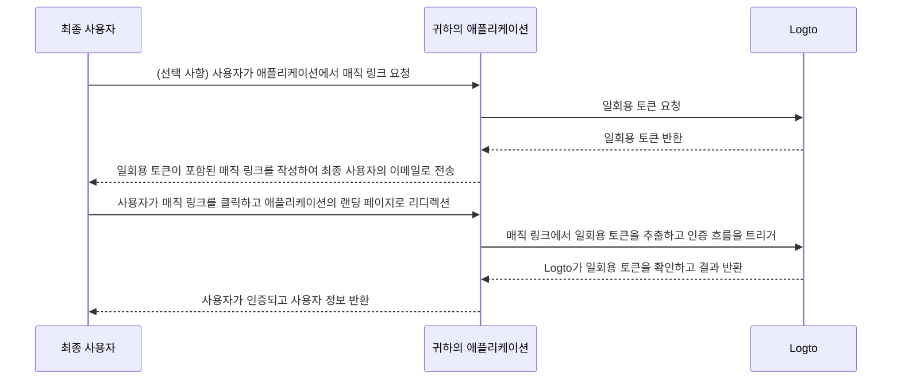

# 매직 링크 (일회용 토큰)

import Availability from '@components/Availability';

<Availability cloud oss="comingSoon" />

일회용 비밀번호 (OTP)와 유사하게, 일회용 토큰은 사용자의 아이덴티티를 확인하는 데 사용할 수 있는 또 다른 비밀번호 없는 인증 (Authentication) 방법입니다. 이 토큰은 제한된 시간 동안 유효하며, 최종 사용자의 이메일 주소와 연결됩니다.

때때로 사용자가 계정을 먼저 생성하지 않고도 애플리케이션 / 조직에 초대하고 싶을 수 있습니다. 또는 비밀번호를 잊어버리고 이메일을 통해 신속하게 본인 확인을 하여 로그인 / 비밀번호를 재설정하고 싶을 수 있습니다. 이러한 경우, 애플리케이션은 "매직 링크"를 이메일로 보낼 수 있습니다. 그리고 링크를 클릭하면 즉시 인증됩니다.

애플리케이션 개발자는 일회용 토큰을 사용하여 매직 링크를 작성하고 최종 사용자의 이메일 주소로 보낼 수 있습니다.

## 일회용 토큰 흐름 \{#one-time-token-flow}

다음은 일회용 토큰을 사용한 인증 흐름의 시퀀스 다이어그램입니다:



## 구현 가이드 \{#implementation-guide}

Logto는 매직 링크 구현을 용이하게 하기 위해 Management API와 Experience API 세트를 제공합니다.

시작하기 전에 Logto 인스턴스가 준비되어 있고, 애플리케이션 서버와 Logto 엔드포인트 간의 기계 간 연결이 설정되어 있는지 확인하세요 (Management API에 필요). [Logto Management API](/integrate-logto/interact-with-management-api)에 대해 자세히 알아보세요.

### 1단계: 일회용 토큰 요청 \{#step-1-request-one-time-token}

Logto Management API를 사용하여 일회용 토큰을 생성하세요.

```bash
POST /api/one-time-tokens
```

샘플 요청 본문 페이로드:

```json
{
  "email": "user@example.com",
  // 선택 사항. 기본값은 600 (10분)입니다.
  "expiresIn": 3600,
  // 선택 사항. 성공적인 확인 후 지정된 조직에 사용자가 프로비저닝됩니다.
  "context": {
    "jitOrganizationIds": ["abcdefgh1234"]
  }
}
```

### 2단계: 매직 링크 작성 \{#step-2-compose-your-magic-link}

일회용 토큰을 받은 후, 매직 링크를 작성하여 최종 사용자의 이메일 주소로 보낼 수 있습니다. 매직 링크에는 최소한 토큰과 사용자 이메일이 매개변수로 포함되어야 하며, 귀하의 애플리케이션의 랜딩 페이지로 이동해야 합니다. 예: `https://yourapp.com/landing-page`.

다음은 매직 링크가 어떻게 보일 수 있는지에 대한 간단한 예입니다:

```
https://yourapp.com/landing-page?token=YHwbXSXxQfL02IoxFqr1hGvkB13uTqcd&email=user@example.com
```

:::note

매직 링크의 매개변수 이름은 완전히 사용자 정의할 수 있습니다. 애플리케이션의 요구 사항에 따라 매직 링크에 추가 정보를 추가할 수 있으며, 모든 URL 매개변수를 인코딩할 수 있습니다.

:::

### 3단계: Logto SDK를 통해 인증 흐름 트리거 \{#step-3-trigger-the-authentication-flow-via-logto-sdk}

최종 사용자가 매직 링크를 클릭하고 애플리케이션으로 이동한 후, URL에서 `token`과 `email` 매개변수를 추출한 다음 Logto SDK의 `signIn()` 함수를 호출하여 인증 흐름을 트리거할 수 있습니다.

```typescript title="TokenLandingPage.tsx"
// React 예제
import { useLogto } from '@logto/react';
import { useEffect } from 'react';
import { useSearchParams } from 'react-router-dom';

const TokenLandingPage = () => {
  const { signIn } = useLogto();
  const [searchParams] = useSearchParams();

  useEffect(() => {
    // 매직 링크에서 토큰과 이메일 추출
    const oneTimeToken = searchParams.get('token');
    const email = searchParams.get('email');

    // 이것이 귀하의 로그인 리디렉션 URI라고 가정합니다
    const redirectUri = 'https://yourapp.com/callback';

    if (oneTimeToken && email) {
      signIn({
        redirectUri,
        clearTokens: false, // 선택 사항. 아래 경고 메시지 참조
        extraParams: {
          'one_time_token': oneTimeToken,
          'login_hint': email,
        },
      });
    }
  }, [searchParams, signIn]);

  return <>잠시만 기다려 주세요...</>;
};
```

:::warning

사용자가 이미 로그인한 경우, SDK의 `signIn()` 함수를 호출하면 클라이언트 저장소에서 모든 캐시된 토큰 (ID 토큰, 액세스 토큰, 리프레시 토큰)이 자동으로 삭제되어 현재 사용자의 인증 상태가 손실됩니다.

따라서 기존 토큰을 삭제하지 않도록 추가 로그인 매개변수 `clearTokens: false`를 지정해야 합니다. 이 경우, 로그인 콜백 페이지에서 토큰을 수동으로 삭제해야 합니다.

인증된 사용자를 위한 매직 링크가 아닌 경우 이 부분을 무시하세요.

:::

### 4단계: (선택 사항) 로그인 콜백 페이지에서 캐시된 토큰 삭제 \{#step-4-clear-cached-tokens-in-sign-in-callback-page}

로그인 함수에서 `clearTokens: false`를 지정한 경우, 로그인 콜백 페이지에서 토큰을 수동으로 삭제해야 합니다.

```typescript title="Callback.tsx"
// React 예제
import { useHandleSignInCallback, useLogto } from '@logto/react';
import { useEffect } from 'react';

const Callback = () => {
  const { clearAllTokens } = useLogto();

  useEffect(() => {
    void clearAllTokens();
  }, [clearAllTokens]);

  useHandleSignInCallback(() => {
    // 홈 페이지로 이동
  });

  return <>잠시만 기다려 주세요...</>;
};
```

## 자주 묻는 질문 \{#faqs}

<details>

<summary>

### 매직 링크를 사용하여 내 조직에 새 사용자를 초대할 수 있습니까? \{#can-i-use-the-magic-link-to-invite-new-users-to-my-organizations}

</summary>

예, 매직 링크를 사용하여 애플리케이션 및 조직에 새 사용자를 초대할 수 있습니다. 조직에 새 사용자를 초대하려면 요청 본문에 `jitOrganizationIds`를 지정하기만 하면 됩니다.

사용자는 성공적인 확인 후 자동으로 조직에 가입되며, 기본 조직 역할이 할당됩니다. 조직 세부 정보 페이지의 "Just-in-time 프로비저닝" 섹션을 확인하고 조직의 기본 역할을 구성하세요.

</details>

<details>

<summary>

### 일회용 토큰이 만료됩니까? \{#does-the-one-time-token-expire}

</summary>

예, 일회용 토큰은 지정된 `expiresIn` 시간 (초) 후에 만료됩니다. 기본 만료 시간은 10분입니다.

</details>

<details>

<summary>

### "로그인 경험"에서 사용자 등록을 비활성화하면 매직 링크를 사용하여 사용자를 초대할 수 있습니까? \{#if-i-disable-user-registration-in-sign-in-experience-can-i-still-use-magic-link-to-invite-users}

</summary>

예, "로그인 경험"에서 사용자 등록을 비활성화하더라도 매직 링크를 사용하여 사용자를 초대할 수 있습니다.

</details>

<details>

<summary>

### 사용자가 이미 로그인한 상태에서 다른 매직 링크를 클릭하면 어떻게 됩니까? \{#what-will-happen-if-a-user-already-signed-in-and-then-click-another-magic-link}

</summary>

다음과 같은 여러 시나리오가 있습니다:

1. 사용자가 이미 로그인한 상태에서 현재 사용자 계정과 연결된 매직 링크를 클릭한 경우. 이 경우 Logto는 여전히 일회용 토큰을 확인하고 필요에 따라 사용자를 지정된 조직에 프로비저닝합니다.
2. 사용자가 이미 로그인한 상태에서 다른 계정과 연결된 매직 링크를 클릭한 경우. 이 경우 Logto는 사용자가 새 계정으로 계속할지, 현재 계정으로 애플리케이션으로 돌아갈지를 묻습니다.
   1. 사용자가 새 계정으로 계속하기로 선택하면, Logto는 토큰 확인이 성공한 후 새 계정으로 전환합니다.
   2. 사용자가 현재 계정에 머물기로 선택하면, Logto는 토큰을 확인하지 않고 현재 계정으로 애플리케이션으로 돌아갑니다.
3. 로그인 프롬프트가 "login"으로 설정되어 있거나 "login"을 포함하는 경우, Logto는 계정 전환을 묻지 않고 일회용 토큰과 연결된 계정으로 자동 로그인합니다.

</details>
