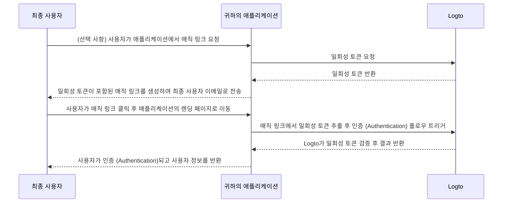

# 매직 링크 (일회성 토큰)

일회성 비밀번호 (OTP)와 유사하게, 일회성 토큰은 사용자의 아이덴티티를 검증할 수 있는 또 다른 비밀번호 없는 인증 (Authentication) 방식입니다.
이 토큰은 제한된 시간 동안만 유효하며, 최종 사용자의 이메일 주소와 연관되어 있습니다.

때로는 사용자가 먼저 계정을 생성하지 않아도 애플리케이션 / 조직에 초대하고 싶을 수 있습니다.
또는 비밀번호를 잊어버려 이메일을 통해 신속하게 본인 확인 후 로그인 / 비밀번호 재설정을 하고 싶을 수 있습니다.
이런 경우, 애플리케이션은 "매직 링크"를 이메일로 전송할 수 있습니다. 사용자가 해당 링크를 클릭하면 즉시 인증 (Authentication)됩니다.

애플리케이션 개발자는 일회성 토큰을 사용해 매직 링크를 만들고, 이를 최종 사용자의 이메일 주소로 전송할 수 있습니다.

## 사용 사례 \{#use-cases}

Logto는 매직 링크로 다음과 같은 시나리오를 지원합니다:

- **초대 전용 가입**: 내부 도구나 테스트 단계의 AI 제품 등에서 공개 가입을 비활성화하고, 특정 사용자에게만 매직 링크로 초대할 수 있습니다.
- **조직 구성원 초대**: SaaS 제품에서 매직 링크를 사용해 새로운 구성원을 조직에 초대하여 온보딩 과정을 간소화할 수 있습니다.
- **로그인 / 회원가입**: 이메일을 통해 비밀번호 없는 로그인 또는 회원가입을 위한 매직 링크를 전송할 수 있습니다.

예를 들어, 공개 가입을 비활성화한 경우, 일회성 토큰이 포함된 매직 링크(예: `https://yourapp.com/landing-page?token=YHwbXSXxQfL02IoxFqr1hGvkB13uTqcd&email=user@example.com`)를 사용자의 이메일로 보내 계정 생성을 완료하도록 초대할 수 있습니다. 이메일 템플릿은 자체 이메일 발송 서비스에서 자유롭게 커스터마이즈할 수 있습니다. 예시:


현재 지원하지 않는 기능:

- 매직 링크를 통한 비밀번호 재설정
- 전화번호 또는 사용자명을 식별자로 사용하는 것

## 일회성 토큰 플로우 \{#one-time-token-flow}

다음은 일회성 토큰을 사용하는 인증 (Authentication) 플로우의 시퀀스 다이어그램입니다:



## 구현 가이드 \{#implementation-guide}

Logto는 매직 링크 구현을 쉽게 할 수 있도록 Management API와 Experience API를 모두 제공합니다.

시작하기 전에 Logto 인스턴스가 준비되어 있고, 애플리케이션 서버와 Logto 엔드포인트 간에 기계 간 (M2M) 연결이 설정되어 있는지 확인하세요 (Management API에 필요). [Logto Management API](/integrate-logto/interact-with-management-api)에서 자세히 알아보세요.

### 1단계: 일회성 토큰 요청 \{#step-1-request-one-time-token}

Logto Management API를 사용해 일회성 토큰을 생성하세요.

```bash
POST /api/one-time-tokens
```

요청 본문 예시:

```json
{
  "email": "user@example.com",
  // 선택 사항. 기본값은 600 (10분)입니다.
  "expiresIn": 3600,
  // 선택 사항. 인증 (Authentication) 성공 시 지정된 조직에 사용자가 프로비저닝됩니다.
  "context": {
    "jitOrganizationIds": ["abcdefgh1234"]
  }
}
```

### 2단계: 매직 링크 생성 \{#step-2-compose-your-magic-link}

일회성 토큰을 받은 후, 매직 링크를 생성하여 최종 사용자의 이메일로 전송할 수 있습니다.
매직 링크에는 최소한 토큰과 사용자 이메일이 파라미터로 포함되어야 하며, 귀하의 애플리케이션 내 랜딩 페이지로 이동해야 합니다.
예: `https://yourapp.com/landing-page`

매직 링크 예시:

```
https://yourapp.com/landing-page?token=YHwbXSXxQfL02IoxFqr1hGvkB13uTqcd&email=user@example.com
```

:::note

매직 링크의 파라미터 이름은 완전히 커스터마이즈할 수 있습니다.
애플리케이션 요구사항에 따라 추가 정보를 매직 링크에 포함하거나, 모든 URL 파라미터를 인코딩할 수 있습니다.

:::

### 3단계: Logto SDK로 인증 (Authentication) 플로우 트리거 \{#step-3-trigger-the-authentication-flow-via-logto-sdk}

최종 사용자가 매직 링크를 클릭해 애플리케이션에 진입하면, URL에서 `token`과 `email` 파라미터를 추출한 뒤 Logto SDK의 `signIn()` 함수를 호출해 인증 (Authentication) 플로우를 트리거할 수 있습니다.

```typescript title="TokenLandingPage.tsx"
// React 예시
import { useLogto } from '@logto/react';
import { useEffect } from 'react';
import { useSearchParams } from 'react-router-dom';

const TokenLandingPage = () => {
  const { signIn } = useLogto();
  const [searchParams] = useSearchParams();

  useEffect(() => {
    // 매직 링크에서 토큰과 이메일 추출
    const oneTimeToken = searchParams.get('token');
    const email = searchParams.get('email');

    // 이 예시에서는 sign-in 리디렉션 URI
    const redirectUri = 'https://yourapp.com/callback';

    if (oneTimeToken && email) {
      signIn({
        redirectUri,
        clearTokens: false, // 선택 사항. 아래 경고 메시지 참고
        extraParams: {
          'one_time_token': oneTimeToken,
          'login_hint': email,
        },
      });
    }
  }, [searchParams, signIn]);

  return <>잠시만 기다려 주세요...</>;
};
```

:::warning

사용자가 이미 로그인된 상태에서 SDK의 `signIn()` 함수를 호출하면, 클라이언트 저장소에 있는 모든 캐시된 토큰 (ID 토큰, 액세스 토큰, 리프레시 토큰)이 자동으로 삭제되어 현재 사용자의 인증 (Authentication) 상태가 사라집니다.

따라서 기존 토큰 삭제를 방지하려면 추가 sign-in 파라미터로 `clearTokens: false`를 지정해야 합니다.
이 경우, sign-in 콜백 페이지에서 토큰을 직접 삭제해 주어야 합니다.

매직 링크가 인증된 사용자를 위한 것이 아니라면 이 안내를 무시해도 됩니다.

:::

### 4단계: (선택 사항) sign-in 콜백 페이지에서 캐시된 토큰 삭제 \{#step-4-clear-cached-tokens-in-sign-in-callback-page}

sign-in 함수에서 `clearTokens: false`를 지정했다면, sign-in 콜백 페이지에서 토큰을 직접 삭제해야 합니다.

```typescript title="Callback.tsx"
// React 예시
import { useHandleSignInCallback, useLogto } from '@logto/react';
import { useEffect } from 'react';

const Callback = () => {
  const { clearAllTokens } = useLogto();

  useEffect(() => {
    void clearAllTokens();
  }, [clearAllTokens]);

  useHandleSignInCallback(() => {
    // 홈 페이지로 이동
  });

  return <>잠시만 기다려 주세요...</>;
};
```

## 자주 묻는 질문 \{#faqs}

<details>

<summary>

### 매직 링크로 내 조직에 새로운 사용자를 초대할 수 있나요? \{#can-i-use-the-magic-link-to-invite-new-users-to-my-organizations}

</summary>

네, 매직 링크를 사용해 애플리케이션뿐만 아니라 조직에도 새로운 사용자를 초대할 수 있습니다.
조직에 새로운 사용자를 초대하려면 요청 본문에 `jitOrganizationIds`를 지정하면 됩니다.

사용자는 인증 (Authentication) 성공 시 자동으로 해당 조직에 가입되며, 기본 조직 역할이 할당됩니다.
조직 상세 페이지의 "Just-in-time 프로비저닝" 섹션에서 기본 역할을 설정할 수 있습니다.

</details>

<details>

<summary>

### 매직 링크로 사용자를 특정 역할에 할당할 수 있나요? \{#can-i-assign-users-to-specific-roles-using-the-magic-link}

</summary>

매직 링크 인증 (Authentication) 플로우는 사용자를 역할에 할당하는 기능을 지원하지 않습니다. 하지만 [Webhooks](/developers/webhooks) 및 [Management API](/user-management/manage-users#manage-roles-of-users)를 사용해 사용자가 등록된 후 역할을 업데이트할 수 있습니다.

</details>

<details>

<summary>

### 일회성 토큰은 만료되나요? \{#does-the-one-time-token-expire}

</summary>

네, 일회성 토큰은 지정한 `expiresIn` 시간(초 단위) 후 만료됩니다. 기본 만료 시간은 10분입니다.

</details>

<details>

<summary>

### "로그인 경험"에서 사용자 등록을 비활성화해도 매직 링크로 초대할 수 있나요? \{#if-i-disable-user-registration-in-sign-in-experience-can-i-still-use-magic-link-to-invite-users}

</summary>

네, "로그인 경험"에서 사용자 등록을 비활성화해도 매직 링크로 사용자를 초대할 수 있습니다.

</details>

<details>

<summary>

### 이미 로그인된 사용자가 또 다른 매직 링크를 클릭하면 어떻게 되나요? \{#what-will-happen-if-a-user-already-signed-in-and-then-click-another-magic-link}

</summary>

다음과 같은 여러 시나리오가 있습니다:

1. 사용자가 이미 로그인된 상태에서, 현재 계정과 연관된 매직 링크를 클릭한 경우. 이 경우 Logto는 일회성 토큰을 검증하고, 필요하다면 사용자를 지정된 조직에 프로비저닝합니다.
2. 사용자가 이미 로그인된 상태에서, 다른 계정과 연관된 매직 링크를 클릭한 경우. 이 경우 Logto는 사용자가 새 계정으로 계속 진행할지, 현재 계정으로 애플리케이션에 돌아갈지 선택하도록 안내합니다.
   1. 사용자가 새 계정으로 계속 진행을 선택하면, 토큰 검증이 성공한 후 Logto가 새 계정으로 전환합니다.
   2. 사용자가 현재 계정 유지를 선택하면, Logto는 토큰을 검증하지 않고 현재 계정으로 애플리케이션에 돌아갑니다.
3. sign-in 프롬프트가 "login" 또는 "login"을 포함하도록 설정된 경우, Logto는 전환 안내 없이 일회성 토큰과 연관된 계정으로 자동 로그인합니다. 이는 "login" 프롬프트가 명시적인 인증 (Authentication) 의도를 나타내기 때문이며, 현재 세션보다 우선합니다.

</details>
