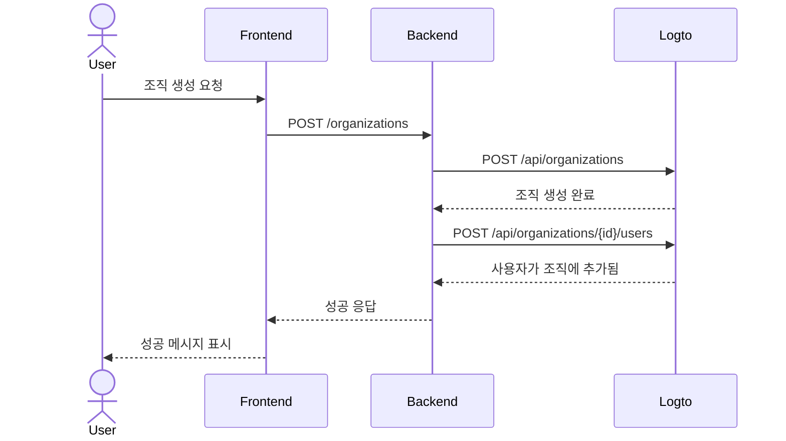

import GearIcon from '@site/src/assets/gear.svg';
import OrganizationIcon from '@site/src/assets/organization.svg';

# 조직 경험 (Organization experience)

[조직](/organizations) 경험은 비즈니스 고객과 그들의 직원들이 사용하는 UI 및 플로우의 집합입니다. 특히 [다중 테넌트 애플리케이션](https://auth.wiki/multi-tenancy)에서 그렇습니다. 이 가이드는 Logto Management API를 사용하여 애플리케이션에 이를 통합하는 방법을 보여줍니다.

이 섹션은 최종 사용자에게 **조직 경험 (Organization experience)**을 설계하는 데 도움을 줍니다. 예를 들어:

1. 관리자가 자신의 조직을 생성할 수 있습니다.
2. 관리자가 조직 구성원을 관리할 수 있습니다.
3. 관리자가 구성원을 조직에 초대할 수 있습니다.
4. 그 외 다양한 기능.

  

## 인증 플로우 이해하기 \{#understand-the-authentication-flow}

Logto Management API와 통합하려면, 먼저 기본 인증 플로우를 이해해야 합니다. 두 가지 주요 요구 사항이 있습니다:

### 백엔드 API 보호하기 \{#protect-your-backend-api}

- 프론트엔드에서 백엔드 API로의 호출은 인증이 필요합니다.
- 사용자의 Logto 액세스 토큰을 검증하여 API 엔드포인트를 보호하세요.
- 인증된 사용자만 서비스에 접근할 수 있도록 하세요.

### Logto Management API 접근 \{#access-the-logto-management-api}

- 백엔드 서비스가 Logto Management API를 안전하게 호출합니다.
- 설정 방법은 [Management API와 상호작용하기](/integrate-logto/interact-with-management-api) 가이드를 참고하세요.
- 액세스 자격 증명을 얻기 위해 기계 간 인증 (Machine-to-machine authentication)을 사용하세요.

다음 장에서는 Logto Management API 설정 방법과 조직 경험 (Organization experience) 구축을 위한 일반적인 사용 사례를 안내합니다.

## 조직 경험 기능 \{#features-for-organization-experience}

<DocCardList
  items={[
    {
      type: 'link',
      label: '조직 생성',
      href: '/end-user-flows/organization-experience/create-organization',
      description:
        'Logto Management API를 사용하여 최종 사용자가 제품에서 직접 조직을 생성할 수 있도록 합니다.',
      customProps: {
        icon: <OrganizationIcon />,
      },
    },
    {
      type: 'link',
      label: '조직에 구성원 초대',
      href: '/end-user-flows/organization-experience/invite-organization-members',
      description:
        'Logto Management API를 사용하여 조직 관리자가 구성원을 조직에 초대할 수 있도록 합니다.',
      customProps: {
        icon: <OrganizationIcon />,
      },
    },
    {
      type: 'link',
      label: '조직 관리',
      href: '/end-user-flows/organization-experience/organization-management',
      description:
        'Logto Management API를 사용하여 조직 관리자가 조직 내에서 구성원을 관리할 수 있도록 합니다.',
      customProps: {
        icon: <GearIcon />,
      },
    },
  ]}
/>

조직 정의, 구성원 개념, 조직 템플릿에 대한 자세한 설명은 [조직이 어떻게 동작하는지 이해하기](/organizations/understand-how-organizations-work)를 참고하세요.

## 관련 리소스 \{#related-resources}

<Url href="https://blog.logto.io/build-multi-tenant-saas-application">
  다중 테넌트 SaaS 애플리케이션 구축: 설계부터 구현까지 완벽 가이드
</Url>
