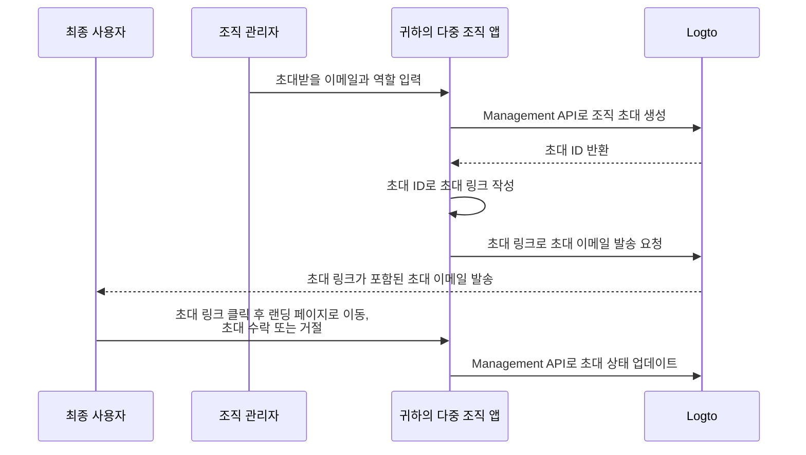

# 조직 구성원 초대

다중 조직 애플리케이션에서는 조직에 구성원을 초대하는 것이 일반적인 요구 사항입니다. 이 가이드에서는 이 기능을 구현하는 단계와 기술적인 세부 사항을 안내합니다.

## 흐름 개요 \{#flow-overview}

전체 프로세스는 아래 다이어그램에 나타나 있습니다:



## 조직 역할 생성 \{#create-organization-roles}

구성원을 초대하기 전에 조직 역할을 생성하세요. 역할과 권한에 대해 더 알고 싶다면 [조직 템플릿](/authorization/organization-template)을 참고하세요.

이 가이드에서는 `admin`과 `member`라는 두 가지 대표적인 조직 역할을 생성해보겠습니다.

`admin` 역할은 조직 내 모든 리소스에 대한 전체 접근 권한을 가지며, `member` 역할은 제한된 접근 권한을 가집니다. 예시:

- `admin` 역할:
  - `read:data` - 모든 조직 데이터 리소스 읽기 권한
  - `write:data` - 모든 조직 데이터 리소스 쓰기 권한
  - `delete:data` - 모든 조직 데이터 리소스 삭제 권한
  - `invite:member` - 조직에 구성원 초대
  - `manage:member` - 조직 내 구성원 관리
  - `delete:member` - 조직에서 구성원 제거
- `member` 역할:
  - `read:data` - 모든 조직 데이터 리소스 읽기 권한
  - `write:data` - 모든 조직 데이터 리소스 쓰기 권한
  - `invite:member` - 조직에 구성원 초대

이 작업은 [Logto Console](https://cloud.logto.io/)에서 쉽게 할 수 있습니다. 또한 [Logto Management API](https://openapi.logto.io/operation/operation-createorganizationrole)를 사용하여 프로그래밍 방식으로 조직 역할을 생성할 수도 있습니다.

## 이메일 커넥터 구성 \{#configure-your-email-connector}

초대는 이메일을 통해 전송되므로, [이메일 커넥터](/connectors/email-connectors)가 올바르게 구성되어 있는지 확인하세요. 초대를 보내려면, 사용 유형이 `OrganizationInvitation`인 [이메일 템플릿](/connectors/email-connectors/email-templates#email-template-types)을 구성해야 합니다. 조직(예: 이름, 로고) 및 초대자(예: 이메일, 이름) [변수](/connectors/email-connectors/email-templates#email-template-variables)를 내용에 포함할 수 있으며, 필요에 따라 [로컬라이즈된 템플릿](/connectors/email-connectors/email-templates#email-template-localization)도 커스터마이즈할 수 있습니다.

`OrganizationInvitation` 사용 유형의 샘플 이메일 템플릿은 아래와 같습니다:

```json
{
  "subject": "내 조직에 오신 것을 환영합니다",
  "content": "<p>{{organization.name}}에 이 <a href=\"{{link}}\" target=\"_blank\">링크</a>로 참여하세요.</p>",
  "usageType": "OrganizationInvitation",
  "type": "text/html"
}
```

이메일 내용의 `{{link}}` 플레이스홀더는 이메일이 발송될 때 실제 초대 링크로 대체됩니다.

:::note

Logto Cloud의 내장 “Logto 이메일 서비스”는 현재 `OrganizationInvitation` 사용 유형을 지원하지 않습니다. 대신, 자체 이메일 커넥터(예: SendGrid)를 구성하고 `OrganizationInvitation` 템플릿을 설정하세요.

:::

## Logto Management API로 초대 처리 \{#handle-invitations-with-logto-management-api}

:::note

아직 Logto Management API를 설정하지 않았다면, [Management API와 상호작용하기](/integrate-logto/interact-with-management-api)를 참고하세요.

:::

### Logto Management API로 조직 초대 생성 \{#create-an-organization-invitation-with-logto-management-api}

조직 기능에는 초대 관련 Management API가 있습니다. 이 API들을 통해 다음을 할 수 있습니다:

- `POST /api/organization-invitations`: 조직 역할이 할당된 조직 초대 생성
- `POST /api/one-time-tokens`: 초대 수락 시 인증을 위한 일회용 토큰 생성. [자세히 알아보기](/end-user-flows/one-time-token)
- `POST /api/organization-invitations/{id}/message`: 초대받는 사람에게 이메일로 조직 초대 전송  
  참고: 페이로드는 `link` 속성을 지원하므로, 초대 ID를 기반으로 직접 초대 링크를 작성할 수 있습니다. 예시:

  ```json
  {
    "link": "https://your-app.com/invitation/join?id=your-invitation-id&token=your-one-time-token&email=invitee-email"
  }
  ```
