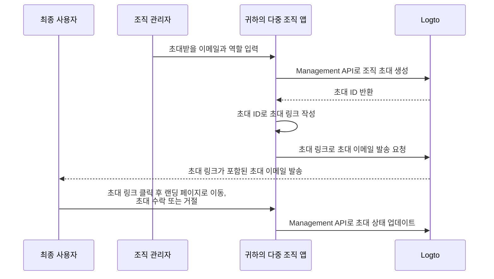

# 조직 구성원 초대하기

다중 조직 애플리케이션에서 일반적으로 요구되는 기능 중 하나는 조직에 구성원을 초대하는 것입니다. 이 가이드에서는 애플리케이션에서 이 기능을 구현하는 단계와 기술적 세부 사항을 안내합니다.

## 흐름 개요 \{#flow-overview}

전체 프로세스는 아래 다이어그램과 같이 설명됩니다:



## 조직 역할 생성하기 \{#create-organization-roles}

구성원을 조직에 초대하기 전에, 조직 역할을 생성해야 합니다. 조직 역할과 권한에 대해 더 알고 싶다면 [조직 템플릿](/authorization/organization-template)을 확인하세요.

이 가이드에서는 `admin`과 `member`라는 두 가지 일반적인 조직 역할을 생성해보겠습니다.

`admin` 역할은 조직 내 모든 리소스에 대한 전체 접근 권한을 가지며, `member` 역할은 제한된 접근 권한을 가집니다. 예를 들어, 각 역할은 다음과 같은 권한 세트를 가질 수 있습니다:

- `admin` 역할:
  - `read:data` - 모든 조직 데이터 리소스 읽기 권한
  - `write:data` - 모든 조직 데이터 리소스 쓰기 권한
  - `delete:data` - 모든 조직 데이터 리소스 삭제 권한
  - `invite:member` - 조직에 구성원 초대
  - `manage:member` - 조직 내 구성원 관리
  - `delete:member` - 조직에서 구성원 제거
- `member` 역할:
  - `read:data` - 모든 조직 데이터 리소스 읽기 권한
  - `write:data` - 모든 조직 데이터 리소스 쓰기 권한
  - `invite:member` - 조직에 구성원 초대

이 작업은 [Logto Console](https://cloud.logto.io/)에서 쉽게 할 수 있습니다. 또한 [Logto Management API](https://openapi.logto.io/operation/operation-createorganizationrole)를 사용하여 프로그래밍 방식으로 조직 역할을 생성할 수도 있습니다.

## 이메일 커넥터 구성하기 \{#configure-your-email-connector}

초대는 이메일을 통해 전송되므로, [이메일 커넥터](/connectors/email-connectors)가 올바르게 구성되어 있는지 확인하세요. 초대를 보내려면 [이메일 템플릿](/connectors/email-connectors/email-templates#email-template-types) 사용 유형 중 `OrganizationInvitation`을 구성해야 합니다. 이메일 내용에는 조직(예: 조직 이름, 로고) 및 초대자(예: 초대자 이메일, 이름) [변수](/connectors/email-connectors/email-templates#email-template-variables)를 포함하거나, 필요에 따라 [다국어 템플릿](/connectors/email-connectors/email-templates#email-template-localization)을 커스터마이즈할 수 있습니다.

`OrganizationInvitation` 사용 유형의 샘플 이메일 템플릿은 아래와 같습니다:

```json
{
  "subject": "우리 조직에 오신 것을 환영합니다",
  "content": "<p>{{organization.name}}에 이 <a href=\"{{link}}\" target=\"_blank\">링크</a>로 참여하세요.</p>",
  "usageType": "OrganizationInvitation",
  "type": "text/html"
}
```

이메일 내용의 `{{link}}` 자리표시는 이메일 전송 시 실제 초대 링크로 대체됩니다. 이 가이드에서는 `https://your-app.com/invitation/accept/{your-invitation-id}`와 같은 링크를 사용한다고 가정합니다.

:::note

Logto Cloud의 내장 "Logto email service"는 현재 `OrganizationInvitation` 사용 유형을 지원하지 않습니다. 대신, 이메일 커넥터(예: Sendgrid)를 구성하고 `OrganizationInvitation` 템플릿을 설정해야 합니다.

:::

## Logto Management API로 초대 처리하기 \{#handle-invitations-with-logto-management-api}

:::note

아직 Logto Management API를 설정하지 않았다면, [Management API와 상호작용하기](/integrate-logto/interact-with-management-api)를 참고하세요.

:::

### Cloud 및 OSS v1.27.0+ 사용자 \{#for-cloud-and-oss-v1-27-0-users}

이제 [매직 링크 (일회성 토큰)](/end-user-flows/one-time-token) 기능을 사용하여 초대 흐름을 처리할 수 있습니다.

Management API를 호출하여 일회성 토큰을 생성하고, 해당 토큰과 초대받을 이메일로 초대 매직 링크를 작성하세요.
위 이메일 템플릿의 `{{link}}` 자리에 이 링크를 삽입하여 초대자에게 이메일을 발송하면 됩니다.
초대 ID 대신 `https://your-app.com/landing-page?token={your-one-time-token}&email={invitee-email}`와 같은 링크를 사용할 수 있습니다.

이 방식은 초대받은 사용자가 아직 계정이 없는 경우에도 매직 링크로 자동 등록되므로 권장됩니다.

자세한 내용은 [매직 링크 (일회성 토큰)](/end-user-flows/one-time-token) 페이지를 참고하세요.

### OSS v1.26.0- 사용자 \{#for-oss-v1-26-0--users}

조직 기능에서 초대 관련 Management API 세트를 제공합니다. 이 API로 다음 작업을 할 수 있습니다:

- `POST /api/organization-invitations` 조직 역할이 할당된 조직 초대 생성
- `POST /api/organization-invitations/{id}/message` 초대받을 사람에게 이메일로 조직 초대 전송  
  참고: 이 API의 payload에는 `link` 속성이 있으며, 초대 ID를 기반으로 초대 링크를 작성할 수 있습니다. 예시:

  ```json
  {
    "link": "https://your-app.com/invitation/accept/{your-invitation-id}"
  }
  ```

  이에 따라, 초대받은 사용자가 초대 링크를 통해 애플리케이션에 접근할 때 사용할 랜딩 페이지를 구현해야 합니다.

- `GET /api/organization-invitations` & `GET /api/organization-invitations/{id}` 모든 초대 또는 특정 초대(초대 ID 기준) 조회  
  랜딩 페이지에서 이 API를 사용해 사용자가 받은 모든 초대 또는 특정 초대의 상세 정보를 표시할 수 있습니다.
- `PUT /api/organization-invitations/{id}/status` 초대 상태 업데이트로 초대 수락 또는 거절  
  이 API를 사용해 사용자의 초대 응답을 처리하세요.

## 조직 역할 기반 접근 제어 (RBAC)로 사용자 권한 관리하기 \{#use-organization-role-based-access-control-rbac-to-manage-user-permissions}

위 설정을 완료하면 이메일로 초대를 보내고, 초대받은 사용자가 할당된 역할로 조직에 참여할 수 있습니다.

서로 다른 조직 역할을 가진 사용자는 조직 토큰 내에서 서로 다른 스코프(권한)를 갖게 됩니다. 따라서 클라이언트 앱과 백엔드 서비스 모두 이 스코프를 확인하여 노출 기능과 허용 작업을 결정해야 합니다.

## 조직 토큰의 스코프 업데이트 처리하기 \{#handle-scope-updates-in-organization-tokens}

:::note
이 섹션은 조직 템플릿 및 인가 시나리오에 대한 고급 주제를 다룹니다. 해당 개념에 익숙하지 않다면 [인가 (Authorization)](/authorization) 및 [조직 템플릿](/authorization/organization-template)을 먼저 읽어보세요.
:::

조직 토큰의 스코프 업데이트 관리는 다음과 같습니다:

### 기존 스코프 철회하기 \{#revoking-existing-scopes}

예를 들어, 관리자를 일반 멤버로 강등하면 해당 사용자의 스코프가 제거되어야 합니다. 이 경우, 캐시된 조직 토큰을 단순히 삭제하고 리프레시 토큰으로 새 토큰을 받아오면 됩니다. 축소된 스코프는 새로 발급된 조직 토큰에 즉시 반영됩니다.

### 새 스코프 부여하기 \{#granting-new-scopes}

이 경우는 두 가지 시나리오로 나눌 수 있습니다:

#### 인증 시스템에 이미 정의된 새 스코프 부여 \{#grant-new-scopes-that-already-defined-in-your-auth-system}

스코프 철회와 유사하게, 새로 부여된 스코프가 이미 인증 서버에 등록되어 있다면, 새 조직 토큰을 발급받기만 하면 새 스코프가 즉시 반영됩니다.

#### 인증 시스템에 새로 도입된 스코프 부여 \{#grant-new-scopes-that-are-newly-introduced-your-auth-system}

이 경우, 사용자의 조직 토큰을 업데이트하기 위해 재로그인 또는 재동의 과정을 트리거해야 합니다. 예: Logto SDK의 `signIn` 메서드 호출.

### 실시간 권한 확인 및 조직 토큰 업데이트 구현하기 \{#implement-real-time-permission-check-and-update-organization-token}

Logto는 조직 내 사용자의 실시간 권한을 조회할 수 있는 Management API를 제공합니다.

- `GET /api/organizations/{id}/users/{userId}/scopes` ([API 참조](https://openapi.logto.io/operation/operation-listorganizationuserscopes))

이 API로 사용자의 조직 토큰 내 스코프와 실시간 권한을 비교하여 승격 또는 강등 여부를 판단할 수 있습니다.

- 강등된 경우, 캐시된 조직 토큰을 삭제하면 SDK가 자동으로 업데이트된 스코프로 새 토큰을 발급합니다.

  ```ts
  const { clearAccessToken } = useLogto();

  ...
  // 실시간 스코프가 조직 토큰 스코프보다 적을 경우
  await clearAccessToken();
  ```

  이 과정에서는 재로그인 또는 재동의가 필요하지 않습니다. Logto SDK가 자동으로 새 조직 토큰을 발급합니다.

- 인증 시스템에 새 스코프가 도입된 경우, 재로그인 또는 재동의 과정을 트리거하여 사용자의 조직 토큰을 업데이트해야 합니다. React SDK 예시:

  ```ts
  const { clearAllTokens, signIn } = useLogto();

  ...
  // 실시간 스코프에 새로 할당된 스코프가 있을 경우
  await clearAllTokens();
  signIn({
    redirectUri: '<your-sign-in-redirect-uri>',
    prompt: 'consent',
  });
  ```

  위 코드는 동의 화면으로 페이지 이동을 트리거하고, 사용자의 조직 토큰에 업데이트된 스코프가 반영된 상태로 앱으로 자동 리디렉션됩니다.

## 관련 리소스 \{#related-resources}

<Url href="https://blog.logto.io/implement-user-collaboration-in-your-app">
  다중 테넌트 앱에서 사용자 협업을 구현하는 방법
</Url>
