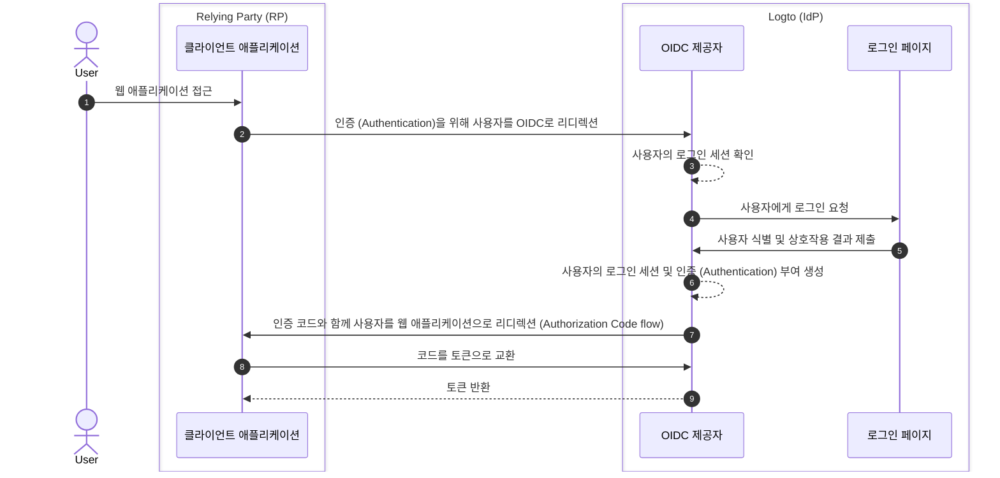

# 로그아웃 (Sign-out)

Logto (OIDC 기반 아이덴티티 제공자)에서의 로그아웃 프로세스는 Logto가 관리하는 중앙화된 로그인 세션과 클라이언트 애플리케이션이 관리하는 분산된 인증 상태가 모두 관여하기 때문에 다면적인 개념입니다.

## 로그인 세션 \{#sign-in-session}

로그아웃 프로세스를 더 잘 이해하려면, 먼저 Logto에서 사용자 로그인 세션과 인증 상태가 어떻게 관리되는지 이해하는 것이 중요합니다.



1. 사용자가 웹 애플리케이션 (RP)에 접근합니다.
2. 클라이언트 애플리케이션이 사용자를 Logto (IdP)로 [인증 (Authentication)](https://auth.wiki/authentication)을 위해 리디렉션합니다.
3. OIDC 제공자가 사용자의 로그인 세션 상태를 확인합니다. 세션이 없거나 만료된 경우, 사용자에게 로그인을 요청합니다.
4. 사용자가 로그인 페이지에서 상호작용하여 인증을 완료합니다.
5. 로그인에 성공하면, Logto가 사용자를 위한 새로운 세션을 생성하고, 인가 코드를 가지고 클라이언트 애플리케이션으로 리디렉션합니다.
6. OIDC 제공자가 사용자를 위한 새로운 로그인 세션과 인증 (Authentication) 부여를 생성합니다.
7. OIDC 제공자가 인증 코드와 함께 사용자를 클라이언트로 리디렉션합니다 ([Authorization Code flow](https://auth.wiki/authorization-code-flow)).
8. 클라이언트가 인증 코드를 받아 사용자 정보를 얻기 위해 토큰으로 교환합니다.
9. 클라이언트 애플리케이션에 토큰을 부여합니다.

## 구성 요소 \{#components}

### Logto가 관리하는 중앙화된 로그인 세션 \{#centralized-sign-in-session-managed-by-logto}

위의 흐름에서 중앙화된 로그인 세션은 Logto가 관리합니다. 사용자가 성공적으로 로그인하면 세션이 생성되고, 로그아웃 시 세션이 파기됩니다. 사용자의 세션이 만료되면 세션도 파기됩니다.

Logto 로그인 세션은 세션 쿠키를 사용하여 관리됩니다. 사용자가 로그인할 때 세션 쿠키가 설정됩니다. 모든 인증 (Authentication) 요청은 세션 쿠키를 기준으로 검증됩니다. 세션 쿠키가 존재하고 유효하다면 사용자는 자동으로 인증되어 인가 코드와 함께 클라이언트 애플리케이션으로 바로 리디렉션됩니다. 그렇지 않으면 사용자는 로그인하라는 요청을 받게 됩니다.

1. 공유 Logto 세션 쿠키  
   동일한 사용자 에이전트(예: 브라우저)에서 여러 클라이언트 애플리케이션에 로그인하는 사용자는 Logto 도메인 하에 공유 세션 쿠키를 갖게 됩니다. 즉, 한 번만 로그인하면 다른 클라이언트 애플리케이션에서도 자동으로 인증됩니다.

   ```mermaid
    flowchart TD
    subgraph User [사용자 에이전트 A]
      U[사용자]

      subgraph Layer1 [클라이언트 도메인 A]
        A[클라이언트 애플리케이션 A]
      end

      subgraph Layer1 [클라이언트 도메인 B]
        B[클라이언트 애플리케이션 B]
      end

      subgraph Layer2 [Logto 도메인]
          C{{Logto 로그인 세션?}}
          D[로그인 페이지]
      end
    end

    U --> |로그인| A
    A --> |Logto로 리디렉션| C
    U --> |로그인| B
    B --> |Logto로 리디렉션| C
    C --> |없음| D
    D --> |세션 생성| C
   ```

2. 분리된 Logto 세션 쿠키  
   서로 다른 기기나 브라우저에서 각각 다른 클라이언트 애플리케이션에 로그인하는 사용자는 Logto 도메인 하에 분리된 세션 쿠키를 갖게 됩니다. 즉, 각 클라이언트 애플리케이션마다 별도로 로그인해야 합니다.

   ```mermaid
    flowchart TD
    U[사용자]

    subgraph DeviceA [사용자 에이전트 A]
      subgraph Layer1 [클라이언트 도메인 A]
        A[클라이언트 애플리케이션 A]
      end

      subgraph Layer2 [Logto 도메인]
          C{{Logto 로그인 세션?}}
          D[로그인 페이지]
      end
    end

    subgraph DeviceB [사용자 에이전트 B]
      subgraph Layer3 [클라이언트 도메인 B]
        B[클라이언트 애플리케이션 B]
      end

      subgraph Layer4 [Logto 도메인]
          E{{Logto 로그인 세션?}}
          F[로그인 페이지]
      end
    end

    U --> |로그인| A
    A --> |Logto로 리디렉션| C
    U --> |로그인| B
    B --> |Logto로 리디렉션| E
    C --> |없음| D
    E --> |없음| F
    D --> |세션 생성| C
    F --> |세션 생성| E
   ```

## 클라이언트 애플리케이션이 관리하는 분산 인증 상태 \{#distributed-authentication-status-managed-by-the-client-applications}

각 클라이언트 애플리케이션은 자체적으로 인증 상태를 관리합니다. Native, SPA, Web 애플리케이션 모두 사용자 인증 상태를 관리하는 고유한 방법이 있습니다.

로그인에 성공하면, 클라이언트 애플리케이션은 [ID 토큰](https://auth.wiki/id-token) 및 [액세스 토큰](https://auth.wiki/access-token)을 받을 수 있습니다. 클라이언트 애플리케이션은 ID 토큰을 사용하여 사용자의 아이덴티티를 확인하고, 액세스 토큰을 사용하여 사용자의 리소스에 접근할 수 있습니다. 사용자의 인증 상태는 액세스 토큰의 만료 시간으로 표현됩니다.

- Native 및 SPA 애플리케이션:  
  클라이언트 애플리케이션은 사용자의 인증 상태를 유지하기 위해 이러한 토큰을 안전하게 저장하고 관리해야 합니다. 예를 들어, 토큰을 local storage 또는 session storage에 저장하고, 사용자가 로그아웃할 때 토큰을 삭제합니다.
- Web 애플리케이션:  
  Next.js와 같은 프레임워크로 구축된 웹 앱은 Logto에서 발급한 토큰과 별도로 로그인 사용자를 위한 자체 세션을 관리하는 경우가 많습니다. 사용자가 로그인하고 Logto에서 토큰을 받으면, SPA 애플리케이션처럼 클라이언트 측에 토큰을 저장하거나, 서버 측에 토큰을 저장하고 쿠키 또는 기타 메커니즘으로 세션을 관리할 수 있습니다.

## 로그아웃 메커니즘 \{#sign-out-mechanisms}

### 클라이언트 측에서 토큰 및 로컬 세션 삭제 \{#clear-tokens-and-local-session-at-the-client-side}

클라이언트 측에서 간단한 로그아웃은 로컬 세션을 삭제하고 local storage 또는 session storage에서 토큰 (ID 토큰, 액세스 토큰, 리프레시 토큰)을 제거하는 것입니다. 이 방식은 클라이언트 측에서만 로그아웃이 이루어지며, 중앙화된 세션은 그대로 남아 있습니다. 이 방식으로 로그아웃한 사용자는 중앙화된 인가 서버 세션이 만료되거나 적극적으로 파기되기 전까지는 다른 애플리케이션에 계속 접근할 수 있습니다.

### Logto에서 로그인 세션 삭제 \{#clear-sign-in-session-at-logto}

사용자를 명시적으로 로그아웃시키고 Logto에서 세션을 삭제하려면, 클라이언트 애플리케이션이 사용자를 Logto의 **end session endpoint**로 리디렉션해야 합니다.

예시: `https://{your-logto-domain}/oidc/session/end`

**end session endpoint**는 클라이언트 애플리케이션이 인가 서버에 사용자가 로그아웃했음을 알릴 수 있도록 하는 표준 OIDC 엔드포인트입니다. 이 엔드포인트는 Logto에서 중앙화된 로그인 세션을 삭제합니다.

세션이 삭제되면, 이후의 모든 인가 요청은 사용자가 다시 로그인해야 합니다.

**post-logout redirect URI**가 제공된 경우, 세션이 삭제된 후 사용자는 지정된 URI로 리디렉션됩니다. 그렇지 않으면, 사용자는 Logto가 호스팅하는 기본 로그아웃 후 페이지로 리디렉션됩니다.

## 연합 로그아웃: 백채널 로그아웃 \{#federated-sign-out-back-channel-logout}

더 일관된 로그아웃 관리를 위해, Logto는 [백채널 로그아웃](https://openid.net/specs/openid-connect-backchannel-1_0-final.html)을 지원합니다. 백채널 로그아웃은 사용자가 로그아웃할 때 동일한 로그인 세션 하의 모든 클라이언트 애플리케이션에 Logto가 알림을 보낼 수 있도록 하는 메커니즘입니다.

이는 사용자가 한 클라이언트 애플리케이션에서 로그아웃하고, 동일한 Logto 로그인 세션 하의 다른 모든 클라이언트 애플리케이션에서도 로그아웃되기를 기대하는 시나리오에서 특히 유용합니다.

클라이언트 애플리케이션에서 백채널 로그아웃을 활성화하려면, Logto 대시보드의 애플리케이션 상세 페이지에서 백채널 로그아웃 URI를 등록하세요. 사용자가 어떤 클라이언트 애플리케이션에서 로그아웃 요청을 시작하면, Logto는 등록된 모든 URI로 로그아웃 토큰을 전송합니다.

클라이언트 애플리케이션에서 로그아웃 토큰에 로그인 세션이 포함되어야 하는 경우, 백채널 로그아웃 설정에서 `Is session required` 옵션을 켜세요. 그러면 로그아웃 토큰에 사용자의 Logto 로그인 세션을 식별하는 `sid` 클레임이 포함됩니다.

1. 사용자가 한 클라이언트 애플리케이션에서 로그아웃 요청을 시작합니다.
2. Logto가 end session 요청을 받고, 로그아웃 토큰을 생성하여 등록된 모든 백채널 로그아웃 URI로 전송합니다.
3. 각 클라이언트 애플리케이션이 로그아웃 토큰을 받아 로그아웃 작업을 수행합니다.

클라이언트 애플리케이션이 로그아웃 토큰을 받을 때 수행하는 로그아웃 작업:

- 로그아웃 토큰 검증
- 로컬 세션 삭제 및 local storage 또는 session storage에서 토큰 제거

## Logto SDK에서의 로그아웃 방법 \{#sign-out-methods-in-logto-sdks}

Logto의 SDK를 사용하여 클라이언트 애플리케이션에 통합하는 경우:

- SPA 및 웹 애플리케이션에서는 `client.signOut()` 메서드가 로컬 토큰 저장소를 삭제하고 사용자를 Logto의 end session endpoint로 리디렉션합니다. 세션 삭제 후 사용자를 리디렉션할 **post-logout redirect URI**를 지정할 수 있습니다.
- 네이티브 애플리케이션(React Native, Flutter 등 하이브리드 앱 포함)에서는 로컬 토큰 저장소만 삭제됩니다. 네이티브 애플리케이션에서는 세션리스 웹뷰를 사용하여 로그인 과정을 처리하므로, 네이티브 브라우저에 세션 쿠키가 저장되지 않습니다. 따라서 Logto에서 로그인 세션을 삭제할 필요가 없습니다. 각 인증 (Authentication) 요청은 세션 쿠키 없이 독립적으로 처리됩니다.

:::note
세션리스 웹뷰를 지원하지 않거나 `emphasized` 설정을 인식하지 않는 네이티브 애플리케이션(Android 앱에서 **React Native** 또는 **Flutter** SDK 사용 등)의 경우, 인가 요청에 `prompt=login` 파라미터를 전달하여 사용자가 다시 로그인하도록 강제할 수 있습니다.
:::

## 매번 재인증 강제하기 \{#enforce-re-authentication-on-every-access}

고보안 시나리오(예: 민감한 작업 전 사용자 아이덴티티 재확인)에서는 매번 사용자가 재인증하도록 요구할 수 있습니다. 이 동작을 강제하려면 인증 (Authentication) 요청에 `prompt=login`을 포함하세요.

`prompt=login`을 설정하면 사용자가 활성 세션이 있거나 최근에 로그인했더라도 Logto가 항상 로그인 페이지를 표시하도록 강제합니다. 이는 싱글 사인온 (SSO) 동작을 우회하고, 매번 사용자에게 자격 증명을 입력하도록 보장합니다.

앱이 offline_access 스코프(리프레시 토큰 발급)를 요청하는 경우, OpenID Connect 명세에 따라 `prompt=consent`도 함께 포함해야 합니다.  
대부분의 경우, 재인증을 강제하고 리프레시 토큰 발급을 보장하려면 다음과 같이 설정하세요:

```
prompt=login consent
```

이렇게 하면 사용자가 재인증되고, 오프라인 접근에 명시적으로 동의하게 됩니다.

## 자주 묻는 질문 \{#faqs}

<details>
  <summary>

### 백채널 로그아웃 알림을 받지 못하고 있습니다. \{#im-not-receiving-the-back-channel-logout-notifications}

</summary>

- Logto 대시보드에서 백채널 로그아웃 URI가 올바르게 등록되어 있는지 확인하세요.
- 클라이언트 애플리케이션에 유효한 활성 로그인 세션이 있고, 로그아웃 요청을 시작한 세션과 동일한 세션인지 확인하세요.

</details>

## 관련 리소스 \{#related-resources}

<Url href="https://blog.logto.io/oidc-back-channel-logout/">OIDC 백채널 로그아웃 이해하기.</Url>
