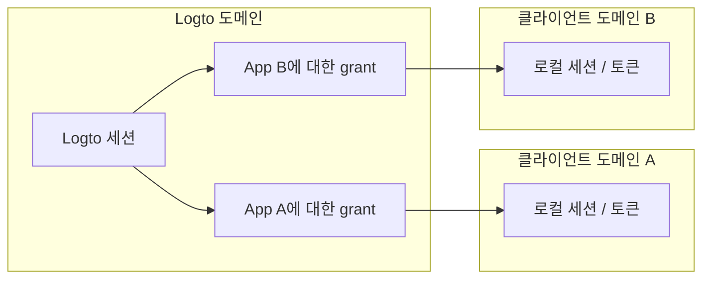
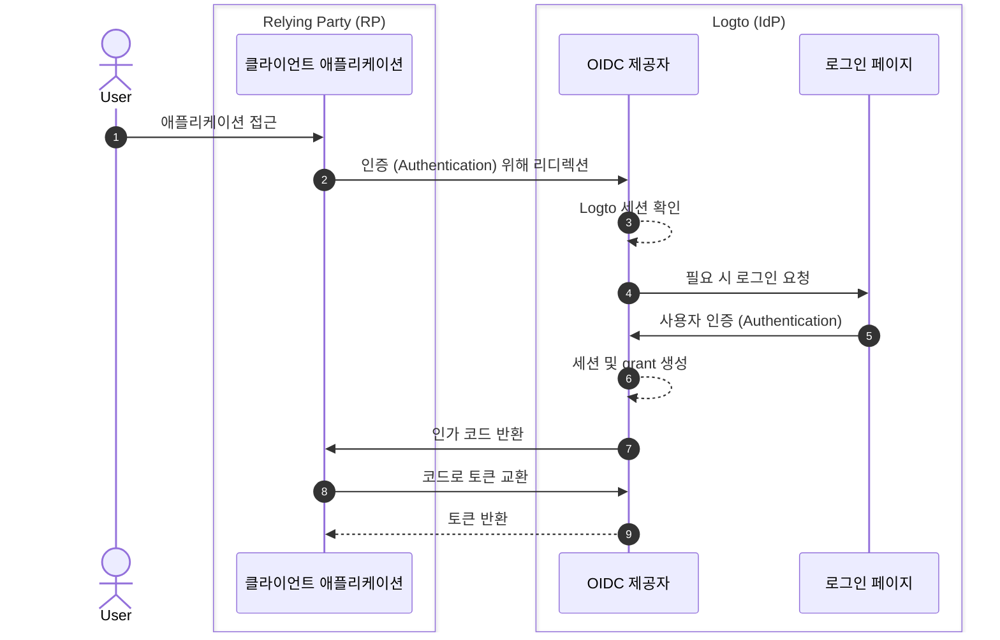
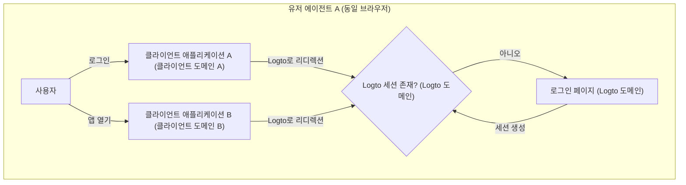
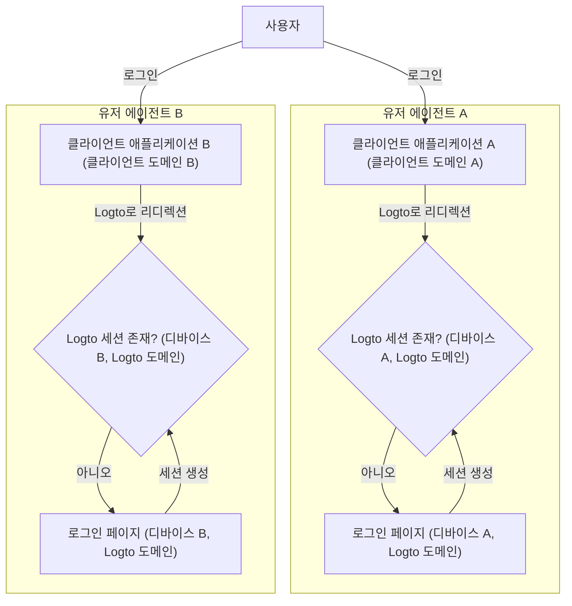
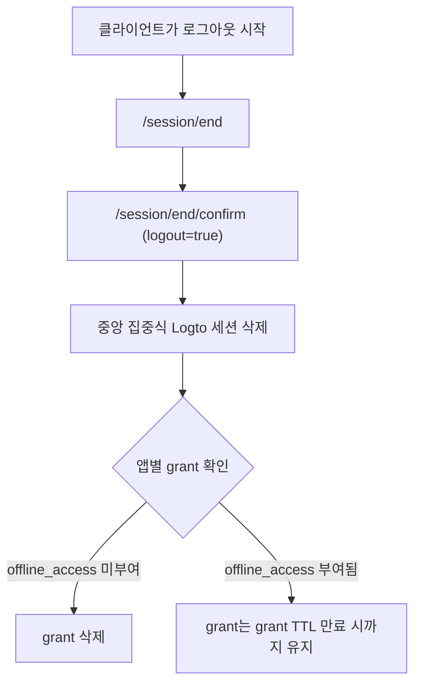

# 로그아웃

Logto( OIDC 아이덴티티 제공자 (IdP)로서 )에서의 로그아웃은 다음 두 가지를 모두 포함합니다:

- **중앙 집중식 Logto 세션** (Logto 도메인 아래의 브라우저 쿠키)
- **분산된 클라이언트 측 인증 상태** (각 앱의 토큰 및 로컬 앱 세션)

로그아웃 동작을 이해하려면 이 두 계층을 분리해서 보고, **grant**가 이 둘을 어떻게 연결하는지 살펴보는 것이 도움이 됩니다.

## 핵심 개념 \{#core-concepts}

### Logto 세션이란? \{#what-is-a-logto-session}

Logto 세션은 Logto가 관리하는 중앙 집중식 로그인 상태입니다. 인증 (Authentication)에 성공한 후 생성되며, Logto 도메인 아래의 쿠키로 표현됩니다.

세션 쿠키가 유효하다면, 사용자는 동일한 Logto 테넌트를 신뢰하는 여러 앱에서 조용히 인증 (SSO)될 수 있습니다.

유효한 세션이 없다면, Logto는 로그인 페이지를 표시합니다.

### grant란 무엇인가요? \{#what-are-grants}

**grant**는 특정 사용자 + 클라이언트 애플리케이션 조합에 대한 인가 (Authorization) 상태를 나타냅니다.

- 하나의 Logto 세션은 여러 클라이언트 앱에 대한 grant를 가질 수 있습니다.
- grant는 발급된 토큰이 연결되는 단위입니다.
- 이 문서 세트에서는 **grant**를 앱 간 인가 단위로 사용합니다.

### 세션, grant, 클라이언트 인증 상태의 관계 \{#how-session-grants-and-client-auth-status-relate}


```mermaid
flowchart LR
  subgraph Logto [Logto 도메인]
    S[Logto 세션]
    G1[App A에 대한 grant]
    G2[App B에 대한 grant]
  end

  subgraph AppA [클라이언트 도메인 A]
    A[로컬 세션 / 토큰]
  end

  subgraph AppB [클라이언트 도메인 B]
    B[로컬 세션 / 토큰]
  end

  S --> G1
  S --> G2
  G1 --> A
  G2 --> B
```

- **Logto 세션**은 중앙 집중식 SSO 경험을 제어합니다.
- **클라이언트 로컬 세션/토큰**은 각 앱이 현재 사용자를 로그인 상태로 간주하는지 제어합니다.
- **grant**는 앱별 인가 상태를 나타내며 이 두 세계를 연결합니다.

## 로그인 요약 (로그아웃이 다계층인 이유) \{#sign-in-recap-why-sign-out-is-multi-layered}


```mermaid
sequenceDiagram
  autonumber
  actor User

  box Relying Party (RP)
    participant Client as 클라이언트 애플리케이션
  end

  box Logto (IdP)
    participant OIDC as OIDC 제공자
    participant SignIn as 로그인 페이지
  end

  User ->> Client: 애플리케이션 접근
  Client ->> OIDC: 인증 (Authentication) 위해 리디렉션
  OIDC -->> OIDC: Logto 세션 확인
  OIDC ->> SignIn: 필요 시 로그인 요청
  SignIn ->> OIDC: 사용자 인증 (Authentication)
  OIDC -->> OIDC: 세션 및 grant 생성
  OIDC ->> Client: 인가 코드 반환
  Client ->> OIDC: 코드로 토큰 교환
  OIDC -->> Client: 토큰 반환
```

## 앱/디바이스 간 세션 토폴로지 \{#session-topology-across-apps-devices}

### 공유 세션 쿠키 (동일 브라우저/유저 에이전트) \{#shared-session-cookie-same-browser-user-agent}

사용자가 동일 브라우저에서 여러 앱에 로그인하면, 해당 앱들은 동일한 Logto 세션 쿠키를 재사용할 수 있으며 SSO 동작이 적용됩니다.


```mermaid
flowchart TD
  U[사용자]
  A["클라이언트 애플리케이션 A (클라이언트 도메인 A)"]
  B["클라이언트 애플리케이션 B (클라이언트 도메인 B)"]
  C{"Logto 세션 존재? (Logto 도메인)"}
  D["로그인 페이지 (Logto 도메인)"]

  subgraph UA["유저 에이전트 A (동일 브라우저)"]
    U
    A
    B
    C
    D
  end

  U -->|로그인| A
  A -->|Logto로 리디렉션| C
  U -->|앱 열기| B
  B -->|Logto로 리디렉션| C
  C -->|아니오| D
  D -->|세션 생성| C
```

### 분리된 세션 쿠키 (다른 디바이스/브라우저) \{#isolated-session-cookies-different-devices-browsers}

다른 브라우저/디바이스는 서로 다른 Logto 쿠키를 가지므로, 로그인 세션 상태가 분리됩니다.


```mermaid
flowchart TD
  U[사용자]
  A["클라이언트 애플리케이션 A (클라이언트 도메인 A)"]
  C{"Logto 세션 존재? (디바이스 A, Logto 도메인)"}
  D["로그인 페이지 (디바이스 A, Logto 도메인)"]

  subgraph DeviceA["유저 에이전트 A"]
    A
    C
    D
  end

  B["클라이언트 애플리케이션 B (클라이언트 도메인 B)"]
  E{"Logto 세션 존재? (디바이스 B, Logto 도메인)"}
  F["로그인 페이지 (디바이스 B, Logto 도메인)"]

  subgraph DeviceB["유저 에이전트 B"]
    B
    E
    F
  end

  U -->|로그인| A
  A -->|Logto로 리디렉션| C
  U -->|로그인| B
  B -->|Logto로 리디렉션| E
  C -->|아니오| D
  E -->|아니오| F
  D -->|세션 생성| C
  F -->|세션 생성| E
```

## 로그아웃 메커니즘 \{#sign-out-mechanisms}

### 1) 클라이언트 측 로그아웃만 수행 \{#1-client-side-only-sign-out}

클라이언트 앱이 자체 로컬 세션과 토큰 (ID / 액세스 / 리프레시 토큰)을 삭제합니다. 이는 해당 앱의 로컬 상태에서만 사용자를 로그아웃시킵니다.

- Logto 세션은 여전히 활성일 수 있습니다.
- 동일 Logto 세션 하의 다른 앱들은 여전히 SSO가 가능합니다.

### 2) Logto에서 세션 종료 (현재 Logto 구현에서의 글로벌 로그아웃) \{#2-end-session-at-logto-global-sign-out-in-current-logto-implementation}

중앙 집중식 Logto 세션을 삭제하려면, 앱이 사용자를 end session 엔드포인트로 리디렉션합니다. 예시:

`https://{your-logto-domain}/oidc/session/end`

현재 Logto SDK 동작:

1. `signOut()`이 `/session/end`로 리디렉션합니다.
2. 이후 `/session/end/confirm`으로 이동합니다.
3. 기본 confirm 폼이 `logout=true`로 자동 전송됩니다.

결과적으로, 현재 SDK 로그아웃은 **글로벌 로그아웃**으로 처리됩니다.

### 글로벌 로그아웃 시 일어나는 일 \{#what-happens-during-global-sign-out}


```mermaid
flowchart TD
  A["클라이언트가 로그아웃 시작"] --> B["/session/end"]
  B --> C["/session/end/confirm (logout=true)"]
  C --> D["중앙 집중식 Logto 세션 삭제"]
  D --> E{"앱별 grant 확인"}
  E -->|"offline_access 미부여"| F["grant 삭제"]
  E -->|"offline_access 부여됨"| G["grant는 grant TTL 만료 시까지 유지"]
```

글로벌 로그아웃 중:

- 중앙 집중식 Logto 세션이 삭제됩니다.
- 관련 앱 grant는 앱별 인가 상태에 따라 처리됩니다:
  - `offline_access`가 **부여되지 않은 경우**, 관련 grant가 삭제됩니다.
  - `offline_access`가 **부여된 경우**, end-session으로 grant가 삭제되지 않습니다.
- `offline_access`의 경우, 리프레시 토큰과 grant는 만료 시점까지 유효합니다.

## grant 수명 및 `offline_access` 영향 \{#grant-lifetime-and-offline-access-impact}

- 기본 Logto grant TTL은 **180일**입니다.
- `offline_access`가 부여된 경우, end-session은 해당 앱 grant를 기본적으로 삭제하지 않습니다.
- 해당 grant와 연결된 리프레시 토큰 체인은 grant가 만료(또는 명시적으로 삭제)될 때까지 계속 유효합니다.

## 연합 로그아웃: 백채널 로그아웃 \{#federated-sign-out-back-channel-logout}

앱 간 일관성을 위해, Logto는 [백채널 로그아웃](https://openid.net/specs/openid-connect-backchannel-1_0-final.html)을 지원합니다.

한 앱에서 사용자가 로그아웃하면, Logto는 동일 세션에 참여하는 모든 앱에 로그아웃 토큰을 각 앱의 등록된 백채널 로그아웃 URI로 전송할 수 있습니다.

앱 백채널 설정에서 `Is session required`가 활성화된 경우, 로그아웃 토큰에 Logto 세션을 식별하는 `sid`가 포함됩니다.

일반적인 흐름:

1. 사용자가 한 앱에서 로그아웃을 시작합니다.
2. Logto가 end-session을 처리하고, 등록된 백채널 로그아웃 URI(들)로 로그아웃 토큰을 전송합니다.
3. 각 앱은 로그아웃 토큰을 검증하고 자체 로컬 세션/토큰을 삭제합니다.

## Logto SDK에서의 로그아웃 방식 \{#sign-out-methods-in-logto-sdks}

- **SPA 및 웹**: `client.signOut()`은 로컬 토큰 저장소를 삭제하고 Logto end-session 엔드포인트로 리디렉션합니다. 로그아웃 후 리디렉션 URI를 지정할 수 있습니다.
- **네이티브 (React Native / Flutter 포함)**: 일반적으로 로컬 토큰 저장소만 삭제합니다. 세션 없는 웹뷰이므로 삭제할 Logto 브라우저 쿠키가 없습니다.

:::note
세션 없는 웹뷰를 지원하지 않거나 `emphasized` 설정을 인식하지 않는 네이티브 애플리케이션 (예: **React Native** 또는 **Flutter** SDK를 사용하는 Android 앱)의 경우, 인증 요청에 `prompt=login` 파라미터를 추가하여 사용자가 다시 로그인하도록 강제할 수 있습니다.
:::

## 매번 재인증 강제하기 \{#enforce-re-authentication-on-every-access}

보안이 중요한 작업의 경우, 인증 (Authentication) 요청에 `prompt=login`을 포함하여 SSO를 우회하고 매번 자격 증명 입력을 강제할 수 있습니다.

리프레시 토큰을 받기 위해 `offline_access`를 요청하는 경우, `consent`, `prompt=login consent`도 함께 포함하세요.

일반적인 조합 예시:

```txt
prompt=login consent
```

## 자주 묻는 질문 \{#faqs}

<details>
  <summary>

### 백채널 로그아웃 알림을 받지 못하고 있습니다. \{#im-not-receiving-the-back-channel-logout-notifications}

</summary>

- Logto 대시보드에서 백채널 로그아웃 URI가 올바르게 등록되어 있는지 확인하세요.
- 앱이 동일 사용자/세션 컨텍스트에 대해 활성 로그인 상태인지 확인하세요.

</details>

## 관련 리소스 \{#related-resources}

<Url href="https://blog.logto.io/oidc-back-channel-logout/">OIDC 백채널 로그아웃 이해하기.</Url>
