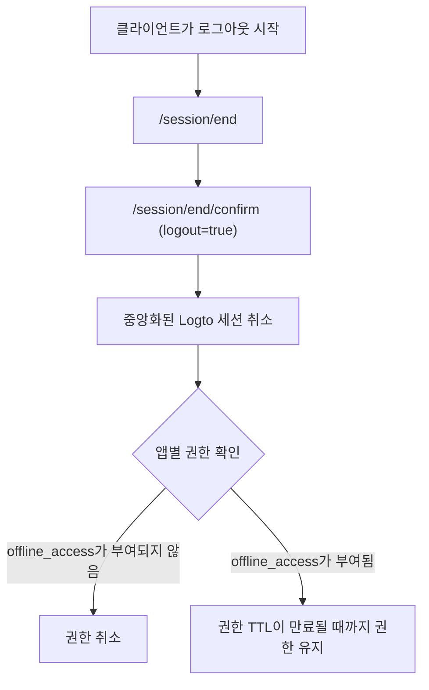

# 로그아웃

Logto에서 로그아웃은 두 가지 계층으로 구성됩니다:

- **Logto 세션 로그아웃**: Logto 도메인 하에서 중앙화된 로그인 세션을 종료합니다.
- **앱 로그아웃**: 클라이언트 애플리케이션에서 로컬 세션 상태와 토큰을 지웁니다.

Logto에서 세션이 어떻게 작동하는지 더 잘 이해하려면 [세션](/sessions)을 참조하세요.

## 로그아웃 메커니즘 \{#sign-out-mechanisms}

### 1) 클라이언트 측에서만 로그아웃 \{#1-client-side-only-sign-out}

클라이언트 앱은 자체 로컬 세션과 토큰 (ID / 액세스 / 리프레시 토큰)을 지웁니다. 이는 사용자를 해당 앱의 로컬 상태에서만 로그아웃시킵니다.

- Logto 세션은 여전히 활성 상태일 수 있습니다.
- 동일한 Logto 세션 하의 다른 앱은 여전히 SSO를 사용할 수 있습니다.

### 2) Logto에서 세션 종료 (현재 Logto 구현에서의 글로벌 로그아웃) \{#2-end-session-at-logto-global-sign-out-in-current-logto-implementation}

중앙화된 Logto 세션을 지우기 위해, 앱은 사용자를 세션 종료 엔드포인트로 리디렉션합니다. 예를 들어:

`https://{your-logto-domain}/oidc/session/end`

현재 Logto SDK 동작에서는:

1. `signOut()`이 `/session/end`로 리디렉션합니다.
2. 그런 다음 `/session/end/confirm`으로 이동합니다.
3. 기본 확인 양식이 `logout=true`를 자동으로 게시합니다.

결과적으로, 현재 SDK 로그아웃은 **글로벌 로그아웃**으로 처리됩니다.

:::note

- **글로벌 로그아웃**: 중앙화된 Logto 세션을 취소합니다.

:::

### 글로벌 로그아웃 중에 발생하는 일 \{#what-happens-during-global-sign-out}


```mermaid
flowchart TD
  A["클라이언트가 로그아웃 시작"] --> B["/session/end"]
  B --> C["/session/end/confirm (logout=true)"]
  C --> D["중앙화된 Logto 세션 취소"]
  D --> E{"앱별 권한 확인"}
  E -->|"offline_access가 부여되지 않음"| F["권한 취소"]
  E -->|"offline_access가 부여됨"| G["권한 TTL이 만료될 때까지 권한 유지"]
```

글로벌 로그아웃 중:

- 중앙화된 Logto 세션이 취소됩니다.
- 관련 앱 권한은 앱 인가 상태에 따라 처리됩니다:
  - `offline_access`가 **부여되지 않은** 경우, 관련 권한이 취소됩니다.
  - `offline_access`가 **부여된** 경우, 세션 종료로 권한이 취소되지 않습니다.
- `offline_access`의 경우, 리프레시 토큰과 권한은 권한 만료까지 유효합니다.

## 권한 수명과 `offline_access` 영향 \{#grant-lifetime-and-offline-access-impact}

- 기본 Logto 권한 TTL은 **180일**입니다.
- `offline_access`가 부여된 경우, 세션 종료는 기본적으로 해당 앱 권한을 취소하지 않습니다.
- 해당 권한과 관련된 리프레시 토큰 체인은 권한이 만료될 때까지 계속될 수 있습니다 (또는 명시적으로 취소될 때까지).

## 연합 로그아웃: 백채널 로그아웃 \{#federated-sign-out-back-channel-logout}

앱 간 일관성을 위해, Logto는 [백채널 로그아웃](https://openid.net/specs/openid-connect-backchannel-1_0-final.html)을 지원합니다.

사용자가 한 앱에서 로그아웃할 때, Logto는 동일한 세션에 참여하는 모든 앱에 로그아웃 토큰을 각 앱의 등록된 백채널 로그아웃 URI로 보낼 수 있습니다.

앱 백채널 설정에서 `Is session required`가 활성화된 경우, 로그아웃 토큰에는 Logto 세션을 식별하기 위한 `sid`가 포함됩니다.

일반적인 흐름:

1. 사용자가 한 앱에서 로그아웃을 시작합니다.
2. Logto가 세션 종료를 처리하고 등록된 백채널 로그아웃 URI로 로그아웃 토큰을 보냅니다.
3. 각 앱은 로그아웃 토큰을 검증하고 자체 로컬 세션 / 토큰을 지웁니다.

## Logto SDK에서의 로그아웃 방법 \{#sign-out-methods-in-logto-sdks}

- **SPA 및 웹**: `client.signOut()`은 로컬 토큰 저장소를 지우고 Logto 세션 종료 엔드포인트로 리디렉션합니다. 로그아웃 후 리디렉션 URI를 제공할 수 있습니다.
- **네이티브 (React Native / Flutter 포함)**: 일반적으로 로컬 토큰 저장소만 지웁니다. 세션 없는 웹뷰는 지울 지속적인 Logto 브라우저 쿠키가 없음을 의미합니다.

:::note
세션 없는 웹뷰를 지원하지 않거나 `emphasized` 설정을 인식하지 않는 네이티브 애플리케이션 (예: **React Native** 또는 **Flutter** SDK를 사용하는 Android 앱)의 경우, 인가 요청에 `prompt=login` 매개변수를 전달하여 사용자가 다시 로그인하도록 강제할 수 있습니다.
:::

## 모든 접근 시 재인증 강제 \{#enforce-re-authentication-on-every-access}

고보안 작업의 경우, 인증 요청에 `prompt=login`을 포함하여 SSO를 우회하고 매번 자격 증명을 입력하도록 강제합니다.

리프레시 토큰을 받기 위해 `offline_access`를 요청하는 경우, `consent`, `prompt=login consent`도 포함합니다.

일반적인 결합 설정:

```txt
prompt=login consent
```

## 자주 묻는 질문 \{#faqs}

<details>
  <summary>

### 백채널 로그아웃 알림을 받지 못하고 있습니다. \{#im-not-receiving-the-back-channel-logout-notifications}

</summary>

- Logto 대시보드에 백채널 로그아웃 URI가 올바르게 등록되어 있는지 확인하세요.
- 동일한 사용자 / 세션 컨텍스트에 대해 앱에 활성 로그인 상태가 있는지 확인하세요.

</details>

## 관련 리소스 \{#related-resources}

<Url href="https://blog.logto.io/oidc-back-channel-logout/">OIDC 백채널 로그아웃 이해하기.</Url>
