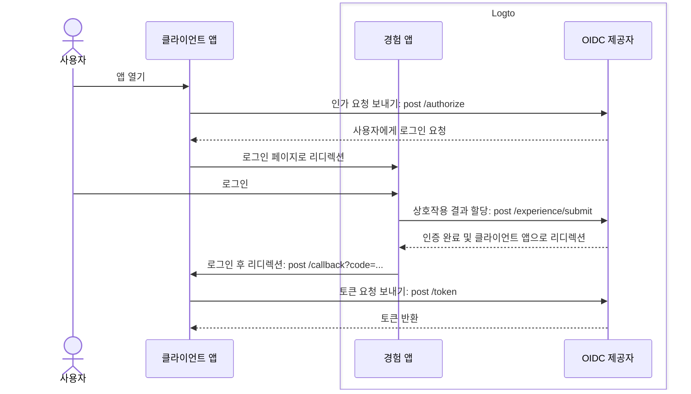
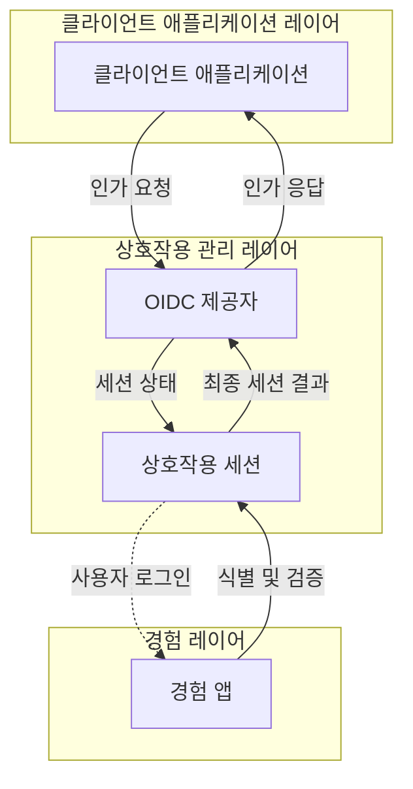

# 회원가입 및 로그인

회원가입 및 로그인은 최종 사용자가 클라이언트 애플리케이션에 인증 (Authentication)하고 접근을 인가 (Authorization)하는 핵심 상호작용 과정입니다. 중앙 집중식 OIDC 기반 [CIAM](https://auth.wiki/iam) 플랫폼으로서, Logto는 여러 클라이언트 애플리케이션과 플랫폼에서 사용자에게 보편적인 로그인 경험을 제공합니다.

## 사용자 흐름 \{#user-flow}

일반적인 [OIDC](https://auth.wiki/openid-connect) 인증 (Authentication) 흐름에서 사용자는 클라이언트 앱을 여는 것으로 시작합니다. 클라이언트 앱은 Logto OIDC 제공자에게 [인가 요청](https://auth.wiki/authorization-request)을 보냅니다. 사용자가 활성 세션이 없는 경우, Logto는 사용자를 Logto 호스팅 로그인 경험 페이지로 안내합니다. 사용자는 Logto 경험 페이지와 상호작용하여 필요한 자격 증명을 제공하여 인증됩니다. 사용자가 성공적으로 인증되면, Logto는 사용자를 클라이언트 앱으로 [인가 코드](https://auth.wiki/authorization-code-flow#how-does-authorization-code-flow-work)와 함께 다시 리디렉션합니다. 클라이언트 앱은 인가 코드를 사용하여 Logto OIDC 제공자에게 [토큰 요청](https://auth.wiki/token-request)을 보내 토큰을 받습니다.

## 사용자 상호작용 \{#user-interaction}

클라이언트 앱이 인가 요청을 시작할 때마다 각 사용자 상호작용에 대해 **상호작용 세션**이 생성됩니다. 이 세션은 여러 클라이언트 애플리케이션 간의 사용자 상호작용 상태를 중앙 집중화하여 Logto가 일관된 로그인 경험을 제공할 수 있도록 합니다. 사용자가 클라이언트 앱 간을 전환할 때, 상호작용 세션은 일관성을 유지하여 사용자의 인증 상태를 유지하고 플랫폼 간 반복적인 로그인의 필요성을 줄입니다. **상호작용 세션**이 설정되면 사용자는 Logto에 로그인하라는 메시지를 받습니다.

Logto의 **경험 앱**은 로그인 경험을 용이하게 하는 전용 호스팅 애플리케이션입니다. 사용자가 인증해야 할 때, 그들은 **경험 앱**으로 안내되어 로그인 과정을 완료하고 Logto와 상호작용합니다. **경험 앱**은 활성 상호작용 세션을 활용하여 사용자의 상호작용 진행 상황을 추적하고 지원합니다.

이 사용자 여정을 지원하고 제어하기 위해, Logto는 세션 기반 **Experience API** 세트를 제공합니다. 이 API는 **경험 앱**이 상호작용 세션 상태를 실시간으로 업데이트하고 접근하여 다양한 사용자 식별 및 검증 방법을 처리할 수 있도록 합니다.

사용자가 모든 검증 및 확인 요구 사항을 충족하면, 상호작용 세션은 OIDC 제공자에게 결과 제출로 종료되며, 사용자는 완전히 인증되고 동의를 제공하여 안전한 로그인 과정을 완료합니다.

## 로그인 경험 커스터마이징 \{#sign-in-experience-customization}

Logto는 다양한 비즈니스 요구 사항에 맞춘 유연하고 커스터마이징 가능한 사용자 경험을 제공합니다. 여기에는 맞춤형 브랜딩, 사용자 인터페이스 및 사용자 상호작용 흐름이 포함됩니다. **경험 앱**은 클라이언트 애플리케이션의 브랜딩 및 보안 요구 사항에 맞게 조정될 수 있습니다.

Logto에서 로그인 경험 [설정](/end-user-flows/sign-up-and-sign-in/sign-up) 및 [커스터마이징](/customization)에 대해 더 알아보세요.

## 자주 묻는 질문 \{#faqs}

  

### 앱별 로그인 경험 방법 또는 브랜딩 \{#per-app-sign-in-experience-method-or-branding}

고유한 **로그인 UI**가 필요한 애플리케이션이나 조직의 경우, Logto는 [앱별 브랜딩](/customization/match-your-brand#app-specific-branding) 및 [조직별 브랜딩](/customization/match-your-brand#organization-specific-branding) 커스터마이징을 지원합니다.

사용자 유형이나 사이트에 따라 다른 **로그인 방법**을 제공해야 하는 경우, [인증 매개변수](/end-user-flows/authentication-parameters) (예: `first_screen` 및 `direct_sign_in`)를 사용하여 사용자를 맞춤형 로그인 옵션이 있는 최종 사용자 페이지로 라우팅하세요.

  

### 이메일 도메인 / IP 주소 / 지역 제한 \{#limit-email-domain--ip-address--region}

속성 기반 접근 제어의 경우, 예를 들어 이메일 도메인, IP 주소 또는 지역에 따라 로그인을 제한하려면, Logto의 [커스텀 토큰 클레임](/developers/custom-token-claims/) 기능을 사용하여 사용자의 속성에 따라 인가 요청을 거부하거나 허용할 수 있습니다.

  

### 로그인 및 회원가입을 위한 헤드리스 API \{#headless-api-for-sign-in-and-sign-up}

현재 Logto는 로그인 및 회원가입을 위한 헤드리스 API를 제공하지 않습니다. 그러나 [자체 UI 가져오기](/customization/bring-your-ui/)를 사용하여 로그인 및 회원가입 경험을 커스터마이징할 수 있습니다.

## 관련 리소스 \{#related-resources}

<Url href="https://blog.logto.io/deprecated-ropc-grant-type">
  리소스 소유자 비밀번호 자격 증명 (ROPC) 승인 유형을 중단해야 하는 이유
</Url>

<Url href="https://blog.logto.io/implicit-flow-is-dead">
  왜 암시적 흐름 대신 인가 코드 흐름을 사용해야 하는가?
</Url>

<Url href="https://blog.logto.io/token-based-authentication-vs-session-based-authentication">
  토큰 기반 인증 (Authentication)과 세션 기반 인증 (Authentication) 비교
</Url>