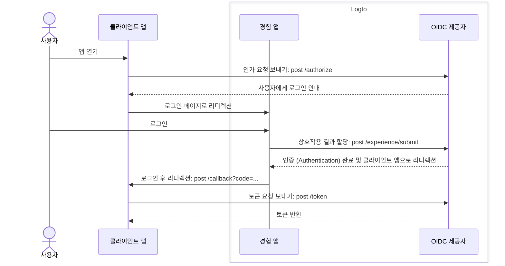
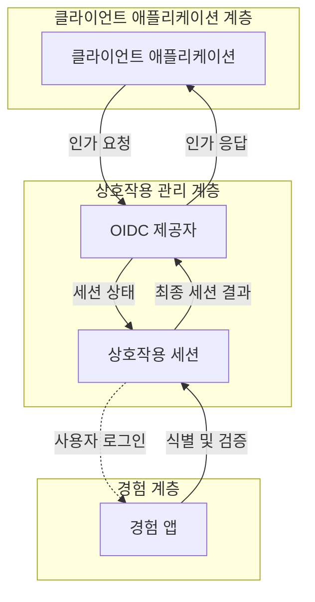

# 회원가입 및 로그인

회원가입 및 로그인은 최종 사용자가 클라이언트 애플리케이션에 인증 (Authentication) 및 인가 (Authorization) 접근을 수행하는 핵심 상호작용 과정입니다. 중앙 집중식 OIDC 기반 [CIAM](https://auth.wiki/iam) 플랫폼인 Logto는 여러 클라이언트 애플리케이션과 플랫폼에서 사용자를 위한 통합 로그인 경험을 제공합니다.

## 사용자 플로우 \{#user-flow}

일반적인 [OIDC](https://auth.wiki/openid-connect) 인증 (Authentication) 플로우에서 사용자는 클라이언트 앱을 여는 것으로 시작합니다. 클라이언트 앱은 Logto OIDC 제공자에게 [인가 요청 (Authorization request)](https://auth.wiki/authorization-request)을 보냅니다. 사용자가 활성 세션이 없다면, Logto는 사용자를 Logto에서 호스팅하는 로그인 경험 페이지로 안내합니다. 사용자는 Logto 경험 페이지와 상호작용하며 필요한 자격 증명을 제공하여 인증 (Authentication)을 받습니다. 인증 (Authentication)에 성공하면, Logto는 사용자를 [인가 코드 (Authorization code)](https://auth.wiki/authorization-code-flow#how-does-authorization-code-flow-work)와 함께 클라이언트 앱으로 리디렉션합니다. 클라이언트 앱은 이 인가 코드를 사용하여 Logto OIDC 제공자에게 [토큰 요청 (Token request)](https://auth.wiki/token-request)을 보내 토큰을 받습니다.

```mermaid
sequenceDiagram
  actor user as 사용자
  participant client as 클라이언트 앱

  box Logto
    participant experience as 경험 앱
    participant oidc as OIDC 제공자
  end

  user ->> client: 앱 열기
  client ->> oidc: 인가 요청 보내기: post /authorize
  oidc -->> client: 사용자에게 로그인 안내
  client ->> experience: 로그인 페이지로 리디렉션
  user ->> experience: 로그인
  experience ->> oidc: 상호작용 결과 할당: post /experience/submit
  oidc -->> experience: 인증 (Authentication) 완료 및 클라이언트 앱으로 리디렉션
  experience ->> client: 로그인 후 리디렉션: post /callback?code=...
  client ->> oidc: 토큰 요청 보내기: post /token
  oidc -->> client: 토큰 반환
```

## 사용자 상호작용 \{#user-interaction}

클라이언트 앱이 인가 요청을 시작할 때마다 각 사용자 상호작용에 대해 **상호작용 세션**이 생성됩니다. 이 세션은 여러 클라이언트 애플리케이션 전반에 걸쳐 사용자 상호작용 상태를 중앙 집중화하여 Logto가 일관된 로그인 경험을 제공할 수 있도록 합니다. 사용자가 클라이언트 앱 간에 전환하더라도 상호작용 세션은 일관성을 유지하여 사용자의 인증 (Authentication) 상태를 유지하고 여러 플랫폼에서 반복 로그인 필요성을 줄여줍니다. **상호작용 세션**이 설정되면 사용자는 Logto에 로그인하라는 안내를 받게 됩니다.

Logto의 **경험 앱**은 로그인 경험을 지원하는 전용 호스팅 애플리케이션입니다. 사용자가 인증 (Authentication)이 필요할 때, **경험 앱**으로 이동하여 로그인 과정을 완료하고 Logto와 상호작용합니다. **경험 앱**은 활성 상호작용 세션을 활용하여 사용자의 상호작용 진행 상황을 추적하고 지원합니다.

이 사용자 여정을 지원하고 제어하기 위해 Logto는 세션 기반 **Experience API** 세트를 제공합니다. 이 API들은 **경험 앱**이 실시간으로 상호작용 세션 상태를 업데이트하고 접근함으로써 다양한 사용자 식별 및 검증 방법을 처리할 수 있도록 합니다.

사용자가 모든 검증 및 확인 요구 사항을 충족하면, 상호작용 세션은 OIDC 제공자에게 결과를 제출하며 종료되고, 이때 사용자는 완전히 인증 (Authentication)되고 동의를 제공하여 안전한 로그인 과정이 마무리됩니다.

```mermaid
flowchart TD
  %% 계층
  subgraph Layer1 [클라이언트 애플리케이션 계층]
      A[클라이언트 애플리케이션]
  end

  subgraph Layer2 [상호작용 관리 계층]
      B[OIDC 제공자]
      C[상호작용 세션]
  end

  subgraph Layer3 [경험 계층]
      D[경험 앱]
  end

  %% 연결
  A --> |인가 요청| B
  B --> |세션 상태| C
  C -.-> |사용자 로그인| D
  D --> |식별 및 검증| C
  C --> |최종 세션 결과| B
  B --> |인가 응답| A
```

:::note
경험 페이지는 인증 (Authentication) 플로우를 통해서만 접근할 수 있도록 설계되었습니다. 검색 엔진이 이러한 페이지를 색인하지 못하도록 하고 직접 접근을 방지하기 위해, Logto는 경험 HTML 페이지에 `<meta name="robots" content="noindex, nofollow" />`를 자동으로 추가합니다.
:::

## 로그인 경험 커스터마이즈 \{#sign-in-experience-customization}

Logto는 다양한 비즈니스 요구 사항에 맞는 유연하고 커스터마이즈 가능한 사용자 경험을 제공합니다. 맞춤 브랜딩, 사용자 인터페이스, 사용자 상호작용 플로우 등이 포함됩니다. **경험 앱**은 클라이언트 애플리케이션의 브랜딩 및 보안 요구 사항에 맞게 맞춤화할 수 있습니다.

Logto에서 로그인 경험의 [설정](/end-user-flows/sign-up-and-sign-in/sign-up) 및 [커스터마이즈](/customization)에 대해 계속 알아보세요.

## 자주 묻는 질문 \{#faqs}

  

### 앱별 로그인 경험 방식 또는 브랜딩 \{#per-app-sign-in-experience-method-or-branding}

별도의 **로그인 UI**가 필요한 애플리케이션 또는 조직의 경우, Logto는 [앱별 브랜딩](/customization/match-your-brand#app-specific-branding) 및 [조직별 브랜딩](/customization/match-your-brand#organization-specific-branding) 커스터마이즈를 지원합니다.

사용자 유형이나 사이트에 따라 다른 **로그인 방식**을 제공해야 한다면, [인증 (Authentication) 파라미터](/end-user-flows/authentication-parameters) (예: `first_screen` 및 `direct_sign_in`)를 사용하여 맞춤 로그인 옵션이 있는 엔드유저 페이지로 라우팅할 수 있습니다.

  

### 이메일 도메인 / IP 주소 / 지역 제한 \{#limit-email-domain--ip-address--region}

속성 기반 접근 제어(예: 이메일 도메인, IP 주소, 지역에 따라 로그인 제한)를 위해, Logto의 [커스텀 토큰 클레임](/developers/custom-token-claims/) 기능을 사용하여 사용자의 속성에 따라 인가 요청을 거부하거나 허용할 수 있습니다.

  

### 로그인 및 회원가입을 위한 헤드리스 API \{#headless-api-for-sign-in-and-sign-up}

현재 Logto는 로그인 및 회원가입을 위한 헤드리스 API를 제공하지 않습니다. 하지만, [UI 직접 제공](/customization/bring-your-ui/)을 통해 로그인 및 회원가입 경험을 커스터마이즈할 수 있습니다.

## 관련 리소스 \{#related-resources}

<Url href="https://blog.logto.io/deprecated-ropc-grant-type">
  Resource Owner Password Credentials (ROPC) 그랜트 타입을 더 이상 사용하지 말아야 하는 이유
</Url>

<Url href="https://blog.logto.io/implicit-flow-is-dead">
  왜 인가 코드 플로우를 implicit flow 대신 사용해야 할까요?
</Url>

<Url href="https://blog.logto.io/token-based-authentication-vs-session-based-authentication">
  토큰 기반 인증 (Authentication)과 세션 기반 인증 (Authentication) 비교
</Url>
