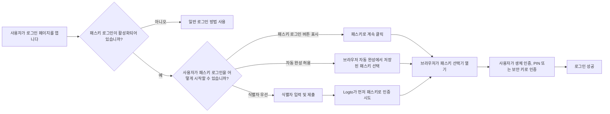
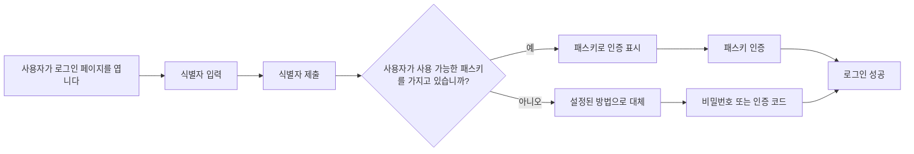
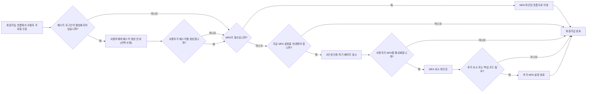

# 패스키 로그인

패스키 로그인을 사용하면 사용자가 비밀번호나 인증 코드를 먼저 입력하지 않고도 WebAuthn 자격 증명으로 직접 인증할 수 있습니다. Logto에서 패스키 로그인에 사용되는 자격 증명은 MFA에서 사용하는 WebAuthn 자격 증명 모델과 동일하므로, 로그인과 MFA 경험이 밀접하게 연결되어 있습니다.

이 문서에서는 Logto의 내장 로그인 경험에서 패스키 로그인이 어떻게 작동하는지, 최종 사용자를 위한 다양한 진입 경로가 어떻게 보이는지, 그리고 MFA와 어떻게 상호작용하는지 설명합니다.

## 패스키 로그인 작동 방식 \{#how-passkey-sign-in-works}

패스키 로그인을 사용하려면 먼저 <CloudLink to="/sign-in-experience/sign-up-and-sign-in">로그인 경험</CloudLink> 설정에서 해당 기능을 활성화해야 합니다. 활성화 후, Logto는 로그인 페이지에서 최대 세 가지 방식으로 패스키 로그인을 제공할 수 있습니다:

- 첫 로그인 화면 하단에 `패스키로 계속` 버튼이 별도로 표시됩니다.
- 사용자가 이메일, 전화번호 또는 사용자 이름을 입력한 후 `패스키로 인증`을 시도하는 식별자 우선 흐름이 있습니다.
- 식별자 입력란에서 브라우저 자동 완성이 가능하여, 브라우저가 현재 기기에서 사용 가능한 패스키를 직접 제안할 수 있습니다.

전체적인 경험은 다음과 같습니다:

## 세 가지 패스키 로그인 경로 \{#three-passkey-sign-in-paths}

### 1. "패스키로 계속" 버튼 활성화 \{#1-show-continue-with-passkey-button-enabled}

`"패스키로 계속" 버튼 표시` 옵션이 활성화되면, 로그인 페이지 첫 화면 하단에 `패스키로 계속` 버튼이 표시됩니다.

사용자 흐름은 다음과 같습니다:

1. 로그인 페이지를 엽니다.
2. `패스키로 계속`을 클릭합니다.
3. 브라우저 또는 운영체제 프롬프트에서 패스키를 선택합니다.
4. 생체 인증, PIN 또는 하드웨어 키 인증을 완료합니다.
5. 로그인에 성공합니다.

이 경로는 가장 직접적입니다. 이미 저장된 패스키가 있고 한 번에 로그인하고 싶은 사용자에게 가장 적합합니다.

### 2. "패스키로 계속" 버튼 비활성화 \{#2-show-continue-with-passkey-button-disabled}

`"패스키로 계속" 버튼 표시` 옵션이 비활성화되면, Logto는 첫 화면에서 식별자 우선 경험으로 전환합니다. 페이지는 먼저 사용자 식별자만 요청합니다.

사용자가 식별자를 제출한 후:

1. Logto는 패스키 로그인이 활성화되어 있는지, 그리고 해당 사용자가 사용 가능한 패스키를 가지고 있는지 확인합니다.
2. 패스키가 있으면 Logto가 먼저 "패스키로 인증" 흐름을 시작합니다.
3. 사용자는 패스키 인증을 완료하고 즉시 로그인할 수 있습니다.
4. 패스키가 없거나 사용자가 다른 방법을 선호하면, Logto는 다른 설정된 인증 방법으로 전환합니다.

사용 가능한 대체 인증 방법은 현재 테넌트의 로그인 경험 설정에 따라 다릅니다. 예를 들어, 해당 식별자에 대해 비밀번호, 이메일 인증 코드, 전화 인증 코드 등이 활성화되어 있다면 사용자는 이들 중에서 선택할 수 있습니다.

### 3. 프롬프트 및 자동 완성 허용 \{#3-allow-prompting-and-autofill}

`프롬프트 및 자동 완성 허용` 옵션이 활성화되면, 호환 브라우저에서 식별자 입력란에서 미리 저장된 패스키를 직접 표시할 수 있습니다.

사용자 흐름은 다음과 같습니다:

1. 로그인 페이지에서 식별자 입력란에 포커스를 맞춥니다.
2. 브라우저가 현재 오리진에 대해 저장된 패스키를 제안합니다.
3. 사용자가 자동 완성 목록에서 패스키를 선택합니다.
4. 브라우저가 생체 인증, PIN 또는 하드웨어 키 인증을 요청합니다.
5. 로그인에 성공합니다.

이 흐름은 플랫폼에서 이미 패스키가 동기화된 기기에서 특히 유용합니다. 사용자는 별도의 페이지로 이동하거나 패스키 전용 버튼을 누르지 않고도 로그인할 수 있습니다.

## 회원가입 및 패스키 바인딩 흐름 \{#sign-up-and-passkey-binding-flow}

패스키 로그인은 단순한 로그인 진입점이 아닙니다. 회원가입 이후에도 영향을 미치는데, 동일한 WebAuthn 자격 증명을 나중에 로그인과 MFA 모두에 재사용할 수 있기 때문입니다.

사용자가 일반 회원가입 단계를 완료한 후, Logto는 패스키 생성을 안내할 수 있습니다. 이 안내는 최종 사용자에게 선택 사항이지만, 패스키를 생성하면 다음 단계는 테넌트의 MFA 정책과 사용자의 MFA 상태에 따라 달라집니다.

주요 로직은 다음과 같습니다:

## 패스키 로그인과 MFA의 관계 \{#relationship-between-passkey-sign-in-and-mfa}

### 패스키 로그인 시 MFA 인증 자동 생략 \{#passkey-sign-in-automatically-skips-mfa-verification}

패스키 로그인에 사용되는 패스키는 WebAuthn 자격 증명에 기반하며, 이 자격 증명은 WebAuthn MFA 요소로도 간주됩니다. 따라서 패스키 로그인과 WebAuthn MFA는 자격 증명 관점에서 사실상 동일합니다.

이로 인해 두 가지 중요한 동작이 발생합니다:

- 사용자가 패스키로 로그인하면, Logto는 별도의 MFA 인증 단계를 생략합니다.
- 사용자가 패스키 로그인 활성화 이전에 이미 WebAuthn을 MFA 요소로 연결했다면, 기존 자격 증명을 패스키 로그인 자격 증명으로 재사용할 수 있습니다. 다시 바인딩할 필요가 없습니다.

즉, 패스키 로그인에 성공하면 MFA 과정에서 요구되는 WebAuthn 기반 아이덴티티 인증을 이미 충족한 것입니다.

### 패스키 바인딩이 사용자 제어 테넌트에서 자동으로 MFA를 강제하지 않음 \{#binding-a-passkey-does-not-automatically-force-mfa-for-user-controlled-tenants}

MFA가 필수가 아닌 테넌트의 사용자는 회원가입 또는 계정 설정 중 패스키를 바인딩해도 계정에 MFA가 자동으로 활성화되지 않습니다.

대신, 패스키 생성 후 Logto는 "2단계 인증 켜기"라는 제목의 확인 페이지를 표시합니다.

해당 페이지에서 사용자는:

- "2단계 인증 활성화" 버튼을 클릭하여 명시적으로 MFA를 켜고 다음 바인딩 단계로 진행할 수 있습니다.
- 안내를 건너뛰고 MFA를 활성화하지 않은 채 현재 흐름을 마칠 수 있습니다.

사용자가 MFA를 활성화하기로 선택하면, Logto는 일반 MFA 설정 흐름을 계속 진행하며, 테넌트의 MFA 설정에 따라 추가 요소 바인딩을 요청할 수 있습니다. 예를 들어, 테넌트에 다른 MFA 요소가 활성화되어 있다면, Logto는 추가 요소나 백업 코드 바인딩을 이어서 안내할 수 있습니다.

### 나중에 패스키 로그인이 비활성화되면 어떻게 됩니까? \{#what-happens-when-passkey-sign-in-is-disabled-later}

패스키 로그인이 나중에 꺼지더라도, 이전에 바인딩된 패스키는 여전히 WebAuthn 자격 증명입니다. 즉, 테넌트에서 WebAuthn MFA가 계속 사용 가능하다면, 해당 패스키는 MFA 요소로 계속 사용할 수 있습니다.

패스키 로그인을 비활성화하면 패스키를 직접 로그인 진입점에서 제거하지만, 기본 WebAuthn MFA 자격 증명은 무효화되지 않습니다.

## 제한 사항 및 호환성 \{#limitations-and-compatibility}

- 패스키 로그인은 엔터프라이즈 SSO 사용자에게 제공되지 않습니다.
- 패스키 로그인은 브라우저 및 플랫폼의 WebAuthn 지원에 의존합니다.
- "프롬프트 및 자동 완성 허용"은 패스키 자동 완성 / 조건부 UI를 지원하는 브라우저 및 환경에서만 작동합니다.
- 패스키는 오리진에 종속됩니다. 한 도메인에 등록된 패스키는 다른 도메인에서 사용할 수 없습니다.

## Q&A \{#q-a}

  

### 패스키 로그인 시에도 MFA 인증이 필요한가요? \{#does-passkey-sign-in-still-require-mfa-verification}

  

아니요. 패스키 로그인에 성공하면 이미 WebAuthn 기반 인증 요건을 충족하므로, Logto는 별도의 MFA 인증 단계를 생략합니다.

  

### 패스키 로그인용으로 바인딩된 패스키가, 패스키 로그인이 비활성화된 후에도 MFA 요소로 사용될 수 있나요? \{#can-a-passkey-bound-for-passkey-sign-in-still-be-used-as-an-mfa-factor-after-passkey-sign-in-is-disabled}

  

네. 패스키 로그인과 WebAuthn MFA는 동일한 자격 증명 모델을 기반으로 합니다. 패스키 로그인이 나중에 비활성화되어도, 바인딩된 패스키는 WebAuthn MFA 요소로 계속 사용할 수 있습니다.

  

### 엔터프라이즈 SSO 사용자는 패스키 로그인을 사용할 수 있나요? \{#can-enterprise-sso-users-use-passkey-sign-in}

  

아니요. 엔터프라이즈 SSO 사용자는 패스키 로그인을 사용할 수 없습니다.

  

### 패스키 로그인 시에도 CAPTCHA가 필요한가요? \{#does-passkey-sign-in-still-require-captcha}

  

아니요. 패스키 로그인 자체에는 추가 CAPTCHA 단계가 필요하지 않습니다. CAPTCHA는 비밀번호 또는 인증 코드 기반 제출 등 페이지 내 다른 로그인 동작에는 적용될 수 있지만, 패스키 인증 흐름에는 적용되지 않습니다.

