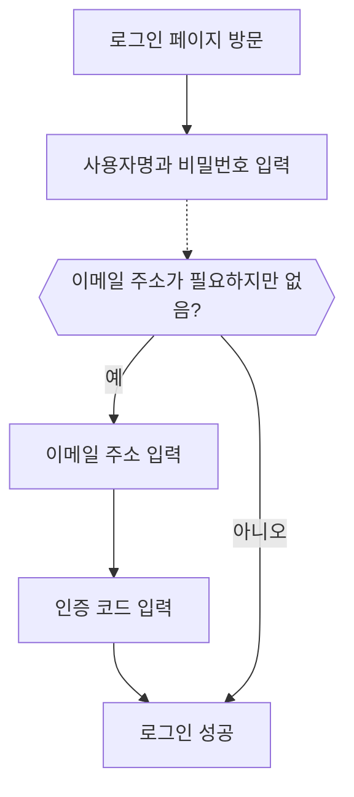

# 이메일 / 전화번호 / 사용자명 로그인

## 식별자 로그인 플로우 구성하기 \{#configure-the-identifier-sign-in-flow}

앞서 언급했듯이, 다양한 식별자 유형은 [회원가입 플로우](/end-user-flows/sign-up-and-sign-in/sign-up) 또는 [Logto에서 직접 계정 생성](/user-management/manage-users#add-users) 과정에서 사용자로부터 수집될 수 있습니다. 또한, 사용자는 제품을 탐색하고 활용하는 과정에서 추가 정보를 입력하고 완료할 수 있습니다. 이러한 식별자는 Logto 시스템에서 사용자를 고유하게 식별하고, Logto와 통합된 애플리케이션에 인증 (Authentication) 및 로그인을 할 수 있도록 해줍니다.

Logto에서 호스팅하는 기본 로그인 페이지를 사용할지, 아니면 [맞춤형 로그인 UI를 직접 구축](/customization#custom-ui)할지에 관계없이, 최종 사용자에게 제공할 로그인 방식과 인증 설정을 구성해야 합니다.

## 식별자 및 인증 설정하기 \{#set-up-the-identifier-and-authentication-settings}

### 1. 지원하는 로그인 식별자 설정하기 \{#1-set-the-supported-sign-in-identifiers}

드롭다운 목록에서 여러 개의 지원 식별자를 추가하여 최종 사용자를 위한 로그인 방식으로 활성화할 수 있습니다. 사용 가능한 옵션은 다음과 같습니다:

- **사용자명**
- **이메일 주소**
- **전화번호**

식별자의 순서를 변경하면 로그인 페이지에 표시되는 순서가 바뀝니다. 첫 번째 식별자가 사용자의 기본 로그인 방식이 됩니다.

### 2. 인증 설정 구성하기 \{#2-set-the-authentication-settings}

각 로그인 식별자에 대해, 사용자의 신원을 확인할 수 있는 최소 한 개의 유효한 인증 요소를 구성해야 합니다. 선택할 수 있는 두 가지 요소는 다음과 같습니다:

- **비밀번호**: 모든 유형의 로그인 식별자에 사용할 수 있습니다. 활성화하면 사용자는 로그인 과정에서 비밀번호를 입력해야 합니다.
- **인증 코드**: **이메일 주소** 및 **전화번호** 식별자에서만 사용할 수 있습니다. 활성화하면 사용자는 이메일 또는 전화번호로 전송된 인증 코드를 입력해야 로그인할 수 있습니다.

두 요소가 모두 활성화된 경우, 사용자는 두 가지 방법 중 하나를 선택하여 로그인할 수 있습니다. 또한 요소의 순서를 변경하여 로그인 페이지에 표시되는 순서를 바꿀 수 있습니다. 첫 번째 요소가 사용자의 기본 인증 방식이 되며, 두 번째 요소는 대체 링크로 표시됩니다.

## 식별자 로그인 플로우 사용자 경험 \{#identifier-sign-in-flow-user-experience}

로그인 경험은 선택한 식별자와 사용 가능한 인증 요소에 따라 달라집니다.

- **여러 식별자에 대한 스마트 입력:**
  둘 이상의 식별자 로그인 방식이 활성화된 경우, Logto 기본 로그인 페이지는 사용자가 입력한 식별자 유형을 자동으로 감지하여 해당 인증 옵션을 표시합니다. 예를 들어, **이메일 주소**와 **전화번호**가 모두 활성화된 경우, 로그인 페이지는 사용자가 입력한 식별자 유형을 자동으로 감지하여 해당 인증 옵션을 표시합니다. 연속된 숫자가 입력되면 국가 코드가 포함된 전화번호 형식으로, "@" 기호가 입력되면 이메일 형식으로 전환됩니다.
  - 전화번호 국가 코드는 사용자의 브라우저 로케일을 기본값으로 사용합니다. 사용자는 수동으로 변경할 수 있습니다. [`ui_locales`](/end-user-flows/authentication-parameters/ui-locales) 파라미터를 사용하여 특정 기본 국가 코드를 설정할 수 있습니다. 자세한 내용은 [현지화 언어](/customization/localized-languages#how-can-i-set-a-default-phone-number-country-code-for-the-sign-in-experience)를 참고하세요.
- **활성화된 인증 요소:**
  - **비밀번호만 사용:** 첫 화면에 식별자와 비밀번호 입력란이 모두 표시됩니다.
  - **인증 코드만 사용:** 첫 화면에 식별자 입력란이, 두 번째 화면에 인증 코드 입력란이 표시됩니다.
  - **비밀번호와 인증 코드 모두 사용:** 첫 화면에 식별자 입력란이 표시되고, 두 번째 화면에서 인증 순서에 따라 비밀번호 또는 인증 코드 입력 단계로 이동합니다. 두 인증 방식 간 전환할 수 있는 링크가 제공됩니다.

### 예시 \{#examples}

  

### 예시 1: 이메일 주소 + 비밀번호 인증 \{#example-1-email-address-with-password-verification}

**이메일 주소**를 로그인 식별자로 추가하고, 인증 요소로 **비밀번호**를 활성화하세요.

  

### 예시 2: 이메일/전화번호 + 비밀번호(기본) 및 인증 코드(대체) 인증 활성화 \{#example-2-emailphone-with-passwordprimary-and-verification-code-alternative-verification-enabled}

**이메일 주소**와 **전화번호**를 모두 로그인 식별자로 추가하세요.
두 식별자 모두에 대해 **비밀번호**와 **인증 코드** 요소를 활성화하세요.

## 로그인 시 추가 사용자 프로필 수집하기 \{#collect-additional-user-profile-on-sign-in}

Logto의 로그인 플로우에서는 회원가입 식별자 설정이 변경된 경우 프로필 보완 과정이 트리거될 수 있습니다. 이를 통해 기존 사용자를 포함한 모든 사용자가 새롭게 요구되는 식별자를 반드시 입력하도록 보장합니다.

예를 들어, 개발자가 새로운 식별자(예: 이메일 주소)를 추가하면, 모든 사용자에게 해당 식별자가 필수로 요구됩니다. 기존 식별자(예: 사용자명)로 로그인하는 기존 사용자는 프로필에 해당 식별자가 없다면 추가 입력 및 인증을 요구받게 됩니다. 이 단계를 완료해야만 애플리케이션에 접근할 수 있으므로, 변경된 요구사항으로의 전환이 원활하고 일관되게 이루어집니다.

과정 요약:

1. **사용자명**이 기존 회원가입 식별자로 설정되어 있고, **비밀번호 생성** 설정이 자동 활성화되어 있습니다.
2. 이후 **이메일 주소**가 회원가입 식별자로 추가됩니다. **이메일 주소** 식별자는 자동으로 활성화된 로그인 옵션으로 추가됩니다.
3. 기존 사용자가 사용자명과 비밀번호로 로그인합니다.
4. 로그인 후, 사용자는 이메일 주소 입력 및 인증을 요구받습니다.

동일한 과정은 **비밀번호 생성** 회원가입 설정에도 적용됩니다. 회원가입 플로우에서 **비밀번호 생성** 설정이 새롭게 활성화되면, 선택한 모든 로그인 식별자에 대해 **비밀번호** 요소가 자동으로 활성화됩니다. 비밀번호가 없는 기존 사용자는 로그인 과정에서 비밀번호를 생성하도록 안내받게 됩니다.

:::note
참고: 맞춤형 로그인 플로우의 경우, [Bring your UI](/customization/bring-your-ui/) 기능을 참고하세요.
:::

## 자주 묻는 질문 \{#faqs}

  

### 자체 호스팅 로그인 경험 (임베디드 로그인) \{#self-hosted-sign-in-experience-embedded-sign-in}

Logto는 현재 로그인 및 회원가입을 위한 헤드리스 API를 지원하지 않습니다. 하지만, [Bring your UI](/customization/bring-your-ui/) 기능을 사용하여 맞춤형 로그인 폼을 Logto에 업로드할 수 있습니다. 또한, 애플리케이션에서 수집한 사용자 식별자를 미리 입력하거나, 소셜 또는 엔터프라이즈 SSO 제공자를 통해 직접 로그인할 수 있도록 여러 로그인 파라미터를 지원합니다. 자세한 내용은 [인증 (Authentication) 파라미터](/end-user-flows/authentication-parameters/)를 참고하세요.

## 관련 리소스 \{#related-resources}

<Url href="https://www.youtube.com/watch?v=64rBXpWbScc">이메일 회원가입 및 로그인 경험</Url>

<Url href="https://www.youtube.com/watch?v=chQxCJX6e6w">사용자명 회원가입 및 로그인 경험</Url>
