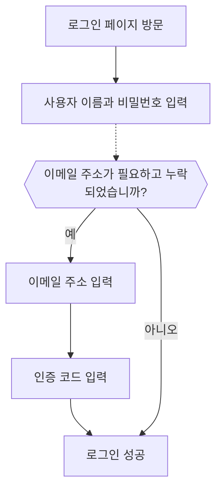

import signInEmailPasswordImage from '@site/docs/end-user-flows/sign-up-and-sign-in/assets/sign-in-email-password.png';
import signInEmailPhonePasswordVerificationCodeImage from '@site/docs/end-user-flows/sign-up-and-sign-in/assets/sign-in-email-phone-password-verification-code.png';

# 이메일 / 전화번호 / 사용자 이름 로그인

## 식별자 로그인 흐름 구성 \{#configure-the-identifier-sign-in-flow}

앞서 언급했듯이, 다양한 식별자 유형은 [가입 흐름](/end-user-flows/sign-up-and-sign-in/sign-up) 또는 [Logto에서의 직접 계정 생성](/user-management/manage-users#add-users) 중에 사용자로부터 수집될 수 있습니다. 또한, 사용자가 제품을 탐색하고 활용하면서 추가 정보를 입력하고 완료할 수 있습니다. 이러한 식별자는 Logto 시스템에서 사용자를 고유하게 식별하고, Logto와 통합된 애플리케이션에 인증 및 로그인을 허용하는 데 사용될 수 있습니다.

Logto가 호스팅하는 사전 구축된 로그인 페이지를 사용하든 [사용자 정의 로그인 UI를 구축](/customization#custom-ui)하든, 최종 사용자에게 제공할 로그인 방법 및 인증 설정을 구성해야 합니다.

## 식별자 및 인증 설정 구성 \{#set-up-the-identifier-and-authentication-settings}

### 1. 지원되는 로그인 식별자 설정 \{#1-set-the-supported-sign-in-identifiers}

드롭다운 목록에서 여러 지원 식별자를 최종 사용자를 위한 활성화된 로그인 방법으로 추가할 수 있습니다. 사용 가능한 옵션은 다음과 같습니다:

- **사용자 이름**
- **이메일 주소**
- **전화번호**

식별자의 순서를 변경하면 로그인 페이지에 표시되는 순서가 변경됩니다. 첫 번째 식별자는 사용자의 기본 로그인 방법이 됩니다.

### 2. 인증 설정 구성 \{#2-set-the-authentication-settings}

각 로그인 식별자에 대해 사용자의 아이덴티티를 확인하기 위한 최소한의 효과적인 인증 요소를 구성해야 합니다. 선택할 수 있는 두 가지 요소가 있습니다:

- **비밀번호**: 모든 유형의 로그인 식별자에 사용할 수 있습니다. 활성화되면 사용자는 로그인 과정을 완료하기 위해 비밀번호를 제공해야 합니다.
- **인증 코드**: **이메일 주소** 및 **전화번호** 식별자에만 사용할 수 있습니다. 활성화되면 사용자는 이메일 또는 전화번호로 전송된 인증 코드를 입력하여 로그인 과정을 완료해야 합니다.

두 요소가 모두 활성화된 경우, 사용자는 로그인 과정을 완료하기 위해 두 방법 중 하나를 선택할 수 있습니다. 요소의 순서를 변경하여 로그인 페이지에 표시되는 순서를 변경할 수 있습니다. 첫 번째 요소는 사용자의 기본 인증 방법으로 사용되며, 두 번째 요소는 대체 링크로 표시됩니다.

## 식별자 로그인 흐름 사용자 경험 \{#identifier-sign-in-flow-user-experience}

로그인 경험은 선택한 식별자와 사용 가능한 인증 요소에 따라 조정됩니다.

- **다중 식별자를 위한 스마트 입력:**
  하나 이상의 식별자 로그인 방법이 활성화된 경우, Logto 내장 로그인 페이지는 사용자가 입력한 식별자 유형을 자동으로 감지하고 해당 인증 옵션을 표시합니다. 예를 들어, **이메일 주소**와 **전화번호**가 모두 활성화된 경우, 로그인 페이지는 사용자가 입력한 식별자 유형을 자동으로 감지하고 해당 인증 옵션을 표시합니다. 숫자가 연속적으로 입력되면 지역 코드가 포함된 전화번호 형식으로 전환되거나 "@" 기호가 사용되면 이메일 형식으로 전환됩니다.
- **활성화된 인증 요소:**
  - **비밀번호만:** 첫 번째 화면에 식별자와 비밀번호 필드가 표시됩니다.
  - **인증 코드만:** 첫 번째 화면에 식별자 필드가 나타나고, 두 번째 화면에 인증 코드 필드가 나타납니다.
  - **비밀번호와 인증 코드:** 첫 번째 화면에 식별자 필드가 입력되고, 두 번째 화면에서 인증 순서에 따라 비밀번호 또는 인증 코드를 입력하는 단계가 이어집니다. 사용자가 두 가지 인증 방법 간에 전환할 수 있도록 전환 링크가 제공됩니다.

### 예시 \{#examples}

  

### 예시 1: 비밀번호 인증이 있는 이메일 주소 \{#example-1-email-address-with-password-verification}

**이메일 주소**를 로그인 식별자로 추가하고 **비밀번호** 요소를 인증에 사용하도록 활성화합니다.

  

### 예시 2: 비밀번호(기본) 및 인증 코드(대체) 인증이 활성화된 이메일/전화번호 \{#example-2-emailphone-with-passwordprimary-and-verification-code-alternative-verification-enabled}

**이메일 주소**와 **전화번호**를 모두 로그인 식별자로 추가합니다.
두 식별자에 대해 **비밀번호** 및 **인증 코드** 요소를 활성화합니다.

## 로그인 시 추가 사용자 프로필 수집 \{#collect-additional-user-profile-on-sign-in}

Logto의 로그인 흐름에서는 가입 식별자 설정이 업데이트되면 프로필 이행 과정이 시작될 수 있습니다. 이는 기존 사용자를 포함하여 모든 사용자가 새로 요구되는 식별자를 제공하도록 보장합니다.

개발자가 새로운 식별자 (예: 이메일 주소)를 추가하면 모든 사용자에게 필수 사항이 됩니다. 기존 식별자 (예: 사용자 이름)로 로그인하는 사용자는 프로필에 누락된 경우 새 식별자를 제공하고 인증하도록 요청받습니다. 이 단계를 완료한 후에야 애플리케이션에 접근할 수 있으며, 업데이트된 요구 사항으로의 원활하고 일관된 전환을 보장합니다.

과정을 세분화하면:

1. **사용자 이름**이 이전에 **비밀번호 생성** 설정과 함께 가입 식별자로 설정되었습니다.
2. **이메일 주소**가 나중에 가입 식별자로 설정됩니다. **이메일 주소** 식별자는 자동으로 활성화된 로그인 옵션으로 추가됩니다.
3. 기존 사용자가 사용자 이름과 비밀번호로 로그인합니다.
4. 사용자는 초기 로그인 단계 후 이메일 주소를 제공하고 인증하도록 요청받습니다.

이 과정은 **비밀번호 생성** 가입 설정에도 동일하게 적용됩니다. 가입 흐름에서 **비밀번호 생성** 설정이 새로 활성화되면, **비밀번호** 요소는 선택한 모든 로그인 식별자에 대해 자동으로 활성화됩니다. 비밀번호가 없는 모든 기존 사용자는 로그인 과정에서 비밀번호를 생성하라는 메시지를 받게 됩니다.

:::note
참고: 사용자 정의 로그인 흐름에 대해서는 [UI 가져오기](/customization/bring-your-ui/) 기능을 참조하세요.
:::

## 자주 묻는 질문 \{#faqs}

  

### 자체 호스팅 로그인 경험 (임베디드 로그인) \{#self-hosted-sign-in-experience-embedded-sign-in}

Logto는 현재 로그인 및 가입을 위한 헤드리스 API를 지원하지 않습니다. 그러나 [UI 가져오기](/customization/bring-your-ui/) 기능을 사용하여 사용자 정의 로그인 양식을 Logto에 업로드할 수 있습니다. 또한, 애플리케이션에서 수집한 사용자 식별자로 로그인 양식을 미리 채우거나 타사 소셜 또는 엔터프라이즈 SSO 제공자로 직접 로그인할 수 있는 여러 로그인 매개변수를 지원합니다. 자세한 내용은 [인증 매개변수](/end-user-flows/authentication-parameters/)를 참조하세요.

## 관련 리소스 \{#related-resources}

<Url href="https://www.youtube.com/watch?v=64rBXpWbScc">이메일 가입 및 로그인 경험</Url>

<Url href="https://www.youtube.com/watch?v=chQxCJX6e6w">사용자 이름 가입 및 로그인 경험</Url>
